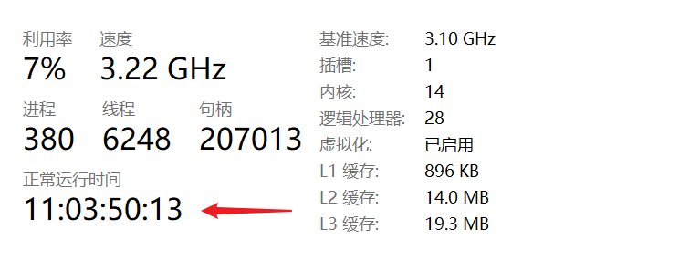

# 获取系统或动作信息

获取系统、Quicker 及当前运行动作的相关信息。

## 当前模块定义

<XActionModuleMeta moduleKey="sys:getSysInfo" />

获取Windows当前环境信息或当前运行的动作信息。

【注】本模块不适合在子程序中使用，部分依赖于动作运行上下文的的信息无法在子程序中获取。

<ModuleParamPreview moduleKey="sys:getSysInfo" />

参数

### 输出

【机器名】Windows主机名。

【用户名】当前登录到Windows的用户名。

【系统版本号】windows的版本号。

【是否为Win10或以上】是否在运行Windows10或11。

【是否为Win11】是否为Win11操作系统。

【是否自动启动】Quicker是否为开机登录Windows后自动运行启动的。（否表示手动启动的）

【系统正常运行秒数】Windows启动之后到现在所运行的秒数。此秒数等于windows任务管理器中显示的“正常运行时间”，很多情况重启电脑不会重置此时间。


【环境变量】将所有环境变量输出到一个词典类型的变量里。

【主屏分辨率】电脑主显示器的分辨率。格式为“宽度,高度”如“1024,768”。

【Quicker版本】Quicker软件的版本号，是一个数字，值为 大版本\*1000000 + 中版本\*1000 + 小版本。比如“1.2.3”版本，此处输出的值为“1002003”

【是否为专业版】当前用户是否为专业版用户。

【UnionId】返回用户id的哈希值。作为用户id的安全替代，可用于第三方服务对用户进行鉴权的场景（一般应该在服务端进行验证）。

【Quicker启动秒数】Quicker启动后到现在的时间。

【动作ID】当前正在执行的动作ID。 

【动作名称】当前动作的名称。

【动作库ID】动作是从动作库安装到本地时，返回所安装的动作库动作ID。

【动作版本号】动作是从动作库安装到本地时，返回所安装的动作库动作版本。

【运行个数】运行中的此动作个数，包含当前动作实例。

【是否调试运行】当前是否以调试方式运行动作。

【触发方式】启动动作的方式，仅供参考。主要的触发方式有：

```text
Panel,          //主面板窗口
TriggerKey,     //触发键
FloatButton,    //浮动按钮
FloatPanel,     //浮动面板
DashboardWindow, //仪表盘窗口
ActionEditor,   //动作编辑器
CircleMenu,     //轮盘菜单
SearchWindow,   //搜索窗口
Gesture,        //手势
OtherMouse,     //其他鼠标触发

Hotkey,         //热键
PowerKeys,      //扩展热键
TextCommand,    //文本指令

App,            //手机APP
Extern,         //外部启动

AutoRun,        //自动运行
ContextMenu, 	  //右键菜单
LeftButtonPlus,	//左键辅助
ScrollOnButton,	//按钮上滚轮
AdvancedMouseAction, //高级鼠标触发 1.10.10版本
Association, 	//上下文菜单
BrowserContextMenu, //浏览器右键菜单
WebpageButton, //网页按钮点击
EventTrigger,  //事件触发
```

## 更新历史

-   1.0.10: 增加Quicker版本、Quicker启动秒数和动作ID信息输出。
-   20230209 完善触发方式；补充一些输出参数的说明。
-   20240327 增加UnionID输出说明。
