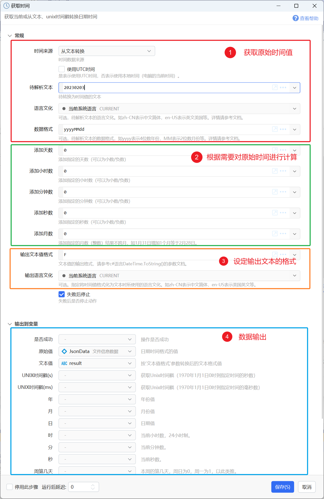
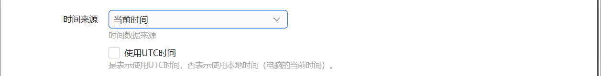
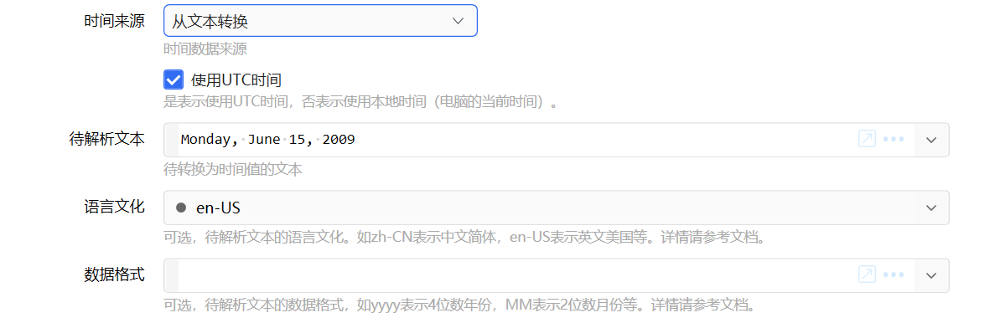

# 获取日期时间

获取当前或从文本、unix时间戳转换日期时间

## 当前模块定义

<XActionModuleMeta moduleKey="sys:getCurrentTime" />

获取一个时间（如系统当前时间/从时间戳或文本内容转换），根据需求做一定的计算，然后输出结果时间。

本部分内容也可以直接在表达式中使用C#的[DateTime](https://learn.microsoft.com/en-us/dotnet/api/system.datetime?view=netframework-4.7.2)类型实现。

## 参数

### 输入

#### 第一部分，获取原始时间值。

【时间来源】选择原始时间的来源，可选值如下：

-   当前时间
-   从文本转换
-   从Unix时间戳转换(秒)
-   从Unix时间戳转换(毫秒)
-   时间变量

**当前时间**

获取系统当前时间。

选中“使用UTC时间”时，返回当前UTC时间，否则返回本地时间。

**从文本值转换**

从文本中解析时间。

【待解析文本】需要从中获取时间的文本值。

【语言文化】用于将其它语言的文本值转换为时间。如果时间值是和特定语言无关的（如2023-12-13 22:22:00），此处保持默认即可。

【数据格式】在解析特定格式的时间时，可从此参数指定格式内容。

**从Unix时间戳转换（秒/毫秒）**

Unix时间戳是从1970年1月1日（UTC）开始所经过的秒数（或毫秒数）。但是实际也会遇到一些从本地时间1970年1月1日0点开始计算的时间戳。

如果时间戳是标准的，请选中“使用UTC时间”选项。如果时间戳是以本地时间计算的，请去掉此选项。

**时间变量**

读取指定时间变量中的值。

#### 第二部分，计算。

在获取的原始时间的基础上，增减指定的时间值，仅需要时填写。

【增加天数】【增加小时数】【增加分钟数】【增加秒数】：正值表示增加，负值表示减少的时间值。可以为小数。

【增加的月数】需要为整数，正值表示增加，负值表示减少。不会跨月，比如3月31日加1个月等于4月30日。

#### 第三部分，设定输出文本的格式

如果不需要输出“文本值”，则可忽略本部分参数。

【输出文本值格式】

用于控制输出参数中的“文本值”的日期时间格式。请参考C#日期时间格式化相关内容。

如，使用“yyyy-MM-dd HH:mm:ss”，得到的文本值为“2020-06-16 10:38:32”

【输出语言文化】

当需要输出其它语言的时间文本时，设定目标语言信息。

### 常用格式指令字符

**标准日期时间格式字符串**（[参考](https://learn.microsoft.com/zh-cn/dotnet/standard/base-types/standard-date-and-time-format-strings)，下表为此参考文档内容摘录）

指定某个标准格式，这里的格式说明符需要单独使用，不能组合。

| 格式说明符 | 描述 | 示例 |
| --- | --- | --- |
| d | 短日期模式。      有关详细信息，请参阅[短日期（“d”）格式说明符](https://learn.microsoft.com/zh-cn/dotnet/standard/base-types/standard-date-and-time-format-strings) 。 | 2009-06-15T13:45:30 -&gt; 6/15/2009 (en-US)      2009-06-15T13:45:30 -&gt; 15/06/2009 (fr-FR)      2009-06-15T13:45:30 -&gt; 2009/06/15 (ja-JP) |
| D | 长日期模式。      有关详细信息，请参阅[长日期（“D”）格式说明符](https://learn.microsoft.com/zh-cn/dotnet/standard/base-types/standard-date-and-time-format-strings) 。 | 2009-06-15T13:45:30 -&gt; Monday, June 15, 2009 (en-US)      2009-06-15T13:45:30 -&gt; понедельник, 15 июня 2009 г. (ru-RU)      2009-06-15T13:45:30 -&gt; Montag, 15. Juni 2009 (de-DE) |
| f | 完整日期/时间模式（短时间）。      更多信息：[完整日期短时间（“f”）格式说明符](https://learn.microsoft.com/zh-cn/dotnet/standard/base-types/standard-date-and-time-format-strings#FullDateShortTime) 。 | 2009-06-15T13:45:30 -&gt; Monday, June 15, 2009 1:45 PM (en-US)      2009-06-15T13:45:30 -&gt; den 15 juni 2009 13:45 (sv-SE)      2009-06-15T13:45:30 -&gt; Δευτέρα, 15 Ιουνίου 2009 1:45 μμ (el-GR) |
| F | 完整日期/时间模式（长时间）。      更多信息：[完整日期长时间（“F”）格式说明符](https://learn.microsoft.com/zh-cn/dotnet/standard/base-types/standard-date-and-time-format-strings#FullDateLongTime) 。 | 2009-06-15T13:45:30 -&gt; Monday, June 15, 2009 1:45:30 PM (en-US)      2009-06-15T13:45:30 -&gt; den 15 juni 2009 13:45:30 (sv-SE)      2009-06-15T13:45:30 -&gt; Δευτέρα, 15 Ιουνίου 2009 1:45:30 μμ (el-GR) |
| g | 常规日期/时间模式（短时间）。      更多信息：[常规日期短时间（“g”）格式说明符](https://learn.microsoft.com/zh-cn/dotnet/standard/base-types/standard-date-and-time-format-strings#GeneralDateShortTime) 。 | 2009-06-15T13:45:30 -&gt; 6/15/2009 1:45 PM (en-US)      2009-06-15T13:45:30 -&gt; 15/06/2009 13:45 (es-ES)      2009-06-15T13:45:30 -&gt; 2009/6/15 13:45 (zh-CN) |
| G | 常规日期/时间模式（长时间）。      更多信息：[常规日期长时间（“G”）格式说明符](https://learn.microsoft.com/zh-cn/dotnet/standard/base-types/standard-date-and-time-format-strings#GeneralDateLongTime) 。 | 2009-06-15T13:45:30 -&gt; 6/15/2009 1:45:30 PM (en-US)      2009-06-15T13:45:30 -&gt; 15/06/2009 13:45:30 (es-ES)      2009-06-15T13:45:30 -&gt; 2009/6/15 13:45:30 (zh-CN) |
| M、m | 月/日模式。      更多信息：[月（“M”、“m”）格式说明符](https://learn.microsoft.com/zh-cn/dotnet/standard/base-types/standard-date-and-time-format-strings) 。 | 2009-06-15T13:45:30 -&gt; June 15 (en-US)      2009-06-15T13:45:30 -&gt; 15. juni (da-DK)      2009-06-15T13:45:30 -&gt; 15 Juni (id-ID) |
| O、o | 往返日期/时间模式。      更多信息：[往返（“O”、“o”）格式说明符](https://learn.microsoft.com/zh-cn/dotnet/standard/base-types/standard-date-and-time-format-strings) 。 | [DateTime](https://learn.microsoft.com/zh-cn/dotnet/api/system.datetime) 值：      2009-06-15T13:45:30 (DateTimeKind.Local) --&gt; 2009-06-15T13:45:30.0000000-07:00      2009-06-15T13:45:30 (DateTimeKind.Utc) --&gt; 2009-06-15T13:45:30.0000000Z      2009-06-15T13:45:30 (DateTimeKind.Unspecified) --&gt; 2009-06-15T13:45:30.0000000      [DateTimeOffset](https://learn.microsoft.com/zh-cn/dotnet/api/system.datetimeoffset) 值：      2009-06-15T13:45:30-07:00 --&gt; 2009-06-15T13:45:30.0000000-07:00 |
| R、r | RFC1123 模式。      更多信息：[RFC1123（“R”、“r”）格式说明符](https://learn.microsoft.com/zh-cn/dotnet/standard/base-types/standard-date-and-time-format-strings) 。 | 2009-06-15T13:45:30 -&gt; Mon, 15 Jun 2009 20:45:30 GMT |
| s | 可排序日期/时间模式。      更多信息：[可排序（“s”）格式说明符](https://learn.microsoft.com/zh-cn/dotnet/standard/base-types/standard-date-and-time-format-strings) 。 | 2009-06-15T13:45:30 (DateTimeKind.Local) -&gt; 2009-06-15T13:45:30      2009-06-15T13:45:30 (DateTimeKind.Utc) -&gt; 2009-06-15T13:45:30 |
| t | 短时间模式。      更多信息：[短时间（“t”）格式说明符](https://learn.microsoft.com/zh-cn/dotnet/standard/base-types/standard-date-and-time-format-strings) 。 | 2009-06-15T13:45:30 -&gt; 1:45 PM (en-US)      2009-06-15T13:45:30 -&gt; 13:45 (hr-HR)      2009-06-15T13:45:30 -&gt; 01:45 م (ar-EG) |
| T | 长时间模式。      更多信息：[长时间（“T”）格式说明符](https://learn.microsoft.com/zh-cn/dotnet/standard/base-types/standard-date-and-time-format-strings) 。 | 2009-06-15T13:45:30 -&gt; 1:45:30 PM (en-US)      2009-06-15T13:45:30 -&gt; 13:45:30 (hr-HR)      2009-06-15T13:45:30 -&gt; 01:45:30 م (ar-EG) |
| u | 通用可排序日期/时间模式。      更多信息：[通用可排序（“u”）格式说明符](https://learn.microsoft.com/zh-cn/dotnet/standard/base-types/standard-date-and-time-format-strings#UniversalSortable) 。 | 含 [DateTime](https://learn.microsoft.com/zh-cn/dotnet/api/system.datetime) 值：2009-06-15T13:45:30 -&gt; 2009-06-15 13:45:30Z      含 [DateTimeOffset](https://learn.microsoft.com/zh-cn/dotnet/api/system.datetimeoffset) 值：2009-06-15T13:45:30 -&gt; 2009-06-15 20:45:30Z |
| U | 通用完整日期/时间模式。      更多信息：[通用完整（“U”）格式说明符](https://learn.microsoft.com/zh-cn/dotnet/standard/base-types/standard-date-and-time-format-strings#UniversalFull) 。 | 2009-06-15T13:45:30 -&gt; Monday, June 15, 2009 8:45:30 PM (en-US)      2009-06-15T13:45:30 -&gt; den 15 juni 2009 20:45:30 (sv-SE)      2009-06-15T13:45:30 -&gt; Δευτέρα, 15 Ιουνίου 2009 8:45:30 μμ (el-GR) |
| Y、y | 年月模式。      更多信息：[年月（“Y”、“y”）格式说明符](https://learn.microsoft.com/zh-cn/dotnet/standard/base-types/standard-date-and-time-format-strings) 。 | 2009-06-15T13:45:30 -&gt; June 2009 (en-US)      2009-06-15T13:45:30 -&gt; juni 2009 (da-DK)      2009-06-15T13:45:30 -&gt; Juni 2009 (id-ID) |

**自定义日期时间格式字符串**（[参考](https://learn.microsoft.com/zh-cn/dotnet/standard/base-types/custom-date-and-time-format-strings)）

可组合使用。如`yyyy-MM-dd`

| **符号** | **说明** | **示例(2016-05-09 13:09:55:2350)** |
| --- | --- | --- |
| yy | 年份后两位 | 16 |
| yyyy | 4位年份 | 2016 |
| MM | 两位月份；单数月份前面用0填充 | 05 |
| M | 不补0的自然数月份 | 5 |
| dd | 长日期，前面补0 | 09 |
| d | 短日期，前面不补0 | 9 |
| ddd | 周几 | 周一 |
| dddd | 星期几 | 星期一 |
| hh | 12小时制的小时数 | 01 |
| h | 不补0的小时数 | 1 |
| HH | 24小时制的小时数 | 13 |
| H | 不补0的小时数 | 13 |
| mm | 分钟数 | 09 |
| m | 不补0的分钟数 | 9 |
| ss | 秒数 | 05 |
| s | 不补0的秒数 | 5 |
| ff | 毫秒数前2位 | 23 |
| fff | 毫秒数前3位 | 235 |
| ffff | 毫秒数前4位 | 2350 |
| 分隔符 | 可使用分隔符来分隔年月日时分秒。 包含的值可为：-、/、:等非关键字符(中文也可以） | yyyy-MM-dd HH:mm:ss:ffff   =&gt; 2016-05-09 13:09:55:2350 yyyy/MM/dd HH:mm:ss:ffff   =&gt; 2016/05/09 13:09:55:2350 yyyy/MM/dd HH:mm:ss:ffff dddd   =&gt; 2016/05/09 13:09:55:2350 星期一 yyyy年MM月dd日 HH时mm分ss秒 \=&gt; 2016年05月09日 13时09分55秒 |

### 输出

【原始值】计算得到的时间类型变量值。

【文本值】依据输入参数“文本值格式”，将原始值转换成的文本格式，用于输出到文本变量中。

【Unix时间戳】将原始值转换为Unix时间戳。此处不考虑原始值是本地时间还是UTC时间。

【年】【月】【日】【时】【分】【秒】时间值中对应的数据。

【周第几天】是一周中的第几天。周日为0，周一为1，以此类推。

【年第几天】是当年的第几天。

## 表达式

也可以使用表达式的方式代替本模块的功能。

例如：

-   $= "当前时间是：" + DateTime.Now.ToString("yyyy-MM-dd HH:mm:ss")

-   将一个文本加上当前时间的文本值

-   $=DateTime.Now.Year

-   得到当前年份数字

## 示例动作

-   插入日期时间：[https://getquicker.net/sharedaction?code=2a89f753-546d-45d0-bfd9-08d6720e1a02](https://getquicker.net/sharedaction?code=2a89f753-546d-45d0-bfd9-08d6720e1a02)

## 参考

-   c# DateTime日期格式化 [https://www.cnblogs.com/polk6/p/5465088.html](https://www.cnblogs.com/polk6/p/5465088.html) 
-   组合成文本模块 [/v2/xaction/modules/formatstring](/v2/xaction/modules/formatstring)

## 更新历史

-   20230213 增加输入文本格式/语言，输出文本语言等参数（需Quicker1.36.33+版本）。完善文档。
-   20250120 更新文档标题，以匹配实际功能。
