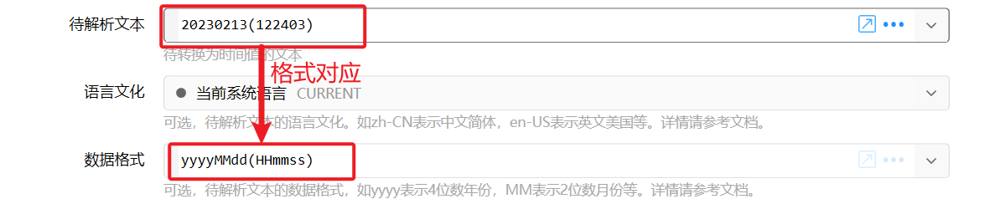
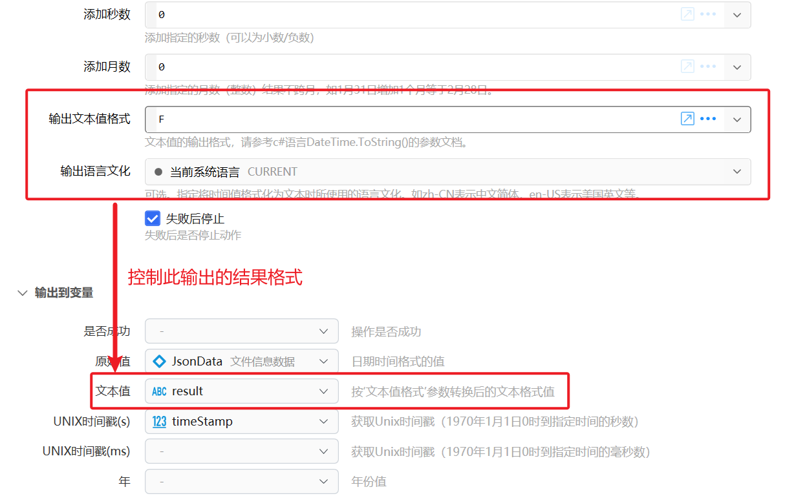

# 获取日期时间

取当前时间，或从文本、Unix 时间戳、时间变量转换，再按需要加减时长并格式化输出。只要对已有时间做差或换时区，用 [计算时间](/v2/xaction/modules/computetime)。表达式里也可以直接用 C# [DateTime](https://learn.microsoft.com/dotnet/api/system.datetime)。

## 当前模块定义

<XActionModuleMeta moduleKey="sys:getCurrentTime" />

## 概述

分三步：选时间来源 → 按需加减 → 设定文本格式。

<ModuleParamPreview moduleKey="sys:getCurrentTime" />

## 参数说明

**时间来源**：当前时间、从文本转换、从 Unix 时间戳转换（秒 / 毫秒）、时间变量。

**使用UTC时间**：仅当前时间、从文本、从时间戳。开启返回 UTC，关闭返回本地时间。默认关闭。标准 Unix 时间戳请开启；按本地 1970-01-01 起算的时间戳请关闭。

**失败后停止**：失败是否中止动作。默认开启。

### 当前时间

<ModuleParamPreview
  moduleKey="sys:getCurrentTime"
  focusKeys={['source', 'useUtc']}
  values={{source: 'currTime', useUtc: 'false'}}
/>

### 从文本转换

<ModuleParamPreview
  moduleKey="sys:getCurrentTime"
  focusKeys={['source', 'useUtc', 'timeStr', 'inputCulture', 'inputFormat']}
  values={{
    source: 'fromString',
    useUtc: 'true',
    timeStr: 'Monday, June 15, 2009',
    inputCulture: 'en-US',
  }}
/>

**待解析文本**：要从中解析时间的文本。

**语言文化**：解析其它语言的时间文本时使用。与语言无关的值（如 `2023-12-13 22:22:00`）保持默认即可。

**数据格式**：特定格式时填写，如 `yyyy` 表示 4 位年、`MM` 表示 2 位月。

### 从 Unix 时间戳转换

<ModuleParamPreview
  moduleKey="sys:getCurrentTime"
  focusKeys={['source', 'useUtc', 'timeStampStr']}
  values={{
    source: 'fromUnixTimeStamp',
    useUtc: 'true',
    timeStampStr: '1676297270',
  }}
/>

**Unix时间戳值**：从 1970-01-01 起经过的秒数或毫秒数。

### 时间变量

<ModuleParamPreview
  moduleKey="sys:getCurrentTime"
  focusKeys={['source', 'timeVar']}
  values={{source: 'fromVar', timeVar: 'timeVar'}}
/>

**时间变量**：要读取的时间变量。

### 加减时长

在原始时间上增减，仅需要时填写。

**添加天数** / **添加小时数** / **添加分钟数** / **添加秒数**：正加负减，可以为小数。

**添加月数**：整数。结果不跨月，如 3 月 31 日加 1 个月等于 4 月 30 日。

### 输出文本格式

不需要 **文本值** 时可忽略。

**输出文本值格式**：控制 **文本值** 的格式，见 C# `DateTime.ToString`。例如 `yyyy-MM-dd HH:mm:ss` → `2020-06-16 10:38:32`。默认即此格式。

**输出语言文化**：输出其它语言的时间文本时设定。

### 常用格式指令

**标准日期时间格式字符串**（[参考](https://learn.microsoft.com/zh-cn/dotnet/standard/base-types/standard-date-and-time-format-strings)）需单独使用，不能组合。

| 格式说明符 | 描述 | 示例 |
| --- | --- | --- |
| d | 短日期 | 2009-06-15T13:45:30 → 6/15/2009 (en-US) |
| D | 长日期 | → Monday, June 15, 2009 (en-US) |
| f / F | 完整日期/时间（短/长） | |
| g / G | 常规日期/时间（短/长） | zh-CN 下 G → 2009/6/15 13:45:30 |
| M、m | 月/日 | June 15 (en-US) |
| O、o | 往返 | 含时区偏移 |
| R、r | RFC1123 | Mon, 15 Jun 2009 20:45:30 GMT |
| s | 可排序 | 2009-06-15T13:45:30 |
| t / T | 短/长时间 | |
| u / U | 通用可排序 / 通用完整 | |
| Y、y | 年月 | June 2009 (en-US) |

**自定义日期时间格式字符串**（[参考](https://learn.microsoft.com/zh-cn/dotnet/standard/base-types/custom-date-and-time-format-strings)）可组合，如 `yyyy-MM-dd`。

| 符号 | 说明 | 示例（2016-05-09 13:09:55.2350） |
| --- | --- | --- |
| yy / yyyy | 两位 / 四位年 | 16 / 2016 |
| M / MM | 月（不补 0 / 补 0） | 5 / 05 |
| d / dd | 日 | 9 / 09 |
| ddd / dddd | 周几 / 星期几 | 周一 / 星期一 |
| h / hh | 12 小时制 | 1 / 01 |
| H / HH | 24 小时制 | 13 |
| m / mm | 分 | 9 / 09 |
| s / ss | 秒 | 5 / 05 |
| ff / fff / ffff | 毫秒前 2/3/4 位 | 23 / 235 / 2350 |

分隔符可用 `-`、`/`、`:` 或中文，例如 `yyyy年MM月dd日 HH时mm分ss秒`。

## 输出

- **是否成功**
- **时间值**：日期时间类型的结果。
- **文本值**：按 **输出文本值格式** 转成的文本。
- **UNIX时间戳(s)** / **UNIX时间戳(ms)**：此处不考虑原始值是本地还是 UTC。
- **年** / **月** / **日** / **时** / **分** / **秒**
- **周第几天**：周日为 0，周一为 1。
- **年第几天**

## 表达式

也可以不用本模块，例如：

- `$= "当前时间是：" + DateTime.Now.ToString("yyyy-MM-dd HH:mm:ss")`
- `$=DateTime.Now.Year`

## 示例

<StepProgramView example="2a89f753-546d-45d0-bfd9-08d6720e1a02" />

<ShareLinkCard
  code="2a89f753-546d-45d0-bfd9-08d6720e1a02"
  title="插入日期时间"
  description="在当前位置插入时间/日期"
  author="CL"
/>

## 限制与排障

从文本转换失败时，核对 **语言文化** 和 **数据格式** 是否与原文一致。时间戳单位要和「秒 / 毫秒」操作对应。1.36.33+ 才有输入格式/语言、输出语言等参数。

## 相关链接

<RelatedDocs
  items={[
    {
      href: '/v2/xaction/modules/computetime',
      label: '计算时间',
      description: '算时间差、加减时长、本地与 UTC 互转。',
    },
    {
      href: '/v2/xaction/modules/formatstring',
      label: '组合成文本',
      description: '把时间文本嵌进一段说明。',
    },
  ]}
/>
