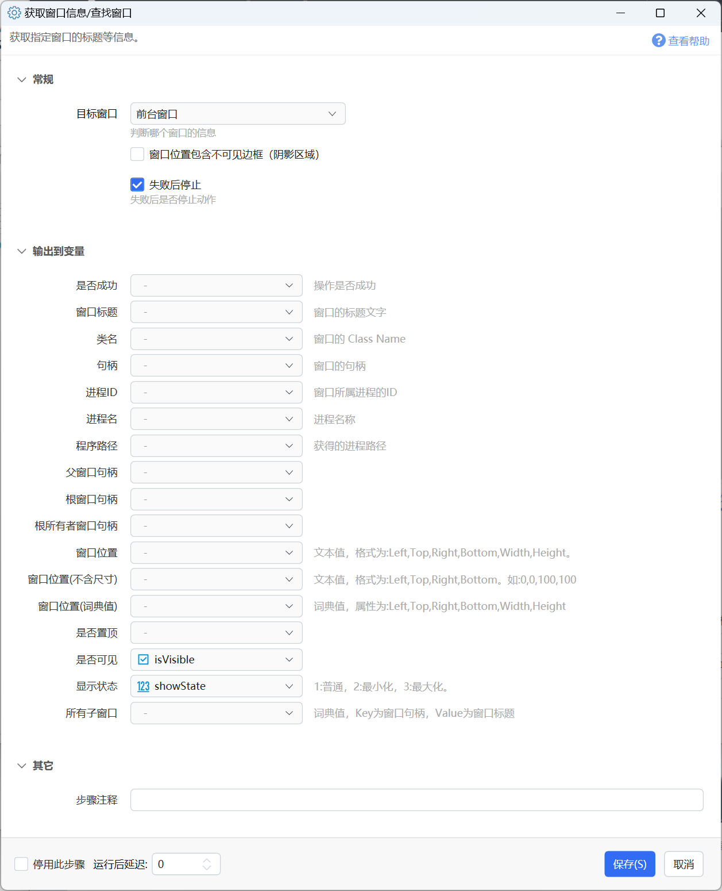

# 获取窗口信息/查找窗口

获取指定窗口的标题等信息。

## 当前模块定义

<XActionModuleMeta moduleKey="sys:getWindowTitle" />

获取指定窗口的标题等信息。

## 参数

### 输入

【目标窗口】要获取信息的窗口。可选值如下：

-   前台窗口：Windows的当前活动窗口；
-   弹出面板前鼠标位置的窗口（可能为子窗口）：弹出面板前鼠标所在位置的窗口，由于Windows创建是层级结构，这里得到的可能是子窗口。
-   弹出面板前鼠标位置窗口的根窗口：弹出面板前鼠标所在位置窗口的根窗口。
-   当前鼠标位置的窗口（可能为子窗口）：执行步骤时鼠标位置的窗口信息。
-   当前鼠标位置窗口的根窗口：执行步骤时鼠标位置窗口的根窗口信息。
-   句柄指定的窗口：通过“窗口句柄”参数指定窗口对象。
-   查找顶层窗口：通过窗口类名、窗口名称参数搜索Windows的顶层窗口。当不指定进程名时，使用Win32方法FindWindow查找窗口。可能找到已隐藏的窗口。当指定进程名时，仅查找可见的窗口。
-   所有顶层窗口：返回所有顶层窗口的句柄和名称的词典。

### 输出

窗口的各项信息。（就不详细解释了，需要了解Win32编程的相关知识）

## 示例

-   等待“另存为”窗口：[https://getquicker.net/sharedaction?code=2a59718b-523b-4e7e-a4a8-08d70bf0ab12](https://getquicker.net/sharedaction?code=2a59718b-523b-4e7e-a4a8-08d70bf0ab12)

## 更新历史

-   20230204 更新图片。
