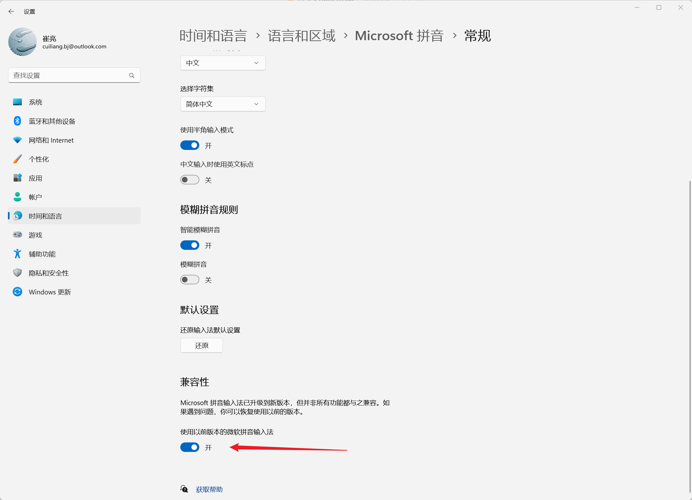

# 输入法状态

获取或切换当前输入法的中英文状态，避免发送热键或文本时被输入法吃掉。发送前可先切到英文，用完再 **恢复**。

## 当前模块定义

<XActionModuleMeta moduleKey="sys:imeControl" />

## 概述

只在输入法已开启时有效。状态作用在前台窗口进程上，目标窗口和其中的输入框需要有焦点。

<ModuleParamPreview moduleKey="sys:imeControl" />

## 参数说明

**操作类型**：

- 切换为中文：切到中文（或其他语种输入法的对应语种）。
- 切换为英文
- 恢复：恢复到本动作里首次使用本模块之前的状态。
- 是否为中文状态？：读取当前是否为中文（或对应语种）。

## 输出

仅 **是否为中文状态？**：

- **是否为中文状态**

## 限制与排障

并非所有输入法都支持。2023-12-19 在 Windows 11 22H2 上的测试：

- 搜狗 11.1.0.5032、QQ 拼音 6.6.6304.400、小狼毫（Rime）0.15.0.0：支持
- 系统内置微软输入法：不支持
- 微软输入法开启「使用以前版本的微软拼音输入法」后：支持

切换输入法为兼容模式可能缓解部分问题。微软拼音被置顶界面挡住时，见 [知识库 920](https://getquicker.net/KC/Kb/Article/920)。

## 相关链接

<RelatedDocs
  items={[
    {
      href: '/v2/xaction/modules/sendkeys',
      label: '模拟按键B',
      description: '发热键前可先切到英文。',
    },
    {
      href: '/v2/xaction/modules/keyinput',
      label: '键盘输入',
      description: '逐键输入文本。',
    },
  ]}
/>
