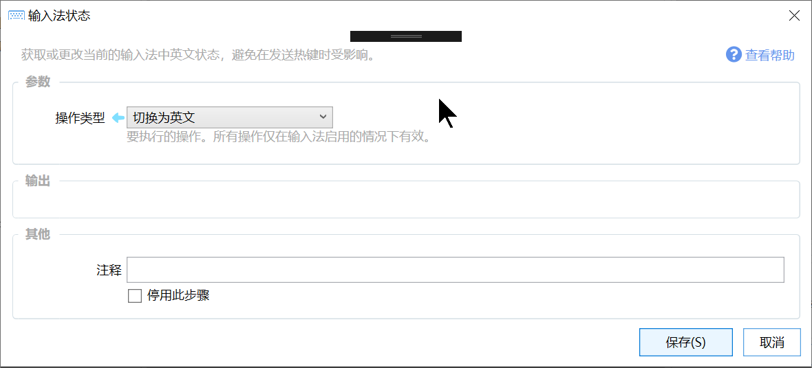

# 输入法状态

获取或更改当前的输入法中英文状态，避免在发送热键时受影响。

{/* xaction-metadata:start */}
## 当前模块定义

- 模块 Key：`sys:imeControl`
- 分类：Windows系统（`System`）
- 类型：`Action`
- 风险操作：否
- 专业版：否

## 输入参数

| Key | 名称 | 类型 | 默认值 | 必填 | 变量模式 | 条件 | 说明 |
| --- | --- | --- | --- | --- | --- | --- | --- |
| `operation` | 操作类型 | `Enum` | GET_STATE | 是 | `Input` |  | 要执行的操作。所有操作仅在输入法启用的情况下有效。 |

## 输出参数

| Key | 名称 | 类型 | 条件 | 说明 |
| --- | --- | --- | --- | --- |
| `isEnabled` | 是否为中文状态 | `Boolean` | 仅：GET_STATE |  |

## 选项值

### `operation` 操作类型

| Value | 名称 | 说明 |
| --- | --- | --- |
| `ENABLE` | 切换为中文 |  |
| `DISABLE` | 切换为英文 |  |
| `RESTORE` | 恢复 |  |
| `GET_STATE` | 是否为中文状态？ |  |
{/* xaction-metadata:end */}

**⚠️** **注意事项**

-   此功能仅对一些输入法有效。详见本文末尾的说明。

**ℹ️** **提示**

-   本模块的功能仅在输入法开启的情况下有效。
-   输入法状态是作用到“前台窗口”进程的，使用的时候确保目标窗口以及窗口的某个输入框具有焦点。

## 概述

获取或改变输入法的中英文状态。

通常在发送热键或文本之前可以使用此模块将输入法切换到英文状态，从而避免发送到窗口的内容被输入法影响。

## 参数

【操作】要执行的操作类型：

-   切换为英文：将输入法切换为英文状态。
-   切换为中文：将输入法切换到中文状态（如果是其他文字如日文/韩文等，切换到对应的语种）。
-   恢复：恢复输入法的中英文状态。（恢复到首次使用本模块之前的状态）
-   是否为中文状态：获取当前的输入法状态是否为中文（或输入法对应的其他语种）。

## 故障排除

切换输入法为兼容模式可能解决部分问题。

[🔗 相关链接：微软拼音输入法被置顶的界面遮挡](https://getquicker.net/KC/Kb/Article/920)

### 一些输入法的支持情况测试结果

**2023-12-19日测试结果**

操作系统版本：Windows11 22H2 （22581.100）

-   搜狗输入法11.1.0.5032：**支持**；
-   QQ拼音输入法6.6.6304.400：**支持**；
-   小狼毫（Rime）输入法0.15.0.0：**支持**；
-   系统内置微软输入法：**不支持**；
-   微软输入法开启“使用以前版本的微软拼音输入法”选项(参见下图)后：**支持**；

