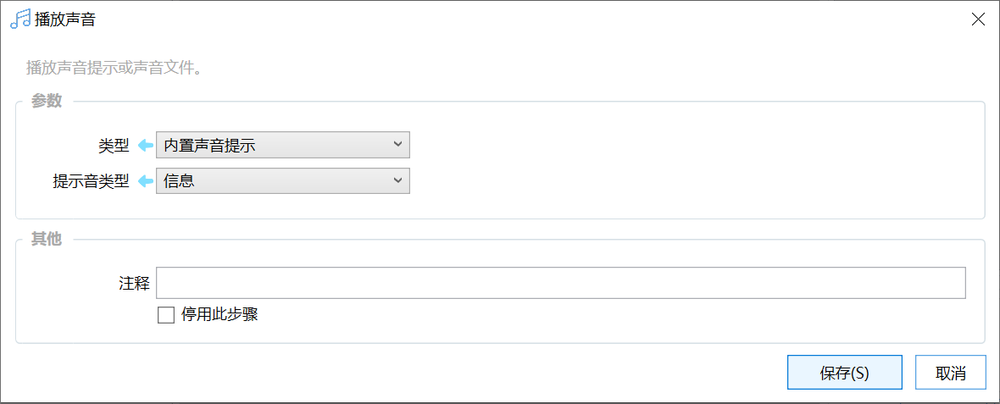

# 播放声音

播放声音提示或声音文件。

{/* xaction-metadata:start */}
## 当前模块定义

- 模块 Key：`sys:playSound`
- 分类：Windows系统（`System`）
- 类型：`Action`
- 风险操作：否
- 专业版：否

## 输入参数

| Key | 名称 | 类型 | 默认值 | 必填 | 变量模式 | 条件 | 说明 |
| --- | --- | --- | --- | --- | --- | --- | --- |
| `type` | 类型 | `Enum` | LOCAL | 是 | `Input` |  |  |
| `localSound` | 提示音类型 | `Enum` | info | 否 | `Input` | 仅：LOCAL |  |
| `uri` | 路径或URL | `Text` |  | 否 | `UseVarOrInput` | 仅：EXTERN | 音乐文件的本地路径或网址。 |
| `text` | 文本内容 | `Text` |  | 否 | `UseVarOrInput` | 仅：TTS | 需要朗读的文本。 |
| `wait` | 等待播放完成 | `Boolean` |  | 否 | `Input` |  |  |
| `stopIfFail` | 失败后停止 | `Boolean` | true | 否 | `Input` |  | 失败后是否停止动作 |

## 输出参数

| Key | 名称 | 类型 | 条件 | 说明 |
| --- | --- | --- | --- | --- |
| `isSuccess` | 是否成功 | `Boolean` |  | 操作是否成功 |

## 选项值

### `type` 类型

| Value | 名称 | 说明 |
| --- | --- | --- |
| `LOCAL` | 内置声音提示 |  |
| `EXTERN` | 电脑文件或网络文件 |  |
| `TTS` | 朗读文本（系统TTS） |  |

### `localSound` 提示音类型

| Value | 名称 | 说明 |
| --- | --- | --- |
| `info` | 信息 |  |
| `snip` | 截图 |  |
| `succeed` | 成功 |  |
| `warning` | 警告 |  |
| `wrong` | 错误 |  |
| `dim` | 弱提醒 |  |
{/* xaction-metadata:end */}

## 概述

本模块用于播放提示音或其他声音文件。

## 参数

**类型：**

-   内置声音提示：播放Quicker内置的几种提示音。
-   电脑文件或网络文件：指定文件路径或URL。

**提示音类型：**信息、截图、成功、告警、错误等。（音频资源由网友Moy提供，特此感谢！）

**路径或URL：**指定要播放的文件路径或网址。
