# Quicker操作

在动作里调用 Quicker 自己的功能（面板、搜索框、轮盘、设置、加载动作页等）。要弹出自定义界面，用 [多字段表单](/v2/xaction/modules/form)、[自定义操作窗](/v2/xaction/modules/custompanel)、[自定义窗口](/v2/xaction/modules/customwindow) 或 [WebView2浏览器窗口](/v2/xaction/modules/webview2)。

## 当前模块定义

<XActionModuleMeta moduleKey="sys:quickeroperations" />

## 概述

换 **类型** 后只显示该操作需要的参数。常见组合：先 **显示面板**，稍等再 **加载动作页**，把面板切到指定页。

<ModuleParamPreview moduleKey="sys:quickeroperations" />

## 参数说明

**类型**：要调用的 Quicker 功能，见下面各节。

**失败后停止**：失败是否中止动作。默认开启。

### 显示面板

显示面板窗口。

<ModuleParamPreview
  moduleKey="sys:quickeroperations"
  focusKeys={['type', 'activatePointWindow', 'followMousePosition', 'stopIfFail', 'isSuccess']}
  values={{
    type: 'showPanel',
    activatePointWindow: 'false',
    followMousePosition: 'true',
    stopIfFail: 'true',
  }}
/>

**自动激活鼠标位置窗口**：是否先激活指针下的窗口。默认关闭。

**跟随鼠标位置**：面板是否跟到指针附近。默认开启。

### 显示搜索框 / 关闭搜索框

**显示搜索框** 弹出搜索框，并可预填搜索词（常填某个搜索功能的触发词）。详见 [从搜索框给动作传递参数](/v2/xaction/guides/search-adv)。

<ModuleParamPreview
  moduleKey="sys:quickeroperations"
  focusKeys={['type', 'searchText', 'stopIfFail']}
  values={{type: 'showSearch', searchText: '', stopIfFail: 'true'}}
/>

**预置的搜索内容**：预先放入搜索框的文字。仅 **显示搜索框**、**使用当前动作进行实时搜索**、**使用指定动作进行实时搜索** 时出现。

<PreviewMarks marks={[{key: 'searchText', label: '预置搜索词'}]}>
  <ModuleParamPreview
    moduleKey="sys:quickeroperations"
    focusKeys={['type', 'searchText', 'stopIfFail', 'isSuccess']}
    values={{type: 'showSearch', searchText: 'ff', stopIfFail: 'true'}}
  />
</PreviewMarks>

**关闭搜索框**：关掉已经打开的搜索框。

### 显示轮盘菜单 (点击)

以点击模式显示轮盘：出现后要点选动作，而不是滑动选择。若轮盘设置里开启了「非滑动方式触发式显示扩展圈」，这样触发的轮盘会把扩展圈铺在屏幕上。轮盘本身的说明见 [轮盘菜单](/v2/what's-new/others/circle-menu)。

<PreviewMarks
  marks={[
    {key: 'exe', label: '场景标识；可点右侧按钮选择，留空时加载前台窗口场景'},
  ]}
>
  <ModuleParamPreview
    moduleKey="sys:quickeroperations"
    focusKeys={['type', 'exe', 'stopIfFail', 'isSuccess']}
    values={{type: 'showCircleMenu', exe: '', stopIfFail: 'true'}}
  />
</PreviewMarks>

**场景标识**：可指定场景关联的 exe 文件名（场景与动作管理左侧列表）。留空则按当前场景。

<ShareLinkCard
  code="7efc668c-a749-4a8c-fc16-08d978b0ec35"
  title="显示轮盘菜单"
  description="以点击模式打开轮盘"
  author="CL"
/>

### 显示选中文本工具条

让 [选中文本工具条](/v2/features/triggers/text-selection-toolbar) 按当前选区弹出。2.x 用它替代 1.x 的文本悬浮窗；托盘或设置里若仍看到旧入口，对应的就是本操作。

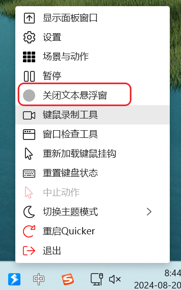

### 禁用/启用

切换是否暂停 Quicker 的功能触发。等同于：

- 托盘菜单的「暂停」「恢复」；
  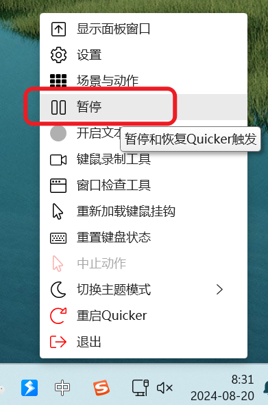
- 双击托盘图标；
- 「暂停/恢复 Quicker」快捷键。

### 运行最后使用的动作

再跑一次「最后使用的动作」。不建议依赖：这个记录可能被别的操作改掉。

### 启动App语音输入

已过时。安卓客户端已不再维护。

### 停止运行中的动作

停掉所有正在跑的动作，等同于「停止运行动作」快捷键。

### 重新加载键鼠挂钩

重新加载键盘和鼠标挂钩，等同于托盘菜单或对应功能快捷键。

### 重置键盘状态

键盘状态和实际按键不一致时，清掉仍显示为按下的键。等同于对应托盘菜单。可用「键盘状态」窗口查看。

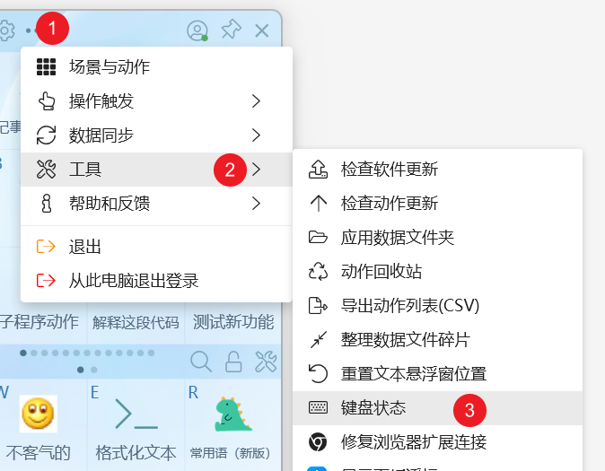

### 显示仪表盘窗口 / 显示设置窗口

**显示仪表盘窗口**：打开仪表盘。需要时可填 **场景标识**，打开该场景的仪表盘。

<ModuleParamPreview
  moduleKey="sys:quickeroperations"
  focusKeys={['type', 'exe', 'stopIfFail']}
  values={{type: 'showDashboardWindow', exe: '', stopIfFail: 'true'}}
/>

**显示设置窗口**：打开设置。等同于主界面入口或托盘菜单。

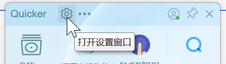

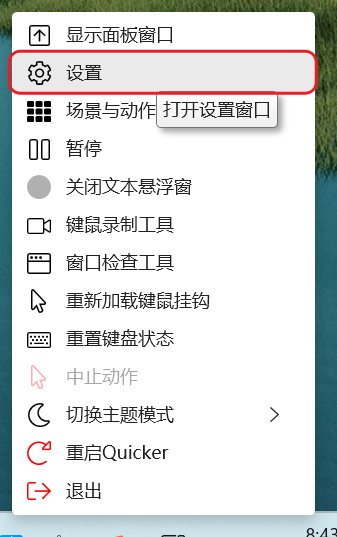

### 显示场景与动作管理窗口

打开场景与动作管理。需要时可填 **场景标识**，自动切到该场景。

<ModuleParamPreview
  moduleKey="sys:quickeroperations"
  focusKeys={['type', 'exe', 'stopIfFail']}
  values={{type: 'showExeSettingWindow', exe: '', stopIfFail: 'true'}}
/>

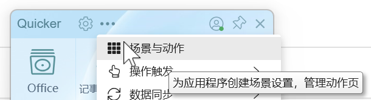

### 关闭所有悬浮按钮

关掉所有悬浮动作和动作页。

### 加载动作页

把指定动作页加载到当前面板。在场景与动作管理里复制动作页 ID。

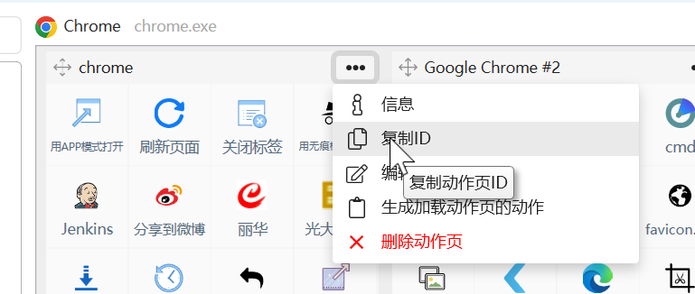

**动作页ID**：必填。

### 加载场景动作（锁定切换）

手动切到某个应用程序（或自定义虚拟应用），加载它的动作页并锁定。锁定等同于按下锁定按钮。

<ModuleParamPreview
  moduleKey="sys:quickeroperations"
  focusKeys={['type', 'exe', 'sceneGroup', 'stopIfFail']}
  values={{type: 'loadExeProfiles', exe: '', sceneGroup: '', stopIfFail: 'true'}}
/>

**场景标识**：场景关联的 exe 文件名。

**切换到分组**：加载后在新版面板里切到此分组。留空按场景默认；填「未分组」切到未分组。仅锁定 / 不锁定这两种加载场景动作时出现。

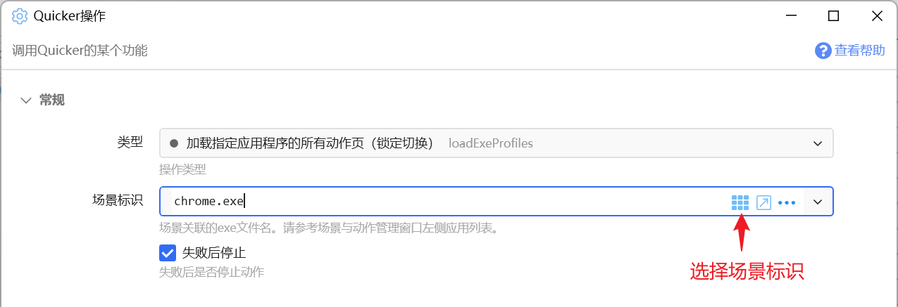

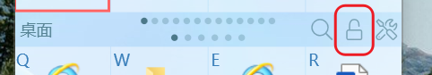

要让加载动作页时面板跟着鼠标：先 **显示面板**（可开 **跟随鼠标位置**）→ 稍等 → 再加载动作页或场景动作。

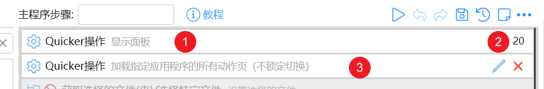

### 加载场景动作（不锁定切换）

同样加载场景动作页，但不锁定切换。参数与上一节相同（**场景标识**、**切换到分组**）。

### 锁定/解锁 动作页自动切换

等同于面板上的锁定切换按钮。

### 编辑动作

打开指定动作或公共子程序的编辑窗口。

<ModuleParamPreview
  moduleKey="sys:quickeroperations"
  focusKeys={['type', 'actionId', 'stopIfFail']}
  values={{type: 'editAction', actionId: '测试动作20240108', stopIfFail: 'true'}}
/>

**动作ID或名称** 可填：

- 动作 ID
- 动作名称（名称必须唯一）
- `%%` 公共子程序 id（1.43.18+）
- `%%` 公共子程序名称（1.43.18+）

右键动作 → 信息 可查看 ID。用名称时不能有重名。

### 重启Quicker / 退出Quicker

**重启Quicker**：重启软件。

**退出Quicker**：关闭软件。

### 推送服务：设置为活动客户端

多台电脑连同一推送服务时，把当前电脑设为默认客户端。

### 使用当前动作进行实时搜索

编写带实时搜索的动作时，用来触发搜索或更新搜索词。可填 **预置的搜索内容**。

### 使用指定动作进行实时搜索

用另一个动作做实时搜索，并填入搜索词。

<ModuleParamPreview
  moduleKey="sys:quickeroperations"
  focusKeys={['type', 'actionId', 'searchText', 'stopIfFail']}
  values={{
    type: 'SearchWithCertainAction',
    actionId: '测试动作20240108',
    searchText: '',
    stopIfFail: 'true',
  }}
/>

**动作ID或名称**：要用来搜索的动作。

**预置的搜索内容**：放入搜索框的词。

### 显示剪贴板上下文菜单

按当前剪贴板内容弹出内容上下文菜单。

### 加载外观/切换主题(专业版功能)

加载指定外观，并可切换浅色 / 暗色。需要专业版。只改主题时，**外观ID** 可留空。

<ModuleParamPreview
  moduleKey="sys:quickeroperations"
  focusKeys={['type', 'skinId', 'theme', 'isSuccess']}
  values={{
    type: 'LoadSkin',
    skinId: '16e905c4-bdab-40d6-ff8e-08dcbaf60df3',
    theme: '',
  }}
/>

**外观ID**：在外观库详情页复制。

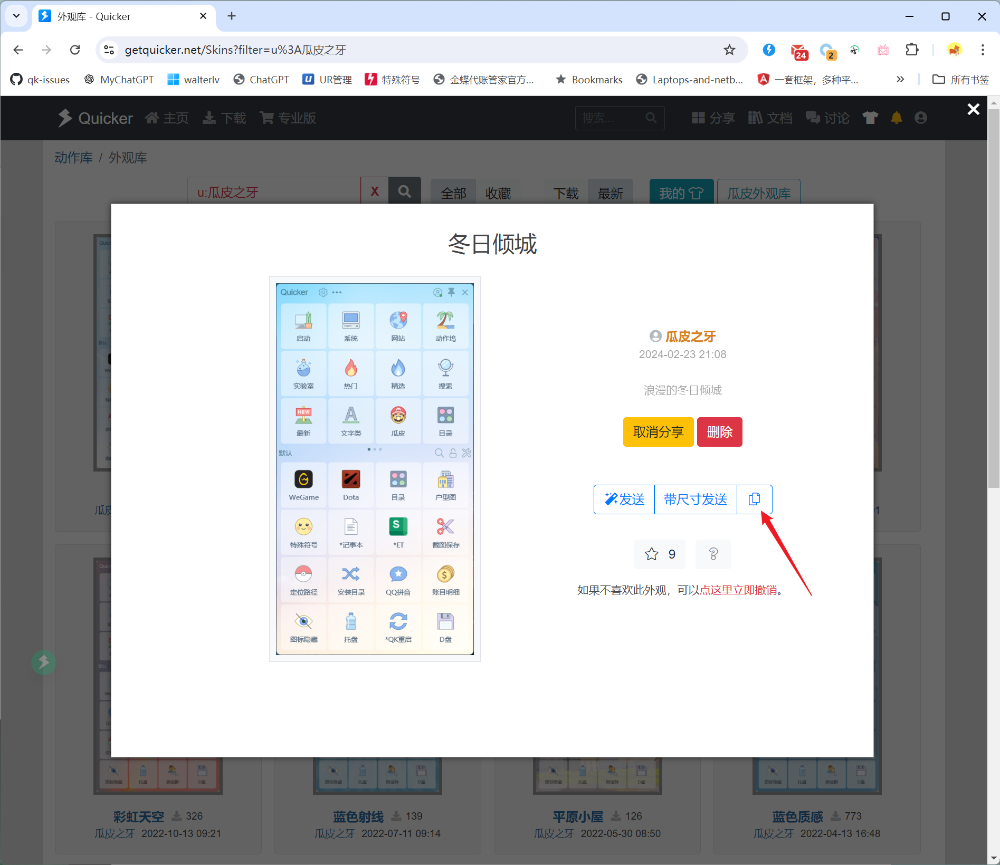

**主题模式**：不改变、跟随 Windows、浅色、暗色、切换浅色和暗色。

### 悬浮动作(专业版功能)

把指定动作悬浮到某个位置。需要专业版。

<ModuleParamPreview
  moduleKey="sys:quickeroperations"
  focusKeys={['type', 'actionId', 'position', 'stopIfFail', 'isSuccess']}
  values={{type: 'FloatAction', actionId: '', position: '200,200', stopIfFail: 'true'}}
/>

**动作ID或名称**：要悬浮的动作。

**位置**：`left,top` 坐标，默认 `200,200`。

输出 **窗口句柄**：悬浮窗口的句柄。

### 切换所有悬浮按钮显示

统一改悬浮动作的显示：全部隐藏、全部显示，或按活动进程自动切换。

<ModuleParamPreview
  moduleKey="sys:quickeroperations"
  focusKeys={['type', 'viewMode', 'isSuccess']}
  values={{type: 'ToggleFloatButtons', viewMode: 'ByProcess'}}
/>

**显示状态**：隐藏全部、自动(按关联进程切换)、显示全部、切换隐藏和自动。默认「自动(按关联进程切换)」。

### 显示或隐藏所有图片窗口

在需要时隐藏或恢复所有图片窗口。

### 删除当前动作

删除当前动作。可配合右键菜单做自定义删除（例如先清本地数据再删）。

### 根据ID获取动作信息

按动作 ID 读取动作信息。此时 **动作ID或名称** 只能填动作 ID，不能填名称。

## 输出

- **步骤是否成功**：本步是否完成。
- **动作标题** / **动作图标** / **动作描述**：仅 **根据ID获取动作信息**。
- **窗口句柄**：仅 **悬浮动作(专业版功能)**。

## 限制与排障

- **运行最后使用的动作** 的目标可能被其它操作改掉，不要当稳定入口。
- **启动App语音输入** 已过时。
- 加载动作页后面板不跟鼠标：先显示面板并打开 **跟随鼠标位置**，稍等再加载。
- 用名称编辑或搜索动作时，名称必须唯一；获取动作信息只能填 ID。
- **加载外观/切换主题**、**悬浮动作** 需要专业版。

## 相关链接

<RelatedDocs
  items={[
    {
      href: '/v2/xaction/guides/search-adv',
      label: '从搜索框给动作传递参数',
      description: '搜索框预填词、把参数交给动作。',
    },
    {
      href: '/v2/features/triggers/text-selection-toolbar',
      label: '选中文本工具条',
      description: '2.x 替代文本悬浮窗的选区工具条。',
    },
    {
      href: "/v2/what's-new/others/circle-menu",
      label: '轮盘菜单',
      description: '点击模式与扩展圈的说明。',
    },
    {
      href: '/v2/xaction/modules/runaction',
      label: '运行动作',
      description: '直接跑另一个动作，而不是调 Quicker 界面。',
    },
  ]}
/>

## 更新历史

- 20240820 完善文档。
