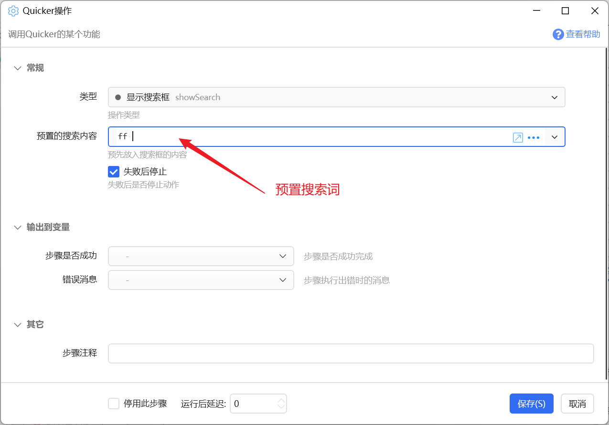
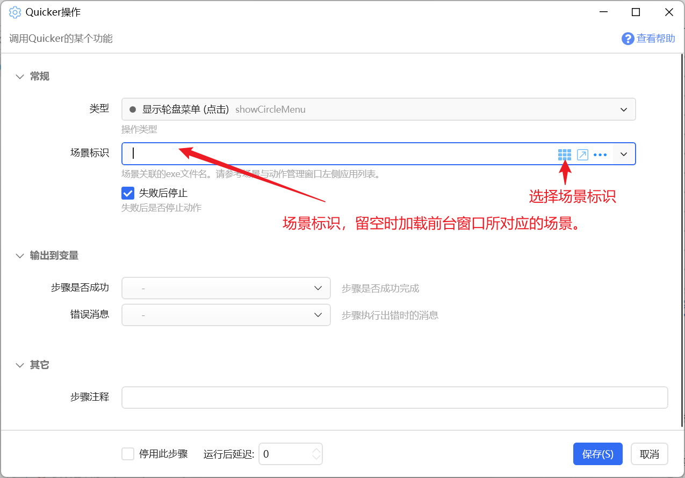

# Quicker操作

调用Quicker的某个功能

## 当前模块定义

<XActionModuleMeta moduleKey="sys:quickeroperations" />

在动作中调用Quicker功能。从而方便的使用轮盘菜单、扩展热键等操作Quicker。

<ModuleParamPreview moduleKey="sys:quickeroperations" />

可以结合使用“显示面板”和“加载动作页”实现用动作切换到某个特定的动作页上的目的。

## 部分操作类型的说明

### 显示面板

显示面板窗口。可指定是否自动激活鼠标位置窗口、是否跟随鼠标。

<ModuleParamPreview
  moduleKey="sys:quickeroperations"
  focusKeys={['type', 'activatePointWindow', 'followMousePosition', 'stopIfFail', 'isSuccess']}
  values={{
    type: 'showPanel',
    activatePointWindow: 'false',
    followMousePosition: 'true',
    stopIfFail: 'true',
  }}
/>

### 显示搜索框

用于触发搜索框，并自动填入特定的搜索词（通常填写某个[搜索功能](https://getquicker.net/kc/manual/doc/searching)的触发词）。

### 关闭搜索框

关闭已经显示的搜索框。

### 显示轮盘菜单（点击）

以点击模式显示轮盘菜单：显示轮盘后需要**点击**选择动作，而不是普通的滑动触发选择。

如果在轮盘设置中开启“非滑动方式触发式显示扩展圈”，使用此方式触发的轮盘会将扩展圈显示在屏幕上。

示例动作：[显示轮盘菜单 - by CL - 动作信息 - Quicker](https://getquicker.net/Sharedaction?code=7efc668c-a749-4a8c-fc16-08d978b0ec35)

### 禁用/启用

切换是否禁用Quicker功能触发。

该功能等同于：

-   点击托盘菜单的“暂停”“恢复”菜单项；
    
-   双击托盘图标；
-   按下“暂停/恢复Quicker”的快捷键；

### 运行最后使用的动作

不建议使用此功能，“最后使用的动作”可能会意外变化。

### 启用App语音输入

【已过时】安卓客户端已不再维护。

### 停止运行中的动作

停止所有运行中的动作，功能等同于“停止运行动作”快捷键。

### 重新加载键鼠挂钩

重新加载键盘和鼠标挂钩，功能等同于“重新加载键盘和鼠标挂钩”托盘菜单或对应的功能快捷键。

### 重置键盘状态

当键盘状态和实际状态不统一时，用于清除处于按下状态的按键。等同于对应托盘菜单的功能。

可以使用“键盘状态”窗口查看键盘状态。

### 显示仪表盘窗口

显示仪表盘窗口，如果需要可以指定特定场景的仪表盘窗口。

<ModuleParamPreview
  moduleKey="sys:quickeroperations"
  focusKeys={['type', 'exe', 'stopIfFail']}
  values={{type: 'showDashboardWindow', exe: '', stopIfFail: 'true'}}
/>

### 开启/关闭文本悬浮窗功能

功能等同于对应托盘菜单：

### 显示配置窗口

打开设置窗口，功能等同于

或托盘菜单：

### 显示场景与动作管理窗口

显示场景与动作管理窗口，必要时可以指定场景标识以自动切换到特定场景的设置界面。

<ModuleParamPreview
  moduleKey="sys:quickeroperations"
  focusKeys={['type', 'exe', 'stopIfFail']}
  values={{type: 'showExeSettingWindow', exe: '', stopIfFail: 'true'}}
/>

功能等同于

### 关闭所有悬浮按钮

关闭所有悬浮动作和动作页。

### 加载动作页

加载特定的动作页到当前面板中。

可以在场景与动作管理中复制动作页id。

### 加载指定应用程序的所有动作页（锁定切换）

以手动方式切换到某个应用程序（或自定义虚拟应用），加载对其设置的动作页并锁定。

用于在某些场景下固定所使用的动作页。

锁定切换等同于按下锁定按钮。

#### 如何使加载动作页时，面板窗口跟随鼠标？

（1）先显示面板，里面可以设置是否跟随鼠标；

（2）然后延迟一点时间；

（3）再加载动作页、或加载场景的所有动作页。

### 加载指定应用程序的所有动作页（不锁定切换）

加载动作页，但不锁定切换。

### 锁定/解锁 动作页自动切换

等同于按下面板窗口的锁定切换按钮。

### 编辑动作

编辑特定的动作或公共子程序。

动作ID或名称参数可填写：

-   动作ID
-   动作名称（确保动作名唯一存在）
-   %%公共子程序id（1.43.18+版本）
-   %%公共子程序名称（1.43.18+版本）

<ModuleParamPreview
  moduleKey="sys:quickeroperations"
  focusKeys={['type', 'actionId', 'stopIfFail']}
  values={{type: 'editAction', actionId: '测试动作20240108', stopIfFail: 'true'}}
/>

### 重启Quicker

重启Quicker软件。

### 推送服务：设置为活动客户端

当多个电脑连接推送服务时，将当前电脑设置为默认客户端。

### 使用当前动作进行实时搜索

当编写具有实时搜索功能的动作时，用于触发搜索功能或更新搜索词。

### 使用指定动作进行实时搜索

触发使用另外的动作进行时搜索的功能并填入指定的搜索词。

<ModuleParamPreview
  moduleKey="sys:quickeroperations"
  focusKeys={['type', 'actionId', 'searchText', 'stopIfFail']}
  values={{
    type: 'SearchWithCertainAction',
    actionId: '测试动作20240108',
    searchText: '',
    stopIfFail: 'true',
  }}
/>

### 显示剪贴板上下文菜单

触发显示[内容上下文菜单](https://getquicker.net/kc/manual/doc/content-contextmenu)，该菜单根据当前剪贴板中的内容加载菜单项。

### 加载外观/切换主题

加载特定的外观，以及切换主题模式。本功能需要专业版。

仅切换主题模式时，可不填写外观ID。

<ModuleParamPreview
  moduleKey="sys:quickeroperations"
  focusKeys={['type', 'skinId', 'theme', 'isSuccess']}
  values={{
    type: 'LoadSkin',
    skinId: '16e905c4-bdab-40d6-ff8e-08dcbaf60df3',
    theme: '',
  }}
/>

外观ID可从外观库中点击某个外观打开的外观详情页面中复制。

### 退出Quicker

关闭Quicker软件。

### 悬浮动作

将指定动作悬浮到特定位置。

<ModuleParamPreview
  moduleKey="sys:quickeroperations"
  focusKeys={['type', 'actionId', 'position', 'stopIfFail', 'isSuccess']}
  values={{type: 'FloatAction', actionId: '', position: '200,200', stopIfFail: 'true'}}
/>

### 切换所有悬浮按钮显示

切换悬浮动作的显示状态，可全部隐藏、全部显示或切换为默认的按活动进程显示的状态。

<ModuleParamPreview
  moduleKey="sys:quickeroperations"
  focusKeys={['type', 'viewMode', 'isSuccess']}
  values={{type: 'ToggleFloatButtons', viewMode: 'ByProcess'}}
/>

### 显示或隐藏所有图片窗口

用于特定情况下隐藏所有的图片窗口。

### 删除当前动作

删除当前动作，可以用于结合右键菜单设计自定义的删除功能（如在删除动作前清理本地数据）。

### 根据ID获取动作信息

获取指定动作的信息。

## 更新历史

-   20240820 完善文档。
