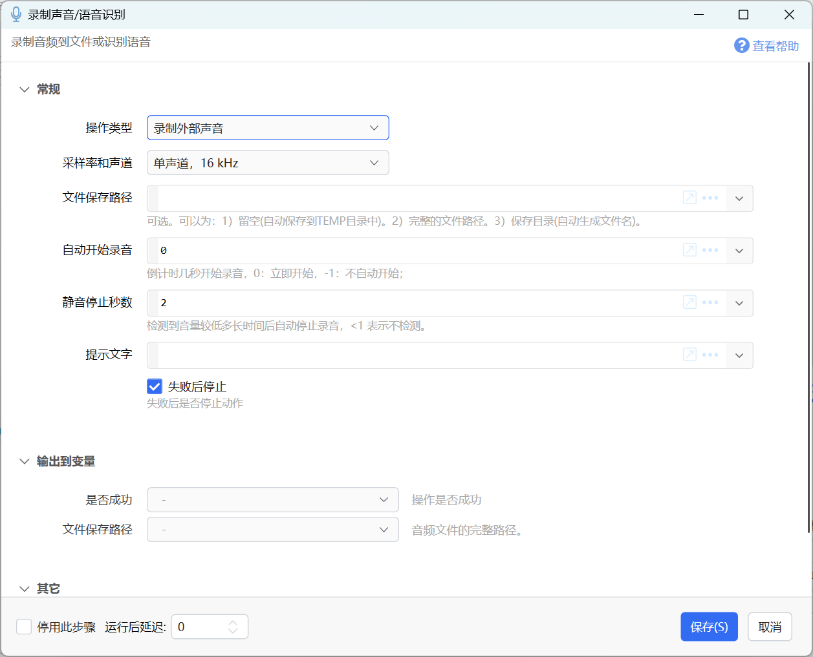
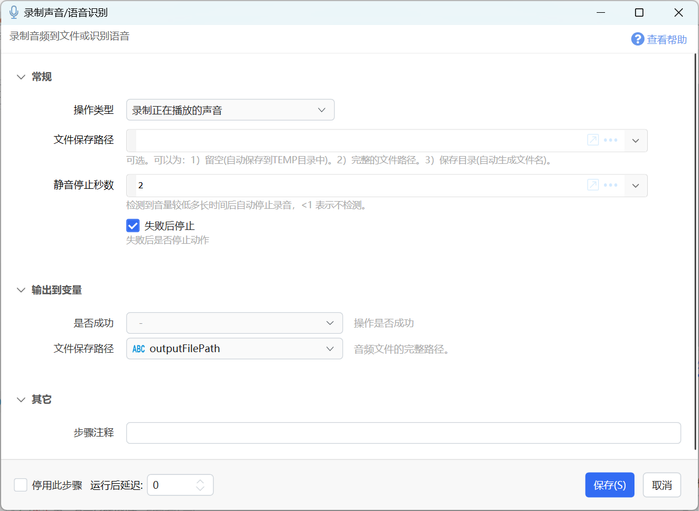
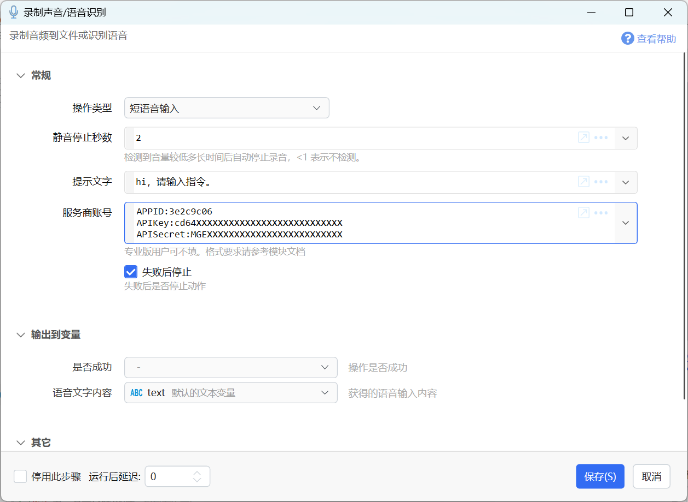

# 录制声音/语音识别

录制音频到文件或识别语音

{/* xaction-metadata:start */}
## 当前模块定义

- 模块 Key：`sys:recordSound`
- 分类：Windows系统（`System`）
- 类型：`Action`
- 风险操作：否
- 专业版：否

## 输入参数

| Key | 名称 | 类型 | 默认值 | 必填 | 变量模式 | 条件 | 说明 |
| --- | --- | --- | --- | --- | --- | --- | --- |
| `operation` | 操作类型 | `Enum` | record | 是 | `Input` |  |  |
| `waveFormat` | 采样率和声道 | `Enum` | 16000\|1 | 否 | `Input` | 仅：record |  |
| `filePath` | 文件保存路径 | `Text` |  | 否 | `Input` | 仅：record, record_internal | 可选。可以为：1）留空(自动保存到TEMP目录中)。2）完整的文件路径。3）保存目录(自动生成文件名)。 |
| `autoStartSeconds` | 自动开始录音 | `Number` | 0 | 否 | `Input` | 仅：record | 倒计时几秒开始录音，0：立即开始，-1：不自动开始； |
| `silentStopSeconds` | 静音停止秒数 | `Number` | 3 | 否 | `Input` | 仅：record, record_internal, short_voice_input | 检测到音量较低多长时间后自动停止录音，&lt;1 表示不检测。 |
| `helpText` | 提示文字 | `Text` |  | 否 | `Input` | 仅：record, short_voice_input |  |
| `vendorAccount` | 服务商账号 | `Text` |  | 否 | `Input` | 仅：short_voice_input | 专业版用户可不填。格式要求请参考模块文档 |
| `volumeGain` | 音量增益倍率 | `Number` | 0 | 否 | `Input` | 仅：record_internal | 录制时的音量放大倍数，1.0为原始音量，建议范围1.0-5.0，设置为0或负数则不进行增益处理 |
| `stopIfFail` | 失败后停止 | `Boolean` | true | 否 | `Input` |  | 失败后是否停止动作 |

## 输出参数

| Key | 名称 | 类型 | 条件 | 说明 |
| --- | --- | --- | --- | --- |
| `isSuccess` | 是否成功 | `Boolean` |  | 操作是否成功 |
| `outputFilePath` | 文件保存路径 | `Text` | 仅：record, record_internal | 音频文件的完整路径。 |
| `speechContent` | 语音文字内容 | `Text` | 仅：short_voice_input | 获得的语音输入内容 |
| `error` | 错误 | `Text` | 仅：short_voice_input | 失败原因提示消息 |

## 选项值

### `operation` 操作类型

| Value | 名称 | 说明 |
| --- | --- | --- |
| `record` | 录制外部声音 |  |
| `record_internal` | 录制正在播放的声音 |  |
| `short_voice_input` | 短语音输入 |  |

### `waveFormat` 采样率和声道

| Value | 名称 | 说明 |
| --- | --- | --- |
| `8000\|1` | 单声道，8 kHz |  |
| `16000\|1` | 单声道，16 kHz |  |
| `22050\|1` | 单声道，22.05 kHz |  |
| `32000\|1` | 单声道，32 kHz |  |
| `44100\|1` | 单声道，44.1 kHz |  |
| `8000\|2` | 双声道，8 kHz |  |
| `16000\|2` | 双声道，16 kHz |  |
| `22050\|2` | 双声道，22.05 kHz |  |
| `32000\|2` | 双声道，32 kHz |  |
| `44100\|2` | 双声道，44.1 kHz |  |
{/* xaction-metadata:end */}

支持如下操作类型：

-   录制外部声音：录制麦克风的声音；
-   录制正在播放的声音：录制电脑发出的声音，比如正在播放的浏览器朗读文字的声音；
-   短语音输入：输入语音并识别成文字；

使用录音功能前，请在Windows设置中开启麦克风权限：


## 录制外部声音

录制麦克风中输入的声音，生成`.wav`格式的文件。




**输入参数**

【采样率和声道】选择采样频率及单声道或双声道类型。

【文件保存路径】指定录制文件的保存位置，支持如下三种形式：

-   留空：自动保存在系统TEMP目录中，并将文件实际路径输出。
-   目录的路径：文件保存在这个路径中，并根据时间自动生成文件名。
-   详细的文件路径：指定具体的存储路径，将覆盖已经存在的文件。

【自动开始录音】倒计时几秒后开始录音。0表示立即开始，-1表示不自动开始录音。

【静音停止秒数】当检测到没有语音输入时自动停止录音。小于1时不自动停止。

【提示文字】显示在录音窗口中的提示文字。

**输出参数**

【文件保存路径】录制文件的实际存储路径。

## 录制正在播放的声音

录制某个软件正在播放的声音。




输入输出参数，请参考“录制外部声音”中的说明。

## 短语音输入

本功能使用[讯飞语音听写(流式版)](https://console.xfyun.cn/services/iat)，实现60秒内的语音转文字功能。




【静音停止秒数】检测到一定的静音时间后停止输入。

【提示文字】显示在语音识别窗口的提示文字内容。

【服务商账号】

专业版目前可免费使用此功能（不需要填写服务商账号，此参数留空）。

请自备账号，在讯飞后台获取接口认证信息，并开通“动态修正”功能。将账号信息按如下格式填写（不要有多余的空格）：

```
APPID:3e2c9c06
APIKey:cd64XXXXXXXXXXXXXXXXXXXXXXXXXXX
APISecret:MGEXXXXXXXXXXXXXXXXXXXXXXXXX
```


从如下位置获取信息。


**输出参数**

【语音文字内容】从语音中识别到的内容。
