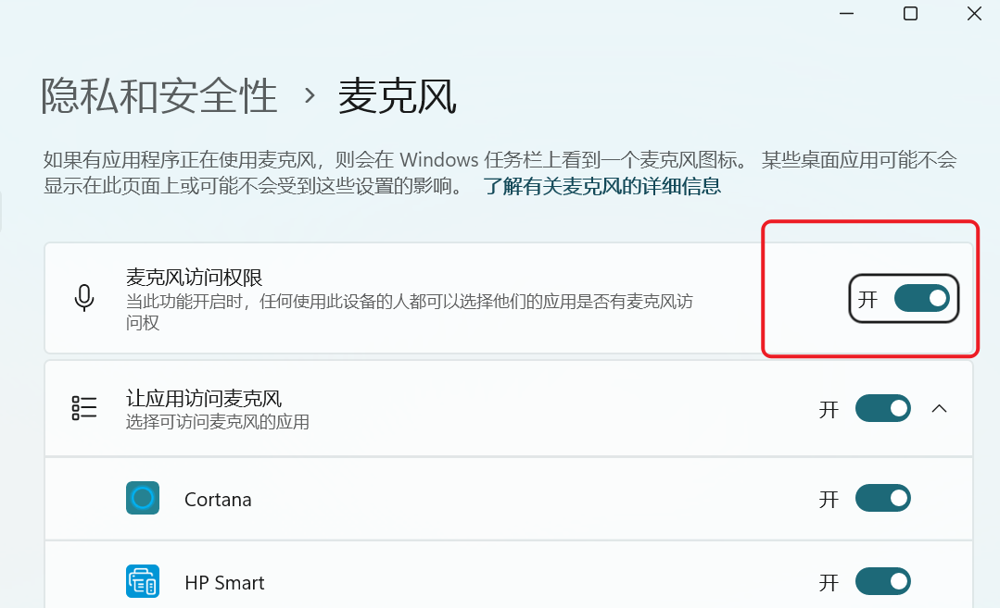
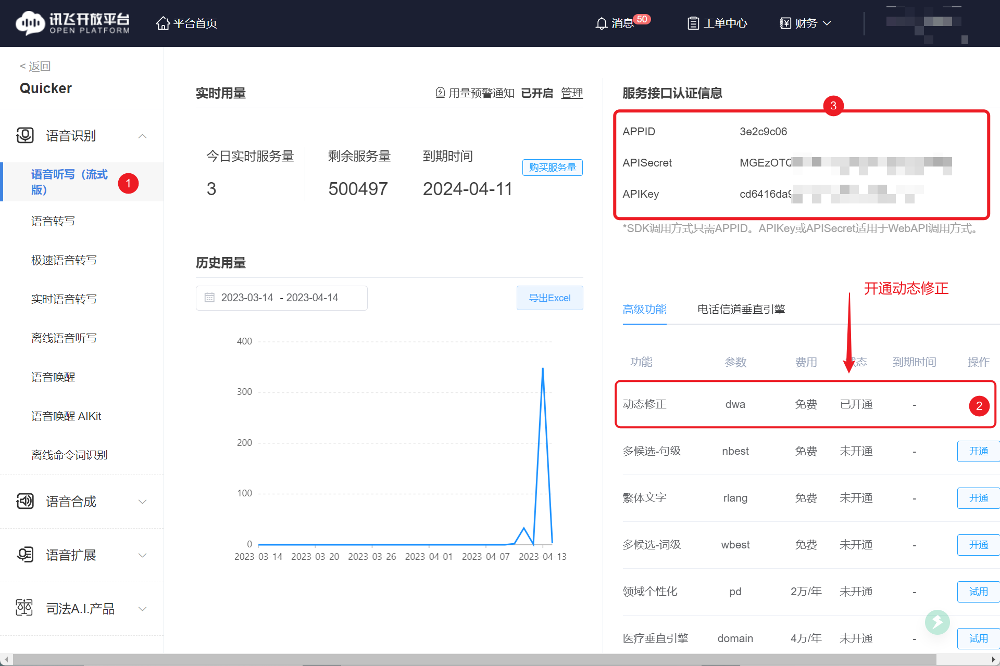

# 录制声音/语音识别

录制音频到文件或识别语音

## 当前模块定义

<XActionModuleMeta moduleKey="sys:recordSound" />

支持如下操作类型：

-   录制外部声音：录制麦克风的声音；
-   录制正在播放的声音：录制电脑发出的声音，比如正在播放的浏览器朗读文字的声音；
-   短语音输入：输入语音并识别成文字；

使用录音功能前，请在Windows设置中开启麦克风权限：



## 录制外部声音

录制麦克风中输入的声音，生成`.wav`格式的文件。

<ModuleParamPreview
  moduleKey="sys:recordSound"
  focusKeys={['operation', 'waveFormat', 'filePath', 'autoStartSeconds', 'silentStopSeconds', 'helpText']}
  values={{
    operation: 'record',
    waveFormat: '16000|1',
    filePath: '',
    autoStartSeconds: '0',
    silentStopSeconds: '2',
    helpText: '',
  }}
/>

**输入参数**

【采样率和声道】选择采样频率及单声道或双声道类型。

【文件保存路径】指定录制文件的保存位置，支持如下三种形式：

-   留空：自动保存在系统TEMP目录中，并将文件实际路径输出。
-   目录的路径：文件保存在这个路径中，并根据时间自动生成文件名。
-   详细的文件路径：指定具体的存储路径，将覆盖已经存在的文件。

【自动开始录音】倒计时几秒后开始录音。0表示立即开始，-1表示不自动开始录音。

【静音停止秒数】当检测到没有语音输入时自动停止录音。小于1时不自动停止。

【提示文字】显示在录音窗口中的提示文字。

**输出参数**

【文件保存路径】录制文件的实际存储路径。

## 录制正在播放的声音

录制某个软件正在播放的声音。

<ModuleParamPreview
  moduleKey="sys:recordSound"
  focusKeys={['operation', 'filePath', 'silentStopSeconds', 'outputFilePath']}
  values={{operation: 'record_internal', filePath: '', silentStopSeconds: '2'}}
  outputVars={{outputFilePath: 'outputFilePath'}}
/>

输入输出参数，请参考“录制外部声音”中的说明。

## 短语音输入

本功能使用[讯飞语音听写(流式版)](https://console.xfyun.cn/services/iat)，实现60秒内的语音转文字功能。

<ModuleParamPreview
  moduleKey="sys:recordSound"
  focusKeys={['operation', 'silentStopSeconds', 'helpText', 'speechContent']}
  values={{operation: 'short_voice_input', silentStopSeconds: '2', helpText: 'hi，请输入指令。'}}
  outputVars={{speechContent: 'text'}}
/>

【静音停止秒数】检测到一定的静音时间后停止输入。

【提示文字】显示在语音识别窗口的提示文字内容。

【服务商账号】

专业版目前可免费使用此功能（不需要填写服务商账号，此参数留空）。

请自备账号，在讯飞后台获取接口认证信息，并开通“动态修正”功能。将账号信息按如下格式填写（不要有多余的空格）：

```text
APPID:3e2c9c06
APIKey:cd64XXXXXXXXXXXXXXXXXXXXXXXXXXX
APISecret:MGEXXXXXXXXXXXXXXXXXXXXXXXXX
```

从如下位置获取信息。



**输出参数**

【语音文字内容】从语音中识别到的内容。
