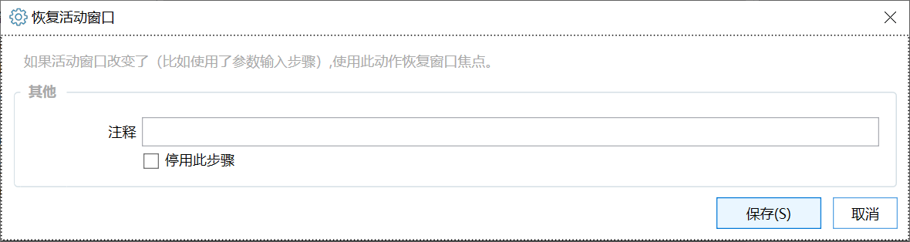

# 恢复活动窗口

如果活动窗口改变了（比如使用了参数输入步骤）,使用此动作恢复窗口焦点。

## 当前模块定义

<XActionModuleMeta moduleKey="sys:restoreActiveWindow" />

## 使用说明

活动窗口是指当前具有输入焦点的窗口。

本模块用于将活动窗口恢复为运行动作之前的活动窗口，用以解决目标窗口丢失焦点的情况。（如使用了用户选择模块或在动作中切换到了别的软件等情况

