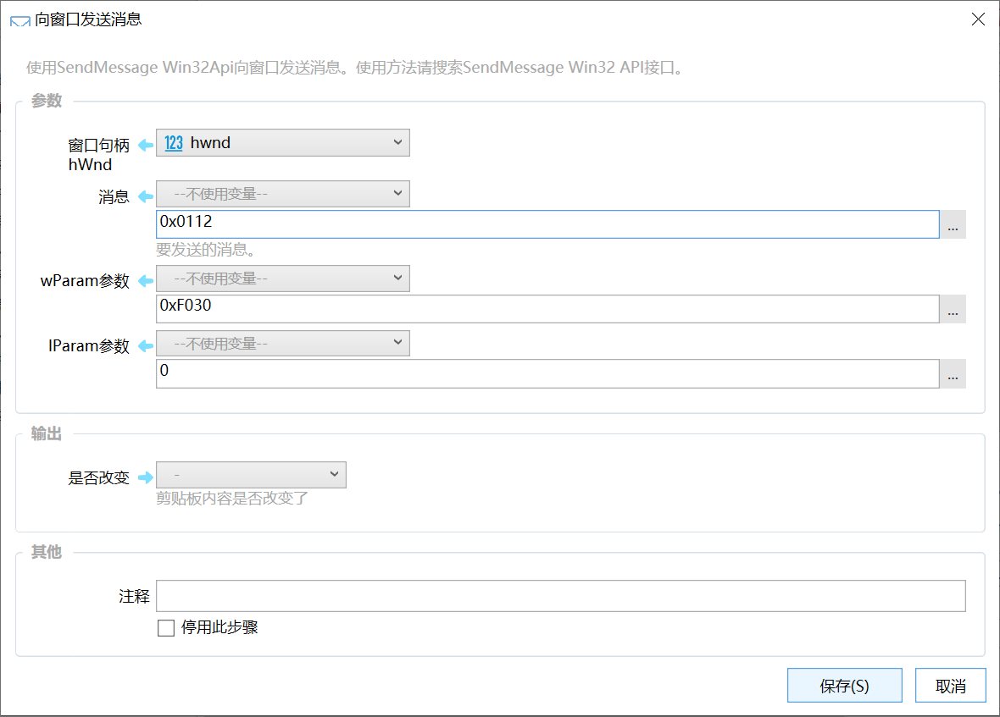

# 向窗口发送消息

使用SendMessage Win32Api向窗口发送消息。使用方法请搜索SendMessage Win32 API接口。

## 当前模块定义

<XActionModuleMeta moduleKey="sys:sendMessage" />

## 概述

【0.11.4版本之后开始提供】

调用[SendMessage](https://docs.microsoft.com/en-us/windows/desktop/api/winuser/nf-winuser-sendmessage)向指定的窗口发送Windows消息。您需要了解Win32编程知识才能使用本模块。 另外本模块限制了只能发送数字类型到lParam参数中，因此不是所有的消息类型都可以调用。

## 参数

【窗口句柄hWnd】要发送消息到的目标窗口。接收整数类型的参数。

【消息】要发送的消息，十进制数字值（如：1234），或十六进制值，如：0x0112。具体请查询Win32文档。

【wParam】wParam参数，十进制数字值（如：1234），或十六进制值，如：0x0112。具体可用值请参考消息文档。

【lParam】lParam参数，十进制数字值（如：1234），或十六进制值，如：0x0112。具体可用值请参考消息文档。

## 示例

-   [https://getquicker.net/sharedaction?code=ef1a10ef-bbb2-4dcf-5f17-08d6cebc3090](https://getquicker.net/sharedaction?code=ef1a10ef-bbb2-4dcf-5f17-08d6cebc3090)

## 参考文档

-   [SendMessage文档](https://docs.microsoft.com/en-us/windows/desktop/api/winuser/nf-winuser-sendmessage)
-   [WM\_SYSCOMMAND消息文档](https://docs.microsoft.com/en-us/windows/desktop/menurc/wm-syscommand)
