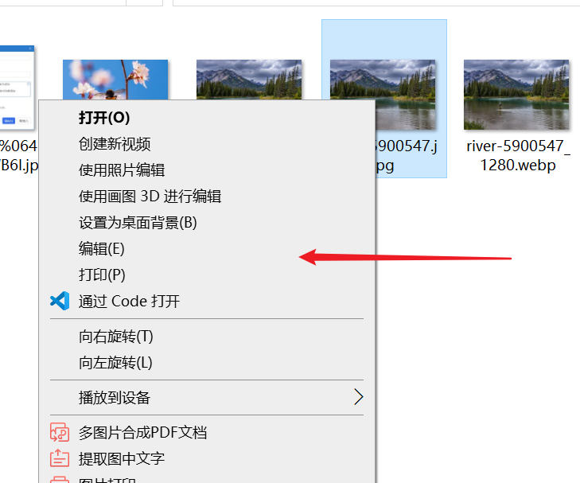
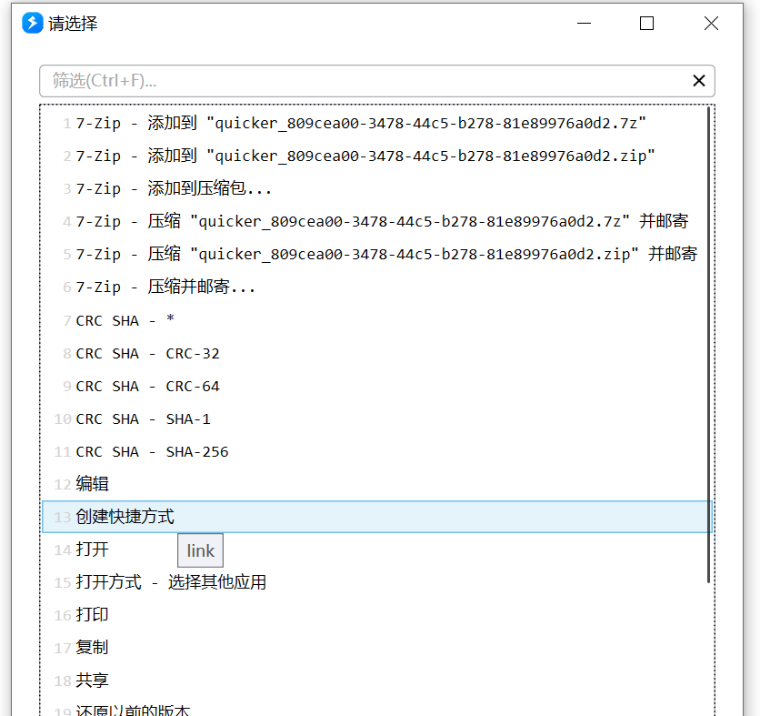
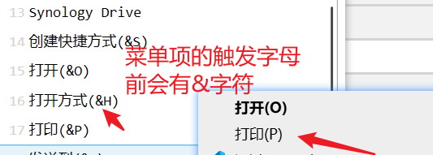
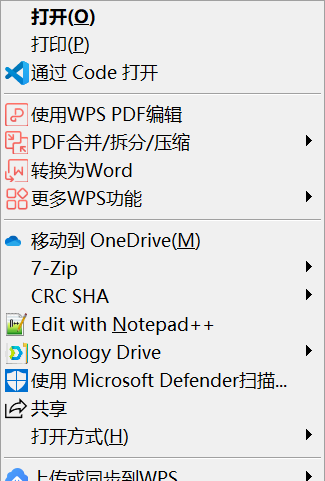

# Shell文件操作

针对文件的Windows Shell相关操作

## 当前模块定义

<XActionModuleMeta moduleKey="sys:shelloperation" />

## 概述

本模块用于对文件或文件夹触发资源管理器右键菜单功能（不需要显示菜单）。

自1.25.1版本开始提供。

**注意:**

-   因为内部实现机制不同，不是所有的菜单项都可以获取和调用（特别是一些子菜单）。
-   有一些菜单有对应的**动词**（verb），可以通过**动词**调用这些菜单。没有动词的菜单可以尝试通过菜单标题文字触发。
-   Shell菜单都是Windows或安装的软件在系统中注册的。如果没有安装对应的软件，则无法找到或运行这些菜单项。

<ModuleParamPreview
  moduleKey="sys:shelloperation"
  focusKeys={['operation', 'pathOrExt', 'isSuccess', 'titles']}
  values={{operation: 'gettitles', pathOrExt: ''}}
  outputVars={{titles: 'verbs'}}
/>

## 支持的操作类型

### 获取文件可用的动词列表

用于获取某个具体文件、文件夹或文件类型的可用动词列表。

<ModuleParamPreview
  moduleKey="sys:shelloperation"
  focusKeys={['operation', 'pathOrExt', 'stopIfFail', 'isSuccess', 'verbs']}
  values={{operation: 'getverb', pathOrExt: '$={file}'}}
  outputVars={{verbs: 'verbs'}}
/>

参数说明：

【文件路径或扩展名】指定要获取菜单的文件或文件夹的完整路径（需要该路径存在），或文件类型的扩展名（如`.txt`）。如果指定的是扩展名，Quicker会自动生成一个临时文件用于获取动词。

输出：

【动词列表】输出一个可直接用于“用户选择”等模块的列表。每一项的格式为：`菜单标题(动词)|动词`

有一些软件的菜单（如7zip）会生成带有文件名的菜单标题，但其动词是固定的。

一些常见的动词：

-   open：打开
-   edit：编辑
-   openas：选择打开方式
-   print：打印

### 对文件执行动词

对选定的（一个或多个）文件或文件夹执行动词。

<ModuleParamPreview
  moduleKey="sys:shelloperation"
  focusKeys={['operation', 'pathList', 'verb', 'stopIfFail', 'isSuccess']}
  values={{operation: 'execverb'}}
  inputVars={{pathList: 'files', verb: 'verb'}}
/>

输入参数：

【文件路径列表】文件或文件夹的完整路径列表。它们需要位于相同的父目录下。

【动词】要执行的动词。

### 获取文件的可用菜单标题列表

有一些菜单没有提供动词。这时候可以尝试通过标题找到并执行菜单。

本操作用于获取指定的文件、文件夹或文件类型可用的菜单标题。

注：Windows内部通过&字符表示菜单的触发字符，所以得到的菜单标题中可能会含有&字符。

参数：

与“获取文件可用的动词列表”类似，只是输出的是菜单标题。

<ModuleParamPreview
  moduleKey="sys:shelloperation"
  focusKeys={['operation', 'pathOrExt', 'stopIfFail', 'isSuccess', 'titles']}
  values={{operation: 'gettitles', pathOrExt: '$={files}[0]'}}
  outputVars={{titles: 'menuList'}}
/>

### 对文件执行菜单（指定菜单标题）

通过标题文字指定要执行的菜单项。

<ModuleParamPreview
  moduleKey="sys:shelloperation"
  focusKeys={['operation', 'pathList', 'title', 'stopIfFail', 'isSuccess']}
  values={{operation: 'execbytitle', title: '打开(o)'}}
  inputVars={{pathList: 'files'}}
/>

参数：

【文件路径列表】文件或文件夹的完整路径列表。它们需要位于相同的父目录下。

【菜单标题】要执行菜单的标题文字。

可以通过“获取文件的可用菜单标题列表”操作获取可用的菜单标题。这时候获取的菜单项中的&字符在调用时可省略。如获取的菜单标题是“打开(&O)”，在调用时可以使用“打开(&O)”也可以直接使用“打开(O)”，Quicker会自动尝试去除&之后对比。

### 显示上下文菜单

针对特定的文件或文件夹显示一个上下文菜单（与资源管理器中的接近）。点击菜单项后触发对应操作。

注意：此菜单必须要鼠标点击才能关闭。

参数：

<ModuleParamPreview
  moduleKey="sys:shelloperation"
  focusKeys={['operation', 'pathList', 'stopIfFail', 'isSuccess']}
  values={{operation: 'showmenu'}}
  inputVars={{pathList: 'files'}}
/>

【文件路径列表】文件或文件夹的完整路径列表。它们需要位于相同的父目录下。

## 示例动作

-   [Shell可用动词和菜单标题](https://getquicker.net/Sharedaction?code=582c20af-30ec-423d-b6ce-08db782fe3a2)
