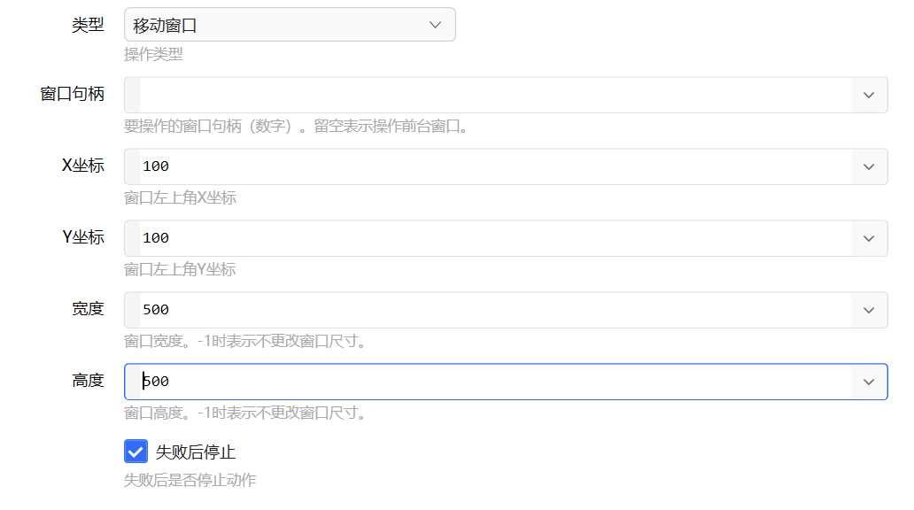
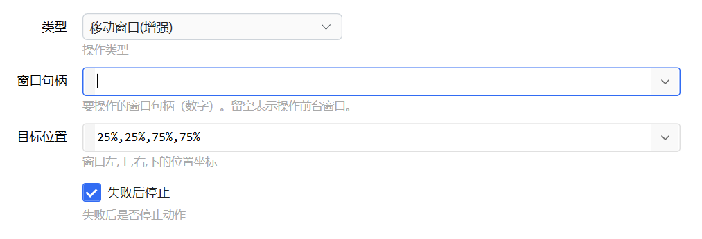
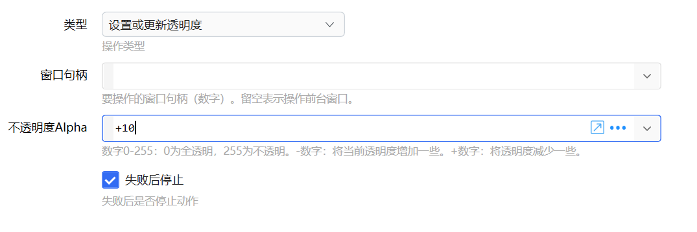

# 窗口操作

Window窗口相关操作

## 当前模块定义

<XActionModuleMeta moduleKey="sys:windowOperations" />

操作指定的Windows窗口对象。

<ModuleParamPreview moduleKey="sys:windowOperations" />

## 参数

【窗口句柄】

要操作的窗口句柄数字。**留空表示操作前台窗口。**

根据操作类型不同，会显示与操作类型相关的其它参数。

## 支持的操作类型

### 移动窗口

【X坐标】窗口左边框X值。通常屏幕的左上角为X=0, Y=0，向右X增加，向下X增加。

【Y坐标】窗口顶边框Y值。

【宽度】窗口的宽度像素数。-1或小于0的数表示不更改窗口尺寸。

【高度】窗口的高度像素数。-1或小于0的数表示不更改窗口尺寸。

### 移动窗口（增强）

可以按百分比或像素指定窗口的**左、上、右、下**位置。例如：

-   50%,0,100%,100%：将窗口移动到右侧半屏。
-   25%,25%,75%,75%：将窗口移动到屏幕的中心，大小为屏幕的1/4。
-   100,100,500,500：将窗口移动到指定的坐标。
-   100,100,50%,50%：结合使用像素和百分比。

### 置顶窗口、切换置顶状态、取消置顶窗口

更改窗口的置顶状态。

### 置底窗口

将窗口移动到其它窗口的后面。

### 设置显示状态

更改窗口的状态，如最大化、最小化、隐藏、显示、恢复等。

<ModuleParamPreview
  moduleKey="sys:windowOperations"
  focusKeys={['type', 'hWnd', 'showCmd', 'isSuccess']}
  values={{type: 'show', hWnd: '', showCmd: '3'}}
/>

### 设置为前台窗口

将窗口显示在前台并使其得到焦点。

### 关闭

向窗口发送关闭消息，效果类似于点右上角的X按钮。此时窗口可能会询问是否保存。

### 强制关闭

强制关闭窗口。可能会造成数据丢失。

### 设置或更新透明度

【**不透明**度Alpha】表示窗口不透明程度。可以通过两种方式指定：

-   指定具体的值。范围0-255之间的整数。0表示彻底透明，255表示彻底不透明。如：

-   128：表示窗口有50%的透明度。

-   指定不透明度的变化。此时：

-   +数字：表示增加**不透明**度。如“+20”，表示将窗口的当前不透明度增加20。加号不可省略。
-   \-数字：表示减少不透明度，即增加透明度。如“-20”，表示窗口的Alpha值减少20，窗口变得更透明。

## 输出

【是否成功】操作是否成功。

## 更新历史

-   1.24.28 支持更多功能
-   20240815 补充文档。
