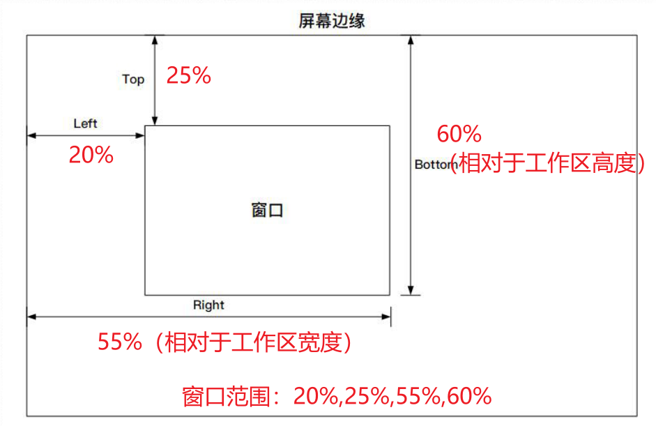

# 窗口操作

移动、置顶、显示或关闭指定的 Windows 窗口。要先按标题或进程找到窗口，用 [获取窗口信息/查找窗口](/v2/xaction/modules/getwindowtitle)。

## 当前模块定义

<XActionModuleMeta moduleKey="sys:windowOperations" />

## 概述

**窗口句柄** 留空或 `0` 表示操作前台窗口。换 **类型** 后会显示对应参数。

<ModuleParamPreview moduleKey="sys:windowOperations" />

## 参数说明

**类型**：移动窗口、移动窗口(增强)、置顶窗口、切换置顶状态、取消置顶窗口、置底窗口、设置显示状态、设置为前台窗口、关闭、强制关闭、设置或更新透明度、设置边框颜色。

**窗口句柄**：要操作的窗口句柄。留空表示前台窗口。

**失败后停止**：失败是否中止动作。默认开启。

### 移动窗口

<ModuleParamPreview
  moduleKey="sys:windowOperations"
  focusKeys={['type', 'hWnd', 'x', 'y', 'width', 'height']}
  values={{type: 'move', hWnd: '', x: '100', y: '100', width: '500', height: '500'}}
/>

**X坐标** / **Y坐标**：窗口左上角。屏幕左上角为 `0,0`，向右 X 增加，向下 Y 增加。

**宽度** / **高度**：像素。`-1` 或小于 0 表示不改尺寸。

### 移动窗口(增强)

按百分比或像素指定左、上、右、下：

- `50%,0,100%,100%`：右侧半屏
- `25%,25%,75%,75%`：屏幕中央、约为屏幕 1/4
- `100,100,500,500`：绝对坐标
- `100,100,50%,50%`：像素和百分比混用

<ModuleParamPreview
  moduleKey="sys:windowOperations"
  focusKeys={['type', 'hWnd', 'area']}
  values={{type: 'move_ex', hWnd: '', area: '25%,25%,75%,75%'}}
/>

**目标位置**：`左,上,右,下`。

### 置顶 / 置底 / 前台 / 关闭

- **置顶窗口** / **切换置顶状态** / **取消置顶窗口**：改置顶。
- **置底窗口**：把窗口放到其它窗口后面。
- **设置为前台窗口**：显示并取得焦点。
- **关闭**：相当于点右上角 ×，窗口可能询问是否保存。
- **强制关闭**：可能造成数据丢失。

### 设置显示状态

<ModuleParamPreview
  moduleKey="sys:windowOperations"
  focusKeys={['type', 'hWnd', 'showCmd', 'isSuccess']}
  values={{type: 'show', hWnd: '', showCmd: '3'}}
/>

**显示状态**：最大化、最小化、显示并恢复大小、隐藏、显示、切换最大化/恢复。对应 Win32 `ShowWindow`。

### 设置或更新透明度

<ModuleParamPreview
  moduleKey="sys:windowOperations"
  focusKeys={['type', 'hWnd', 'alpha']}
  values={{type: 'set_trans', hWnd: '', alpha: '128'}}
/>

**不透明度Alpha**：

- `0`–`255` 的整数：`0` 全透明，`255` 不透明。
- `+数字`：减少透明度（更不透明），加号不能省。
- `-数字`：增加透明度（更透明）。

### 设置边框颜色

**窗口边框颜色**：`#RRGGBB`。留空表示去掉边框颜色。

## 输出

- **是否成功**
- **是否置顶**：仅 **切换置顶状态**。操作后窗口是否置顶。

## 限制与排障

部分全屏或受保护窗口无法移动或改透明度。强制关闭前确认没有未保存内容。1.24.28 起支持更多操作类型。

## 相关链接

<RelatedDocs
  items={[
    {
      href: '/v2/xaction/modules/getwindowtitle',
      label: '获取窗口信息/查找窗口',
      description: '先按标题或进程拿到句柄。',
    },
    {
      href: '/v2/xaction/modules/restoreactivewindow',
      label: '恢复活动窗口',
      description: '把焦点还给动作开始前的窗口。',
    },
  ]}
/>
