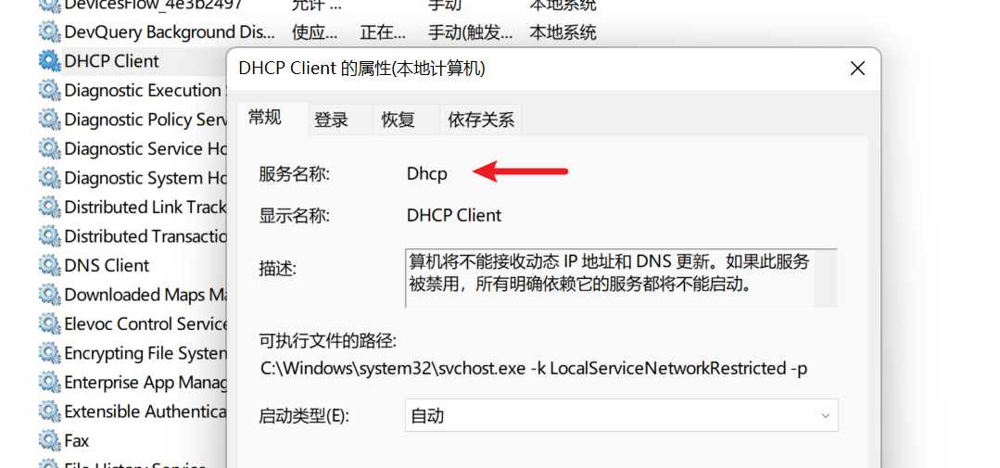
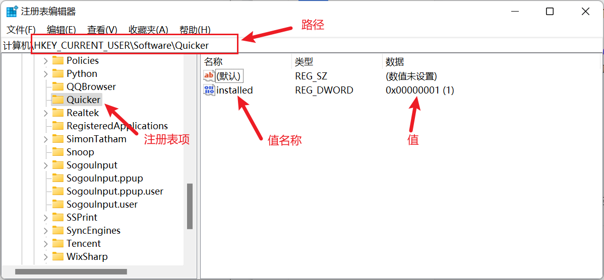

# Windows服务和注册表

获取Windows服务的状态、注册表项信息

## 当前模块定义

<XActionModuleMeta moduleKey="sys:winservice" />

用于获取特定Windows服务的运行状态或某注册表项的信息（用于判断特定的组件是否已安装等目的）。

## 获取某个服务的信息

输入：

【服务名】需要获取信息的Windows服务名称。

输出：

【服务是否存在】电脑上是否存在此服务。

【显示名】服务的显示名。

【服务状态】表示服务状态的数字。 `4`表示运行中，其它请参考下表。

| ContinuePending | 5 | 服务即将继续。 这对应于 Win32 SERVICE\_CONTINUE\_PENDING 常数，该常数定义为 0x00000005。 |
| --- | --- | --- |
| Paused | 7 | 服务已暂停。 这对应于 Win32 SERVICE\_PAUSED 常数，该常数定义为 0x00000007。 |
| PausePending | 6 | 服务即将暂停。 这对应于 Win32 SERVICE\_PAUSE\_PENDING 常数，该常数定义为 0x00000006。 |
| Running | 4 | 服务正在运行。 这对应于 Win32 SERVICE\_RUNNING 常数，该常数定义为 0x00000004。 |
| StartPending | 2 | 服务正在启动。 这对应于 Win32 SERVICE\_START\_PENDING 常数，该常数定义为 0x00000002。 |
| Stopped | 1 | 服务未运行。 这对应于 Win32 SERVICE\_STOPPED 常数，该常数定义为 0x00000001。 |
| StopPending | 3 | 服务正在停止。 这对应于 Win32 SERVICE\_STOP\_PENDING 常数，该常数定义为 0x00000003。 |

## 获取windows服务列表

获取当前电脑服务列表。

## 获取注册表项的值

可用于判断某个注册表项是否存在，以及获取其值。

模块设置：

输入：

【注册表项路径】设定要获取信息的注册表项的路径。在注册表编辑器，注册表项代表左侧上一个文件夹表示的目录节点。

【值名称】设定要获取信息的值的名称。 在注册表编辑器中，右侧的列表表示注册表项下的所有值。本参数留空时，对应于该列表中第一项 "(默认)" 。

输出：

【是否存在】指定的注册表项是否存在。（而不是右侧值列表中的值是否存在，如果值条目不存在，则“值”输出为空字符串。）

【值】指定“值名称”对应的实际值。如果值名称不存在，则返回空字符串。其它情况下返回转换为文本的实际值。
