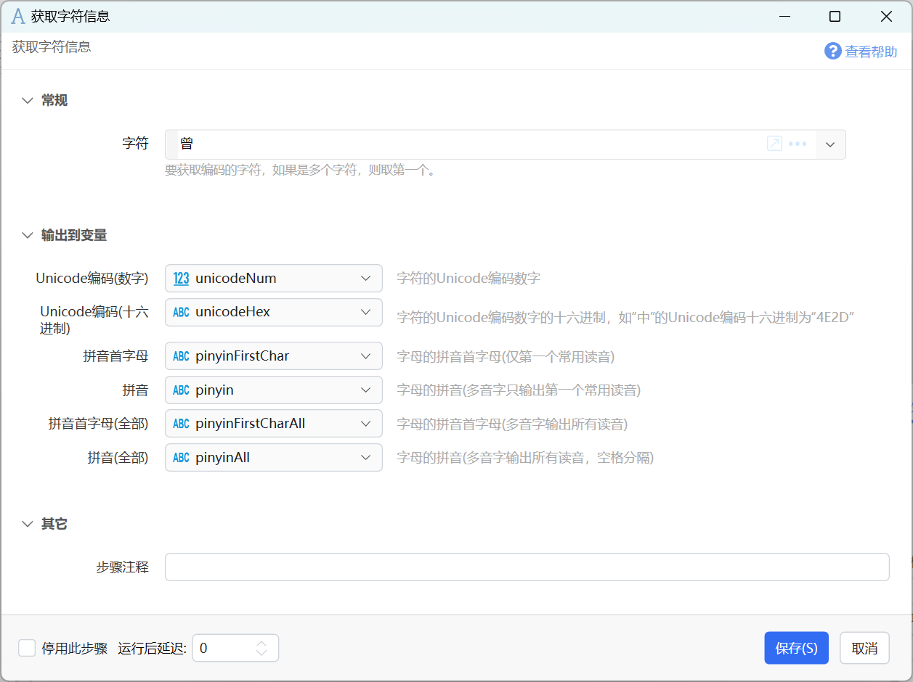
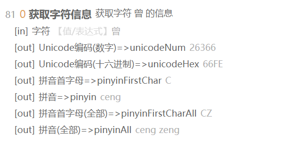

# 获取字符信息

获取字符信息

{/* xaction-metadata:start */}
## 当前模块定义

- 模块 Key：`sys:charInfo`
- 分类：文本处理（`Text`）
- 类型：`Action`
- 风险操作：否
- 专业版：否

## 输入参数

| Key | 名称 | 类型 | 默认值 | 必填 | 变量模式 | 条件 | 说明 |
| --- | --- | --- | --- | --- | --- | --- | --- |
| `char` | 字符 | `Text` | 中 | 是 | `UseVarOrInput` |  | 要获取编码的字符，如果是多个字符，则取第一个。 |

## 输出参数

| Key | 名称 | 类型 | 条件 | 说明 |
| --- | --- | --- | --- | --- |
| `unicodeNum` | Unicode编码(数字) | `Integer` |  | 字符的Unicode编码数字 |
| `unicodeHex` | Unicode编码(十六进制) | `Text` |  | 字符的Unicode编码数字的十六进制，如"中"的Unicode编码十六进制为"4E2D" |
| `pinyinFirstChar` | 拼音首字母 | `Text` |  | 字母的拼音首字母(仅第一个常用读音) |
| `pinyin` | 拼音 | `Text` |  | 字母的拼音(多音字只输出第一个常用读音) |
| `pinyinFirstCharAll` | 拼音首字母(全部) | `Text` |  | 字母的拼音首字母(多音字输出所有读音) |
| `pinyinAll` | 拼音(全部) | `Text` |  | 字母的拼音(多音字输出所有读音，空格分隔) |
{/* xaction-metadata:end */}

用于获取某个字符的Unicode编码信息/汉字的拼音信息。

## 参数

【字符】要获取信息的字符。如果输入的是多个字符，则自动获取第一个字符的信息。

### 输出

【Unicode编码（数字）】字符的Unicode编码的数值

【Unicode编码（数字）】字符的Unicode编码的十六进制字串。

【拼音首字母】汉字的拼音首字母（大写），多音字时只输出第一个。

【拼音】汉字的拼音，多音字时只输出第一个。

【拼音首字母（全部）】汉字的拼音首字母（大写），多音字时输出全部。注意：只能处理常用多音字。

【拼音（全部）】汉字的拼音，多音字时只输出全部拼音（空格分隔）。注意：只能处理常用多音字。

示例：“曾”字的信息输出：

## 更新历史

-   20230207 增加输出拼音参数（需版本1.36.28+）
