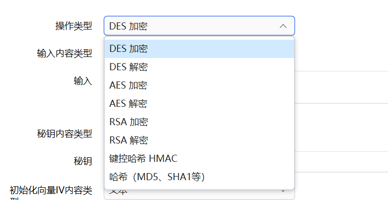
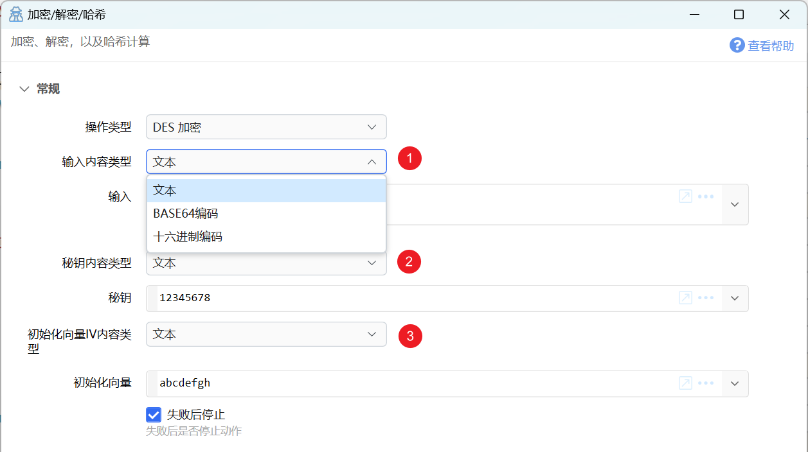
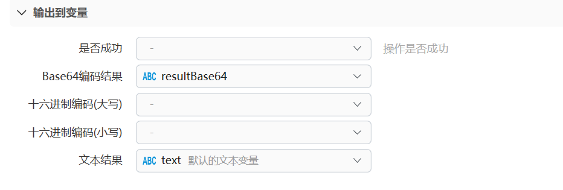
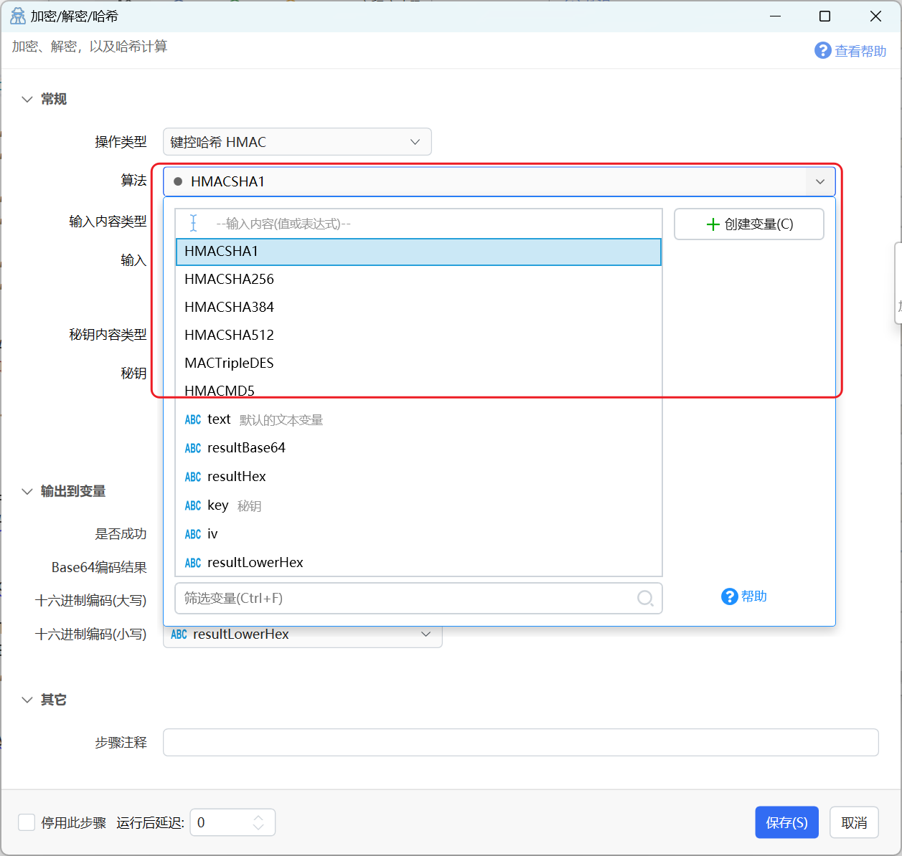
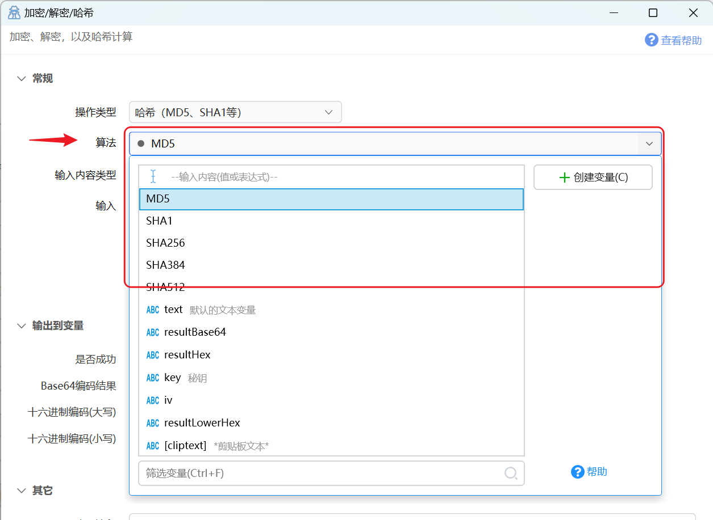

# 加密/解密/哈希

加密、解密，以及哈希计算

## 当前模块定义

<XActionModuleMeta moduleKey="sys:enc" />

封装常用的加密解密及哈希算法：

-   对称加密：DES、AES
-   非对称加密：RSA
-   哈希：MD5、SHA1、SHA256、SHA384、SHA512
-   键控哈希：HMACSHA1、HMACSHA256，HMACSHA384，HMACSHA512，MACTripleDES，HMACMD5
-   自用加密、自用解密。

注：

-   每种加密解密算法都有自己特定参数及参数长度要求，您需要对此有一定了解才能使用本模块。
-   文本内容涉及编码处理时，会全部使用UTF8编码。

## 常规参数说明

**输入参数**

【操作类型】选择要执行的操作。

【xx内容类型】用于指定特定参数值的格式。如“输入内容类型”，用于指定“输入”参数（待加密、解密或哈希的原始内容）的内容类型。

可能为：

-   `文本`：输入的内容为原始文本，如`Hello World!`
-   `Base64编码`：输入的内容为原始文本的Base64编码，如`SGVsbG8gV29ybGQh`(`Hello World!`的base64编码结果）。
-   `十六进制编码`（HEX编码）：输入的内容为原始文本对应的字节数组的十六进制编码（每个字节编码为两个十六进制字符），如`48656C6C6F20576F726C6421`(`Hello World!`的HEX编码结果)。

【输入】待加密、解密或计算哈希值的内容。

【秘钥】对称加密算法中的秘钥内容。不同加密算法所需要的秘钥长度可能不同。

【初始化向量】（IV）对称加密算法中所需要提供的参数。不同加密算法所需要的初始化向量长度可能不同。

**输出参数**

加解密或哈希运算后，会得到一个字节数组。由于字节数组本身不方便显示，通常需要将它们编码输出。

【Base64编码结果】对加解密或哈希运算的结果进行Base64编码后的值。

【十六进制编码】对运算结果进行十六进制编码后的值。可以根据需要选择大写或小写输出。

【文本结果】对于解密操作，输出对应的明文内容。

## 键控哈希 HMAC

常用于对HTTP请求参数进行签名。如[阿里云](https://help.aliyun.com/document_detail/30563.html)、[腾讯云](https://cloud.tencent.com/document/product/213/15693)、[百度云](https://cloud.baidu.com/doc/Reference/s/6k6yfh1he)等。

操作类型选择“键控哈希”后，可选择具体的算法。

## 哈希

操作类型选择“哈希”后，选择具体的哈希算法。

注：如果您需要对文件计算哈希，请使用“[检查路径/获取文件信息](/v2/xaction/modules/checkpathexists)”模块。它使用流式读取，可以避免将文件整个读入内存，具有更高的性能。

## 自用加密和自用解密

使用当前用户自己的用户标识信息作为秘钥对数据进行加密。 得到的数据只能在自己的Quicker账号上解密读取。

内部使用AES加密算法。

## 示例动作

-   [加密解密测试](https://getquicker.net/Sharedaction?code=b20f2a88-3bc4-4446-fe0c-08db67a6796c) ： 请调试运行动作以观察输入输出。

## 更新历史

-   20230609 1.38.17 版本增加模块。
