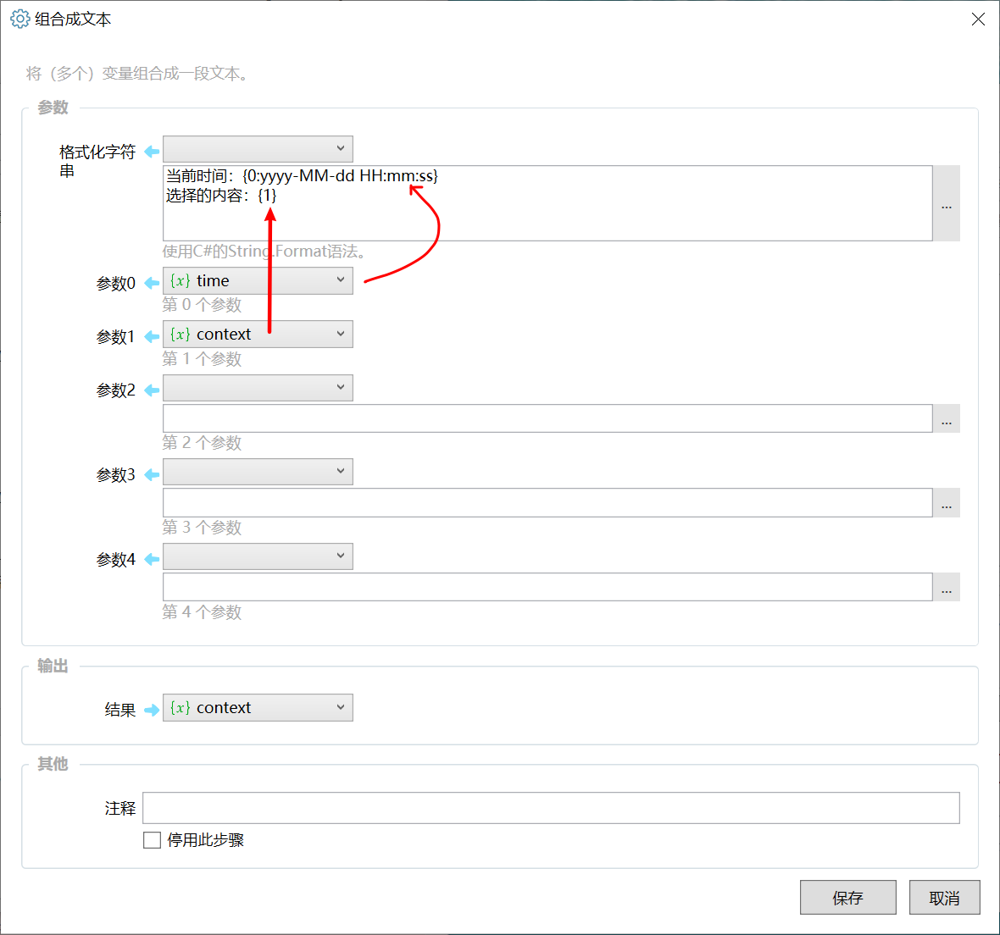
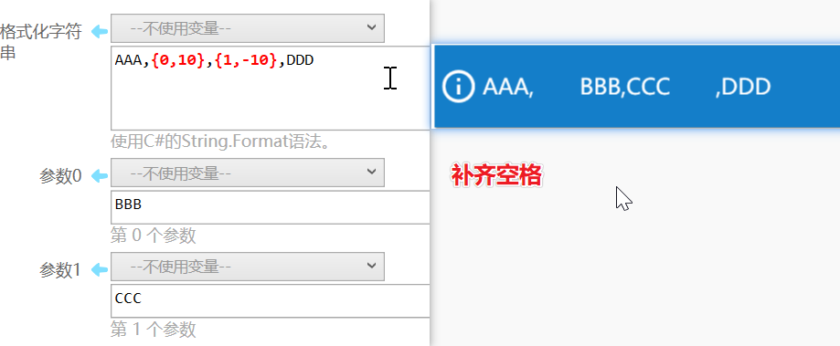

# 组合成文本

将（多个）变量组合成一段文本。

## 当前模块定义

<XActionModuleMeta moduleKey="sys:formatString" />

## 概述

组合成文本模块可以将5个指定的变量的值插入到文本中，并且可以支持指定数字、日期等类型的变量的转换格式。

此模块使用c#编程语言的 [String.Format()](https://docs.microsoft.com/en-us/dotnet/api/system.string.format?view=netframework-4.7.2) 函数，可以查看文档了解所支持的转换格式内容。也可以直接在表达式中使用String.Format函数来实现本模块的功能。

## 插入变量

在 “格式化字符串” 参数中，使用 **&#123;序号,对齐:格式&#125;** 的格式插入变量。其中**对齐**和**转换格式**的部分可以省略的，所以下面的写法都是合法的：

-   &#123;序号&#125; ，如：&#123;1&#125;
-   &#123;序号,对齐&#125;,  如：&#123;1,10&#125;，表示插入变量1的默认格式值，如果长度不够10个字符，则在左侧添加空格。
-   &#123;序号:格式&#125;，如：&#123;1:C3&#125;
-   &#123;序号,对齐:格式&#125;，如：&#123;1,-10:C3&#125;

例如：

-   格式化字符串：*你好，****&#123;0&#125;****!*
-   参数0的值：*Quicker*
-   得到的结果：*你好，Quicker!*

### 控制对齐

&#123;序号,**长度数字**&#125;

长度数字表示在内容长度不足时，通过添加空格将内容补足到多少个字符。

**正值**长度，在**左侧**补齐空格（用于实现右对齐），**负值**长度在**右侧**补齐空格（用于实现左对齐）。

如下面的示例，&#123;0,10&#125;和&#123;1,-10&#125;分别将BBB和CCC插入到了文本中，得到结果如下图所示。可以看到BBB左侧插入了空格，CCC右侧插入了空格。

## 控制格式

&#123;变量序号**:****格式字串**&#125;

&#123;变量,对齐**:****格式****字串**&#125;

格式字串用于控制将变量的内容转换为文本时的输出格式。不同类型的变量支持的格式化字串。

### 数字的格式化

| C 或 c | 货币值 | &#123;0:c&#125;: 123.456 -&gt; ￥123.46 |
| --- | --- | --- |
| D 或 d | 十进制数 | &#123;0:D&#125;: 1234  -&gt; 1234 &#123;0:D6&#125;: -1234 -&gt; -001234 |
|  |  |  |

【待续...】

标准数字格式字符串：[https://docs.microsoft.com/zh-cn/dotnet/standard/base-types/standard-numeric-format-strings](https://docs.microsoft.com/zh-cn/dotnet/standard/base-types/standard-numeric-format-strings)

自定义数字格式字符串：[https://docs.microsoft.com/zh-cn/dotnet/standard/base-types/custom-numeric-format-strings](https://docs.microsoft.com/zh-cn/dotnet/standard/base-types/custom-numeric-format-strings)

### 时间的格式化

标准日期和时间格式字符串：[https://docs.microsoft.com/zh-cn/dotnet/standard/base-types/standard-date-and-time-format-strings](https://docs.microsoft.com/zh-cn/dotnet/standard/base-types/standard-date-and-time-format-strings)

自定义的日期和时间格式字符串：[https://docs.microsoft.com/zh-cn/dotnet/standard/base-types/custom-date-and-time-format-strings](https://docs.microsoft.com/zh-cn/dotnet/standard/base-types/custom-date-and-time-format-strings)

## 示例动作

-   示例：格式化字符串（演示了数字格式化指令字符的使用）[https://getquicker.net/Sharedaction?code=345b395f-8f0a-4f35-a01f-08d7636fd69a](https://getquicker.net/Sharedaction?code=345b395f-8f0a-4f35-a01f-08d7636fd69a)
-   格式化选择的数字：[https://getquicker.net/sharedaction?code=f6fc9c05-7b95-40f7-b326-08d6756598a8](https://getquicker.net/sharedaction?code=f6fc9c05-7b95-40f7-b326-08d6756598a8)
