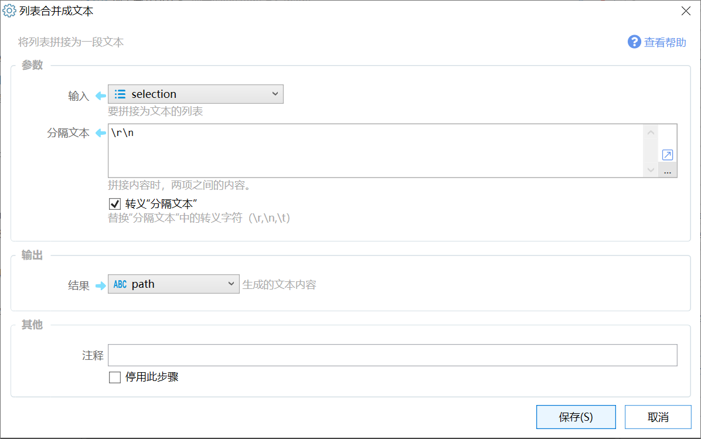

# 列表合并成文本

将列表拼接为一段文本

{/* xaction-metadata:start */}
## 当前模块定义

- 模块 Key：`sys:joinList`
- 分类：文本处理（`Text`）
- 类型：`Action`
- 风险操作：否
- 专业版：否

## 输入参数

| Key | 名称 | 类型 | 默认值 | 必填 | 变量模式 | 条件 | 说明 |
| --- | --- | --- | --- | --- | --- | --- | --- |
| `list` | 输入 | `List` |  | 是 | `UseVarOrInput` |  | 要拼接为文本的列表 |
| `separator` | 分隔文本 | `Text` | , | 是 | `Input` |  | 拼接内容时，两项之间的内容。 |
| `escapeSeparator` | 转义“分隔文本” | `Boolean` | false | 否 | `Input` |  | 替换"分隔文本"中的转义字符（\r,\n,\t） |

## 输出参数

| Key | 名称 | 类型 | 条件 | 说明 |
| --- | --- | --- | --- | --- |
| `output` | 结果 | `Text` |  | 生成的文本内容 |
{/* xaction-metadata:end */}

使用列表里的各项拼接成一段文本。

此操作的相反操作是“[文本拆分成列表](/v2/xaction/modules/splitstring)”。

## 参数

【输入】要合并成文本的列表变量；

【分隔文本】拼接时两项中间插入的字符；如果要合并成多行文本每个一行，分隔文本可以直接输入一个回车换行。

【转义“分隔文本”】将“分隔文本”参数中的\\r、\\n、\\t转义处理成换行和tab字符。

### 输出

【结果】拼接成的文本。

## 示例

假设列表中各项为“AAA”“BBB”“CCC”，分隔符为“，”，则拼接的结果为：“AAA，BBB，CCC”。

## 更新历史

-   1.5.7 增加 转义“分隔文本” 参数。
