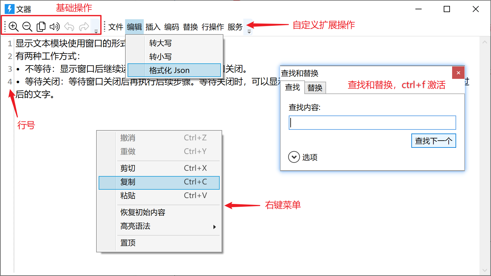
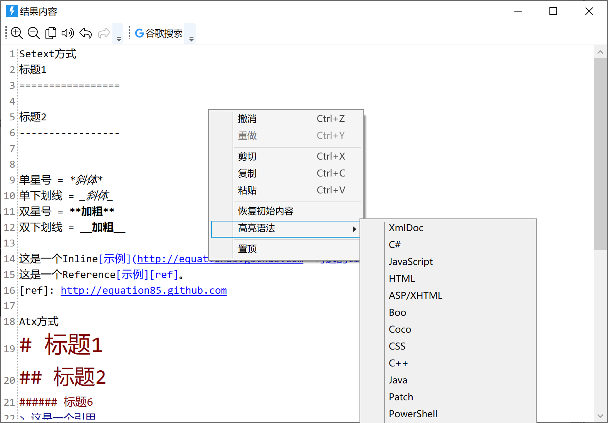
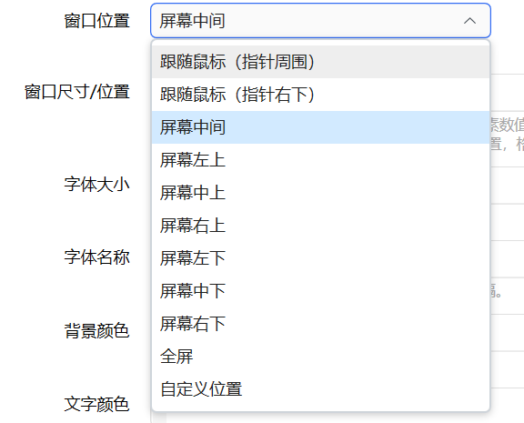
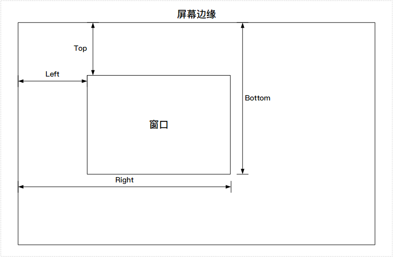
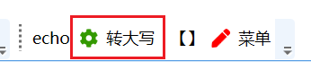
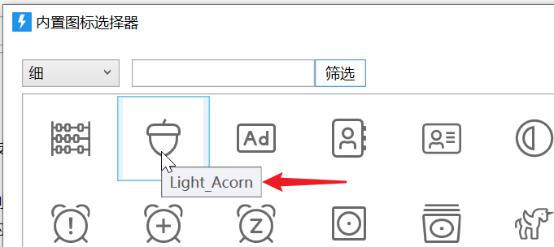
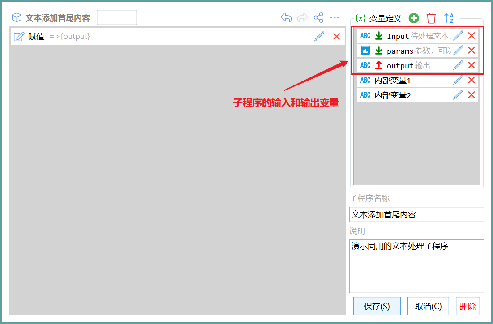

# 文本窗口

在独立的窗口中显示文本。

## 当前模块定义

<XActionModuleMeta moduleKey="sys:showText" />

## 概述

用于显示或编辑较长的文本内容。

有两种工作方式：

-   不等待：显示窗口后继续运行后续步骤，不等待窗口关闭。
-   等待关闭：等待窗口关闭后再执行后续步骤。等待关闭时，可以显示附加的操作按钮并返回用户选择的按钮以及修过后的文字。



### 窗口使用

#### 右键菜单



-   基础功能：撤销、重做、剪切、复制、粘贴
-   恢复初始内容：恢复显示文本开始设置的内容；
-   高亮语法：选择使用高亮类型；
-   置顶：置顶或取消置顶窗口。

#### 快捷键

-   Ctrl+Z 撤销编辑步骤
-   Ctrl+Y 重做最后撤销的编辑步骤
-   Ctrl+C、Ctrl+X、Ctrl+V 常规复制粘贴操作
-   Ctrl+F 查找
-   Ctrl+H 替换
-   Alt+↑ 将当前行向上移动一行 （v1.40.11+)
-   Alt+↓ 将当前行向下移动一行
-   Ctrl+D 重复当前选中内容，未选择时重复当前行 (v1.40.12+)
-   Ctrl+Shift+D 删除当前行

## 操作类型

<ModuleParamPreview
  moduleKey="sys:showText"
  focusKeys={['type']}
  values={{type: 'NO_WAIT'}}
/>

-   **显示窗口，不等待关闭**：显示窗口后继续运行后面的步骤。
-   **显示窗口，等待关闭**：显示窗口后，等待用户关闭窗口再继续运行后面的步骤。
-   **关闭窗口**：关闭前面通过“不等待关闭”方式显示的文本窗口。
-   **获取窗口信息**：获取指定文本窗口的信息。如是否存在、窗口文本内容等。
-   **追加内容**：向已打开的文本窗口中追加内容。
-   **显示和激活窗口**：将指定的已被最小化或在其它窗口后面的文本窗口显示在前台。
-   **等待窗口关闭**：等待指定的文本窗口关闭后再执行后续的步骤。(1.39.33)

在通过不同步骤控制相同窗口时，需要使用“**文本窗口标识**”参数指定要操作的窗口。 将此值设置为“=”，表示使用当前动作ID作为窗口标识，可避免和其它动作冲突。

## 参数

<ModuleParamPreview
  moduleKey="sys:showText"
  values={{
    type: 'WAIT',
    text: '',
    title: '结果内容',
    topMost: 'false',
    autoCloseKey: '',
    winLocation: 'CenterScreen',
    winSize: '',
    fontsize: '14',
    fontfamily: '',
    bgColor: '',
    textColor: '',
    highlight: '',
    autoSaveToState: '',
    closeWhenLostFocus: 'false',
    stopIfFail: 'true',
  }}
/>

### 输入

**常规参数**

【操作类型（等待方式）】是否等待窗口关闭再执行后续步骤。

-   不等待：显示窗口后继续运行后面的步骤。
-   等待关闭：显示窗口后，等待用户关闭窗口再继续运行后面的步骤。
-   关闭窗口：关闭前面通过“不等待”方式显示的文本窗口。

【文本内容】要显示的文字内容。

【窗口标题】窗口标题文字，可用于提示用户显示的什么内容，或提示用户选择下一步的操作。

【置顶显示】窗口显示保持在顶层。

**高级参数**

【工具栏操作】在工具栏显示附加的操作按钮。每行一个，详细说明请参见下面章节。

【文本窗口标识】如果设置了此值，则在显示窗口前先关闭之前弹出的使用此标使的窗口。用于多次使用某个动作（如OCR或翻译动作）时自动关闭前一次动作的结果窗口。此标识应为全局唯一以避免关闭其他动作的窗口。

【窗口位置】窗口的显示位置类型。



【窗口尺寸/位置】

-   在窗口位置类型为“自定义位置”时，设定窗口的具体位置坐标。格式为“left,top,right,bottom”，即“左边,顶边,右边,底边”。每个位置可以填写数字值或百分比。

-   数字值表示物理像素（相对于屏幕左侧边或顶边的距离）。如`100,100,500,500`表示一个400\*400像素的矩形窗口。
-   百分比表示该位置到屏幕左侧边或顶边的距离占屏幕宽度或高度的百分比。如`0%,0%,50%,100%`表示占屏幕工作区左半边。
-   可以结合使用数字和百分比。如`100,100,50%,50%`表示窗口左上角在 100,100 右下角在屏幕工作区中心位置。



-   窗口位置类型为其它类型时，指定窗口的大小，格式为`width,height`即“宽,高”。可以指定数字或百分比。

-   指定数字时，表示**逻辑像素**尺寸，即考虑了Windows中屏幕缩放比例后的大小。如指定窗口大小为`500,400`时，如果Windows屏幕缩放比例为150%，则窗口的实际大小为750\*600物理像素大小。
-   指定百分比时，表示相对于桌面工作区的大小。如`50%,50%`表示占屏幕工作区1/4大小。
-   宽和高可以分别使用数字和百分比，如`300,90%`表示窗口宽为300逻辑像素，高为工作区90%高度。

【字体大小】初始的文字大小。默认为14。

【字体名称】仅在需要时设置。多个字体时，使用英文逗号分隔字体名。

【背景颜色】可选。自定义窗口背景色，格式为#RRGGBB。

【文字颜色】可选。自定义文字颜色，格式为#RRGGBB。

【语法高亮】设置使用的语法高亮类型。(v1.39.11)除了选择已有的高亮语法规则，也可以指定自定义高亮规则：1）提供语法高亮规则文件的路径 或 2）提供规则内容。 规则内容可参考 [官方代码仓库中的各语言规则文件](https://github.com/icsharpcode/AvalonEdit/tree/master/ICSharpCode.AvalonEdit/Highlighting/Resources) 。

-   示例动作：[自定义高亮语法](https://getquicker.net/Sharedaction?code=92b7ac12-3349-4d2d-a4a6-08dbb4bd66e6) by @level1

【自动保存到状态】当文本框内容修改时，自动将内部保存到动作状态中，避免意外关闭造成内容丢失。这里应制定状态的key字符串，如`暂存文本`（不应该使用变量）。可在必要时通过“[状态存取](/v2/xaction/modules/statestorage)”模块通过相同的状态Key（如前面的`暂存文本`）读取该内容。

【Esc键关闭窗口】在文本窗口中按下Esc的时候，是否自动关闭窗口。

【失去焦点自动关闭】失去焦点后自动关闭窗口，适合用于仅显示内容不需要编辑的情况。 (1.26.5版本) 如果手动置顶了窗口，则暂时取消失去焦点自动关闭。

【显示行号】是否在窗口左侧显示行号数字。

【自动换行】单行内容太长时是否折行显示（不折行时将显示水平滚动条）。(v1.10.1)

【显示内置工具栏】是否显示预置的工具栏。

【未选择内容时，复制或剪切整行】启用时，如果未选择内容，则Ctrl+C/Ctrl+X复制光标所在行的整行内容。(v1.10.1)

【光标位置】设定打开文本窗口后，输入光标（插入符号）所在的位置。0 表示最前面，-1表示末尾，其它数字表示特定字符的后面。（v1.36.23）

【高级设置】仅特殊需求时使用。用于在窗口加载后或关闭前执行指定的子程序，或设置一些额外的功能选项，每行一个。

支持的指令有：

-   `loaded_sp:窗口加载后执行的子程序`；
-   `closing_sp:窗口关闭时执行的子程序`；

调用子程序时，会传入如下参数：

-   `_windowId`窗口标识、
-   `_handle`窗口句柄、
-   `_window`窗口对象、
-   `_windowLocation`最后的窗口位置。

您需要非常了解相关编程技术，避免卡死UI线程。（v1.39.34，1.42.35增加输出\_windowLocation)

### 输出

【选择的项】用户选择的附加操作按钮。如果直接点击X关闭窗口，则返回空值。

【结果文本】返回显示框内的最终结果文本。

## 工具栏操作按钮的定义

基本说明：

-   每行定义一个操作按钮；
-   使用"**显示内容|值或处理方式**"的格式定义。
-   **显示内容**部分，使用 **\[图标\]标题文字(ToolTip文字)** 的格式定义外观。

-   示例： **\[fa:Solid\_Cog:#339900\]转大写(将选中的文字转换为大写)** 
-   图标部分和Tooltip文字部分可选。
-   图标定义：

-   **fa:**为开始标记；
-   第二部分为图标。图标名称可以在图标选择窗口中查看（为动作设置图标的窗口）
    
-   第三部分为图标颜色，使用 **#RRGGBB** 格式。
-   如果需要使用网络图片，可以使用这样的格式定义图标(1.22.27+版本)：\[url:[https://files.getquicker.net/\_icons/0C8F7C4E850B0BF5A9915603076B6D3577F0C3F6.svg](https://files.getquicker.net/_icons/0C8F7C4E850B0BF5A9915603076B6D3577F0C3F6.svg)\]

-   标题文字内容中，可以通过“\_字母”的方式给按钮设置快捷访问按键。如标题文字设置为“保存(\_S)”后，可以通过alt+s触发此按钮。
-   Tooltip提示文字：长度应该多于2个字符。应尽量避免出现括号影响匹配判断。

-   支持创建菜单。

-   一个主菜单按钮下可以跟随多个子菜单项。
-   主菜单按钮按钮文字定义：**\[+\]***\[fa:Solid\_Pen:#FF0000\]标题文字(提示文字)* 显示内容的图标和提示文字是可选的。
-   子菜单文字：**\[-\]***\[fa:Solid\_Pen:#FF0000\]菜单标题文字(菜单提示文字)*

-   使用////开始将改行作为注释使用或用于使其不生效。

默认使用竖线“|”作为显示内容和值内容的分隔符。如果需要更改分隔符，可以在第一行使用“ |=新分隔符 ”的方法进行修改。

### 按钮的行为定义

扩展按钮定义的第二部分定义按钮的行为。

按钮行为分为两个方式：

-   关闭窗口并从“选择的项”输出参数中返回一个值。仅在“等待方式”参数为“等待关闭”时可用。定义方法：直接写要返回的值即可。

-   例如：按钮定义“使用百度翻译|**baidu**”，点击此按钮将关闭窗口并在“选择的项”中输出“baidu”。

-   执行某个文本处理操作。定义方法：call:*执行功能定义*  

### 定义文本处理功能

基本格式位call:后面加由$符号分隔的4个部分：

**call:****第1部分****$****第2部分****$****第3部分****$****第4部分**

#### 第1部分

定义要处理全部文本还是选中部分的文本。可选值：

-   **a** 或 **all** ：文本框的全部内容
-   **s** 或 **selection** : 文本框选中部分的内容
-   **n** 或 **none**: 不需要输入文本
-   **auto**: 如果选中了内容，则使用选中部分，否则使用全部文本内容。（1.5.20版本支持）
-   **l** 或 **line**：选中内容/光标所在位置的整行。（1.10.1版本支持)

#### 第2部分

文本处理后的结果的操作方式。可选值：

-   **ra** 或 **replaceall** : 替换文本框的全部内容；
-   **rs** 或 **replaceselection**: 替换文本框选中部分的内容；
-   **c** 或 **copy**: 复制到剪贴板；
-   **n** 或 **none**: 不处理返回内容；
-   **rauto**: 根据来源文本是选中部分还是全部内容自动替换选中部分或替换全部内容；(1.5.20版本支持)
-   **insertafter** 或 **ia**：在选中内容的后面插入结果。(1.6.2版本支持)
-   **append**：在文本内容结尾添加内容。(1.37.35+)
-   **caret**：更新光标（插入符）位置，用于从子程序返回`caretOffset`输出变量控制光标位置。此时，`caretOffset`输出变量正数表示从头开始的字符位置，负数表示从末尾向前的字符位置。(1.39.22+)

在操作方式为“替换选中部分”（rs/replaceselection）或“在选中部分的后面插入”(ia/insertafter) 或 “替换文本框的全部内容”（ra/replaceall） 时，支持移动光标到插入内容的某个位置。使用格式为：**操作方式字符-从插入内容结尾开始向前移动的字符数** 或 **操作方式字符+从插入内容开始偏移的字符数。**如“rs-1”表示替换选中的内容后，光标位置设置为从替换内容的结尾向前移动一个字符。也可通过子程序`caretOffset`输出变量控制光标位置，详情请参考本文下面章节。

#### 第3部分

定义操作功能的类型。可选值：

-   **sp**: 子程序（SubProgram）。

-   **in** 或 **internal**: 内置的文本处理功能。
-   cloud: 在线文本处理服务。（后期支持）
-   url：提供通用接口的第三方文本处理服务网址。（后期支持）

#### 第4部分

操作功能的资源名称或网址以及参数。

格式为： **子程序名称**或**在线服务功能key**或**第三方服务网址****?****参数1=值1&参数2=值2...**

如果没有参数，则?和后面的部分可以省略。参数值需要经过URL编码处理。

示例动作：

-   [https://getquicker.net/sharedaction?code=d3dcdaf2-1544-43b8-17c3-08d7dec8856a](https://getquicker.net/sharedaction?code=d3dcdaf2-1544-43b8-17c3-08d7dec8856a)
-   [https://getquicker.net/sharedaction?code=1ec2aca5-554f-4abd-17c1-08d7dec8856a](https://getquicker.net/sharedaction?code=1ec2aca5-554f-4abd-17c1-08d7dec8856a)

#### 文本处理子程序

调用示例：

-   不带参数的调用：call:s$rs$sp$**子程序名**
-   带有参数的调用：call:s$rs$sp$**子程序名****?****head=head\_value&end=end\_value&param3=value3**

子程序需要符合如下的规范：

-   需要有2个输入参数变量和1个输出参数变量：

-   【Input】文本类型变量，用于接收待处理的文本。
-   【params】（可选）文本或词典类型变量，用于接收文本处理的附加参数。如果此变量为文本类型，参数内容将直接以原始格式传递到变量中（如：head=head\_value&end=end\_value&param3=value3）；如果此变量为词典类型，Quicker会把参数自动转换为词典（在表达式中可以使用 **$=&#123;params&#125;\["参数名"\]** 的方式取用参数）。
-   【output】文本类型的输出变量，用于将处理结果返回。当output内容为空时，不会替换编辑窗口中的选中内容（避免用户取消操作时内容被清空）。如果希望清空内容，请在output中返回\*NULL\*。
-   【caretOffset】（可选，1.39.20+版本支持）文本类型的输出变量，用于设定光标位置（与直接在上述第2部分中直接设定位置的格式相同。子程序输出的优先级高于指令第2部分指定的光标位置）：

-   +0、0、正数数字：从插入内容开始的字符数
-   \-0, 负数：从插入内如末尾**向前**的字符数。
-   空字符串：不处理。



参考子程序：[https://getquicker.net/SubProgram?id=58926ef7-0908-46d6-17c0-08d7dec8856a](https://getquicker.net/SubProgram?id=58926ef7-0908-46d6-17c0-08d7dec8856a)

#### 内置的文本处理功能

调用示例：

-   call:s$rs$**in**$**toUpper**
-   call:a$ra$**internal**$**toLower**

目前支持的内部处理功能：

-   **toUpper** 英文转换为大写
-   **toLower** 英文转换为小写
-   **reverse** 反顺文本
-   **trimStart** 去除前面的空白
-   **trimEnd** 去除后面的空白
-   **trim** 去除前后的空白
-   **urlEncode** URL编码（utf8）
-   **urlDecode** URL解码 (utf8)
-   **htmlEncode** Html编码
-   **htmlDecode** Html解码
-   **intercappedToSentence** 组合词拆分成句子(thisIsChina=&gt;this Is China)
-   **base64Encode** Base64编码
-   **base64Decode** Base64解码
-   **removeEmptyLine** 去除空行
-   **mergeEmptyLine** 合并多个空行
-   **sortLinesAsc** 排序多行A-Z
-   **sortLinesDesc** 排序多行Z-A（字母倒序）
-   **reverseLines** 翻转多行顺序
-   **toTitleCase** 首字母大写
-   **formatJson** 格式化JSON
-   **md5** 计算MD5哈希
-   **sha256Hash** 计算SHA256哈希
-   **sha1Hash** 计算SHA1哈希
-   **escapeJson** 转义文本为合法Json值
-   **DecodeUnicode** 解码Unicode字串(\\uXXXX转普通字符)
-   **toCnNum** 金额数字转换为大写
-   **cn2num** 中文数字转阿拉伯数字
-   **num2cn** 阿拉伯数字转中文数字
-   **ExpandEnvironmentVariables** 替换环境变量

#### 在线文本处理服务

本功能为以后扩展文本处理增加支持接口。

调用方式：call:a$ra$**cloud**$服务名?参数1=值1&参数2=值2

其中，?和后面的参数部分可选（依据具体的在线文本处理功能）。

示例：

-   Echo服务|call:all$rs$cloud$echo

目前可用的处理服务：

-   echo    直接返回原始输入文本。

#### 第三方文本处理服务

本功能为以后扩展文本处理增加支持接口。

调用方式：call:a$ra$**url**$**https://somesite.com/text/processor?参数1=值1&参数2=值2**

接口需要符合如下规范：

**请求：**

以POST方式发送待处理文本，请求体为json格式：

```json
{
  "content":"待处理文本的内容。"
}
```

**响应：**

```json
{
    "isSuccess": true,
    "message": "",
    "data": "文本处理结果"
}
```

-   isSuccess: 是否成功。
-   message: 失败时的错误消息内容。
-   data: 处理后的结果文本。

## 更新历史

-   1.1.12 增加字体大小参数。窗口位置增加“全屏”选项。支持Ctrl+滚轮缩放字体。
-   1.5.17 增加扩展按钮外观定义和功能增强。
-   1.5.27 增加置顶、失去焦点后关闭等选项。
-   1.6.2 增加支持光标移动功能。
-   1.36.23 增加设置光标位置。
-   1.37.35 增加append命令说明。
-   1.39.11 增加自定义语法高亮说明。
-   1.39.20 运行子程序支持设定光标位置。
-   1.39.22 工具栏按钮增加caret命令设置光标位置。
-   20230914 增加自定义高亮示例动作。
-   20231005 增加“高级参数”的说明。
-   20231110 增加alt+上下快捷键移动行。
-   20231118 增加Ctrl+D快捷键。
-   20240607 增加删除行快捷键说明。
-   20240623 高级参数增加disable\_esc\_close指令。
-   20240717 去除高级参数里的disable\_esc\_close指令说明，增加单独的参数【Esc关闭窗口】。
-   20250605 补充快速访问键的说明。
