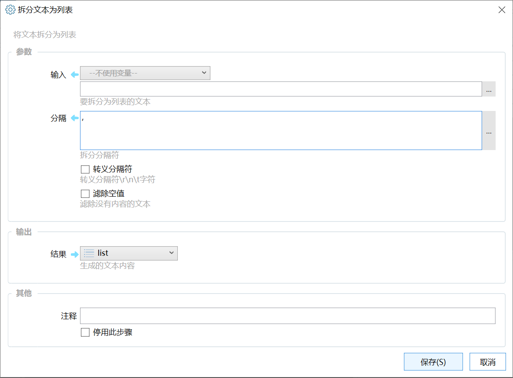

# 拆分文本为列表

将文本拆分为列表

{/* xaction-metadata:start */}
## 当前模块定义

- 模块 Key：`sys:splitString`
- 分类：文本处理（`Text`）
- 类型：`Action`
- 风险操作：否
- 专业版：否

## 输入参数

| Key | 名称 | 类型 | 默认值 | 必填 | 变量模式 | 条件 | 说明 |
| --- | --- | --- | --- | --- | --- | --- | --- |
| `data` | 输入 | `Text` |  | 是 | `UseVarOrInput` |  | 要拆分为列表的文本 |
| `separator` | 分隔 | `Text` | , | 是 | `Input` |  | 拆分分隔符 |
| `escapeSeparator` | 转义分隔符 | `Boolean` | false | 否 | `Input` |  | 转义分隔符\r\n\t字符 |
| `multiSeparator` | 使用多个分隔符拆分列表 | `Boolean` | false | 否 | `Input` |  | 每行指定一个。 |
| `removeEmpty` | 滤除空值 | `Boolean` | true | 是 | `Input` |  | 滤除没有内容的文本 |

## 输出参数

| Key | 名称 | 类型 | 条件 | 说明 |
| --- | --- | --- | --- | --- |
| `output` | 结果 | `List` |  | 生成的文本内容 |
{/* xaction-metadata:end */}

将文本变量拆分成列表变量。

例如：将一个包含多个文件路径的文本拆分成列表，列表的每一项是一个文件路径，然后就可以使用“每个”模块对列表中的每个文件路径进行处理了。

## 参数

【输入】要拆分的文本；

【分隔】根据什么内容拆分。比如“AAA;BBB;CCC;”，可以使用“;”作为分隔符拆分。

如果需要拆分多行文本，可以使用换行符作为分隔符。可以用两种方式输入换行符：

-   直接在“分隔”参数中按下回车输入一个换行；
-   使用“\\r\\n”并且选中【转意分隔符】参数。

注意：Windows和Linux的换行习惯不同，Windows通常使用"\\r\\n"，Linux等通常使用 "\\n\\r"。如果发现拆分不成功，可以尝试更改一下，或者直接使用"\\n"。

【转义分隔符】是否转换“分隔”参数中的\\r、\\n、\\t为对应的字符。

【滤除空值】如果拆分出来的某一项内容为空，是否丢弃。

## 示例动作

-   [排序多行](https://getquicker.net/sharedaction?code=d59d0507-ad21-4783-a83a-08d6d0f9e36e)
