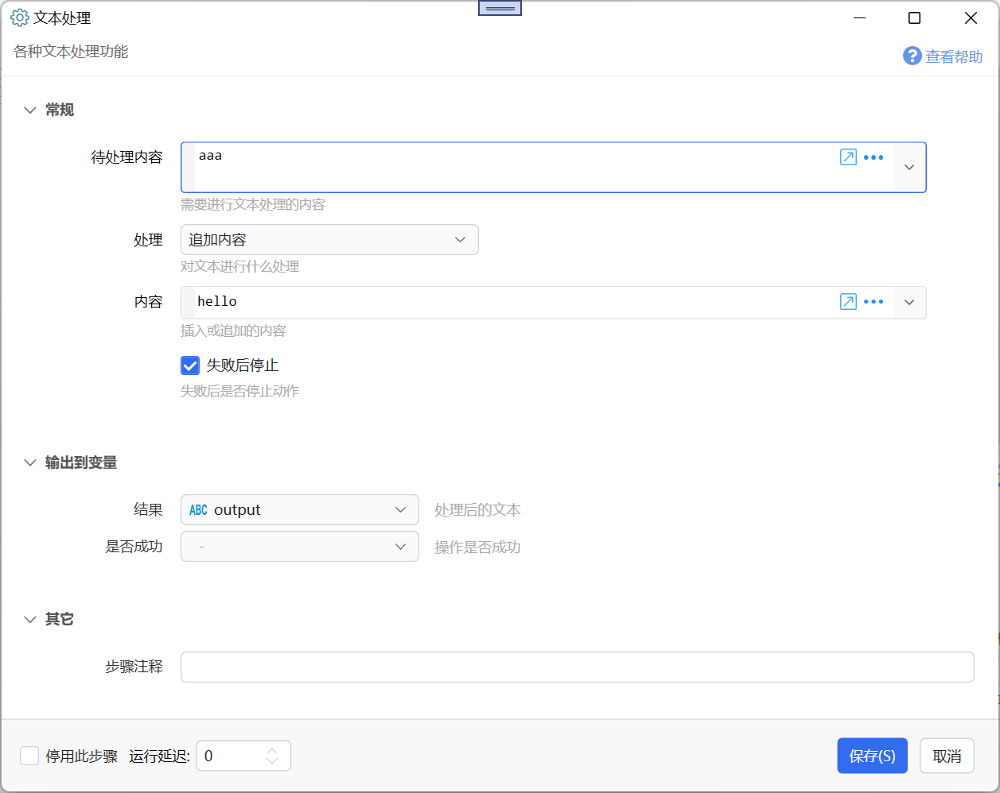
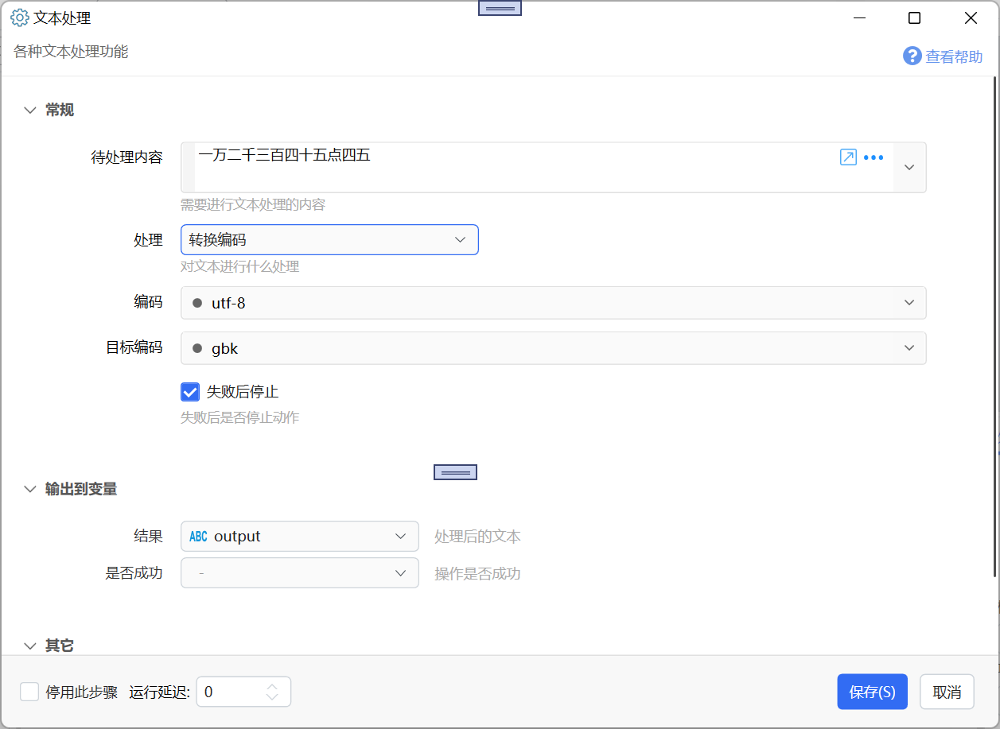
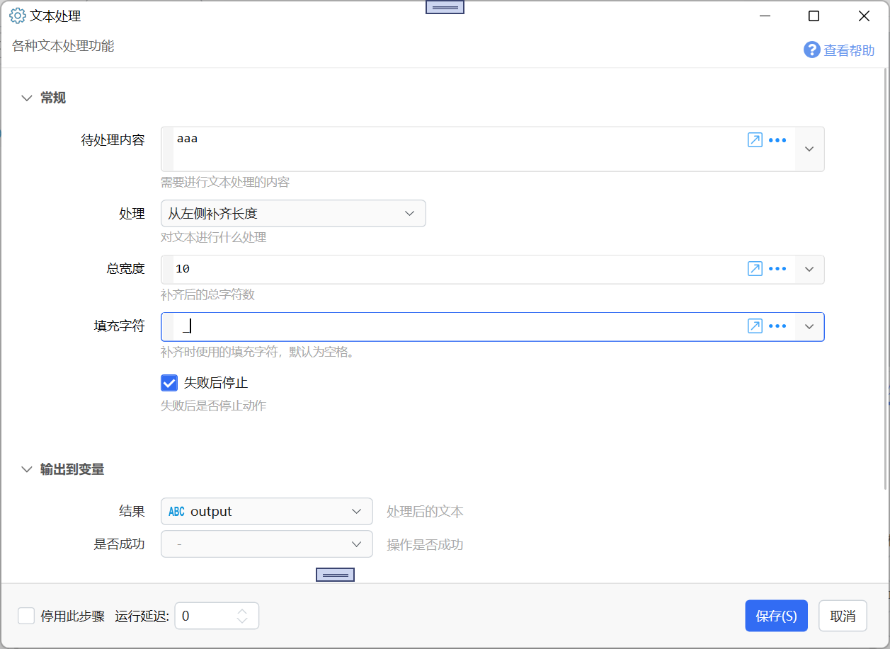
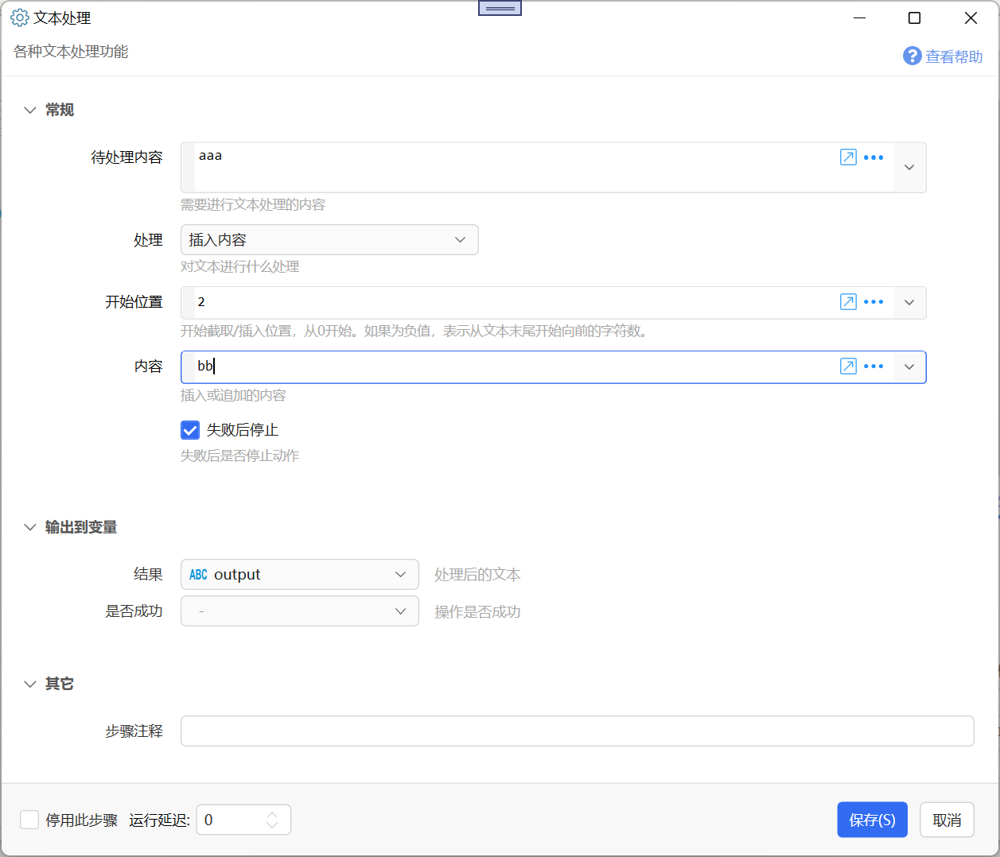
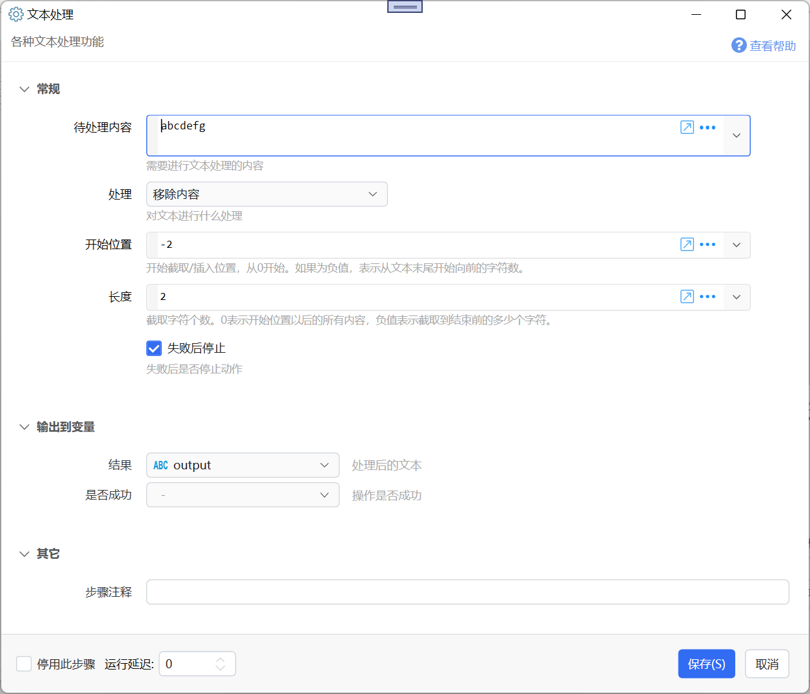

# 文本处理

各种文本处理功能

{/* xaction-metadata:start */}
## 当前模块定义

- 模块 Key：`sys:stringProcess`
- 分类：文本处理（`Text`）
- 类型：`Action`
- 风险操作：否
- 专业版：否

## 输入参数

| Key | 名称 | 类型 | 默认值 | 必填 | 变量模式 | 条件 | 说明 |
| --- | --- | --- | --- | --- | --- | --- | --- |
| `data` | 待处理内容 | `Text` |  | 否 | `UseVarOrInput` |  | 需要进行文本处理的内容 |
| `method` | 处理 | `Enum` |  | 是 | `Input` |  | 对文本进行什么处理 |
| `srcEncoding` | 编码 | `Text` | utf-8 | 否 | `UseVarOrInput` | 仅：convertEncoding, urlEncode, urlDecode |  |
| `dstEncoding` | 目标编码 | `Text` | gbk | 否 | `UseVarOrInput` | 仅：convertEncoding |  |
| `start` | 开始位置 | `Integer` | 0 | 否 | `UseVarOrInput` | 仅：substring, insert, remove | 开始截取/插入位置，从0开始。如果为负值，表示从文本末尾开始向前的字符数。 |
| `value` | 内容 | `Text` |  | 否 | `UseVarOrInput` | 仅：insert, append | 插入或追加的内容 |
| `length` | 长度 | `Integer` | 0 | 否 | `UseVarOrInput` | 仅：substring, remove | 截取或移除字符个数。截取时，0表示开始位置以后的所有内容，负值表示截取到结束前的多少个字符。 |
| `totalWidth` | 总宽度 | `Integer` | 10 | 否 | `UseVarOrInput` | 仅：padLeft, padRight | 补齐后的总字符数 |
| `paddingChar` | 填充字符 | `Text` |   | 否 | `UseVarOrInput` | 仅：padLeft, padRight | 补齐时使用的填充字符，默认为空格。 |
| `stopIfFail` | 失败后停止 | `Boolean` | true | 否 | `Input` |  | 失败后是否停止动作 |

## 输出参数

| Key | 名称 | 类型 | 条件 | 说明 |
| --- | --- | --- | --- | --- |
| `isSuccess` | 是否成功 | `Boolean` |  | 操作是否成功 |
| `output` | 结果 | `Text` |  | 处理后的文本 |

## 选项值

### `method` 处理

| Value | 名称 | 说明 |
| --- | --- | --- |
| `toUpper` | 英文转大写 |  |
| `toLower` | 英文转小写 |  |
| `reverse` | 前后反转 |  |
| `substring` | 截取 |  |
| `trimStart` | 去除前面空白字符 |  |
| `trimEnd` | 去除后面空白字符 |  |
| `trim` | 去除前后空白字符 |  |
| `urlEncode` | URL编码 |  |
| `urlDecode` | URL解码 (+解码为空格) |  |
| `urlDataDecode` | URL数据解码 (保留+号) |  |
| `htmlEncode` | Html编码 |  |
| `htmlDecode` | Html解码 |  |
| `intercappedToSentence` | 组合词拆分成句子(thisIsChina=&gt;this Is China) |  |
| `base64Encode` | Base64编码 |  |
| `base64Decode` | Base64解码 |  |
| `removeEmptyLine` | 去除空行 |  |
| `mergeEmptyLine` | 合并多个空行 |  |
| `sortLinesAsc` | 排序多行A-Z |  |
| `sortLinesDesc` | 排序多行Z-A |  |
| `reverseLines` | 翻转多行顺序 |  |
| `toTitleCase` | 首字母大写 |  |
| `formatJson` | 格式化JSON |  |
| `md5` | 计算MD5哈希 |  |
| `sha256Hash` | 计算SHA256哈希 |  |
| `sha1Hash` | 计算SHA1哈希 |  |
| `escapeJson` | 转义文本为合法Json值 |  |
| `DecodeUnicode` | 解码Unicode字串(\uXXXX转普通字符) |  |
| `convertEncoding` | 转换编码 |  |
| `toCnNum` | 金额数字转换为大写 |  |
| `cn2num` | 中文转数字 |  |
| `num2cn` | 数字转中文 |  |
| `ExpandEnvironmentVariables` | 替换环境变量 |  |
| `padLeft` | 从左侧补齐长度 |  |
| `padRight` | 从右侧补齐长度 |  |
| `insert` | 插入内容 |  |
| `append` | 追加内容 |  |
| `remove` | 移除内容 |  |
| `removeZeroWidthChars` | 移除零宽字符 |  |
| `html2text` | HTML转纯文本 |  |

### `srcEncoding` 编码

| Value | 名称 | 说明 |
| --- | --- | --- |
| `utf-8` | utf-8 |  |
| `gbk` | gbk |  |
| `gb2312` | gb2312 |  |
| `big5` | big5 |  |
| `utf-16` | utf-16 |  |
| `utf-32` | utf-32 |  |

### `dstEncoding` 目标编码

| Value | 名称 | 说明 |
| --- | --- | --- |
| `utf-8` | utf-8 |  |
| `gbk` | gbk |  |
| `gb2312` | gb2312 |  |
| `big5` | big5 |  |
| `utf-16` | utf-16 |  |
| `utf-32` | utf-32 |  |
{/* xaction-metadata:end */}

对文本内容实施某种处理，输出处理的结果。

## 参数

输入

【待处理内容】需要处理的文本内容。

【处理】进行哪种处理。支持的选项有：

**转大写**

将英文字母转换为大写，如：`abc`\=&gt;`ABC`

**转小写**

将英文字母转换为小写，如：`ABC`\=&gt; `abc`

**前后反转**

将文本串前后倒转，`ABC`\=&gt;`CBA`

**截取**

取文本串中的一部分。参数：

【开始位置】从哪个位置开始截取。如果是0或正数，表示从前往后数第几个字符（以0为开始序号）；如果为负数，则表示从后向前数第几个字符。

【长度】要截取内容的长度。如果为大于0，表示截取指定的长度；如果为0，则截取从开始位置到末尾的所有内容。

**去除前面空白字符**

去除文本串前端的不可见字符，如空格和tab。（不包括零宽字符）；

**去除后面空白字符**

去除文本串末尾的不可见字符，如空格和tab。（不包括零宽字符）；

**去除前后空白字符**

去除文本串两端的不可见字符，如空格和tab。（不包括零宽字符）；

**URL编码**

**URL解码**

**Html编码**

**Html解码**

**组合词拆分成句子(thisIsChina=&gt;this Is China)**

将驼峰格式的合成词拆分成句子，通常用于将程序代码中的变量名、函数名拆分后搜索或翻译。

**Base64编码**

**Base64解码**

**去除空行**

滤除多行文本中不包含可见字符的行；

**合并多个空行**

将多个空行合并为1个，用于整理程序代码；

**排序多行A-Z**

将多行文字按字母顺序排序；

**排序多行Z-A**

将多行文字按字母顺序倒序排序；

**翻转多行顺序**

将多行文字的各行顺序倒转；

**首字母大写**

将句子中的每个单词修改为首字母大写；

**格式化JSON**

将json数据格式化，请确保输入的内容为合法的json数据；

**计算MD5哈希**

**计算SHA256哈希**

**计算SHA1哈希**

计算文本内容的hash值。

**金额数字转换为大写**

将数字金额转换为大写格式；

如：`1234`处理后的结果为：`壹仟贰佰叁拾肆元`

**转义文本为合法Json值**

将一段文本转换为合法的json字段值（将里面的特殊字符进行转义，避免拼接的json内容出现格式混乱）；

**解码Unicode字串(\\uXXXX转普通字符)**

如`\u65b9\u6b63\u5c0f`得到的结果为`方正小`

**转换编码**

转换文本的编码，通常用于处理网络返回数据；

**中文转数字**

将中文（金额）数字转换为阿拉伯数字。

如：`一万二千三百四十五点四五`处理后的结果为：`12345.45`

**数字转中文**

将金额数字转换为中文。

如：`12345.45` 或 `12,345.45` 处理后的结果为：`一万二千三百四十五点四五`

**替换环境变量**

将文本内容（通常是路径）中的环境变量替换为对应的值。

如：`%USERPROFILE%\AppData`处理后的结果为：`C:\Users\用户名\AppData`

**从左侧补齐长度**

从文本内容的左侧添加指定的字符，从而让文本总长度不少于指定的数值。

如：将`abc`从左侧使用字符`*`补齐长度为5，则得到的结果为`**abc`

**从右侧补齐长度**

从文本内容的右侧添加指定的字符，从而让文本总长度不少于指定的数值。

**插入内容**

在文本的指定位置插入内容。

【开始位置】要插入内容的位置，从0开始。如果是负数，表示从结尾向前的字符序号。

【内容】要插入的文本。

如：对`aaa`，在开始位置 2 插入内容`bb`，得到的结果为`aabba`。

**追加内容**

在文本内容的结尾追加指定的内容。

也可以使用表达式实现：`$={文本1} + "追加内容"`或插值：`$${文本1}追加内容`

**移除内容**

从指定位置开始移除指定的字符个数。也可以在表达式中使用[String.Remove](https://docs.microsoft.com/en-us/dotnet/api/system.string.remove?view=netframework-4.7.2)方法实现`$={str}.Remove(0,2)`。

【开始位置】从0开始的字符序号。如果是负数，表示从结尾向前的字符序号。

【长度】移除的字符个数。

如：对`abcdefg`，从开始位置 -2 移除长度2，得到的结果为`abcde`。

### 输出

【结果】处理后的输出。
