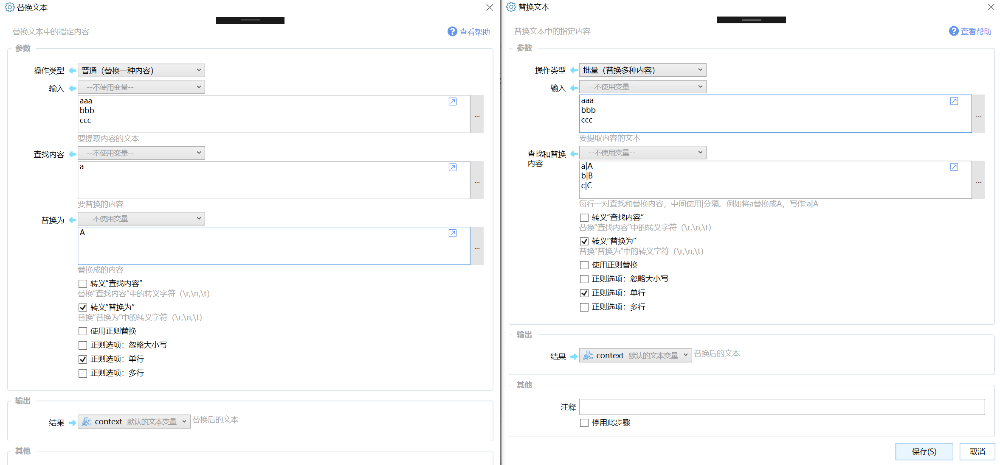

# 替换文本

替换文本中的指定内容

{/* xaction-metadata:start */}
## 当前模块定义

- 模块 Key：`sys:strReplace`
- 分类：文本处理（`Text`）
- 类型：`Action`
- 风险操作：否
- 专业版：否

## 输入参数

| Key | 名称 | 类型 | 默认值 | 必填 | 变量模式 | 条件 | 说明 |
| --- | --- | --- | --- | --- | --- | --- | --- |
| `type` | 操作类型 | `Enum` | single | 是 | `Input` |  |  |
| `input` | 输入 | `Text` |  | 是 | `UseVarOrInput` |  | 要提取内容的文本 |
| `old` | 查找内容 | `Text` |  | 是 | `UseVarOrInput` | 仅：single | 要替换的内容 |
| `new` | 替换为 | `Text` |  | 是 | `UseVarOrInput` | 仅：single | 替换成的内容 |
| `batchReplaceData` | 查找和替换内容 | `Text` |  | 是 | `UseVarOrInput` | 仅：batch | 每行一对查找和替换内容，中间使用\|\|\|或\|分隔。例如将a替换成A，写作:a\|A 或 a\|\|\|A |
| `escapeOld` | 转义“查找内容” | `Boolean` | false | 否 | `UseVarOrInput` |  | 替换"查找内容"中的转义字符（\r,\n,\t） |
| `replaceEscapes` | 转义“替换为” | `Boolean` | true | 否 | `UseVarOrInput` |  | 替换"替换为"中的转义字符（\r,\n,\t） |
| `useRegex` | 使用正则替换 | `Boolean` | false | 否 | `UseVarOrInput` |  |  |
| `ignoreCase` | 忽略大小写 | `Boolean` | false | 否 | `UseVarOrInput` |  |  |
| `singleLine` | 正则：单行 | `Boolean` | true | 否 | `UseVarOrInput` |  | 此模式下"."能匹配任意字符，包括换行符。(否则匹配除了\n外的任意字符) |
| `multiLine` | 正则：多行 | `Boolean` | false | 否 | `UseVarOrInput` |  | 此模式下^和$可以分别匹配行首和行尾。(否则匹配输入内容的开始和结束) |

## 输出参数

| Key | 名称 | 类型 | 条件 | 说明 |
| --- | --- | --- | --- | --- |
| `output` | 结果 | `Text` |  | 替换后的文本 |

## 选项值

### `type` 操作类型

| Value | 名称 | 说明 |
| --- | --- | --- |
| `single` | 普通（替换一种内容） |  |
| `batch` | 批量（替换多种内容） |  |
{/* xaction-metadata:end */}

替换文本中的一部分内容。





## 参数

### 输入

【操作类型】替换一种内容或多种内容。

-   普通：查找一种内容并进行替换。
-   批量：查找多种内容并进行替换。


【输入】要替换内容的原始文本。


【查找和替换内容】（批量模式下使用）每行指定一对要查找和替换的内容。如：

```
a|A
b|B
cc|||CC|CC
```

会分别将输入文本中的a替换为A，b替换为B，cc替换为CC|CC。

使用 |（一个竖线）或 |||（三个竖线）分隔要查找的内容和要替换成的内容。三个竖线用于在要查找的或要替换的内容中包含一个或两个竖线的情况。

也可以在首行使用“|=分隔符”的方式自定义分隔文本（自1.5.20版本支持，支持单个字符或多个字符）。


【查找内容】（普通模式下使用）需要替换掉的内容。

【替换为】（普通模式下使用）将“查找内容”替换成这里指定的文字。


选项：

【转义“查找内容”】将“查找内容”参数中的\\r\\n\\t识别为对应的ASCII字符。在开启“使用正则表达式”选项时，因为``字符在正则中会被自动当做转义字符，所以请勿选择本选项，以避免重复的转义处理。

【转义“替换为”】将“替换为”参数中的\\r\\n\\t识别为对应的ASCII字符。

【使用正则表达式】使用正则替换。这时候“查找内容”是一个正则表达式。

在使用正则替换时，下面的选项会生效：

【正则选项：忽略大小写】匹配要替换的内容时忽略大小写。

【正则选项：单行】启用单行模式。详细说明请参考正则相关资料。

【正则选项：多行】启用多行模式。详细说明请参考正则相关资料。


## 更新历史

-   1.1.33 增加支持批量替换功能。
-   增加开启正则时，避免开启“转义查找内容”的说明。


## 参考

-   正则表达式教程：[https://deerchao.net/tutorials/regex/regex.htm](https://deerchao.net/tutorials/regex/regex.htm)
-   [https://www.runoob.com/csharp/csharp-regular-expressions.html](https://www.runoob.com/csharp/csharp-regular-expressions.html)
