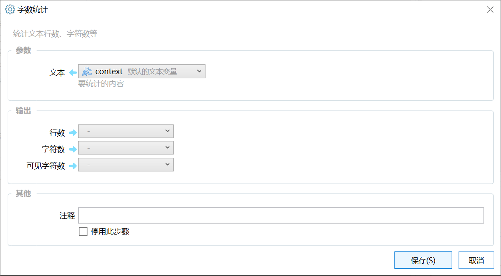

# 字数统计

统计文本行数、字符数等

{/* xaction-metadata:start */}
## 当前模块定义

- 模块 Key：`sys:textCounter`
- 分类：文本处理（`Text`）
- 类型：`Action`
- 风险操作：否
- 专业版：否

## 输入参数

| Key | 名称 | 类型 | 默认值 | 必填 | 变量模式 | 条件 | 说明 |
| --- | --- | --- | --- | --- | --- | --- | --- |
| `content` | 文本 | `Text` |  | 是 | `UseVar` |  | 要统计的内容 |

## 输出参数

| Key | 名称 | 类型 | 条件 | 说明 |
| --- | --- | --- | --- | --- |
| `line` | 行数 | `Integer` |  |  |
| `char` | 字符数 | `Integer` |  |  |
| `visableChar` | 可见字符数 | `Integer` |  |  |
| `cnChar` | 汉字数 | `Integer` |  |  |
{/* xaction-metadata:end */}

统计文本的字符数量、行数等信息。

## 参数

### 输入

【文本】要统计数据的原始文本内容。

### 输出

【行数】文本的行数。

【字符数】总字符数量，中文文字算作1个字符。

【可见字符数】去除空白字符之后的可见字符数量。
