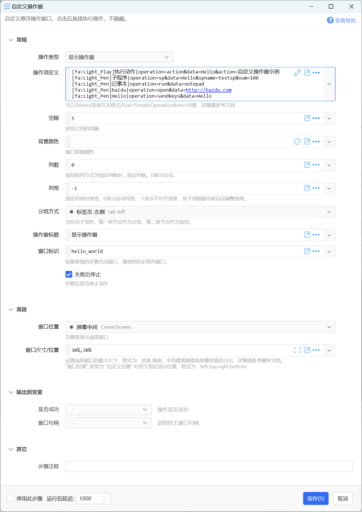
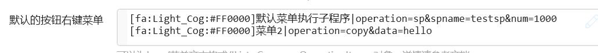
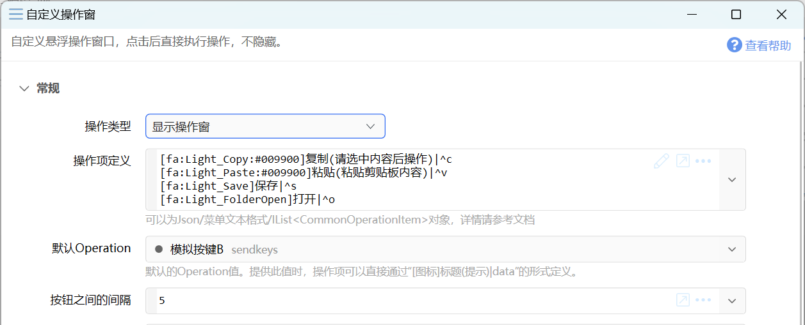
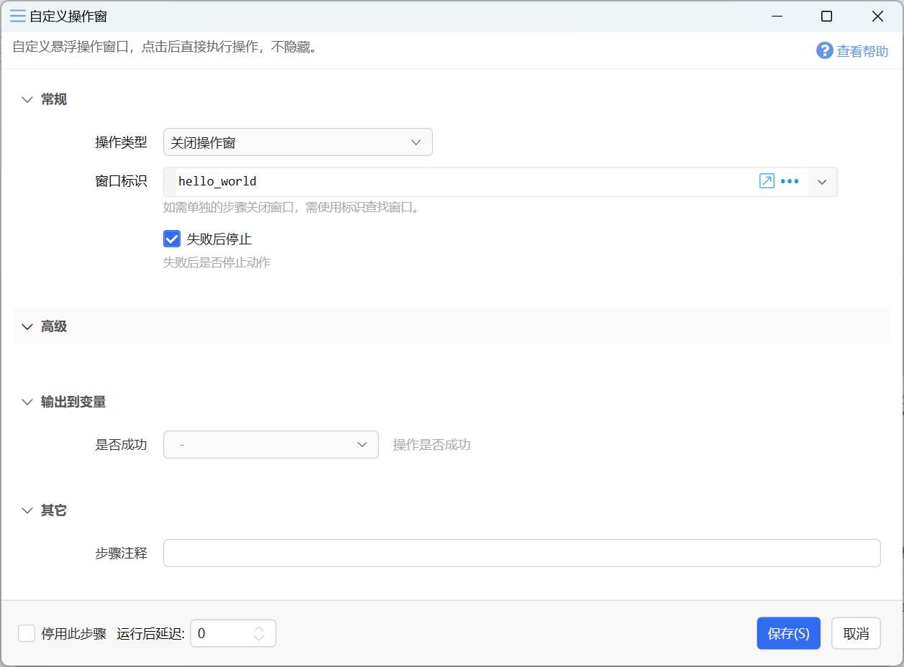

# 自定义操作窗

自定义悬浮操作窗口，点击后直接执行操作，不隐藏。

{/* xaction-metadata:start */}
## 当前模块定义

- 模块 Key：`sys:custompanel`
- 分类：界面组件（`Ui`）
- 类型：`Action`
- 风险操作：否
- 专业版：否

## 输入参数

| Key | 名称 | 类型 | 默认值 | 必填 | 变量模式 | 条件 | 说明 |
| --- | --- | --- | --- | --- | --- | --- | --- |
| `operation` | 操作类型 | `Enum` | show_fixed_panel_wait_close | 是 | `Input` |  |  |
| `operationData` | 操作项定义 | `Text` |  | 是 | `UseVarOrInput` | 仅：show_fixed_panel, show_fixed_panel_wait_close | 可以为Json/菜单文本格式/IList&lt;CommonOperationItem&gt;对象，详情请参考文档 |
| `defaultOperation` | 默认Operation | `Text` |  | 否 | `Input` | 仅：show_fixed_panel, show_fixed_panel_wait_close | 默认的Operation值或参数组合。提供此值时，操作项可以直接通过"[图标]标题(提示)\|data"的形式定义。 |
| `spacingStr` | 按钮之间的间隔 | `Text` | 5 | 是 | `UseVarOrInput` | 仅：show_fixed_panel, show_fixed_panel_wait_close | 可选格式1：5 =&gt; 四个边都是5；格式2：10,5 =&gt; 左右10，上下5;  |
| `buttonPadding` | 按钮内边距 | `Text` | 10,6 | 是 | `UseVarOrInput` | 仅：show_fixed_panel, show_fixed_panel_wait_close | 格式1：5 =&gt; 四个边都是5；格式2：10,5 =&gt; 左右10，上下5; 格式3：7,8,9,10 =&gt; 分别指定左上右下4边边距。 |
| `columnCount` | 列数 | `Integer` | 2 | 是 | `UseVarOrInput` | 仅：show_fixed_panel, show_fixed_panel_wait_close | 按钮排列方式为固定列数时，指定列数。0表示自动。 |
| `columnWidth` | 列宽 | `Integer` | 0 | 是 | `UseVarOrInput` | 仅：show_fixed_panel, show_fixed_panel_wait_close | 固定列宽时使用。0表示自动列宽，-1表示不对齐宽度，各子项根据内容自动调整宽度。 |
| `groupMode` | 分组方式 | `Enum` | heading | 否 | `UseVarOrInput` | 仅：show_fixed_panel, show_fixed_panel_wait_close | 当包含子项时，第一级节点作为分组，第二级节点作为按钮。 |
| `selectGroup` | 选择标签分组 | `Text` |  | 否 | `UseVarOrInput` | 仅：show_fixed_panel, show_fixed_panel_wait_close | 标签页分组时切换至设定的标签页标题，留空表示默认。 |
| `title` | 操作窗标题 | `Text` |  | 是 | `UseVarOrInput` | 仅：show_fixed_panel, show_fixed_panel_wait_close | 标题文字，或"[图标]标题"格式。 |
| `windowId` | 窗口标识 | `Text` |  | 是 | `UseVarOrInput` |  | 如需单独的步骤关闭窗口，需使用标识查找窗口。可使用"="表示当前动作ID。 |
| `winLocation` | 窗口位置 | `Enum` | CenterScreen | 否 | `UseVarOrInput` | 仅：show_fixed_panel, show_fixed_panel_wait_close | 在哪里显示选择窗口 |
| `winSize` | 窗口尺寸/位置 | `Text` |  | 否 | `Input` | 仅：show_fixed_panel, show_fixed_panel_wait_close | 设置选择窗口的最大尺寸，格式为：宽度,高度。支持像素数值或屏幕宽高百分比，详情请参考模块文档。<br />"窗口位置" 类型为 "自定义位置" 时用于指定显示位置，格式为：left,top,right,bottom |
| `horzAlign` | 按钮内容对齐方式 | `Enum` | Center | 否 | `UseVarOrInput` | 仅：show_fixed_panel, show_fixed_panel_wait_close |  |
| `bgColor` | 背景颜色 | `Text` |  | 是 | `UseVarOrInput` | 仅：show_fixed_panel, show_fixed_panel_wait_close |  |
| `btnColor` | 按钮颜色 | `Text` |  | 否 | `UseVarOrInput` | 仅：show_fixed_panel, show_fixed_panel_wait_close |  |
| `btnBorderColor` | 按钮边框颜色 | `Text` |  | 否 | `UseVarOrInput` | 仅：show_fixed_panel, show_fixed_panel_wait_close |  |
| `fontColor` | 字体颜色 | `Text` |  | 否 | `UseVarOrInput` | 仅：show_fixed_panel, show_fixed_panel_wait_close |  |
| `fontsize` | 字体大小 | `Number` | 12 | 是 | `UseVarOrInput` | 仅：show_fixed_panel, show_fixed_panel_wait_close |  |
| `iconsize` | 图标大小 | `Number` | 16 | 是 | `UseVarOrInput` | 仅：show_fixed_panel, show_fixed_panel_wait_close | 图标的宽度/高度像素数 |
| `contextMenuData` | 窗口右键菜单 | `Text` |  | 是 | `UseVarOrInput` | 仅：show_fixed_panel, show_fixed_panel_wait_close | 可以为Json/菜单文本格式/IList&lt;CommonOperationItem&gt;对象，详情请参考文档 |
| `buttonContextMenuData` | 默认的按钮右键菜单 | `Text` |  | 是 | `UseVarOrInput` | 仅：show_fixed_panel, show_fixed_panel_wait_close | 可以为Json/菜单文本格式/IList&lt;CommonOperationItem&gt;对象，详情请参考文档 |
| `bindProc` | 自动关联到进程 | `Enum` |  | 是 | `UseVarOrInput` | 仅：show_fixed_panel, show_fixed_panel_wait_close | 要关联的进程名称，输入"-"禁用此功能。当该进程为前台时显示操作窗，否则自动隐藏。 |
| `autoCollapse` | 自动折叠 | `Enum` | 0 | 否 | `Input` | 仅：show_fixed_panel, show_fixed_panel_wait_close |  |
| `saveState` | 记忆位置等状态 | `Boolean` | true | 否 | `Input` | 仅：show_fixed_panel, show_fixed_panel_wait_close | 多次使用操作窗时，保持上一次所在位置和分组 |
| `stopIfFail` | 失败后停止 | `Boolean` | true | 否 | `Input` |  | 失败后是否停止动作 |

## 输出参数

| Key | 名称 | 类型 | 条件 | 说明 |
| --- | --- | --- | --- | --- |
| `isSuccess` | 是否成功 | `Boolean` |  | 操作是否成功 |
| `selectedItemData` | 选择的操作项数据 | `Text` | 仅：show_fixed_panel_wait_close | 选择的操作项的data属性数据 |
| `selectedItem` | 选择的操作项 | `Object` | 仅：show_fixed_panel_wait_close | 选择的操作项的CommonOperationItem对象 |
| `currentGroup` | 当前标签分组 | `Object` | 仅：show_fixed_panel_wait_close, get_panel_info | 当使用标签分组显示时，关闭窗口时所停留的标签分组名称。 |
| `buttonItemData` | 按钮操作项数据 | `Text` | 仅：show_fixed_panel_wait_close | 点击的是按钮的菜单时，所对应按钮的操作项Data数据 |
| `buttonItem` | 按钮操作项 | `Object` | 仅：show_fixed_panel_wait_close | 点击的是按钮的菜单时，所对应按钮的CommonOperationItem对象 |
| `winHandle` | 窗口句柄 | `Integer` | 仅：show_fixed_panel, get_panel_info | 操作窗的窗口句柄 |
| `isWindowExpanded` | 窗口是否展开 | `Boolean` | 仅：get_panel_info |  |
| `isWindowVisible` | 窗口是否可见 | `Boolean` | 仅：get_panel_info | 可能会因为关联进程而隐藏 |

## 选项值

### `operation` 操作类型

| Value | 名称 | 说明 |
| --- | --- | --- |
| `show_fixed_panel` | 显示操作窗 |  |
| `show_fixed_panel_wait_close` | 显示操作窗并等待关闭 |  |
| `close_fixed_panel` | 关闭操作窗 |  |
| `toggle_collapse` | 切换展开状态 |  |
| `get_panel_info` | 获取操作窗状态 |  |

### `defaultOperation` 默认Operation

| Value | 名称 | 说明 |
| --- | --- | --- |
| `copy` | 复制 |  |
| `paste` | 粘贴 |  |
| `pastefile` | 粘贴文件 |  |
| `pasteimage` | 粘贴图片 |  |
| `inputtext` | 键入文本 |  |
| `run` | 执行命令 |  |
| `sendkeys` | 模拟按键B |  |
| `action` | 执行动作 |  |
| `selectfile` | 定位文件 |  |
| `inputscript` | 多步骤输入 |  |
| `sp` | 执行子程序 |  |

### `groupMode` 分组方式

| Value | 名称 | 说明 |
| --- | --- | --- |
| `heading` | 标题分组 |  |
| `expander` | 可折叠的分组 |  |
| `tab-top` | 标签页-顶部 |  |
| `tab-left` | 标签页-左侧 |  |
| `tab-right` | 标签页-右侧 |  |
| `tab-bottom` | 标签页-底部 |  |
| `headingLeft` | 多行 |  |
| `columns` | 多列 |  |
| `none` | 不分组 |  |

### `winLocation` 窗口位置

| Value | 名称 | 说明 |
| --- | --- | --- |
| `WithMouse1` | 跟随鼠标（指针周围） |  |
| `WithMouse2` | 跟随鼠标（指针右下） |  |
| `CenterScreen` | 屏幕中间 |  |
| `TopLeft` | 屏幕左上 |  |
| `TopCenter` | 屏幕中上 |  |
| `TopRight` | 屏幕右上 |  |
| `LeftCenter` | 屏幕左中 |  |
| `RightCenter` | 屏幕右中 |  |
| `BottomLeft` | 屏幕左下 |  |
| `BottomCenter` | 屏幕中下 |  |
| `BottomRight` | 屏幕右下 |  |
| `FullScreen` | 全屏 |  |
| `Maximized` | 最大化 |  |
| `Manual` | 自定义位置 |  |
| `Auto` | 系统默认 |  |

### `horzAlign` 按钮内容对齐方式

| Value | 名称 | 说明 |
| --- | --- | --- |
| `Center` | 居中 |  |
| `Left` | 左侧 |  |
| `Right` | 右侧 |  |

### `bindProc` 自动关联到进程

| Value | 名称 | 说明 |
| --- | --- | --- |
| `-` | 禁用此功能 |  |

### `autoCollapse` 自动折叠

| Value | 名称 | 说明 |
| --- | --- | --- |
| `0` | 关闭 |  |
| `1` | 开启 |  |
| `-1` | 禁用此功能 |  |
{/* xaction-metadata:end */}

本模块的目的是为了提供一个可以多次点击按钮触发某项操作（而不会自动关闭）的小窗口。

支持的操作类型：

-   显示操作窗：显示操作窗后继续执行后面的步骤。
-   显示操作窗并等待关闭：显示操作窗，并等待操作窗关闭后，再执行后面的步骤。
-   关闭操作窗：关闭通过窗口标识指定的操作窗。
-   切换展开状态：根据给定的操作窗标识，切换操作窗展开、折叠的状态。
-   获取操作窗状态：根据给定的操作窗标识，返回操作窗状态、窗口句柄。

## 显示操作窗

显示操作窗后继续执行后面的步骤。




### 参数

#### 操作项定义


**【操作项定义】**

定义操作窗上所显示的按钮和它们的行为。

数据格式基本与[显示菜单模块的菜单数据](/v2/xaction/modules/showmenu)参数一致，请参考该文档，同时注意以下区别：

-   本模块不支持分隔符。
-   当操作类型为“显示操作窗并等待关闭”时，支持使用`operation=close&data=返回值`方式指定用于关闭操作窗的按钮以及该按钮所需要返回的“操作项数据”值。
-   支持使用`operation=sp&spname=子程序名称`的形式调用动作中所定义的子程序。更详细的说明请参考本文后面部分。
-   最多支持一级子项。数据通常有两种形式：（1）全部都不带子项，所有操作项按设定的方式平铺排列。（2）首层节点带子项。此时首层节点作为分组处理（可选多种分组方式）。


-   使用`[]`作为操作项的标题，可以创建按钮占位符，用于在创建按钮时跳过某些位置以便实现特定布局方式。（1.39.42+）
    


**缩进格式的子项定义**

如下面的定义：


生成的效果如图。 如果按钮本身不需要实现其它操作，可以在标题后面加`|`或`|operation=&data=`表示空操作，这时点主按钮，也可直接展开子项菜单。


示例动作：[CAD命令板 - 动作信息 - Quicker](https://getquicker.net/Sharedaction?code=6085f206-34f6-4ee7-97b7-08db3d4a9dcd)

注：

-   在多行/多列等分组模式下，可以使用`__`(两个下划线）表示空的分组标题，此时会隐藏标题，减少留白。
-   对于显示子项菜单的右侧按钮\[&gt;\]，

-   可以通过`.dropdown_text=xx`方式设定自定义的文字内容。(v1.44.7)
-   可以通过`.dropdown_width=30`的参数设定右侧按钮的宽度。（v1.44.49)
    


**默认的按钮右键菜单 (v1.39.32)**

如果按钮所需要的右键菜单类似，可以在步骤中设置“默认的按钮右键菜单”参数。



当菜单调用子程序（operation=sp）时，按钮的相关信息将通过子程序输入变量传入子程序中。


**缩进格式的右击菜单定义**

使用缩进格式时，在按钮条目下，可在缩进后使用 `-` （短横线加空格）作为开始，为CommonOperationItem设置Menu数据。（菜单项的子菜单不再需要添加 `-` )。

注：按钮的右键菜单缩进比按钮本身的缩进多一级。

```
[fa:Light_Play]执行动作|operation=action&data=Hello&action=自定义操作窗示例
[fa:Light_Pen]子程序|operation=sp&data=Hello&spname=testsp&num=100
[icon:c:\windows\notepad.exe]记事本|operation=run&data=notepad
[url:https://helperservice.getquicker.cn/favicon/get/baidu.com]打开baidu|operation=open&data=http%3A%2F%2Fbaidu.com
  [url:https://helperservice.getquicker.cn/favicon/get/baidu.com]打开Google|operation=open&data=http%3A%2F%2Fgoogle.com
  - [url:https://helperservice.getquicker.cn/favicon/get/baidu.com]打开Google|operation=open&data=http%3A%2F%2Fgoogle.com
  - ----
  - 子菜单
    [url:https://helperservice.getquicker.cn/favicon/get/baidu.com]打开Google|operation=open&data=http%3A%2F%2Fgoogle.com
[fa:Light_Pen]模拟输入文本Hello|operation=sendkeys&data=Hello
```

对应的右键菜单：


**右键点击按钮直接触发操作**（1.39.33）

如果希望在按钮点击右键时直接执行某个操作，可以这样定义：有且仅有一个右键菜单项，且其标题为`=`。

例如：

```
父操作项
    - =|operation=xxxx......
```

也可在默认的按钮右键菜单中按此方式设置：`=|operation=xxx&data=xxxx`

**缩进格式的内容注释**

如果需要注释某一行，可以在缩进后添加`////`字符。此时该行以及它所有子节点会被注释。

```
aaaaa
  ////bbbb
  cccc
  ////dddd
  eeee
    ////ffff
    ggggg
```

**设置单个按钮的额外属性**

-   通过额外的参数`.background`可设置单个按钮的背景颜色。如果要固定按钮颜色，不要鼠标悬浮效果，可以附加`.fixed`参数，如：`...&.background=#ff0000&.fixed=true`。
-   `.foreground`可设置按钮文字颜色（在设置按钮背景色的情况下，`.foreground`可以设置为`auto`，以根据背景色亮度自动将文字显示为黑色或白色）（1.39.24+）。
-   `.bordercolor`可设置按钮的边框颜色（1.39.24+）。
-   `.width`可以设置按钮的固定宽度，`.height`可以设置按钮的固定高度。（1.40.16+）
-   `.iconSize`可设置图标大小。
-   `.text-align`可设置文字对齐方式，可选值`left`,`center`,`right`。
-   `.overflow`可设置在按钮宽度有限制时，文字过长时的处理方式（对应于WPF中的TextWrapping属性）。可选值：`wrap`表示折行（如果单词太长放不下就整个单词放入下一行），`wrapWithOverflow`表示折行（如果单词太长就从中间拆开）。`ellipsis`或`...`表示在末尾显示省略号。
-   `.close=true`可设置点击按钮后并触发相关操作后关闭操作窗。(1.44.49+)

**缩进格式：**

`[fa:Light_Play]执行动作|operation=action&data=Hello&action=_this_&.background=#66FF0000`

**JSON格式：**

```
      {
        "Title": "执行动作",
        "Icon": "fa:Light_Play",
        "Description": null,
        "Data": "Hello",
        "DataType": null,
        "Operation": "action",
        "Action": "_this_",
        "Menu": null,
        "SecondaryIcon": null,
        "ExtraData": {
          ".background": "#66FF0000"
        }
      }
```

**表达式创建：**

```
$=new CommonOperationItem(){
    Title = "执行动作",
    Icon = "fa:Light_Pen:#000000",
    Description = "描述",
    Operation = "action",
    Action = "_this",
    ExtraData = new Dictionary<string,object>(){
        {".background", "#20FF0000"}
    }
}
```


**使用操作项编辑器**

注意：

-   使用此功能会自动清除原始数据中的注释内容，也可能会造成一些原始数据格式变化或丢失。
-   不支持在开启插值或表达式的情况下使用。仅支持编辑缩进格式或json格式数据。

点击参数输入框右侧的编辑按钮，可以打开操作项编辑器。


在打开的编辑窗口中修改或添加操作项，然后保存即可。


**【默认Operation】**可以为空。

默认的操作项Operation值，在1.38.23+版本中，也支持附带更多默认参数值。

当大部分的按钮具有相同的工作方式时，可以通过本参数指定操作项的默认参数，然后在具体操作项定义中，只需要设置`标题部分|data值`即可。

默认Operation支持如下两种格式：

-   仅提供Operation值，如`paste`，表示点击按钮后，向当前窗口粘贴文本。更多的operation值请参考[这里](/v2/xaction/modules/showmenu)。
-   提供包含多个operation的参数，如`operation=sp&spname=send`表示点击按钮后执行名称为`send`的子程序，并将操作项data数据作为参数传递给子程序的data输入变量（参考示例动作“文字窗”）。

设置默认Operation后，操作项的数据定义可以简化为以下格式中的一种：

-   `内容`按钮标题和data值一样的情况。
-   `标题|值`分别指定按钮标题和data值，适用于data内容较长不易识别的情况。
-   `[图标]标题|值`带有图标的按钮。

示例动作：

-   [示例：默认Operation](https://getquicker.net/Sharedaction?code=62cb23a0-fdc5-4616-9791-08db3d4a9dcd)
-   [文字窗](https://getquicker.net/Sharedaction?code=c132bcb5-9cc1-476d-eba4-08db754ee2c2)




注：

-   如果某个操作项的operation和默认的不同，可以按上面章节中所描述的完整格式写。


#### 其它参数

**【默认Operation】**默认的Operation值或参数组合。提供此值时，操作项可以直接通过“\[图标\]标题(提示)|data”的形式定义。此参数主要用于减少在操作项定义中输入重复的参数。

例如：

-   设置为`copy`，那么操作项可以使用`你好|hello`的方式定义data参数，只要点击按钮，即可自动复制`hello`文本。
-   设置为`operation=action&action=某个动作`，那么操作项定义为`你好|hello`时，点击按钮即可调用指定动作，并且将`hello`作为参数传递给动作。

这里定义的是一些默认值，在具体操作项中，仍然可以指定这些参数来覆盖默认值。

**【按钮之间的间隔】** 按键之间的间隙。

可选格式1：输入1个数字，如`5` =&gt; 四个边都是5；格式2：逗号分隔的2个数字，如`10,5` =&gt; 左右10，上下5;

**【按钮内边距】**按钮内部的边框留白宽度。

可选格式：格式1：`5`\=&gt; 四个边都是5；格式2：`10,5` =&gt; 左右10，上下5; 格式3：`7,8,9,10` =&gt; 分别指定左上右下4边边距。


**【列数】【列宽】**

确定按钮的排列方式。

列数大于0时，按钮按指定列数对齐排列，宽度固定。此时列宽应设置为 0 或 -1 。


列数等于 0 时，按钮自动折行排列。此时根据列宽的数值，分为几种情况：

-   列宽如果为 -1，则表示每个按钮根据其内容自动设置宽度。
-   列宽如果为 0，则表示所有按钮等宽，宽度根据内容最多的按钮确定。
-   列宽为大于 0 的值，表示使用固定的宽度。


**【分组方式】**

操作项数据一级节点包含子项时，一级作为分组，二级作为按钮显示。


**【选择标签分组】**使用标签页分组方式时，在显示操作窗时自动切换到指定的标签页。留空表示默认（通常显示上次关闭时的标签页）。


**【操作窗标题】** 窗口左上角的标题文字。

**【窗口标识】**

如果需要先显示窗口，后面再根据需要更新窗口内容或通过动作关闭窗口，可设定一个自定义的文本作为窗口标识。 后面使用相同的窗口标识再次调用“显示操作窗”即可更新窗口内容。或使用“关闭操作窗”操作来关闭它。

为避免和其它动作重复，尽量使用较为特殊一点的文字，或使用`=`表示使用当前动作ID作为窗口标识（在多个动作中使用=作为窗口标识时，各动作之间互不影响）。


**【失败后停止】**

遇到异常后是否停止动作。

特别的，当操作方式为“显示操作窗并等待关闭”，并且输出了“选择的操作项数据”或“选择的操作项”时，如果通过点击窗口右上角的关闭按钮或双击空白区域等方式关闭了窗口，则视为步骤执行失败。如需继续执行后续的步骤，请取消本选项。


**【窗口位置】**选择操作窗的显示位置类型。

**【窗口尺寸/位置】**与“窗口位置”参数结合使用。在“窗口位置”参数选择“自定义位置”时，指定窗口的坐标范围。其他情况指定窗口的尺寸。

可以使用百分比或像素值。如：

-   50%,50%：设定窗口尺寸为屏幕的一半宽一半高。
-   300,50%：宽度为300像素，高度为屏幕一半。
-   600,300：宽度为600像素，高度为300像素。
-   10%,10%,50%,50%：指定窗口的左、顶、右、底边在屏幕上的位置（百分比位置）
-   100,100,50%,50%：指定窗口的左、顶、右、底边在屏幕上的位置（百分比单位和像素单位结合）

支持增加!(英文半角叹号)前缀表示禁止调整操作窗大小。如：`!300,200`创建固定大小的窗口。(1.39.42+)


**【记忆位置等状态】**保存操作窗的位置、分组折叠展开状态、当前标签页等信息，并在下次显示此操作窗时自动使用之前的状态。

**【按钮内容对齐方式】**按钮中的图标和文字的对齐方向。

**【背景颜色】**操作窗的背景颜色。

**【按钮颜色】**按钮的背景颜色。使用自定义按钮颜色后，鼠标悬浮时的颜色对比就会变得不是很明显了。

**【字体大小】**按钮文字字体大小（逻辑像素数）。

**【图标大小】**按钮图标大小（逻辑像素数）。

**【窗口右键菜单】**必要时用于自定义窗口的右键菜单内容。 格式与“操作项定义”一致。

**【自动关联到进程】**指定自动关联的进程名。关联进程后，只有该进程在前台时，操作窗才显示。

绑定多个进程时，可使用英文半角分号或逗号隔开，如`notepad;winword;excel`。

如果指定“-”，则表示禁用此功能，将从操作窗隐藏关联进程按钮。如果留空，则可以在操作窗界面上根据需要手动关联到当前前台进程。


【自动折叠】是否开启自动折叠操作窗。可选“开启”“关闭”或“禁用此功能”。开启时，如果鼠标离开操作窗，操作窗会自动收缩到只显示标题栏。禁用功能时，将从操作窗移除此按钮。


### 操作窗的使用

**折叠：**点击标题栏最小化按钮，或双击标题栏或窗口内部，可将操作窗折叠为一个横条。也可使用轮盘、手势的窗口最小化、最大化功能来折叠。


**拖动位置：**按住标题栏或窗口空白区域即可拖动窗口。


**切换分组：**点击标签页，或在标签页标题区使用滚轮可以快速切换页面。


**关闭操作窗：**

-   点击右上角关闭按钮；
-   通过窗口右键菜单；
-   使用轮盘、手势等功能中的关闭窗口；
-   在设置中开启后，可双击关闭操作窗。
    


**重置操作窗位置**

如果因为某种原因，操作窗未能显示到屏幕内（如副屏断开等造成了上次显示的位置不存在），可以通过右键菜单重置操作窗状态（1.40.34+）：


### 调用子程序并传递参数

示例动作：[示例：自定义操作窗\_子程序 - by CL - 动作信息 - Quicker](https://getquicker.net/Sharedaction?code=bfc36f54-2bfb-44b9-9d15-08dbb6a8337d)

-   无论按钮本身或按钮的菜单，都可以使用operation类型为sp的操作项定义。
-   文本格式的例子：`[图标]标题(提示内容)|operation=sp&spname=子程序名&data=data数据&其他参数.....`的格式定义。


将会为子程序传递如下数据：


-   **data**：点击的按钮或按钮的子菜单、右键菜单对应的操作项（CommonOperationItem）的data数据。
-   **num**：示例：一个自定义变量。当需要为子程序传递自定义的内容时，可以添加自定义变量并且设置为子程序的输入。在操作项定义中，为其传递参数即可：
    
    或：
    
-   **spname**：子程序名称。
-   **\_group**：当前分组名称。
-   **\_groupData**：当前分组条目的data参数值。(1.43.55+版本）
-   **\_handle**：操作窗的窗口句柄（非窗口标识，每次创建窗口时由Windows所赋予的一个数字）
-   **\_buttonItemData**：当点击按钮的子项菜单或右键菜单时，保存所对应按钮的操作项data数据。下图显示了，当点击“菜单3”时，数据的对应关系。
    
-   **\_buttonItemTitle**：按钮所对应操作项的标题。
-   **\_buttonItemAll**：当操作项以文本缩进方式定义时，返回对应的原始文本。
-   **\_buttonItem**：按钮所对应的操作项对象，类型为CommonOperationItem。


## 显示操作窗并等待关闭

显示并等待操作窗关闭后再继续后面的步骤。

#### 返回所点击的按钮

此方式时，支持输出所点击的用于关闭窗口的操作项数据。

如下图，使用`operation=close`定义了两个用于关闭窗口的按钮，并通过`data`参数定义了关联的数据。


如果通过点击这两个按钮关闭窗口，即可从“选择的操作项数据”中得到对应的操作项的`data`参数（`关闭1`或`关闭2`)。


如果通过点击窗口右上角的关闭按钮或双击窗口空白区域等方式关闭窗口，步骤会执行失败。（此时如果需要继续执行动作，需要取消`失败后停止`选项）。

## 关闭操作窗

通过指定“窗口标识”的方式，关闭前面步骤打开的操作窗。




## 注意事项

1）尽量避免在Quicker的窗口上使用自定义操作窗。

同一个进程的窗口会互相抢占焦点，在操作窗里模拟的按键消息，可能会作用到操作窗自身，从而导致一些意外的情况。（如模拟空格，会导致再次按下操作窗按钮，从而循环触发动作）。


## 更新历史

-   20230105：

-   增加多行多列分组布局方式；
-   缩进格式增加Menu数据定义格式；

-   20230111

-   增加注意事项。

-   20230415：增加“默认Operation”的参数说明；增加【自动关联进程】【自动折叠】参数说明。
-   20230505：增加缩进格式的注释说明。
-   20230525：增加绑定多个进程的说明。
-   20230908：1.39.24 增加为单独按钮设置字体和边框颜色功能。
-   20230916：1.39.32

-   增加“默认的按钮右键菜单”参数。
-   支持为子程序传递按钮的操作项信息。
-   文档增加“调用子程序并传递参数”章节。

-   20231202：1.40.16 按钮支持.width, .height的说明。
-   20240109: 增加如何重置状态的说明。
-   20241122：完善文字。
-   20241219：增加\_groupData子程序参数。
-   20251210：完善文档，增加.text-align等操作项参数的说明。
