# 自定义操作窗

弹出一块可反复点的悬浮操作窗，点完默认不关。要点一下就选一项并关掉，用 [显示菜单](/v2/xaction/modules/showmenu)。要填多项再继续，用 [多字段表单](/v2/xaction/modules/form)。要自己画 WPF 布局，用 [自定义窗口](/v2/xaction/modules/customwindow)。

## 当前模块定义

<XActionModuleMeta moduleKey="sys:custompanel" />

## 概述

**操作类型**：

- **显示操作窗**：弹出后继续后面的步骤。
- **显示操作窗并等待关闭**：等到关掉再继续；可返回点中的关闭按钮数据。
- **关闭操作窗**：按 **窗口标识** 关掉已打开的操作窗。
- **切换展开状态**：按标识在展开 / 折叠之间切换。
- **获取操作窗状态**：按标识返回是否展开、是否可见、窗口句柄等。

<ModuleParamPreview moduleKey="sys:custompanel" />

## 显示操作窗

显示后立刻继续后面的步骤。下面参数仅「显示操作窗」「显示操作窗并等待关闭」时出现（**窗口标识**、**失败后停止** 例外）。

### 操作项定义

**操作项定义**：窗上按钮及其行为。格式大体与 [显示菜单](/v2/xaction/modules/showmenu) 的菜单数据相同，差别：

- 不支持分隔符。
- 「显示操作窗并等待关闭」时，可用 `operation=close&data=返回值` 做关闭按钮，并把 data 写到 **选择的操作项数据**。
- 可用 `operation=sp&spname=子程序名称` 调本动作里的子程序，见 [调用子程序](#调用子程序并传递参数)。
- 最多一级子项。常见两种写法：（1）全部平铺；（2）首层带子项，首层当分组（可选多种分组方式）。

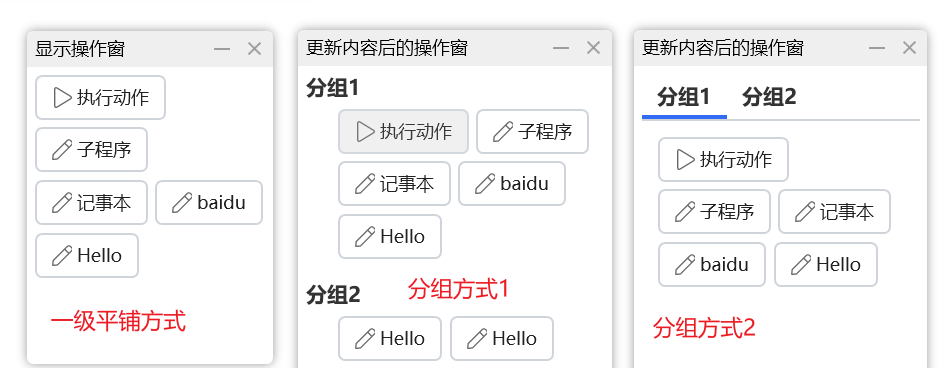

标题写成 `[]` 可做占位，跳过某些格子以便排版（1.39.42+）。

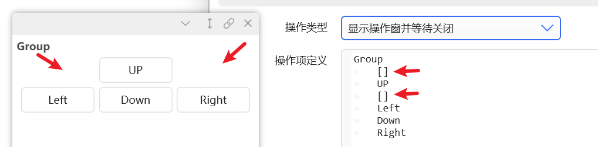

#### 缩进格式的子项

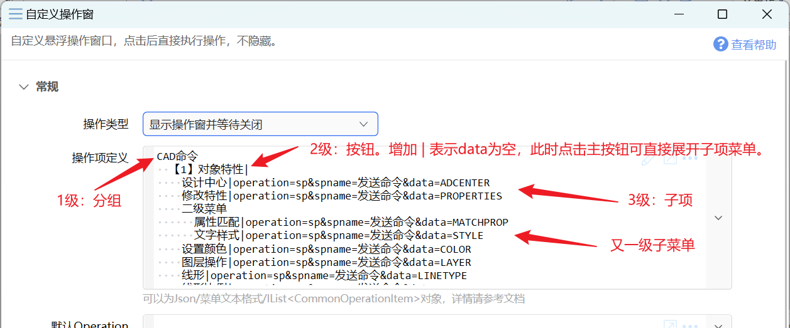

生成效果如下。按钮本身不做事时，标题后加 `|` 或 `|operation=&data=` 表示空操作，点主按钮会展开子项。

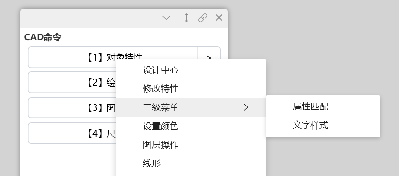

<ShareLinkCard
  code="6085f206-34f6-4ee7-97b7-08db3d4a9dcd"
  title="CAD命令板"
  description="用操作窗做常驻命令板"
/>

- 多行 / 多列分组时，分组标题写 `__`（两个下划线）可隐藏标题、少留白。
- 右侧展开子项的 `[>]` 按钮：
  - `.dropdown_text=xx` 自定义文字（v1.44.7）
  - `.dropdown_width=30` 设右侧按钮宽度（v1.44.49）

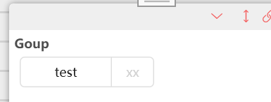

#### 默认的按钮右键菜单

多数按钮右键菜单相同时，在步骤里填 **默认的按钮右键菜单**（v1.39.32）。菜单 `operation=sp` 时，按钮信息会通过子程序输入变量传入。

<ModuleParamPreview
  moduleKey="sys:custompanel"
  focusKeys={['operation', 'buttonContextMenuData']}
  values={{operation: 'show_fixed_panel', buttonContextMenuData: ''}}
/>

缩进格式里，在按钮下再缩进一级，用 `- `（短横线加空格）开始写 Menu。菜单的子菜单不必再加 `-`。右键菜单要比按钮本身多缩进一级。

```text
[fa:Light_Play]执行动作|operation=action&data=Hello&action=自定义操作窗示例
[fa:Light_Pen]子程序|operation=sp&data=Hello&spname=testsp&num=100
[icon:c:\windows\notepad.exe]记事本|operation=run&data=notepad
[url:https://helperservice.getquicker.cn/favicon/get/baidu.com]打开baidu|operation=open&data=http%3A%2F%2Fbaidu.com
  [url:https://helperservice.getquicker.cn/favicon/get/baidu.com]打开Google|operation=open&data=http%3A%2F%2Fgoogle.com
  - [url:https://helperservice.getquicker.cn/favicon/get/baidu.com]打开Google|operation=open&data=http%3A%2F%2Fgoogle.com
  - ----
  - 子菜单
    [url:https://helperservice.getquicker.cn/favicon/get/baidu.com]打开Google|operation=open&data=http%3A%2F%2Fgoogle.com
[fa:Light_Pen]模拟输入文本Hello|operation=sendkeys&data=Hello
```

对应的右键菜单：

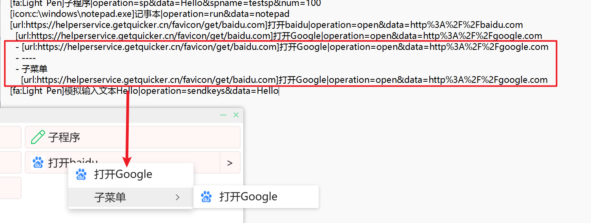

右键要点一下就执行（1.39.33）：有且仅有一个右键项，且标题为 `=`。

```text
父操作项
    - =|operation=xxxx......
```

也可在默认右键菜单里写：`=|operation=xxx&data=xxxx`

#### 缩进格式的注释

缩进后写 `////`，该行及其子节点都会被注释掉。

```text
aaaaa
  ////bbbb
  cccc
  ////dddd
  eeee
    ////ffff
    ggggg
```

#### 单个按钮的额外属性

- `.background`：背景色。再加 `.fixed=true` 可固定颜色、不要悬浮变色，如 `...&.background=#ff0000&.fixed=true`。
- `.foreground`：文字颜色。已设背景色时可写 `auto`，按亮度自动黑/白字（1.39.24+）。
- `.bordercolor`：边框颜色（1.39.24+）。
- `.width` / `.height`：固定宽高（1.40.16+）。
- `.iconSize`：图标大小。
- `.text-align`：`left` / `center` / `right`。
- `.overflow`：宽度不够时的折行（对应 WPF TextWrapping）。`wrap` 整词换行；`wrapWithOverflow` 可从词中间拆；`ellipsis` 或 `...` 末尾省略号。
- `.close=true`：点完并执行操作后关掉操作窗（1.44.49+）。

缩进格式：

`[fa:Light_Play]执行动作|operation=action&data=Hello&action=_this_&.background=#66FF0000`

JSON：

```json
{
  "Title": "执行动作",
  "Icon": "fa:Light_Play",
  "Description": null,
  "Data": "Hello",
  "DataType": null,
  "Operation": "action",
  "Action": "_this_",
  "Menu": null,
  "SecondaryIcon": null,
  "ExtraData": {
    ".background": "#66FF0000"
  }
}
```

表达式：

```csharp
$=new CommonOperationItem(){
    Title = "执行动作",
    Icon = "fa:Light_Pen:#000000",
    Description = "描述",
    Operation = "action",
    Action = "_this",
    ExtraData = new Dictionary<string,object>(){
        {".background", "#20FF0000"}
    }
}
```

#### 操作项编辑器

注意：

- 打开编辑器会清掉原始注释，也可能改掉格式或丢掉部分内容。
- 开启插值或表达式时不能用。只支持编辑缩进格式或 JSON。

点参数框右侧编辑按钮打开编辑器，改完保存即可。

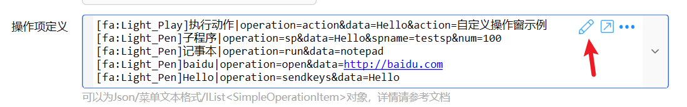

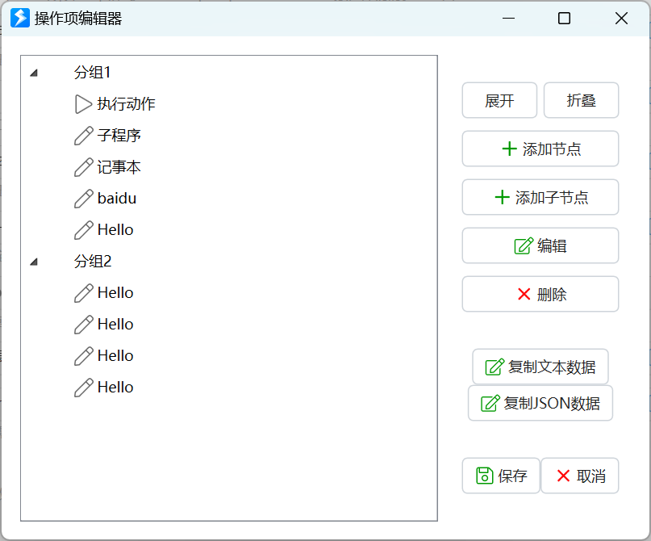

### 默认Operation

**默认Operation**：可空。多数按钮工作方式相同时，在这里写默认参数，操作项里只写 `标题部分|data` 即可。1.38.23+ 也可附带更多默认参数。

两种写法：

- 只写 Operation，如 `paste`，点击后向当前窗口粘贴。更多值见 [显示菜单](/v2/xaction/modules/showmenu)。
- 写完整查询串，如 `operation=sp&spname=send`，点击后跑名为 `send` 的子程序，并把 data 传给子程序的 data 输入（可参考「文字窗」示例）。

设了默认值后，操作项可以简化为：

- `内容`：标题和 data 相同
- `标题|值`：标题和 data 不同
- `[图标]标题|值`：带图标

<ShareLinkCard
  items={[
    {
      code: '62cb23a0-fdc5-4616-9791-08db3d4a9dcd',
      title: '示例：默认Operation',
      description: '用默认 Operation 简化按钮定义',
    },
    {
      code: 'c132bcb5-9cc1-476d-eba4-08db754ee2c2',
      title: '文字窗',
      description: '默认 Operation 调用子程序',
    },
  ]}
/>

<ModuleParamPreview
  moduleKey="sys:custompanel"
  focusKeys={['operation', 'operationData', 'defaultOperation', 'spacingStr']}
  values={{
    operation: 'show_fixed_panel',
    operationData: `[fa:Light_Copy:#009900]复制(请选中内容后操作)|^c
[fa:Light_Paste:#009900]粘贴(粘贴剪贴板内容)|^v
[fa:Light_Save]保存|^s
[fa:Light_FolderOpen]打开|^o`,
    defaultOperation: 'sendkeys',
    spacingStr: '5',
  }}
/>

某个操作项与默认不同时，仍可按完整格式写，覆盖默认值。例如默认是 `copy` 时，`你好|hello` 点击会复制 `hello`；默认是 `operation=action&action=某个动作` 时，同样写法会把 `hello` 传给该动作。

### 其它参数

**按钮之间的间隔**：默认 `5`。`5` 表示四边都是 5；`10,5` 表示左右 10、上下 5。

**按钮内边距**：默认 `10,6`。`5` 四边相同；`10,5` 左右 / 上下；`7,8,9,10` 左上右下。

**列数** / **列宽**：

列数大于 0 时按固定列数排列，宽度固定。此时列宽应设为 `0` 或 `-1`。

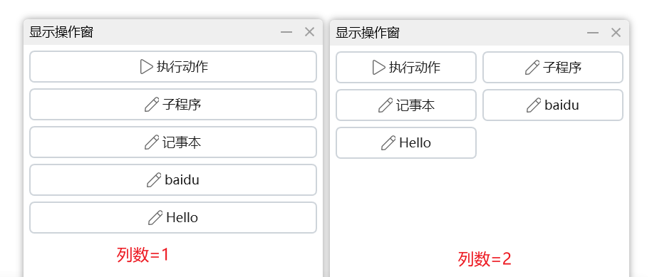

列数为 `0` 时自动折行，再看列宽：

- `-1`：每个按钮按内容定宽
- `0`：所有按钮等宽，按内容最多的那个定
- 大于 0：固定宽度

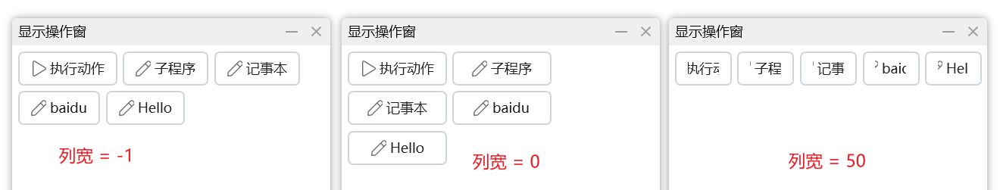

**分组方式**：一级节点含子项时，一级当分组、二级当按钮。可选标题分组、可折叠的分组、标签页（上 / 左 / 右 / 下）、多行、多列、不分组。

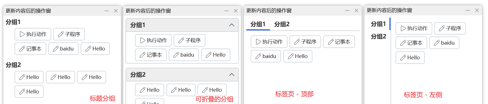

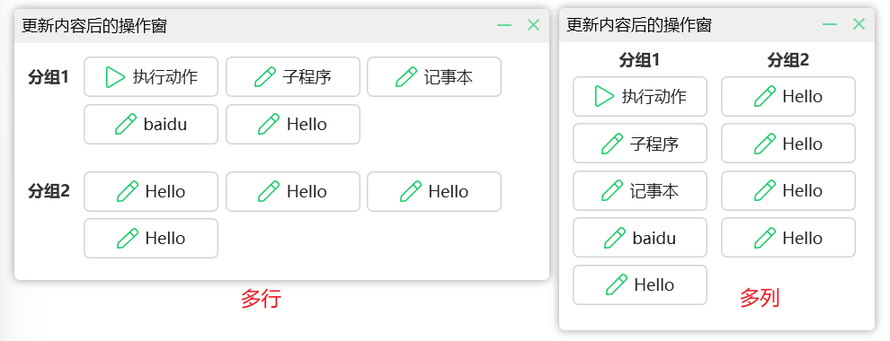

**选择标签分组**：标签页分组时，打开时切到指定标签。留空则默认（通常是上次关掉时的标签）。

**操作窗标题**：左上角文字，或 `[图标]标题`。

**窗口标识**：后面要更新内容或关掉窗口时，填一段自定义文字。再用同一标识「显示操作窗」即可更新；「关闭操作窗」按标识关。尽量写独特一点，或填 `=` 表示用当前动作 ID（多个动作都写 `=` 时互不影响）。关闭 / 切换展开 / 获取状态时也用这个标识。

**失败后停止**：出错是否中止。默认开启。「显示操作窗并等待关闭」且输出了 **选择的操作项数据** 或 **选择的操作项** 时，点右上角关闭或双击空白关掉视为失败；要继续跑后面的步骤，请关掉本选项。

**窗口位置**：跟随鼠标、屏幕各方位、全屏、最大化、自定义位置、系统默认。默认屏幕中间。

**窗口尺寸/位置**：与 **窗口位置** 配合。自定义位置时写坐标范围；其它情况写尺寸。可用百分比或像素：

- `50%,50%`：宽高各为屏幕一半
- `300,50%`：宽 300 像素，高为一半
- `600,300`：600×300
- `10%,10%,50%,50%`：左、顶、右、底（百分比）
- `100,100,50%,50%`：像素和百分比混用

前面加 `!` 禁止改大小，如 `!300,200`（1.39.42+）。

**记忆位置等状态**：记住位置、分组折叠、当前标签，下次打开时还原。默认开启。

**按钮内容对齐方式**：居中 / 左侧 / 右侧。默认居中。

**背景颜色**：操作窗背景。

**按钮颜色**：按钮背景。自定义后，鼠标悬浮的对比会变弱。

**按钮边框颜色** / **字体颜色**：全局按钮边框和文字颜色。单个按钮仍可用 `.bordercolor` / `.foreground` 覆盖。

**字体大小**：按钮文字（逻辑像素），默认 `12`。

**图标大小**：按钮图标（逻辑像素），默认 `16`。

**窗口右键菜单**：自定义窗口右键。格式与 **操作项定义** 相同。

**自动关联到进程**：仅当前台是这些进程时才显示操作窗。多个进程用英文分号或逗号，如 `notepad;winword;excel`。填 `-` 禁用并藏掉关联按钮；留空可在窗上再手动关联。

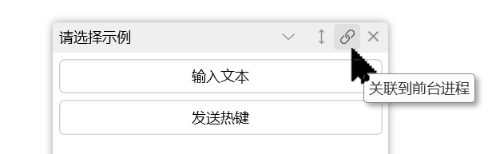

**自动折叠**：开启、关闭，或禁用此功能。开启后鼠标离开会收到只剩标题栏；禁用会去掉窗上的折叠按钮。

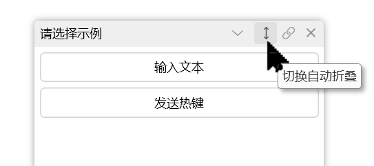

### 操作窗的使用

**折叠**：点标题栏最小化，或双击标题栏 / 窗口内部，可折成一条。也可用轮盘、手势的最小化 / 最大化。

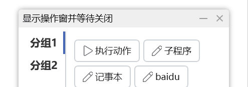

**拖动位置**：按住标题栏或空白处拖动。

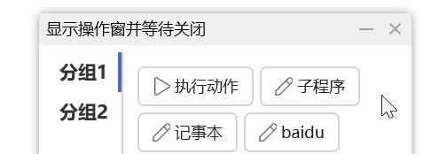

**切换分组**：点标签，或在标签标题区滚轮。

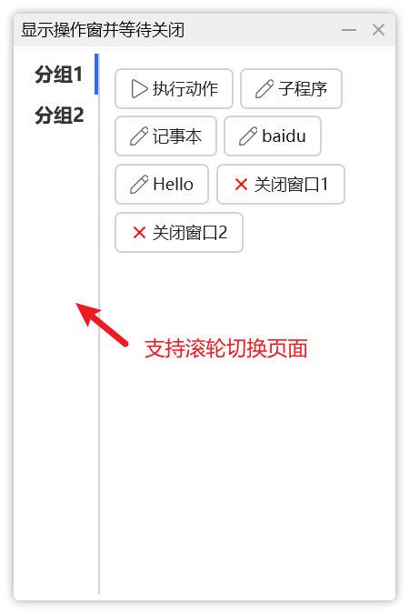

**关闭操作窗**：

- 右上角关闭按钮
- 窗口右键菜单
- 轮盘、手势里的关闭窗口
- 设置里开启后，可双击关闭

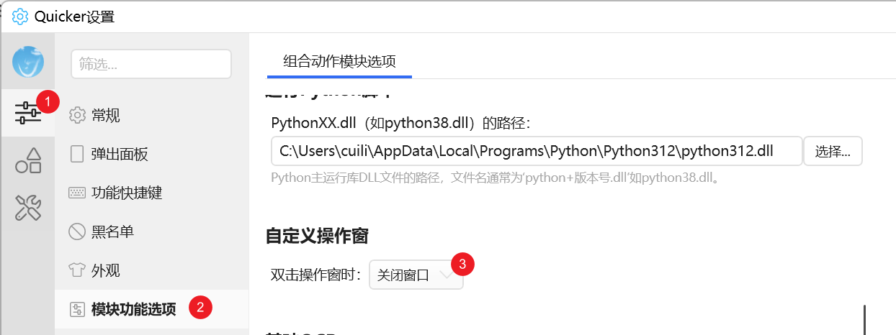

**重置位置**：操作窗跑到屏幕外（例如副屏断开）时，用右键菜单重置状态（1.40.34+）。

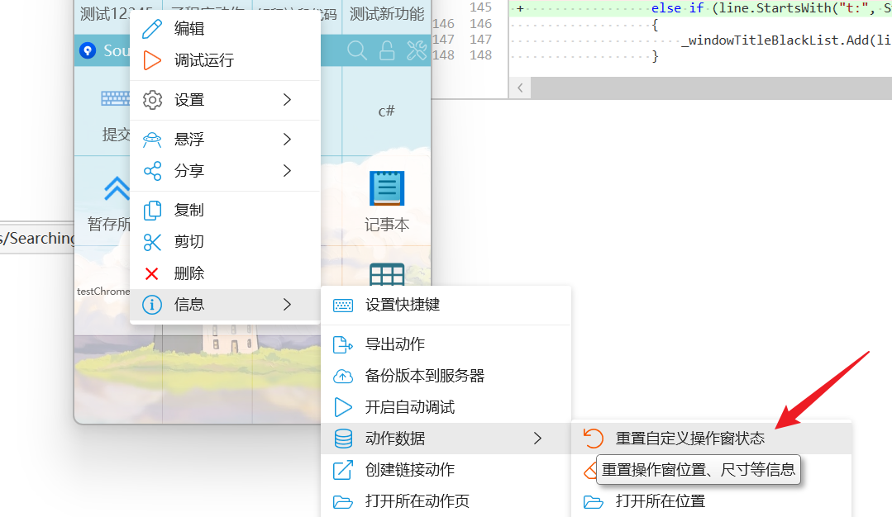

### 调用子程序并传递参数

<ShareLinkCard
  code="bfc36f54-2bfb-44b9-9d15-08dbb6a8337d"
  title="示例：自定义操作窗_子程序"
  description="按钮或菜单用 operation=sp 调子程序"
  author="CL"
/>

按钮本身或按钮菜单都可用 `operation=sp`。文本格式：`[图标]标题(提示内容)|operation=sp&spname=子程序名&data=data数据&其他参数.....`。

会传给子程序：

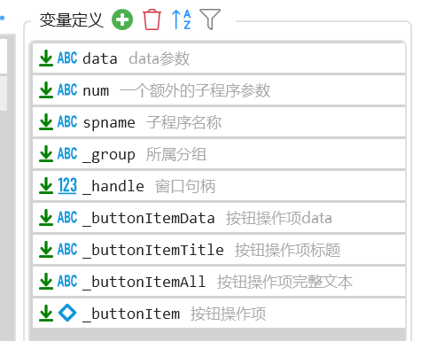

- **data**：点中的按钮、子菜单或右键项的 data。
- **num**：示例里的自定义输入。要额外传参时，给子程序加输入变量，再在操作项里写同名参数：

  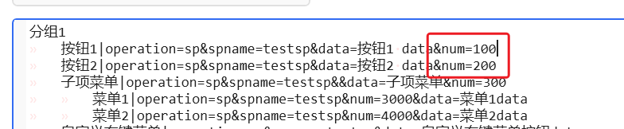

  或：

  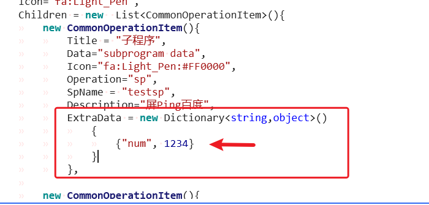

- **spname**：子程序名称。
- **\_group**：当前分组名称。
- **\_groupData**：当前分组条目的 data（1.43.55+）。
- **\_handle**：操作窗的窗口句柄（不是窗口标识，每次创建由 Windows 分配）。
- **\_buttonItemData**：点子项或右键时，对应主按钮的 data。下图是点「菜单3」时的对应关系：

  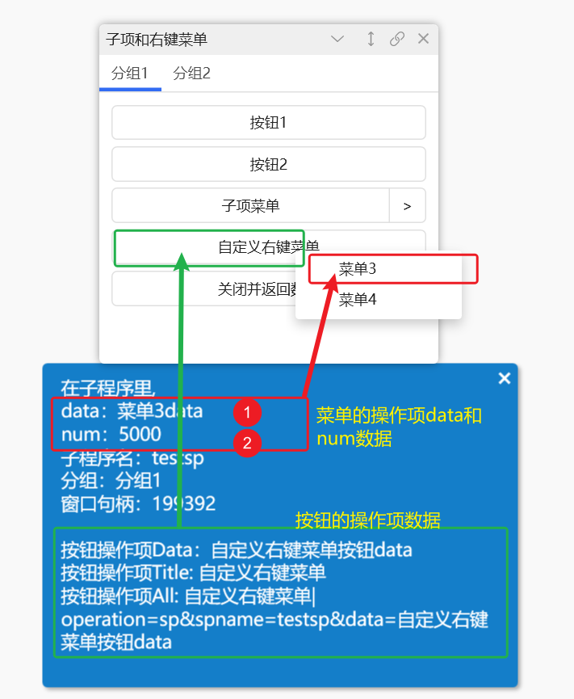

- **\_buttonItemTitle**：主按钮标题。
- **\_buttonItemAll**：缩进格式时，对应的原始文本。
- **\_buttonItem**：主按钮的 CommonOperationItem 对象。

## 显示操作窗并等待关闭

显示后等到关掉再继续。可用 `operation=close` 做关闭按钮，并用 `data` 带返回值。

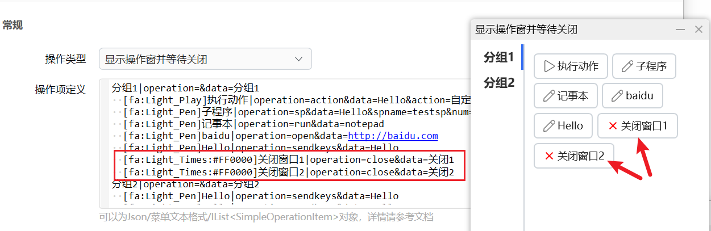

点这两个按钮关掉时，**选择的操作项数据** 分别是 `关闭1` / `关闭2`。

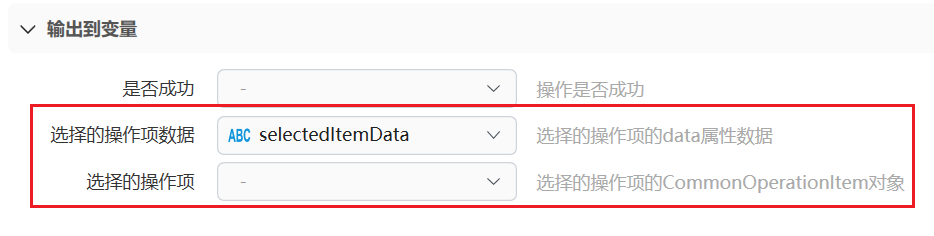

点右上角关闭或双击空白关掉，本步会失败。要继续跑，请关掉 **失败后停止**。

## 关闭操作窗

按 **窗口标识** 关掉前面打开的操作窗。

<ModuleParamPreview
  moduleKey="sys:custompanel"
  focusKeys={['operation', 'windowId', 'stopIfFail', 'isSuccess']}
  values={{operation: 'close_fixed_panel', windowId: 'hello_world', stopIfFail: 'true'}}
/>

## 切换展开状态 / 获取操作窗状态

**切换展开状态**：按 **窗口标识** 在展开和折叠之间切换。

<ModuleParamPreview
  moduleKey="sys:custompanel"
  focusKeys={['operation', 'windowId', 'stopIfFail']}
  values={{operation: 'toggle_collapse', windowId: 'hello_world', stopIfFail: 'true'}}
/>

**获取操作窗状态**：按标识读取当前状态。

<ModuleParamPreview
  moduleKey="sys:custompanel"
  focusKeys={['operation', 'windowId', 'stopIfFail']}
  values={{operation: 'get_panel_info', windowId: 'hello_world', stopIfFail: 'true'}}
/>

## 输出

- **是否成功**：本步是否完成。
- **选择的操作项数据** / **选择的操作项**：仅「显示操作窗并等待关闭」，点关闭类按钮时返回。
- **当前标签分组**：等待关闭，或获取状态时。
- **按钮操作项数据** / **按钮操作项**：仅等待关闭。
- **窗口句柄**：显示操作窗，或获取状态时。
- **窗口是否展开** / **窗口是否可见**：仅获取状态。

## 限制与排障

尽量不要在 Quicker 自己的窗口上用操作窗。同一进程的窗口会抢焦点，操作窗里模拟的按键可能打到自己身上（例如模拟空格会再点一次按钮，形成循环）。

操作窗跑出屏幕时，用窗口右键「重置」状态。

## 相关链接

<RelatedDocs
  items={[
    {
      href: '/v2/xaction/modules/showmenu',
      label: '显示菜单',
      description: '操作项格式与这里相近，点完即关。',
    },
    {
      href: '/v2/xaction/modules/form',
      label: '多字段表单',
      description: '填多项再继续，不是常驻按钮窗。',
    },
    {
      href: '/v2/xaction/modules/customwindow',
      label: '自定义窗口',
      description: '用 XAML 自己画界面。',
    },
    {
      href: '/v2/xaction/modules/subprogram',
      label: '运行子程序',
      description: 'operation=sp 会调到这里。',
    },
  ]}
/>

## 更新历史

- 20230105：增加多行多列分组；缩进格式增加 Menu 定义。
- 20230111：增加注意事项。
- 20230415：增加「默认Operation」、自动关联进程、自动折叠说明。
- 20230505：增加缩进格式注释说明。
- 20230525：增加绑定多个进程的说明。
- 20230908：1.39.24 单独按钮可设字体和边框颜色。
- 20230916：1.39.32 增加默认按钮右键菜单；子程序可收到按钮信息。
- 20231202：1.40.16 按钮支持 `.width` / `.height`。
- 20240109：增加如何重置状态。
- 20241122：完善文字。
- 20241219：增加 `_groupData` 子程序参数。
- 20251210：完善文档，增加 `.text-align` 等说明。
