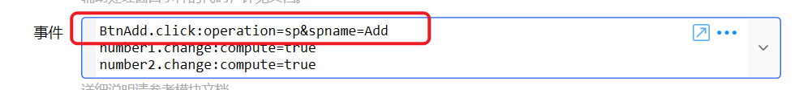

# 自定义窗口

创建和显示自定义窗口

{/* xaction-metadata:start */}
## 当前模块定义

- 模块 Key：`sys:customwindow`
- 分类：界面组件（`Ui`）
- 类型：`Action`
- 风险操作：否
- 专业版：否

## 输入参数

| Key | 名称 | 类型 | 默认值 | 必填 | 变量模式 | 条件 | 说明 |
| --- | --- | --- | --- | --- | --- | --- | --- |
| `type` | 操作类型 | `Enum` | ShowAndWaitClose | 是 | `Input` |  |  |
| `windowMarkup` | 窗口XAML代码 | `Text` | &lt;Window xmlns="http://schemas.microsoft.com/winfx/2006/xaml/presentation"<br />        xmlns:d="http://schemas.microsoft.com/expression/blend/2008"<br />        xmlns:x="http://schemas.microsoft.com/winfx/2006/xaml"<br />        xmlns:hc="https://handyorg.github.io/handycontrol"<br />        xmlns:mc="http://schemas.openxmlformats.org/markup-compatibility/2006"<br />        xmlns:qk="https://getquicker.net"<br />        Width="637"<br />        Height="556"<br />        Title="Test Window"<br />        mc:Ignorable="d"&gt;<br />  &lt;Grid Margin="10"&gt;<br />    &lt;StackPanel&gt;<br />      &lt;TextBlock Margin="10,50,10,50" Text="Hello World！" FontSize="20" /&gt;<br />     <br />      &lt;Button Margin="10" qk:Att.Action="close:result" Style="&#123;StaticResource ButtonPrimary&#125;" Width="50"&gt;<br />        关闭<br />      &lt;/Button&gt;<br />    &lt;/StackPanel&gt;<br />  &lt;/Grid&gt;<br />&lt;/Window&gt; | 是 | `UseVarOrInput` | 仅：Show, ShowAndWaitClose | 窗口定义XAML代码 |
| `dataMapping` | 数据映射 | `Text` |  | 是 | `UseVarOrInput` | 仅：Show, ShowAndWaitClose | 将变量与窗口上下文数据进行映射。每行一个，格式为:"窗口数据项名称:&#123;动作变量名&#125;" 或 "窗口数据项:=表达式" |
| `events` | 事件 | `Text` |  | 是 | `UseVarOrInput` | 仅：Show, ShowAndWaitClose | 详细说明请参考模块文档 |
| `cscode` | 辅助C#代码 | `Text` |  | 否 | `UseVarOrInput` | 仅：Show, ShowAndWaitClose | 辅助处理窗口事件的代码，详见文档。 |
| `csReference` | 辅助C#引用DLL库 | `Text` |  | 否 | `UseVarOrInput` | 仅：Show, ShowAndWaitClose | 辅助 C# 代码要引用的 DLL 文件，每行一个。也可以在代码中使用 #r 指令。 |
| `windowId` | 窗口标识 | `Text` |  | 是 | `UseVarOrInput` |  | 如需单独的步骤关闭窗口，需使用标识查找窗口。 |
| `autoCloseTime` | 自动关闭时间(S) | `Number` | 0 | 是 | `UseVarOrInput` | 仅：Show, ShowAndWaitClose | 自动关闭窗口的时间（秒数）。需大于0.5秒。 |
| `winLocation` | 窗口位置 | `Enum` | CenterScreen | 否 | `UseVarOrInput` | 仅：Show, ShowAndWaitClose | 在哪里显示选择窗口 |
| `winSize` | 窗口尺寸/位置 | `Text` |  | 否 | `Input` | 仅：Show, ShowAndWaitClose | 设置选择窗口的最大尺寸，格式为：宽度,高度。支持像素数值或屏幕宽高百分比，详情请参考模块文档。<br />"窗口位置" 类型为 "自定义位置" 时用于指定显示位置，格式为：left,top,right,bottom |
| `activateMode` | 激活模式 | `Enum` | AutoActivate | 否 | `UseVarOrInput` | 仅：Show, ShowAndWaitClose |  |
| `closeWhenDeactivate` | 失去焦点后关闭窗口 | `Text` | false | 否 | `UseVarOrInput` | 仅：Show, ShowAndWaitClose | 仅在窗口支持激活（获取焦点）的情况下有效。 |
| `stopIfFail` | 失败后停止 | `Boolean` | true | 否 | `Input` |  | 失败后是否停止动作 |

## 输出参数

| Key | 名称 | 类型 | 条件 | 说明 |
| --- | --- | --- | --- | --- |
| `isSuccess` | 是否成功 | `Boolean` |  | 操作是否成功 |
| `result` | 窗口结果 | `Text` | 仅：ShowAndWaitClose, Close | 通过close:result返回的结果 |
| `windowList` | 窗口对象列表 | `Object` | 仅：GetWindows | IList&lt;Window&gt;对象 |
| `windowHandle` | 窗口句柄 | `Integer` | 仅：Show |  |
| `windowLocation` | 关闭时窗口位置 | `Text` | 仅：ShowAndWaitClose |  |

## 选项值

### `type` 操作类型

| Value | 名称 | 说明 |
| --- | --- | --- |
| `ShowAndWaitClose` | 显示窗口并等待关闭 |  |
| `Show` | 显示窗口 |  |
| `Close` | 关闭窗口 |  |
| `GetWindows` | 获取窗口列表 |  |

### `winLocation` 窗口位置

| Value | 名称 | 说明 |
| --- | --- | --- |
| `WithMouse1` | 跟随鼠标（指针周围） |  |
| `WithMouse2` | 跟随鼠标（指针右下） |  |
| `CenterScreen` | 屏幕中间 |  |
| `TopLeft` | 屏幕左上 |  |
| `TopCenter` | 屏幕中上 |  |
| `TopRight` | 屏幕右上 |  |
| `LeftCenter` | 屏幕左中 |  |
| `RightCenter` | 屏幕右中 |  |
| `BottomLeft` | 屏幕左下 |  |
| `BottomCenter` | 屏幕中下 |  |
| `BottomRight` | 屏幕右下 |  |
| `FullScreen` | 全屏 |  |
| `Maximized` | 最大化 |  |
| `Manual` | 自定义位置 |  |
| `Auto` | 系统默认 |  |

### `activateMode` 激活模式

| Value | 名称 | 说明 |
| --- | --- | --- |
| `AutoActivate` | 支持激活，打开时抢占焦点 |  |
| `NotActivatable` | 不支持激活（不占用焦点，仅能使用鼠标操作） |  |
| `NotActivatableMouseThrough` | 不支持激活，鼠标穿透 |  |
| `NotActivated` | 支持激活，打开时不抢占焦点 |  |

### `closeWhenDeactivate` 失去焦点后关闭窗口

| Value | 名称 | 说明 |
| --- | --- | --- |
| `true` | 是 |  |
| `false` | 否 |  |
| `closeIfNotTopmost` | 在未置顶时 |  |
{/* xaction-metadata:end */}

此功能为预览状态，可能存在bug或随时改动。

根据给定的XAML代码创建和显示窗口，并提供简单的数据绑定与事件处理功能。

注：

-   难度等级++++，如果不是特别必要，不需要了解此模块。
-   需要您对WPF编程有基本的了解。
-   如果功能相对复杂，可以在VisualStudio中调试好后再迁移到Quicker中。


## 参数

【操作类型】

-   显示窗口并等待关闭：窗口关闭后再运行后续的动作步骤。
-   显示窗口：显示窗口后，不等待关闭就继续运行后续的动作步骤。
-   关闭窗口：关闭之前打开的自定义窗口（根据\[窗口标识\]参数确定要关闭的窗口）。


【窗口XAML代码】

示例代码：

```
<Window xmlns="http://schemas.microsoft.com/winfx/2006/xaml/presentation"
        xmlns:d="http://schemas.microsoft.com/expression/blend/2008"
        xmlns:x="http://schemas.microsoft.com/winfx/2006/xaml"
        xmlns:hc="https://handyorg.github.io/handycontrol"
        xmlns:mc="http://schemas.openxmlformats.org/markup-compatibility/2006"
        xmlns:qk="https://getquicker.net"
        Width="637"
        Height="556"
        Title="CalcWindow"
        mc:Ignorable="d">
  <Grid Margin="10">
    <StackPanel>
      <TextBox Margin="10" Text="{Binding [number1]}" />
      <TextBox Margin="10" Text="{Binding [number2]}" />
      <WrapPanel Orientation="Horizontal">
        <Button Name="BtnAdd" Margin="10">
          加(子程序)
        </Button>
        <Button  Margin="10" qk:Att.Action="operation=sp&amp;spname=Multiply">
          乘(声明式调用子程序)
        </Button>
        <Button  Margin="10" qk:Att.Action="compute=true">
          减(自动计算表达式)
        </Button>
        <Button Name="btnCompute"
                Margin="10"
                HorizontalAlignment="Center">
          直角三角形斜边长(C#代码)
        </Button>
        <Button Name="btnCallSp"
                Margin="10"
                HorizontalAlignment="Center">
          c#调用子程序
        </Button>

      </WrapPanel>

      <TextBlock Text="Total:" />
      <TextBlock Margin="10"
                 FontSize="40"
                 Foreground="Red"
                 Text="{Binding [total]}" />
      <Button Margin="10" qk:Att.Action="close:result" Style="{StaticResource ButtonPrimary}" Width="50">
        关闭
      </Button>
      <qk:OperationButtonList ButtonMargin="10"
                              OperationListStr="{Binding [buttons]}" />
    </StackPanel>
  </Grid>
</Window>
```

注意事项：

-   需要去掉x:Class属性。
-   XAML中不支持指定事件处理方法。
-   注册命名空间xmlns:qk="https://getquicker.net"

【数据映射】

设置从动作变量引入到窗口的数据。

**情况1：**关联动作变量，格式：窗口数据:&#123;动作变量&#125;。窗口建立时，从动作变量取值放入窗口数据。窗口结束时，将窗口数据中的内容写回动作变量。（如下面示例中1、2行）

**情况2：**初始化一个内部数据项。（下面示例中3、4行）

**情况3：**动态计算一个内部数据项。（下面示例中5）。

```
# 情况1：关联动作变量
# 格式：窗口数据:{动作变量}
# 窗口建立时，从动作变量取值放入窗口数据。窗口结束时，将窗口数据中的内容写回动作变量
number:{number}
buttons:{buttons}

# 情况2：初始化一个内部数据项
number1:=(int)0
number2:=(int)0

# 情况3：动态计算一个内部数据项
total:$= Convert.ToInt32(number1) +  Convert.ToInt32(number2)
```

注意：

-   窗口数据保存在一个词典中。
-   数据项值的类型可能会改变（如将数据绑定到文本框，文本框内容改变后，会将数据更新为文本类型）。
-   预先规划好数据项名称（后期修改起来会比较困难）。

【窗口标识】

给窗口指定的内部ID。在使用单独的步骤关闭窗口时，通过此信息查找要关闭的窗口。

自定义窗口的标识可以重复（相对于一个分组或分类ID），在创建新的窗口时，具有相同标识的旧窗口不会自动关闭。如有必要，请先通过“关闭窗口”操作关闭旧窗口。

【辅助C#代码】

可选。

可以在代码中编写回调函数。传入的参数：

-   win：当前的自定义窗口对象。
-   dataContext：存储窗口数据的词典对象。
-   controlName：被点击的按钮名称（Name属性值）。
-   controlTag：被点击的按钮的Tag属性值。

```
//
using System.Text;
using System.Windows;
using System.Windows.Forms;
using System.Collections.Generic;
using MessageBox = System.Windows.Forms.MessageBox;
using Quicker.Public;

public static void OnWindowCreated(Window win, IDictionary<string, object> dataContext,
  ICustomWindowContext winContext
  ){
  //MessageBox.Show("WinodwCreated");
  dataContext["number1"] = 0;
  dataContext["number2"] = 0;
}

public static void OnWindowLoaded(Window win, IDictionary<string, object> dataContext,
  ICustomWindowContext winContext){
  //MessageBox.Show("WinodwLoaded");
}

public static bool OnButtonClicked(string controlName, object controlTag, Window win,  	IDictionary<string, object> dataContext,
  ICustomWindowContext winContext){
  if (controlName == "btnCompute"){
    // 计算直角三角形斜边长度。

    dataContext["total"] =
    Math.Sqrt(
      Convert.ToDouble(dataContext["number1"])*Convert.ToDouble(dataContext["number1"])
      + Convert.ToDouble(dataContext["number2"])*Convert.ToDouble(dataContext["number2"])
      );

    return true;
  }else if (controlName == "btnCallSp"){
        // 调用子程序
    var result = winContext.RunSp("Add", new Dictionary<string,object>{{"number1", dataContext["number1"]}, {"number2",dataContext["number2"]}});
    dataContext["total"] = result["total"];
        return true;
  }
  //dataContext["number"] = 100;
  //MessageBox.Show("ButtonClicked");
  return false;
}
```

【事件】

为按钮设定执行的操作。格式为：

```
按钮名称.click:操作内容
菜单项名称.click:操作内容
窗口数据项.change:操作内容
```

操作内容的格式请下面的章节。

注意：

-   数据项的改变可能会迅速连续发生，避免在其中触发复杂的操作。
-   数据项的改变可能会改变其它数据项，从而造成连续触发。需避免产生循环的情况。

【自动关闭时间】

设定需要自动关闭窗口的秒数，0为不自动关闭。 在仅用于提示用途的情况下，可以使用此选项关闭窗口。

【激活模式】

窗口占用焦点的方式。可选值：

-   不支持激活(不占用焦点)。当窗口上触发的操作需要和其他软件交互时，可能需要避免占用焦点。（否则会无法获取其它窗中选中的文本，也无法发送按键、文本到其它窗口）。

-   不支持激活的窗口只能通过鼠标操作，不能在窗口中的输入框输入文字。

-   不自动激活：显示窗口时不抢占焦点，但是鼠标点击窗口后，窗口可以获得焦点。
-   自动激活：显示窗口后自动抢占焦点。

如果要避免不支持激活的窗口抢占Quicker进程的窗口，可以尝试为要点击的控件（按钮）增加`Focusable="False"`属性设置。

【窗口位置】

设置窗口的显示位置。

【窗口尺寸/位置】

与“窗口位置”参数结合使用。在“窗口位置”参数选择“自定义位置”时，指定窗口的坐标。其他情况指定窗口的尺寸。

可以使用百分比或像素值。如：

-   50%,50%：设定窗口尺寸为屏幕的一半宽一半高。
-   300,50%：宽度为300像素，高度为屏幕一半。
-   600,300：宽度为600像素，高度为300像素。
-   10%,10%,50%,50%：指定窗口的左、顶、右、底边在屏幕上的位置（百分比位置）
-   100,100,50%,50%：指定窗口的左、顶、右、底边在屏幕上的位置（百分比单位和像素单位结合）

### 按钮事件


#### 注册按钮事件

可以通过如下的几种方式为按钮点击添加基本的触发事件：

1.  在【事件】参数中，为按钮设置操作内容代码。格式为：`按钮名称.click:操作内容代码`。此时按钮必须设置Name属性。
2.  在【辅助代码】中定义`OnButtonClicked`回调函数。按钮被点击时，会触发回调函数。可以在函数中根据`controlName`得到控件名称，`controlTag`得到控件的Tag属性，并根据这两个属性值区分点击的控件以及相关的其他信息，判断并执行自定义操作。
3.  在【辅助代码】中，`OnWindowCreated`或`OnWindowLoaded`回调函数中，找到控件并注册事件消息。

```
public static void OnWindowLoaded(Window win, IDictionary<string, object> dataContext,
  ICustomWindowContext winContext){
  var btnOk = (Button)win.FindName("BtnOK");
  btnOk.Click += (sender, args) => {
      // 处理按钮点击事件。
  };
}
```

4.  在XAML代码中，为按钮添加附加属性`qk:Att.Action="操作内容代码"`。例如：

```
<Button Margin="10" qk:Att.Action="close:ok">
     关闭
</Button>
```

注：xaml属性值里有些字符需要用转义方式写(重点注意&字符)。

|  | 特殊字符 | 字符实体 |
| --- | --- | --- |
|  | 小于号(&lt;) | &lt; |
|  | 大于号(&gt;) | &gt; |
|  | **&符号(&)** | **&amp;** |
|  | 引号(") | &quot; |

#### 按钮点击的操作内容代码

在上述注册按钮事件的方法1和方法2中，可以直接通过声明方式添加按钮“操作内容代码”。支持代码内容有：

**关闭窗口**

-   关闭窗口`close:` 此时【窗口结果】返回内容为空。
-   关闭窗口并返回结果：`close:result` 其中result替换为实际要返回到【窗口结果】的值。


**其他操作**

-   通过构建一个查询字符串指定较为复杂的操作。格式与推送服务参数、连续搜索参数类似。
-   格式（所有参数均可选，根据实际目的提供参数值）：`**operation**=操作类型&**data**=URL编码后的内容&**action**=动作名称或id&**close**=是否关闭窗口&**compute**=是否更新计算字段&**spname**=子程序名`

各参数说明：

-   operation：操作类型，支持：

-   copy：将data参数中的内容写入剪贴板
-   paste：将data参数中的内容粘贴到目标窗口（需要当前的自定义窗口不占用焦点）
-   action：运行动作。此时在action参数中指定动作id或动作名称。
-   open：打开data中的路径或网址。
-   input sendkeys：使用模拟按键B的语法，模拟键入data中的内容到目标窗口（需要当前的自定义窗口不占用焦点）为统一operation的值，1.27.3 以后的版本请使用sendkeys作为模拟按键B操作的类型。
-   inputtext：使用模拟键入方式输入data中的文本。（需要当前的自定义窗口不占用焦点）
-   sp：运行子程序。此时通过spname参数传递要运行的子程序。子程序的输入参数将从窗口数据中获取（通过【数据映射】参数定义）。子程序的输出，会根据参数名更新到窗口数据中。

-   data：URL编码后的待处理数据。
-   action：当operation为action时，通过此参数指定要执行的动作id或名称。
-   close：值为true或false，用于指定点击按钮后是否关闭当前自定义窗口。
-   compute：值为true或false，用于指定点击按钮后是否更新窗口的计算数据（在【数据映射】参数中指定表达式）


### 数据绑定

在xaml中可以绑定窗口数据。窗口的DataContext为保存窗口数据的词典对象。

可以使用如下的方式将窗口数据项绑定到控件的属性：

&lt;TextBox Margin="10" Text="**&#123;Binding \[number1\]&#125;**" /&gt;

### 如何运行子程序


#### 声明式调用子程序


##### 触发子程序

**方式1：声明按钮事件**

```
<Button  Margin="10" qk:Att.Action="operation=sp&amp;spname=Multiply&amp;param1=value1">
          乘(声明式调用子程序)
        </Button>
```

operation=sp&amp;spname=Multiply

-   operation=sp：表示点击按钮之后的操作是运行子程序。
-   &amp;：在xaml中表示&符号。
-   spname=Multiply：执行的子程序名称为Multiply
-   param1=value1：为子程序输入参数传递内容(param1为子程序的输入参数变量名)。


qk:Attr.action中调用子程序时，为子程序传递\_\_sender, \_\_e, \_\_control 参数，分别对应click事件的sender、事件参数和OriginSource对象。


**方式2：在【事件】参数中设定按钮执行子程序**



BtnAdd.click: 表示点击名称为BtnAdd的按钮时执行的操作。

operation=sp&spname=Add：表示点击后执行名称为Add的子程序。


##### 参数传递

使用声明式调用时，子程序的输入直接取自窗口数据，输出直接更新到对应的窗口数据中。


上图中可以看到：

-   窗口中定义了number1、number2和total三个数据。
-   在子程序Add中，对number1和number2变量求和得到的数据输出到total变量中。
-   调用Add子程序时，Quicker从窗口中取number1和number2放入子程序参数，从子程序的total输出结果到窗口数据total中。

#### 在C#代码中调用子程序

在【辅助c#代码】参数中，可以添加OnButtonClicked回调函数，有按钮点击时，可以通过判断按钮名称识别点击的哪个按钮，并做相应的处理。


在上图所示例子中，点击btnCallSp后，通过winContext.RunSp调用子程序。如果子程序中涉及显示用户界面，可以尝试使用RunSpAsync(string spName, object inputParams)、RunSpAsync(string spName, IDictionary&lt;string, object&gt; inputParams) 方法，避免程序死锁。

-   第一个参数：子程序名称
-   第二个参数：词典类型的对象。Key为子程序的参数名，Value为要给参数传入的值。（这里不一定需要对应到特定的窗口数据）。从1.24.28版本之后将支持以匿名对象的形式传入参数。
-   输出数据为词典类型的对象。


## 输出参数

【是否成功】操作是否成功。

【窗口结果】通过按钮参数关闭窗口并返回指定的结果。

## 示例动作

-   自定义窗体测试：[https://getquicker.net/sharedaction?code=3a524540-5fdb-4be9-aaef-08d920f42d24](https://getquicker.net/sharedaction?code=3a524540-5fdb-4be9-aaef-08d920f42d24)

## 更新历史

-   20240909 修改错别字。
