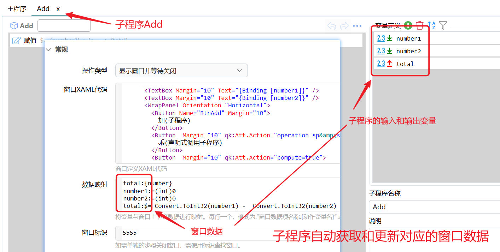
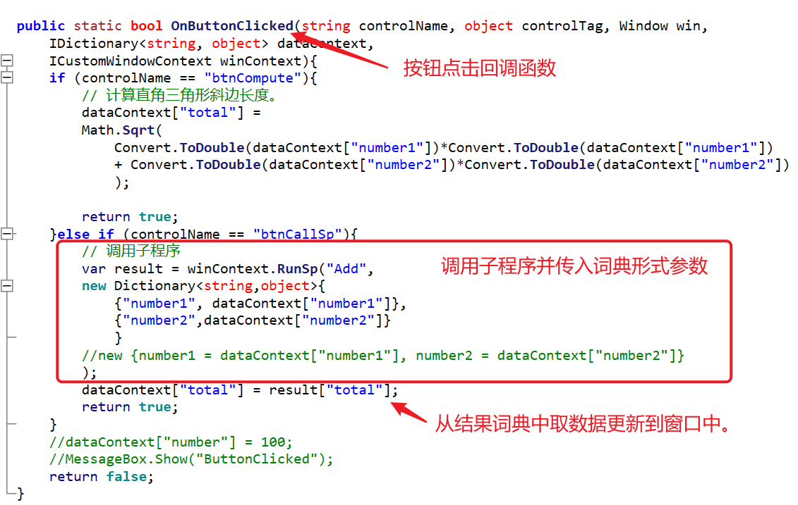

# 自定义窗口

用 XAML 画出 WPF 窗口，并做简单的数据绑定和事件。此功能仍是预览，可能有 bug 或改动。只要填表，用 [多字段表单](/v2/xaction/modules/form)。只要常驻按钮，用 [自定义操作窗](/v2/xaction/modules/custompanel)。要嵌网页，用 [WebView2浏览器窗口](/v2/xaction/modules/webview2)。

需要基本的 WPF 知识。界面较复杂时，建议先在 Visual Studio 里调通再迁到 Quicker。

## 当前模块定义

<XActionModuleMeta moduleKey="sys:customwindow" />

## 概述

换 **操作类型** 后显示对应参数。显示类操作要提供 XAML、数据映射和事件。

<ModuleParamPreview moduleKey="sys:customwindow" />

## 参数说明

**操作类型**：

- **显示窗口并等待关闭**：关掉窗口后再跑后面的步骤。默认。
- **显示窗口**：弹出后立刻继续。
- **关闭窗口**：按 **窗口标识** 关掉已打开的自定义窗口。
- **获取窗口列表**：取出当前自定义窗口对象列表。

**窗口XAML代码**：仅显示两类操作。示例：

```markup
<Window xmlns="http://schemas.microsoft.com/winfx/2006/xaml/presentation"
        xmlns:d="http://schemas.microsoft.com/expression/blend/2008"
        xmlns:x="http://schemas.microsoft.com/winfx/2006/xaml"
        xmlns:hc="https://handyorg.github.io/handycontrol"
        xmlns:mc="http://schemas.openxmlformats.org/markup-compatibility/2006"
        xmlns:qk="https://getquicker.net"
        Width="637"
        Height="556"
        Title="CalcWindow"
        mc:Ignorable="d">
  <Grid Margin="10">
    <StackPanel>
      <TextBox Margin="10" Text="{Binding [number1]}" />
      <TextBox Margin="10" Text="{Binding [number2]}" />
      <WrapPanel Orientation="Horizontal">
        <Button Name="BtnAdd" Margin="10">
          加(子程序)
        </Button>
        <Button  Margin="10" qk:Att.Action="operation=sp&amp;spname=Multiply">
          乘(声明式调用子程序)
        </Button>
        <Button  Margin="10" qk:Att.Action="compute=true">
          减(自动计算表达式)
        </Button>
        <Button Name="btnCompute"
                Margin="10"
                HorizontalAlignment="Center">
          直角三角形斜边长(C#代码)
        </Button>
        <Button Name="btnCallSp"
                Margin="10"
                HorizontalAlignment="Center">
          c#调用子程序
        </Button>

      </WrapPanel>

      <TextBlock Text="Total:" />
      <TextBlock Margin="10"
                 FontSize="40"
                 Foreground="Red"
                 Text="{Binding [total]}" />
      <Button Margin="10" qk:Att.Action="close:result" Style="{StaticResource ButtonPrimary}" Width="50">
        关闭
      </Button>
      <qk:OperationButtonList ButtonMargin="10"
                              OperationListStr="{Binding [buttons]}" />
    </StackPanel>
  </Grid>
</Window>
```

注意：

- 去掉 `x:Class`。
- XAML 里不能指定事件处理方法。
- 注册命名空间 `xmlns:qk="https://getquicker.net"`。

**数据映射**：把动作变量引进窗口。窗口数据存在一个词典里。

**情况 1**：关联动作变量，格式 `窗口数据:{动作变量}`。打开时从变量读入，关掉时写回。

**情况 2**：初始化一个内部数据项。

**情况 3**：用表达式动态计算内部数据项。

```text
# 情况1：关联动作变量
# 格式：窗口数据:{动作变量}
# 窗口建立时，从动作变量取值放入窗口数据。窗口结束时，将窗口数据中的内容写回动作变量
number:{number}
buttons:{buttons}

# 情况2：初始化一个内部数据项
number1:=(int)0
number2:=(int)0

# 情况3：动态计算一个内部数据项
total:$= Convert.ToInt32(number1) +  Convert.ToInt32(number2)
```

注意：

- 绑到文本框后，用户一改，该项往往会变成文本类型。
- 事先定好数据项名称，后期改名很麻烦。

**窗口标识**：内部 ID。单独一步「关闭窗口」时靠它查找。标识可以重复（相当于分组），新建同标识窗口时旧窗口不会自动关。需要时先用「关闭窗口」关掉旧的。

**辅助C#代码**：可选。回调参数：

- `win`：当前窗口
- `dataContext`：窗口数据词典
- `controlName`：被点按钮的 Name
- `controlTag`：被点按钮的 Tag

```csharp
using System.Text;
using System.Windows;
using System.Windows.Forms;
using System.Collections.Generic;
using MessageBox = System.Windows.Forms.MessageBox;
using Quicker.Public;

public static void OnWindowCreated(Window win, IDictionary<string, object> dataContext,
  ICustomWindowContext winContext
  ){
  dataContext["number1"] = 0;
  dataContext["number2"] = 0;
}

public static void OnWindowLoaded(Window win, IDictionary<string, object> dataContext,
  ICustomWindowContext winContext){
}

public static bool OnButtonClicked(string controlName, object controlTag, Window win,  	IDictionary<string, object> dataContext,
  ICustomWindowContext winContext){
  if (controlName == "btnCompute"){
    dataContext["total"] =
    Math.Sqrt(
      Convert.ToDouble(dataContext["number1"])*Convert.ToDouble(dataContext["number1"])
      + Convert.ToDouble(dataContext["number2"])*Convert.ToDouble(dataContext["number2"])
      );

    return true;
  }else if (controlName == "btnCallSp"){
    var result = winContext.RunSp("Add", new Dictionary<string,object>{{"number1", dataContext["number1"]}, {"number2",dataContext["number2"]}});
    dataContext["total"] = result["total"];
        return true;
  }
  return false;
}
```

**辅助C#引用DLL库**：辅助代码要引用的 DLL，每行一个。也可以在代码里用 `#r`。

**事件**：给按钮或数据项挂操作。格式：

```text
按钮名称.click:操作内容
菜单项名称.click:操作内容
窗口数据项.change:操作内容
```

操作内容见 [按钮点击的操作内容代码](#按钮点击的操作内容代码)。数据项变化可能连着触发，不要在里面做重活，也要避免循环改数据。

<ModuleParamPreview
  moduleKey="sys:customwindow"
  focusKeys={['type', 'events']}
  values={{
    type: 'ShowAndWaitClose',
    events: 'BtnAdd.click:operation=sp&spname=Add',
  }}
/>

**自动关闭时间(S)**：多少秒后自动关。`0` 不自动关。需大于 0.5 秒才生效。适合纯提示窗。

**激活模式**：

- **支持激活，打开时抢占焦点**：显示后立刻抢焦点。默认。
- **支持激活，打开时不抢占焦点**：显示时不抢，点到窗口后可以输入。
- **不支持激活（不占用焦点，仅能使用鼠标操作）**：不占焦点。要往别的软件发按键、取选中文本时常用。这种窗口不能在输入框里打字。
- **不支持激活，鼠标穿透**：不占焦点，鼠标点穿到后面。

不支持激活的窗口若抢了 Quicker 自己的焦点，可给要点的控件加 `Focusable="False"`。

**窗口位置**：跟随鼠标、屏幕各方位、全屏、最大化、自定义位置、系统默认。默认屏幕中间。

**窗口尺寸/位置**：与 **窗口位置** 配合。自定义位置时写坐标；其它情况写尺寸。可用百分比或像素，写法与 [自定义操作窗](/v2/xaction/modules/custompanel) 相同。

**失去焦点后关闭窗口**：仅窗口支持激活时有效。可选是、否，或「在未置顶时」。

**失败后停止**：失败是否中止。默认开启。

## 按钮事件

### 注册按钮事件

1. 在 **事件** 里写 `按钮名称.click:操作内容代码`。按钮必须有 Name。
2. 在 **辅助C#代码** 里写 `OnButtonClicked`，用 `controlName` / `controlTag` 区分控件。
3. 在 `OnWindowCreated` 或 `OnWindowLoaded` 里找到控件再挂事件：

```csharp
public static void OnWindowLoaded(Window win, IDictionary<string, object> dataContext,
  ICustomWindowContext winContext){
  var btnOk = (Button)win.FindName("BtnOK");
  btnOk.Click += (sender, args) => {
      // Handle the click.
  };
}
```

4. 在 XAML 里加附加属性 `qk:Att.Action="操作内容代码"`：

```markup
<Button Margin="10" qk:Att.Action="close:ok">
     关闭
</Button>
```

XAML 属性值里的特殊字符要转义（尤其是 `&`）：

| 特殊字符 | 字符实体 |
| --- | --- |
| 小于号 (`<`) | `&lt;` |
| 大于号 (`>`) | `&gt;` |
| **& 符号** | **`&amp;`** |
| 引号 (`"`) | `&quot;` |

### 按钮点击的操作内容代码

上面第 1、4 种写法可直接声明操作。

**关闭窗口**

- `close:`：关掉，**窗口结果** 为空。
- `close:result`：关掉并把 `result` 写到 **窗口结果**（换成你要返回的值）。

**其它操作**

用查询字符串，格式接近推送服务 / 连续搜索：

`operation=操作类型&data=URL编码后的内容&action=动作名称或id&close=是否关闭窗口&compute=是否更新计算字段&spname=子程序名`

各参数均可选。

- **operation**：
  - `copy`：把 data 写入剪贴板
  - `paste`：把 data 粘贴到目标窗口（当前自定义窗口不能占焦点）
  - `action`：跑动作，用 **action** 指定 ID 或名称
  - `open`：打开 data 里的路径或网址
  - `sendkeys`：按模拟按键 B 语法把 data 打到目标窗口（窗口不能占焦点）。1.27.3 前曾用 `input`，请改用 `sendkeys`
  - `inputtext`：模拟键入 data 文本（窗口不能占焦点）
  - `sp`：跑子程序，用 **spname** 指定名称。输入从窗口数据取（见 **数据映射**），输出按参数名写回窗口数据
- **data**：URL 编码后的待处理数据
- **action**：operation 为 `action` 时的动作 ID 或名称
- **close**：`true` / `false`，点完是否关窗
- **compute**：`true` / `false`，点完是否重算 **数据映射** 里的表达式

## 数据绑定

窗口的 DataContext 就是保存窗口数据的词典。控件属性可写成：

```markup
<TextBox Margin="10" Text="{Binding [number1]}" />
```

## 如何运行子程序

### 声明式调用

**方式 1：按钮附加属性**

```markup
<Button  Margin="10" qk:Att.Action="operation=sp&amp;spname=Multiply&amp;param1=value1">
          乘(声明式调用子程序)
        </Button>
```

- `operation=sp`：点完跑子程序
- `&amp;`：XAML 里的 `&`
- `spname=Multiply`：子程序名
- `param1=value1`：给子程序输入 `param1`

`qk:Att.Action` 调子程序时，还会传入 `__sender`、`__e`、`__control`，对应 click 的 sender、事件参数和 OriginSource。

**方式 2：在事件里写**

`BtnAdd.click:operation=sp&spname=Add` 表示点名为 BtnAdd 的按钮时跑 Add。

声明式调用时，子程序输入直接取自窗口数据，输出直接写回同名窗口数据。



上图里：窗口有 `number1`、`number2`、`total`；子程序 Add 对前两个求和写到 `total`；调用时 Quicker 从窗口取输入、把输出写回。

### 在 C# 里调用

在 **辅助C#代码** 的 `OnButtonClicked` 里按按钮名分支，再用 `winContext.RunSp`。



子程序会显示界面时，改用 `RunSpAsync(string spName, object inputParams)` 或 `RunSpAsync(string spName, IDictionary<string, object> inputParams)`，避免死锁。

- 第一个参数：子程序名称
- 第二个参数：词典。Key 是子程序参数名，Value 是要传入的值（不必对应某个窗口数据）。1.24.28+ 也可用匿名对象。
- 返回值是词典。

## 输出

- **是否成功**：操作是否成功。
- **窗口结果**：仅「显示窗口并等待关闭」「关闭窗口」。由 `close:result` 带回。
- **窗口对象列表**：仅「获取窗口列表」，类型为 `IList<Window>`。
- **窗口句柄**：仅「显示窗口」。
- **关闭时窗口位置**：仅「显示窗口并等待关闭」。

## 限制与排障

- 预览功能，接口可能变。
- 不占焦点的窗口不能在输入框里打字；要往其它软件发按键时，不要用「打开时抢占焦点」。
- 数据项 `.change` 可能连着触发，避免循环更新。
- 同标识旧窗口不会自动关，先关再开。
- 子程序要出界面时用 `RunSpAsync`，同步 `RunSp` 可能死锁。

## 示例

<ShareLinkCard
  code="3a524540-5fdb-4be9-aaef-08d920f42d24"
  title="自定义窗体测试"
  description="XAML 窗口、数据映射与子程序"
/>

## 相关链接

<RelatedDocs
  items={[
    {
      href: '/v2/xaction/modules/custompanel',
      label: '自定义操作窗',
      description: '常驻按钮窗，不用写 XAML。',
    },
    {
      href: '/v2/xaction/modules/form',
      label: '多字段表单',
      description: '填多项，不必自己画控件。',
    },
    {
      href: '/v2/xaction/modules/webview2',
      label: 'WebView2浏览器窗口',
      description: '嵌网页而不是 WPF。',
    },
    {
      href: '/v2/xaction/modules/csscript',
      label: '运行C#代码',
      description: '辅助 C# 之外的脚本步骤。',
    },
  ]}
/>

## 更新历史

- 20240909 修改错别字。
