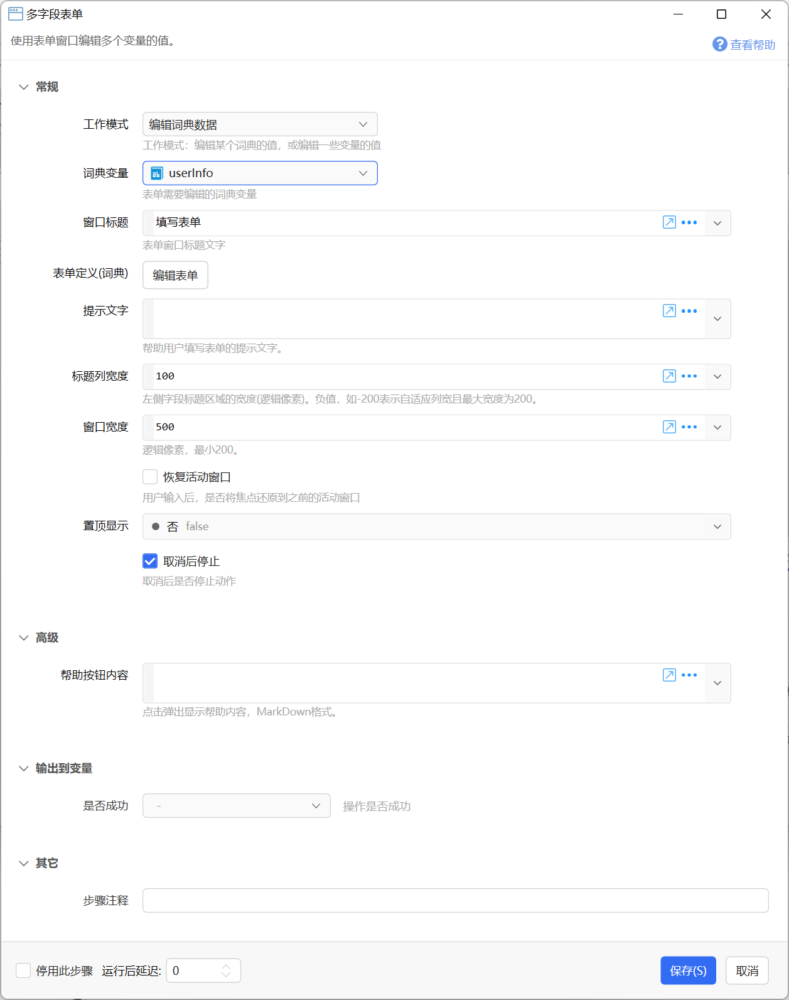

# 多字段表单

使用表单窗口编辑多个变量的值。

{/* xaction-metadata:start */}
## 当前模块定义

- 模块 Key：`sys:form`
- 分类：界面组件（`Ui`）
- 类型：`Action`
- 风险操作：否
- 专业版：否

## 输入参数

| Key | 名称 | 类型 | 默认值 | 必填 | 变量模式 | 条件 | 说明 |
| --- | --- | --- | --- | --- | --- | --- | --- |
| `operation` | 工作模式 | `Enum` | variables | 是 | `Input` |  | 工作模式：编辑某个词典的值，或编辑一些变量的值 |
| `dictVar` | 词典变量 | `Dict` |  | 否 | `UseVarOnly` | 仅：dict, dict_dynamic | 表单需要编辑的词典变量 |
| `title` | 窗口标题 | `Text` | 填写表单 | 是 | `UseVarOrInput` |  | 表单窗口标题文字 |
| `formDef` | 表单定义 | `Form` |  | 是 | `Input` | 仅：variables |  |
| `formForDictDef` | 表单定义(词典) | `FormForDict` |  | 是 | `Input` | 仅：dict |  |
| `dynamicFormForDictDef` | 表单定义(词典) | `Text` |  | 是 | `UseVarOrInput` | 仅：dict_dynamic | JSON格式的表单定义数据。格式说明请参考模块文档。 |
| `help` | 提示文字 | `Text` |  | 否 | `UseVarOrInput` |  | 帮助用户填写表单的提示文字。 |
| `titleColumnWidth` | 标题列宽度 | `Number` | 100 | 否 | `UseVarOrInput` |  | 左侧字段标题区域的宽度(逻辑像素)。负值，如-200表示自适应列宽且最大宽度为200。 |
| `windowWidth` | 窗口宽度 | `Number` | 500 | 是 | `UseVarOrInput` |  | 逻辑像素，最小400。 |
| `defaultInputWidth` | 输入框默认宽度 | `Number` | 0 | 是 | `UseVarOrInput` |  | 逻辑像素，0表示自动宽度。 |
| `windowHeight` | 窗口最大高度 | `Number` | 0 | 是 | `UseVarOrInput` |  | 逻辑像素，0表示默认。设置时请填写大于100的值。 |
| `topMost` | 置顶显示 | `Boolean` | false | 否 | `UseVarOrInput` |  |  |
| `restoreFocus` | 恢复活动窗口 | `Boolean` | false | 否 | `Input` |  | 用户输入后，是否将焦点还原到之前的活动窗口 |
| `markdownhelp` | 帮助按钮内容 | `Text` |  | 否 | `Input` |  | 点击弹出显示帮助内容，MarkDown格式。 |
| `confirm` | 自定义“确定”按钮标题 | `Text` |  | 否 | `Input` |  | 仅在需要时填写。使用"_字符"的形式定义触发字符,如"_S"表示Alt+S可直接触发按钮 |
| `customButtons` | 自定义按钮 | `Text` |  | 否 | `Input` |  | 使用"标题\|返回值"的形式定义按钮，多个按钮用换行分隔。 |
| `selectedGroup` | 选择的分组 | `Text` |  | 否 | `Input` |  | 使用分组标签页时，默认选择的分组。 |
| `disableEnterSubmit` | 关闭Enter提交表单功能 | `Boolean` | false | 否 | `Input` |  |  |
| `winLocation` | 窗口位置类型 | `Enum` | CenterScreen | 否 | `UseVarOrInput` |  | 在哪里显示选择窗口 |
| `winSize` | 位置 | `Text` |  | 否 | `Input` |  | 当 "窗口位置" 类型为 "自定义位置" 时用于指定显示位置，格式为：left,top,right,bottom |
| `stopIfFail` | 取消后停止 | `Boolean` | true | 否 | `Input` |  | 取消后是否停止动作 |

## 输出参数

| Key | 名称 | 类型 | 条件 | 说明 |
| --- | --- | --- | --- | --- |
| `isSuccess` | 是否成功 | `Boolean` |  | 操作是否成功 |
| `button` | 点击的按钮 | `Text` |  | 默认的确认按钮返回值为空，自定义按钮返回值为自定义的值。 |
| `selectedGroup` | 选择的分组 | `Text` |  | 关闭时所选择的标签页分组。 |

## 选项值

### `operation` 工作模式

| Value | 名称 | 说明 |
| --- | --- | --- |
| `variables` | 编辑动作变量的值 |  |
| `dict` | 编辑词典数据 |  |
| `dict_dynamic` | 编辑词典数据（动态） |  |

### `winLocation` 窗口位置类型

| Value | 名称 | 说明 |
| --- | --- | --- |
| `WithMouse1` | 跟随鼠标（指针周围） |  |
| `WithMouse2` | 跟随鼠标（指针右下） |  |
| `CenterScreen` | 屏幕中间 |  |
| `TopLeft` | 屏幕左上 |  |
| `TopCenter` | 屏幕中上 |  |
| `TopRight` | 屏幕右上 |  |
| `LeftCenter` | 屏幕左中 |  |
| `RightCenter` | 屏幕右中 |  |
| `BottomLeft` | 屏幕左下 |  |
| `BottomCenter` | 屏幕中下 |  |
| `BottomRight` | 屏幕右下 |  |
| `Manual` | 自定义位置 |  |
{/* xaction-metadata:end */}

## 概述

显示一个可以同时修改多个变量的表单窗口。如下图所示：


表单的每一行称为一个“**字段**”。每个字段用于修改一个变量的值或词典变量的某个键的值。

表单显示的时候，会自动加载变量的当前值。表单保存后将输入的值写入到变量中。

### 工作模式

**【编辑动作变量的值】**

用于编辑动作的某一些变量的值。显示表单时，会自动加载变量的当前值。表单保存后，会将修改后的值保存到变量。通常用于结合“作为状态使用”的变量，为动作创建[设置界面](/v2/xaction/concepts/store-settings)。

**【编辑词典数据】**（*自1.34.5版本增加。*）

用于修改词典变量的内部数据（某些键所对应的值）。

词典中需要事先存在表单中需要编辑的键值对。


**【编辑词典数据（动态）】**

在动作运行期间动态生成表单定义。

词典中需要事先存在表单中需要编辑的键值对。


### 使用

键盘使用：

-   Tab：跳转到下个控件
-   Shift+Tab：跳转到上个控件
-   Ctrl+Tab 或 Ctrl+↓：跳转到下一个字段
-   Ctrl+↑：跳转到上一个字段
-   Alt+S：保存
-   Alt+C、Esc：取消
-   Alt+R：重置表单内容


## 参数





【工作模式】选择用途：编辑变量，还是编辑某个词典的数据。

【词典变量】工作模式为“编辑词典数据”时，指定需要被编辑数据的词典类型变量。

【窗口标题】表单窗口的标题文字。

【表单定义】打开表单定义窗口设计表单。动态表单的数据定义格式请参考本文下面部分的章节。

【提示文字】显示在表单下方的提示文字。如果使用表达式动态生成提示文字内容，并且需要根据其它字段的值刷新显示，请在字段的“扩展设置”参数中增加指令`refresh_help`。

【标题列宽度】设置表单文本标题部分所占宽度。


【窗口宽度】表单窗口的整体宽度。

【置顶显示】是否自动置顶表单窗口。

【恢复活动窗口】在表单关闭后，是否将输入焦点恢复到显示表单之前的窗口上。

【取消后停止】取消表单后，是否停止动作的后续步骤。


## 设计表单


在步骤设置中，点击“编辑表单”按钮，即可打开表单编辑器窗口。


在此窗口中设定需要通过表单修改哪些变量的值（或词典键对应的值），以及输入方式、验证条件等信息。

表单设计窗口列出了所有的字段。

点击“添加字段”按钮，添加新的字段：


【动作变量】工作模式为“编辑动作变量的值”时，设定要编辑的变量名。

【词典的键名】工作模式为“编辑词典数据”时，指定要编辑词典的哪个**键**(key)对应的值。

【数据类型】工作模式为“编辑词典数据”时，指定词典键所对应的值的数据类型。例子：加入某个存储用户信息的词典，有“姓名”和“年龄”两个键，则它们对应的数据类型分别为 文本 和 数字。


【字段标题】显示在表单左侧的字段名称。

在标题文字中使用`_字母`可以为字段设置快捷定位按键，如`_A`，通过`Alt+A`即可快速将焦点设置到字段的输入框中。


【帮助提示】显示在输入框下方的提示文字。

【分组】字段较多时，可以按逻辑关联将某些字段放置在分组中。

可以在字段列表中选中多项，然后通过右键菜单快速修改分组。


【输入方式】设定使用哪种控件编辑值。

【验证表达式】输入方式为文本框时，对输入内容进行校验的正则表达式。

【最大长度】允许输入的最多字符数。

【数值范围】输入内容的最小值和最大值（可选）。

【文本选择工具】在输入框右侧显示的快捷选择按钮。

【可见性表达式】依据某些‘检查框’和‘下拉框’方式输入的字段值，更新当前字段的可见性。

-   操作类型为“编辑动作变量的值”时，可见性表达式中可以使用当前主程序或子程序的其它变量。如`$= {铃声模式变量} == "自定义"`中，`铃声模式变量`为另外一个变量。
-   操作类型为“编辑词典数据”时，可见性表达式中可以将其它词典键当做变量访问。如 `$= {铃声模式}.ToString()=="自定义"` 中，`铃声模式`为当前被编辑词典的另外一个键。

【控件宽度】可选。输入框宽度，为逻辑像素值（实际像素需要再乘以屏幕缩放比例）。

【不能为空】是否必须输入内容。

【扩展设置】一些特殊的指令用于控制输入控件的行为，多个指令时，每个占用一行。

-   可用于[设定自定义的文本选择工具](/v2/xaction/concepts/custom_texttool)等情况使用。
-   `refresh_items` 刷新选择类型输入框的可选值；
-   `refresh_help` 刷新字段帮助提示内容；
-   `height:80` 多行文本框输入方式，指定文本框的初始高度（1.43.2+）；
-   `depd:变量名1,变量名2...` 依据其它字段值变化重新计算当前字段值时，指定所依赖的字段；
-   `compute:表达式`依据其它字段自动计算当前字段的值时，指定计算表达式；
-   `notify_on_change`多行文本框输入方式，可在每次修改内容后立即触发表单刷新（而不需要等待丢失焦点）(1.43.3+)；


双击或点击后面的编辑按钮按钮可以修改字段。

### 动态生成下拉框字段的选项

在定义下拉选择等选择类型的选项可选值时，可以使用表达式或插值动态生成选项，如下图（1）标注所示。

如果需要在其它字段的内容变化后，动态更新可选值，请在扩展设置参数中增加指令`refresh_items`。

示例动作：[示例：表单刷新选项 - by CL - 动作信息 - Quicker](https://getquicker.net/Sharedaction?code=7ffbb877-da04-45dc-cdf6-08dc19b6971f)


### 个别字段根据其它字段自动计算值

如果希望一个字段的值根据其它字段的值自动计算，可以在字段 “扩展设置” 中添加行`compute:表达式`进行设置。表达式中可以引用其它字段变量。


设置`compute:表达式`后，默认情况下，在其它任意字段修改后此字段都会重新计算值。 这可能导致一些问题，如果B、C两个字段根据A字段自动计算，在允许用户手动修改这两个参数的值时，修改其中一个就会导致另一个被自动计算，从而造成手动填写的内容被覆盖。

为解决这个问题，可以增加一行`depd:变量名1,变量名2...`的规则。如设置B、C字段只依赖A字段变量，可以写作`depd:A`，这样在修改B或C其中一个的时候就不会导致另一个被重新计算覆盖掉了。（1.42.34+版本支持。）


示例动作：

-   [示例：表单自动计算字段值](https://getquicker.net/Sharedaction?code=d1043f3e-7c99-4677-cdf7-08dc19b6971f)


### 自定义文本选择工具

当内置的文本选择工具不能满足需求时，可参考文档《[为输入框设置自定义的文本选择工具](/v2/xaction/concepts/custom_texttool)》，使用子程序自定义新的文本选择工具。


### 分割线

当不选择动作变量时，可选择使用“分割线”输入方式，在表单中显示横线，以从视觉上将字段进行分组显示。


可以为分割线设置标题文字。

(1.38.38+版本)将分割线的字段标题设置为`[]`，可以隐藏分割线，只显示一个空白行。


## 动态表单定义数据

示例动作：[动态表单示例](https://getquicker.net/Sharedaction?code=02e52959-01b9-4f09-297a-08da62e9d954)


表单定义的输入为`Quicker.Public.Forms.FormField`对象列表的JSON数据格式。 也可以直接通过表达式返回`Quicker.Public.Forms.FormField`对象的列表，此时会自动生成json数据。

注意：动态表单因为无法进行事先的校验和数据限制，需要动作开发者自行保证数据合法、词典值的类型和输入方式匹配。

FormField类型的定义如下：

```

namespace Quicker.Public.Forms
{
    /// <summary>
    /// 表单字段
    /// </summary>
    public class FormField
    {

        /// <summary>
        /// 对应的变量
        /// </summary>
        public string FieldKey { get; set; }

        /// <summary>
        /// 对于编辑词典键值的情况，设定类型
        /// </summary>
        public VarType? DictVarType { get; set; }

        /// <summary>
        /// 字段名、标签
        /// </summary>
        public string Label { get; set; }

        /// <summary>
        /// 帮助文本
        /// </summary>
        public string HelpText { get; set; }

        /// <summary>
        /// 帮助链接
        /// </summary>
        public string HelpLink { get; set; }

        /// <summary>
        /// 输入方法
        /// </summary>
        public InputMethod InputMethod { get; set; }

        /// <summary>
        /// 选项内容。使用换行分隔多条。
        /// </summary>
        public string SelectionItems { get; set; }

        /// <summary>
        /// 是否必填
        /// </summary>
        public bool IsRequired { get; set; }

        /// <summary>
        /// 最小值
        /// </summary>
        public string MinValue { get; set; }

        /// <summary>
        /// 最大值
        /// </summary>
        public string MaxValue { get; set; }

        /// <summary>
        /// 验证规则表达式
        /// </summary>
        public string Pattern { get; set; }

        /// <summary>
        /// 最大长度
        /// </summary>
        public int MaxLength { get; set; } = 0;

        /// <summary>
        /// 输入法状态控制
        /// </summary>
        public string ImeState { get; set; }

        /// <summary>
        /// 文本选择工具：以英文半角逗号分隔的工具名。
        /// </summary>
        public string TextTools { get; set; }

        /// <summary>
        /// 可见性表达式
        /// </summary>
        public string VisibleExpression { get; set; }

        /// <summary>
        /// 分组名称
        /// </summary>
        public string Group { get; set; }

    }
}
```

其中，VarType的定义为（已去除一些在表单中不支持的类型，在Json中写对应的数字值）：

```
namespace Quicker.Public.Actions
{
    /// <summary>
    /// 参数类型
    /// </summary>
    public enum VarType
    {
        /// <summary>
        /// 文本
        /// </summary>
        [Display(Name = "文本", Order = 10)]
        Text = 0, //文本

        /// <summary>
        /// 数字（小数）
        /// </summary>
        [Display(Name = "数字(小数)", Order = 2)]
        Number = 1, // 数字

        /// <summary>
        /// 数字（整数）
        /// </summary>
        [Display(Name = "数字(整数)", Order = 3)]
        Integer = 12, //整数

        /// <summary>
        /// 布尔(是否)
        /// </summary>
        [Display(Name = "布尔(是否)", Order = 1)]
        Boolean = 2, //布尔


        /// <summary>
        /// 文本列表
        /// </summary>
        [Display(Name = "文本列表", Order = 21)]
        List = 4, //字符串列表


        /// <summary>
        /// 时间日期
        /// </summary>
        [Display(Name = "时间日期", Order = 11)]
        DateTime = 6, //日期时间
    }


}
```

InputMethod的定义（已去除一些在表单中不支持的类型，在Json中写对应的数字值）：

```
namespace Quicker.Public.Forms
{
    /// <summary>
    /// 输入方式
    /// </summary>
    public enum InputMethod
    {
        /// <summary>
        /// -无-
        /// </summary>
        [Display(Name = "-无-")]
        None = 0,

        /// <summary>
        /// 单行文本框
        /// </summary>
        [Display(Name = "单行文本框")]
        TextBox=1,

        /// <summary>
        /// 多行文本框
        /// </summary>
        [Display(Name = "多行文本框")]
        TextEditor = 2,

        /// <summary>
        /// 下拉选择框
        /// </summary>
        [Display(Name = "下拉选择")]
        DropDown = 3,

        /// <summary>
        /// 滑块
        /// </summary>
        [Display(Name = "滑块")]
        Slider = 4,

        /// <summary>
        /// 日期选择框
        /// </summary>
        [Display(Name = "日期选择")]
        DatePicker = 5,

        /// <summary>
        /// 检查框
        /// </summary>
        [Display(Name = "检查框")]
        CheckBox = 6,

        /// <summary>
        /// 数字输入框
        /// </summary>
        [Display(Name = "数字输入框")]
        NumberBox = 7,

        /// <summary>
        /// 多选下拉框
        /// </summary>
        [Display(Name = "多选下拉框")]
        CheckComboBox = 8,

        /// <summary>
        /// 颜色选择框
        /// </summary>
        [Display(Name = "颜色选择器")]
        ColorPicker = 9,

        /// <summary>
        /// 密码框
        /// </summary>
        [Display(Name = "密码框")]
        PasswordBox = 10,

        /// <summary>
        /// 带选择的文本框
        /// </summary>
        [Display(Name = "带选择的文本框")]
        EditableDropDown = 11,

        /// <summary>
        /// 字体选择器
        /// </summary>
        [Display(Name = "字体选择器")]
        FontFamilySelector = 12,

        /// <summary>
        /// 带选择的文本框(支持选项筛选)
        /// </summary>
        [Display(Name = "带选择的文本框(支持选项筛选)")]
        EditableAutoCompleteDropDown = 13,

        [Display(Name = "键-值对编辑器")]
        DictEditor = 14,

        [Display(Name = "显示文本(只读)")]
        DisplayText = 41,

        [Display(Name = "分隔线")]
        Separator = 100
    }
}
```

文本选择工具，Json中为以英文半角逗号分隔的工具名，如`EditInCodeWindow,SelectProcessPath`，可选值如下：

```
namespace Quicker.Modules.TextTools
{
    /// <summary>
    /// 输入框工具类型
    /// </summary>
    public enum TextToolType
    {
        Na, //不支持的选项

        [Display(Name = "在编辑器中修改")]
        EditInCodeWindow, //在代码窗口中编辑

        [Display(Name = "选择一个文件")]
        SelectSingleFile, //选择一个文件的路径

        [Display(Name = "选择多个文件")]
        SelectMultiFile, //选择多个文件路径

        [Display(Name = "选择文件夹")]
        SelectSingleFolder, //选择一个文件夹
        //SelectMultipleFolder, //选择多个文件夹

        [Display(Name = "选择窗口并获取进程的路径")]
        SelectProcessPath, //选择进程的完整路径

        [Display(Name = "选择窗口并获取进程名称")]
        SelectProcessName, //选择进程名称

        [Display(Name = "选择窗口并获取标题")]
        SelectWindowTitle, //选择窗口名称

        [Display(Name = "选择窗口并获取其类名")]
        SelectWindowClass, //选择窗口类

        [Display(Name = "选择屏幕位置")]
        SelectLocationPoint, //选择位置

        [Display(Name = "选择屏幕区域")]
        SelectLocationArea,     //选择区域

        [Display(Name = "选择屏幕颜色")]
        SelectColor,        //选择屏幕颜色

        [Display(Name = "选择颜色(#RRGGBB)")]
        ColorPicker,        //颜色选择器

        [Display(Name = "选择颜色(#AARRGGBB)")]
        ColorPickerArgb,        //颜色选择器

        [Display(Name = "截图")]
        CaptureToFile, //截图并保存到图片

        [Display(Name = "选择图标")]
        SelectIcon,         //选择图标

        [Display(Name = "输入并获取键名")]
        SelectKeyName,      // 按键名称（System.Windows.Forms.Keys)

        [Display(Name = "输入并获取'模拟按键B'的值")]
        SelectSendKeysData, // 选择模拟按键B的键值

        [Display(Name = "输入并获取虚拟键码数字")]
        SelectKeyCode, // 选择模拟按键B的键值

        [Display(Name = "选择动作ID")]
        SelectActionId,

        [Display(Name = "选择动作名称")]
        SelectActionName,

        [Display(Name = "选择控件XPath")]
        SelectControlXPath,

        [Display(Name = "布尔表达式助手")]
        BoolExpressionHelper,
        //[Display(Name= "Wpf窗体设计器")]
        //WindowDesigner,

        [Display(Name = "选择保存路径")]
        SelectSavePath, //选择一个文件夹

        [Display(Name = "选择窗口句柄")]
        SelectWindowHandle, //选择窗口句柄

        [Display(Name = "选择场景标识")]
        SelectProfileExe,

        [Display(Name = "操作项编辑器")]
        OperationItemEditor,

        [Display(Name = "选择蓝牙设备")]
        SelectBluetoothDevice,

        [Display(Name = "选择蓝牙低功耗设备")]
        SelectBluetoothLEDevice,

        [Display(Name = "选择网络连接")]
        SelectNetworkProfile,


        [Display(Name = "选择窗口位置")]
        SelectRelativePoint, //选择位置

        [Display(Name = "获取网页元素CSS选择器")]
        SelectWebElementSelector,

        [Display(Name = "子程序选择工具")]
        Custom = 1020,

        [Display(Name = "扩展选择菜单")]
        ExtraSelectMenu = 1024,
    }
}
```


### 注意事项

编辑词典数据时，可以通过使用变量的方式访问词典的其它key对应的值。

如，在“可见性表达式”中，`$= {key1} == "value1"`表示词典的key1键对应的值为value1时，本字段可见。此时因为无法获知词典里有哪些键，编辑框可能会有波浪线提示，忽略即可。

此时如果需要访问动作本身的变量，可以在表达式中通过这样的方式访问：

`**$=**_context.**GetRootContext**().**GetVarValue**("变量名")`


## 更新历史

-   1.5.7 增加提示文字参数。
-   1.34.5 增加分组、编辑词典内容等功能。
-   20230326 增加控件宽度说明、编辑词典时使用动作变量的说明。
-   20230802 增加分割线说明。
-   20240223 增加动态更新选项、计算字段值的说明。
-   20240504 1.42.34 自动计算时，通过depd限制依赖的字段。
-   20240526 增加字段标题中使用快捷定位按键的说明。
-   20240618 完善对扩展设置参数的说明。
