# 多字段表单

弹出表单窗口，一次改多个变量或词典里的多个键。只要填一项，用 [用户输入](/v2/xaction/modules/userinput)。要点按钮反复操作且不关窗，用 [自定义操作窗](/v2/xaction/modules/custompanel)。要自己画 WPF 界面，用 [自定义窗口](/v2/xaction/modules/customwindow)。

## 当前模块定义

<XActionModuleMeta moduleKey="sys:form" />

## 概述

每一行是一个**字段**，对应一个动作变量，或词典里的一个键。打开时加载当前值，保存后写回。常和「作为状态使用」的变量一起做 [设置界面](/v2/xaction/concepts/store-settings)。

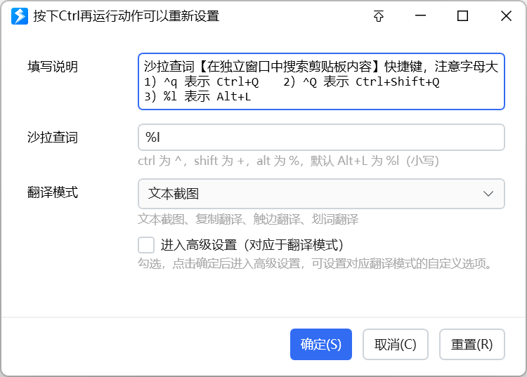

<ModuleParamPreview moduleKey="sys:form" />

键盘：

- Tab / Shift+Tab：下一个 / 上一个控件
- Ctrl+Tab 或 Ctrl+↓ / Ctrl+↑：下一个 / 上一个字段
- Alt+S：保存
- Alt+C、Esc：取消
- Alt+R：重置

## 参数说明

**工作模式**：

- **编辑动作变量的值**：改本动作（或子程序）里的变量。打开时读当前值，保存后写回。
- **编辑词典数据**（1.34.5+）：改词典变量里已有键的值。词典里要先有这些键。
- **编辑词典数据（动态）**：运行时用 JSON 或表达式生成表单定义。词典里同样要先有这些键。

<ModuleParamPreview
  moduleKey="sys:form"
  values={{
    operation: 'dict',
    title: '填写表单',
    titleColumnWidth: '100',
    windowWidth: '500',
    restoreFocus: 'false',
    topMost: 'false',
    stopIfFail: 'true',
  }}
  inputVars={{dictVar: 'userInfo'}}
/>

**词典变量**：仅词典两种模式。要编辑的词典类型变量。


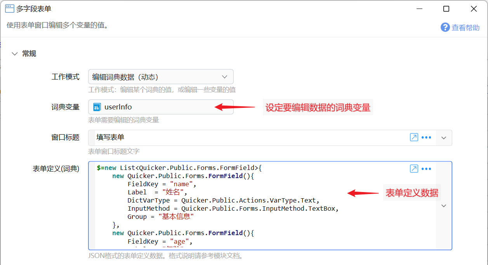

**窗口标题**：标题栏文字，默认「填写表单」。

**表单定义** / **表单定义(词典)**：点「编辑表单」打开设计器。变量模式用 **表单定义**；词典模式用 **表单定义(词典)**；动态模式用 JSON，见 [动态表单定义](#动态表单定义数据)。

**提示文字**：表单下方说明。若用表达式生成，并要随其它字段刷新，在字段「扩展设置」里加 `refresh_help`。

**标题列宽度**：左侧标题区宽度（逻辑像素），默认 `100`。负值如 `-200` 表示自适应，最大 200。

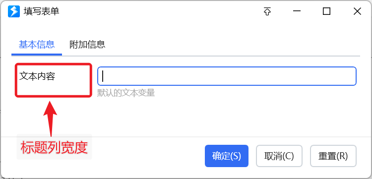

**窗口宽度**：整体宽度（逻辑像素），默认 `500`，最小 400。

**输入框默认宽度**：逻辑像素，`0` 表示自动。

**窗口最大高度**：逻辑像素，`0` 表示默认。要限制高度请填大于 100 的值。

**置顶显示**：是否置顶。默认关闭。

**恢复活动窗口**：关掉表单后，是否把焦点还回打开前的窗口。默认关闭。

**帮助按钮内容**：点帮助按钮弹出的 Markdown。空则不显示帮助按钮。

**自定义“确定”按钮标题**：仅必要时填。用 `_字符` 设快捷键，如 `_S` 表示 Alt+S。

**自定义按钮**：每行一个 `标题|返回值`。点自定义按钮后，输出 **点击的按钮** 为对应返回值。

**选择的分组**：用分组标签页时，打开时默认选中的分组。关掉时也会输出当前分组。

**关闭Enter提交表单功能**：开启后按 Enter 不会提交。默认关闭。

**窗口位置类型**：屏幕各方位、跟随鼠标，或自定义位置。默认屏幕中间。

**位置**：仅「自定义位置」时填 `left,top,right,bottom`。

**取消后停止**：用户取消后是否中止动作。默认开启。

## 设计表单

在步骤里点「编辑表单」，打开表单设计器，设定要改哪些变量（或词典键）、输入方式和校验。


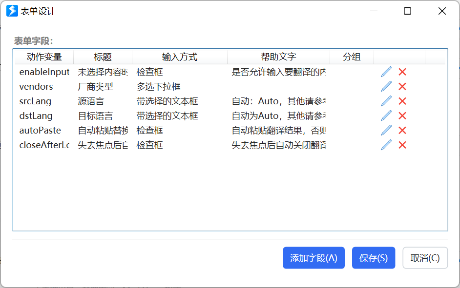

点「添加字段」新增一行：

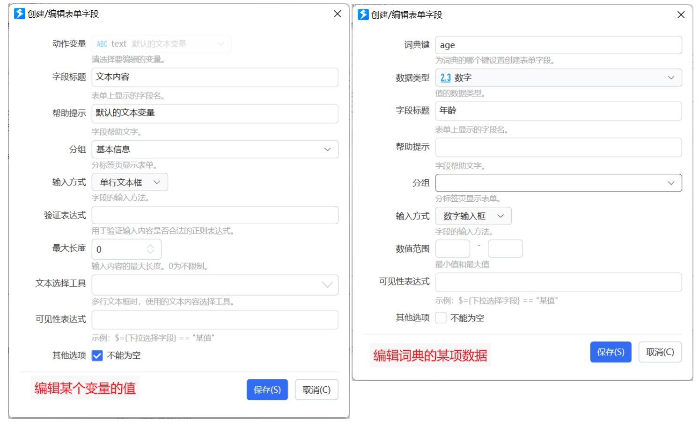

**动作变量**：变量模式时，要编辑的变量名。

**词典的键名**：词典模式时，要编辑的键。

**数据类型**：词典模式时，该键的类型。例如用户信息词典里「姓名」是文本、「年龄」是数字。

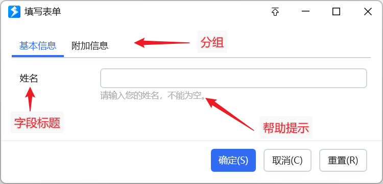

**字段标题**：左侧名称。标题里写 `_字母` 可设定位快捷键，如 `_A` 对应 Alt+A。

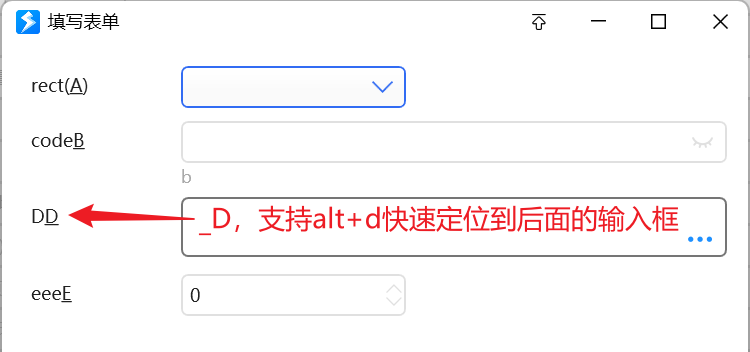

**帮助提示**：输入框下方说明。

**分组**：字段多时按逻辑分组。可在列表里多选，再用右键改分组。

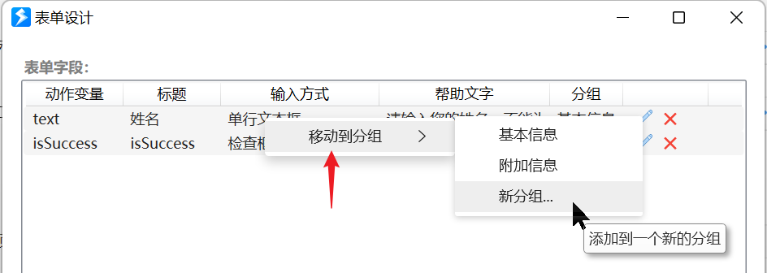

**输入方式**：用哪种控件改值。

**验证表达式**：文本框时校验用的正则。

**最大长度**：最多允许的字符数。

**数值范围**：可选的最小 / 最大值。

**文本选择工具**：输入框右侧的快捷选择按钮。

**可见性表达式**：根据其它「检查框」「下拉框」字段决定本字段是否显示。

- 变量模式：可用本程序或子程序的其它变量：

  ```text
  $= {铃声模式变量} == "自定义"
  ```

- 词典模式：把其它词典键当变量：

  ```text
  $= {铃声模式}.ToString()=="自定义"
  ```

**控件宽度**：可选。输入框宽度（逻辑像素，再乘屏幕缩放）。

**不能为空**：是否必填。

**扩展设置**：每行一条指令，控制控件行为。

- 可配合 [自定义文本选择工具](/v2/xaction/concepts/custom_texttool)
- `refresh_items`：刷新选择类控件的可选值
- `refresh_help`：刷新字段帮助提示
- `height:80`：多行文本框初始高度（1.43.2+）
- `depd:变量名1,变量名2...`：按其它字段重算本字段时，声明依赖
- `compute:表达式`：按其它字段自动计算本字段
- `notify_on_change`：多行文本框每次改内容就刷新表单，不必等失焦（1.43.3+）

双击字段或点后面的编辑按钮可改字段。

### 动态生成下拉框选项

选择类字段的可选值可用表达式或插值生成。其它字段变化后要更新选项，在扩展设置里加 `refresh_items`。

<ShareLinkCard
  code="7ffbb877-da04-45dc-cdf6-08dc19b6971f"
  title="示例：表单刷新选项"
  description="其它字段变化后刷新下拉选项"
  author="CL"
/>

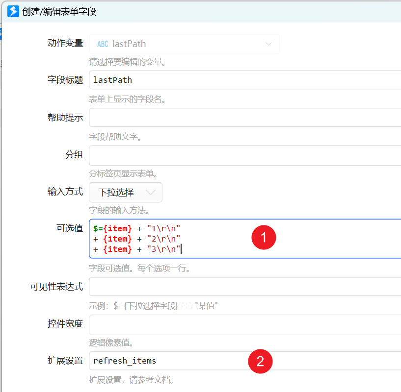

### 按其它字段自动计算

在扩展设置加 `compute:表达式`，表达式里可引用其它字段。默认任意字段一改就会重算。若 B、C 都按 A 计算，用户改 B 时 C 也会被覆盖。

加一行 `depd:变量名1,变量名2...` 可限制依赖。例如 B、C 都写 `depd:A`，改 B 就不会重算 C（1.42.34+）。

<ShareLinkCard
  code="d1043f3e-7c99-4677-cdf7-08dc19b6971f"
  title="示例：表单自动计算字段值"
  description="用 compute / depd 按其它字段计算"
/>

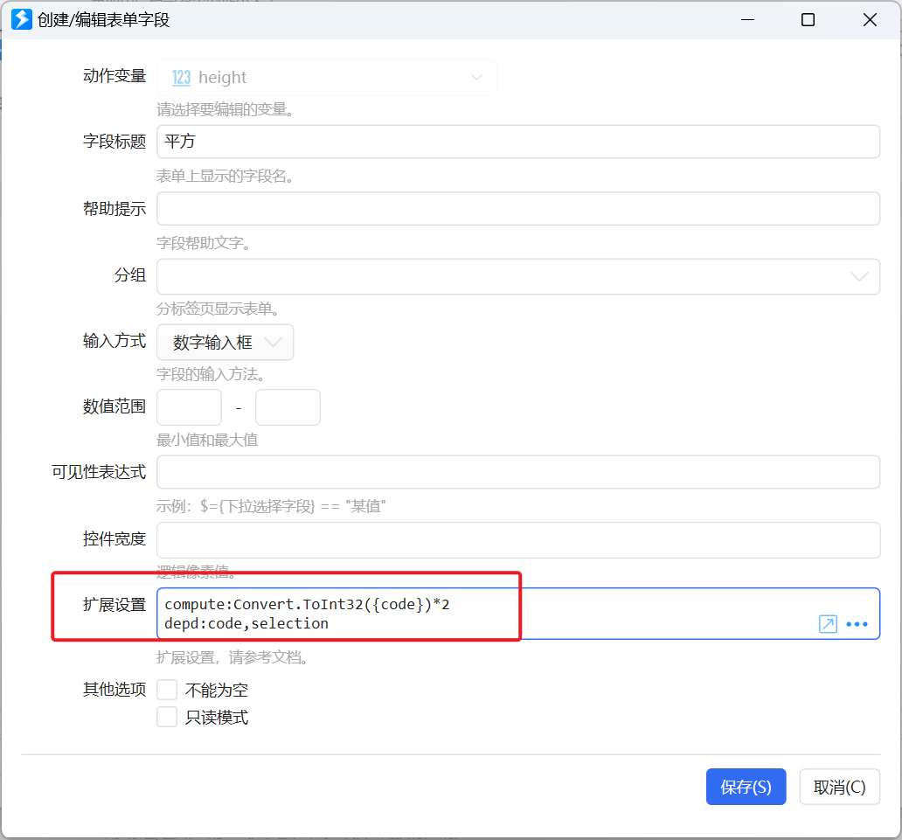

### 自定义文本选择工具

内置工具不够时，见 [为输入框设置自定义的文本选择工具](/v2/xaction/concepts/custom_texttool)，用子程序做新工具。

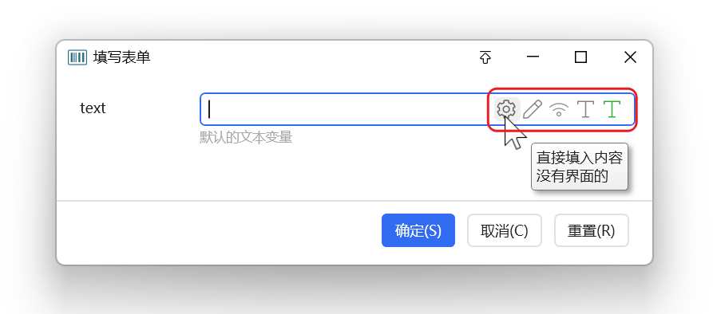

### 分割线

不选动作变量时，输入方式可选「分割线」，用来在视觉上分组。

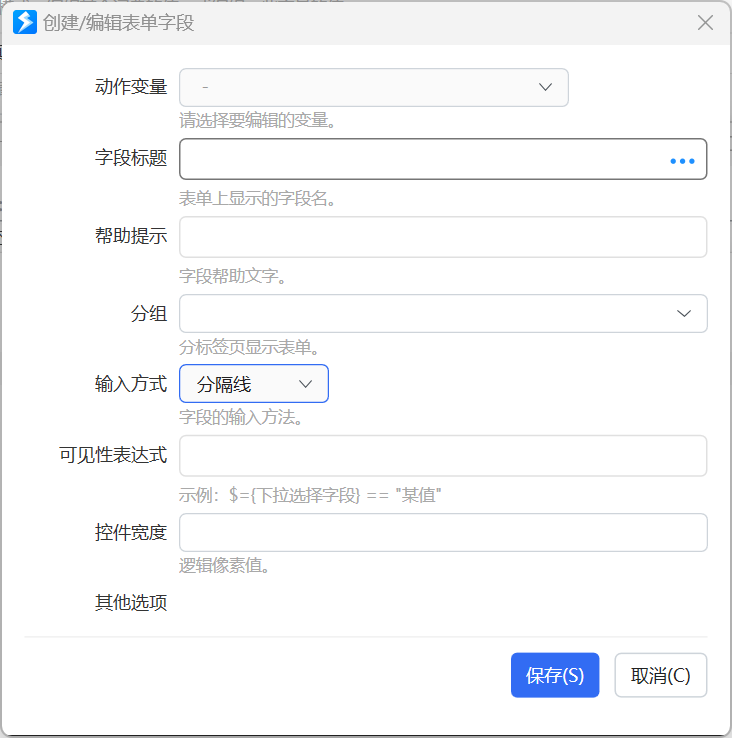

可给分割线设标题。1.38.38+ 把标题设为 `[]`，只留空白行、不画横线。

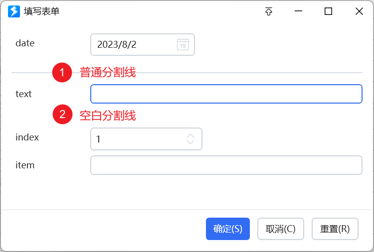

## 动态表单定义数据

<ShareLinkCard
  code="02e52959-01b9-4f09-297a-08da62e9d954"
  title="动态表单示例"
  description="运行时生成表单定义"
/>

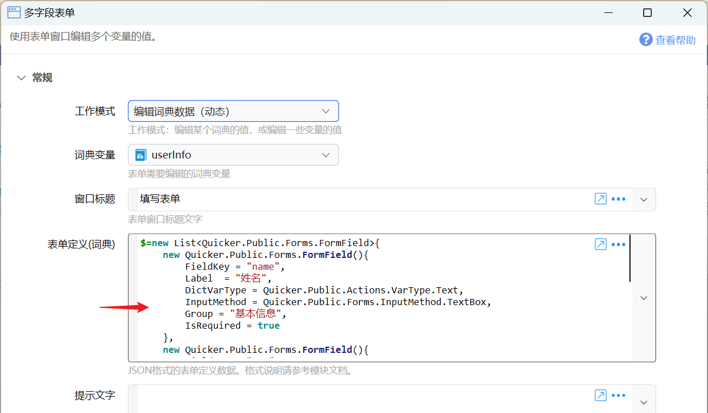

**表单定义(词典)** 在动态模式里填 `Quicker.Public.Forms.FormField` 列表的 JSON。也可以用表达式直接返回该对象列表，会自动转成 JSON。

动态表单事先不能做完整校验，需要自己保证数据合法，并且词典值类型和输入方式匹配。

`FormField` 定义：

```csharp
namespace Quicker.Public.Forms
{
    /// <summary>
    /// Form field
    /// </summary>
    public class FormField
    {
        /// <summary>
        /// Bound variable or dict key
        /// </summary>
        public string FieldKey { get; set; }

        /// <summary>
        /// Value type when editing a dict key
        /// </summary>
        public VarType? DictVarType { get; set; }

        /// <summary>
        /// Field label
        /// </summary>
        public string Label { get; set; }

        /// <summary>
        /// Help text
        /// </summary>
        public string HelpText { get; set; }

        /// <summary>
        /// Help link
        /// </summary>
        public string HelpLink { get; set; }

        /// <summary>
        /// Input method
        /// </summary>
        public InputMethod InputMethod { get; set; }

        /// <summary>
        /// Options, one per line
        /// </summary>
        public string SelectionItems { get; set; }

        /// <summary>
        /// Required
        /// </summary>
        public bool IsRequired { get; set; }

        public string MinValue { get; set; }
        public string MaxValue { get; set; }
        public string Pattern { get; set; }
        public int MaxLength { get; set; } = 0;
        public string ImeState { get; set; }

        /// <summary>
        /// Text tools, comma-separated names
        /// </summary>
        public string TextTools { get; set; }

        public string VisibleExpression { get; set; }
        public string Group { get; set; }
    }
}
```

`VarType`（表单不支持的类型已去掉，JSON 里写数字）：

```csharp
namespace Quicker.Public.Actions
{
    public enum VarType
    {
        [Display(Name = "文本", Order = 10)]
        Text = 0,
        [Display(Name = "数字(小数)", Order = 2)]
        Number = 1,
        [Display(Name = "数字(整数)", Order = 3)]
        Integer = 12,
        [Display(Name = "布尔(是否)", Order = 1)]
        Boolean = 2,
        [Display(Name = "文本列表", Order = 21)]
        List = 4,
        [Display(Name = "时间日期", Order = 11)]
        DateTime = 6,
    }
}
```

`InputMethod`（同样只保留表单支持的项，JSON 写数字）：

```csharp
namespace Quicker.Public.Forms
{
    public enum InputMethod
    {
        [Display(Name = "-无-")]
        None = 0,
        [Display(Name = "单行文本框")]
        TextBox = 1,
        [Display(Name = "多行文本框")]
        TextEditor = 2,
        [Display(Name = "下拉选择")]
        DropDown = 3,
        [Display(Name = "滑块")]
        Slider = 4,
        [Display(Name = "日期选择")]
        DatePicker = 5,
        [Display(Name = "检查框")]
        CheckBox = 6,
        [Display(Name = "数字输入框")]
        NumberBox = 7,
        [Display(Name = "多选下拉框")]
        CheckComboBox = 8,
        [Display(Name = "颜色选择器")]
        ColorPicker = 9,
        [Display(Name = "密码框")]
        PasswordBox = 10,
        [Display(Name = "带选择的文本框")]
        EditableDropDown = 11,
        [Display(Name = "字体选择器")]
        FontFamilySelector = 12,
        [Display(Name = "带选择的文本框(支持选项筛选)")]
        EditableAutoCompleteDropDown = 13,
        [Display(Name = "键-值对编辑器")]
        DictEditor = 14,
        [Display(Name = "显示文本(只读)")]
        DisplayText = 41,
        [Display(Name = "分隔线")]
        Separator = 100
    }
}
```

**文本选择工具**：JSON 里用英文逗号分隔工具名，如 `EditInCodeWindow,SelectProcessPath`。可选值：

```csharp
namespace Quicker.Modules.TextTools
{
    public enum TextToolType
    {
        Na,
        [Display(Name = "在编辑器中修改")]
        EditInCodeWindow,
        [Display(Name = "选择一个文件")]
        SelectSingleFile,
        [Display(Name = "选择多个文件")]
        SelectMultiFile,
        [Display(Name = "选择文件夹")]
        SelectSingleFolder,
        [Display(Name = "选择窗口并获取进程的路径")]
        SelectProcessPath,
        [Display(Name = "选择窗口并获取进程名称")]
        SelectProcessName,
        [Display(Name = "选择窗口并获取标题")]
        SelectWindowTitle,
        [Display(Name = "选择窗口并获取其类名")]
        SelectWindowClass,
        [Display(Name = "选择屏幕位置")]
        SelectLocationPoint,
        [Display(Name = "选择屏幕区域")]
        SelectLocationArea,
        [Display(Name = "选择屏幕颜色")]
        SelectColor,
        [Display(Name = "选择颜色(#RRGGBB)")]
        ColorPicker,
        [Display(Name = "选择颜色(#AARRGGBB)")]
        ColorPickerArgb,
        [Display(Name = "截图")]
        CaptureToFile,
        [Display(Name = "选择图标")]
        SelectIcon,
        [Display(Name = "输入并获取键名")]
        SelectKeyName,
        [Display(Name = "输入并获取'模拟按键B'的值")]
        SelectSendKeysData,
        [Display(Name = "输入并获取虚拟键码数字")]
        SelectKeyCode,
        [Display(Name = "选择动作ID")]
        SelectActionId,
        [Display(Name = "选择动作名称")]
        SelectActionName,
        [Display(Name = "选择控件XPath")]
        SelectControlXPath,
        [Display(Name = "布尔表达式助手")]
        BoolExpressionHelper,
        [Display(Name = "选择保存路径")]
        SelectSavePath,
        [Display(Name = "选择窗口句柄")]
        SelectWindowHandle,
        [Display(Name = "选择场景标识")]
        SelectProfileExe,
        [Display(Name = "操作项编辑器")]
        OperationItemEditor,
        [Display(Name = "选择蓝牙设备")]
        SelectBluetoothDevice,
        [Display(Name = "选择蓝牙低功耗设备")]
        SelectBluetoothLEDevice,
        [Display(Name = "选择网络连接")]
        SelectNetworkProfile,
        [Display(Name = "选择窗口位置")]
        SelectRelativePoint,
        [Display(Name = "获取网页元素CSS选择器")]
        SelectWebElementSelector,
        [Display(Name = "子程序选择工具")]
        Custom = 1020,
        [Display(Name = "扩展选择菜单")]
        ExtraSelectMenu = 1024,
    }
}
```

编辑词典时，可见性表达式里可把其它键当变量：

```text
$= {key1} == "value1"
```

编辑器可能画波浪线，忽略即可。要访问动作本身的变量：

```text
$= _context.GetRootContext().GetVarValue("变量名")
```

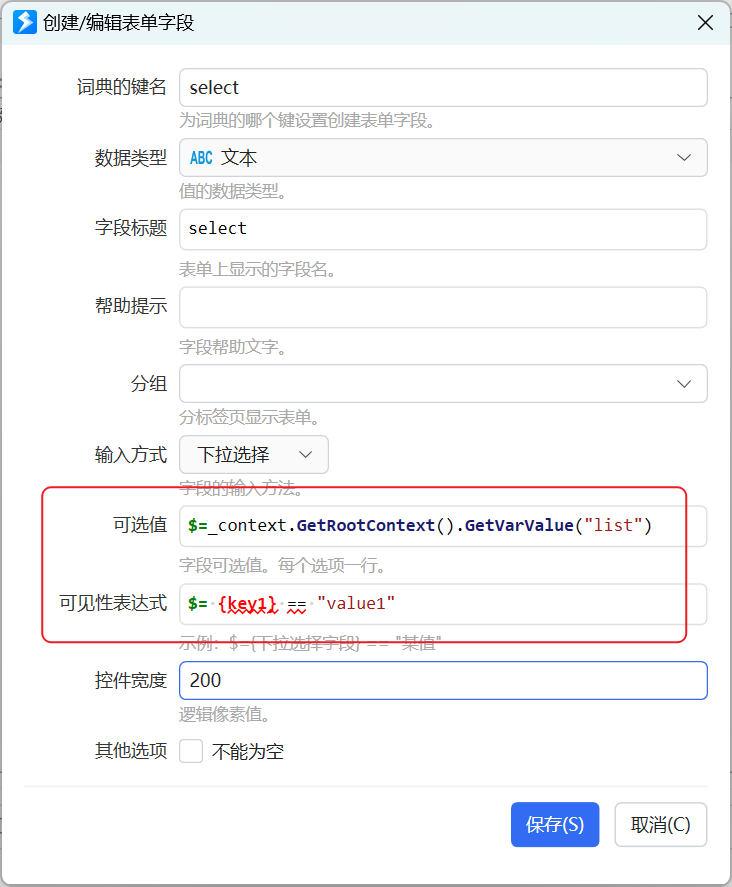

## 输出

- **是否成功**：用户是否保存（未取消）。
- **点击的按钮**：默认确定按钮为空；自定义按钮为你写的返回值。
- **选择的分组**：关闭时选中的标签页分组。

## 限制与排障

- 词典两种模式都要求键事先存在，表单不会自动往词典里加键。
- 动态表单不会预先校验，类型和输入方式对不上会出错。
- 表达式里访问词典键时编辑器可能报波浪线，不影响运行。
- 自动计算把手动填写覆盖掉时，给计算字段加上 `depd:`。

## 相关链接

<RelatedDocs
  items={[
    {
      href: '/v2/xaction/modules/userinput',
      label: '用户输入',
      description: '一次只收一个值。',
    },
    {
      href: '/v2/xaction/concepts/store-settings',
      label: '用变量做设置界面',
      description: '表单常和状态变量一起用。',
    },
    {
      href: '/v2/xaction/concepts/custom_texttool',
      label: '自定义文本选择工具',
      description: '给字段加自己的拾取按钮。',
    },
    {
      href: '/v2/xaction/modules/textselecttools',
      label: '辅助选择工具',
      description: '同一套拾取器，不先出表单。',
    },
    {
      href: '/v2/xaction/modules/custompanel',
      label: '自定义操作窗',
      description: '常驻按钮窗，点完不关。',
    },
  ]}
/>

## 更新历史

- 1.5.7 增加提示文字参数。
- 1.34.5 增加分组、编辑词典内容等功能。
- 20230326 增加控件宽度说明、编辑词典时使用动作变量的说明。
- 20230802 增加分割线说明。
- 20240223 增加动态更新选项、计算字段值的说明。
- 20240504 1.42.34 自动计算时，通过 depd 限制依赖的字段。
- 20240526 增加字段标题中使用快捷定位按键的说明。
- 20240618 完善对扩展设置参数的说明。
