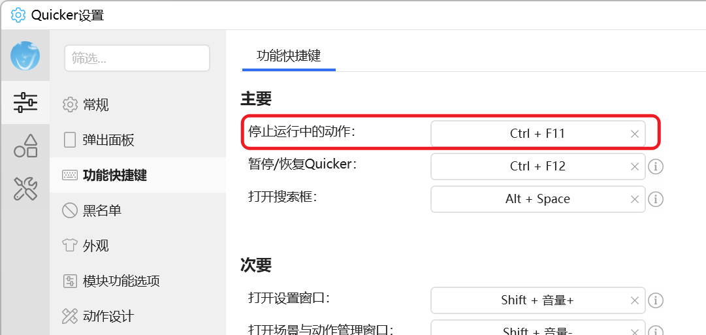

# 重放键鼠操作

回放 [录制键鼠操作](/v2/xaction/modules/record) 或托盘「键鼠录制工具」录下的数据。

## 当前模块定义

<XActionModuleMeta moduleKey="sys:playRecords" />

## 概述

坐标是绝对坐标。窗口位置、分辨率、输入法和录制时不一致时，重放容易失败。

<ModuleParamPreview moduleKey="sys:playRecords" />

中止重放：在设置里配好「停止运行中的动作」快捷键，重放时按下即可。



## 参数说明

**录制数据**：录制模块或录制工具输出的文本。

**重放速度**：`1` 为原始速度，`1.5` 更快。默认 `2`。

## 录制数据格式

`//` 开头的行是注释，会被忽略。其余每行一次操作，用分号和 Tab 分成三部分：

1. 距上一步的毫秒数。重放时会再除以重放速度。
2. 操作类型。
3. 该类型的参数。

```text
816;	MC;	Left,693,2130,1;
559;	MC;	Left,1531,1274,1;
707;	KP;	Space;
207;	KD;	LShiftKey;
184;	KP;	H;
59;	KU;	LShiftKey;
```

操作类型：

| 类型 | 含义 |
| --- | --- |
| MV | 鼠标移动 |
| MD | 鼠标按下 |
| MC | 鼠标点击（按下+抬起） |
| MU | 鼠标抬起 |
| MH | 水平滚轮 |
| MW | 垂直滚轮 |
| DL | 等待（无操作） |
| KD | 键盘按下 |
| KU | 键盘抬起 |
| KP | 按键按下+抬起 |
| MVD | 移动相对距离（1.10.12+） |

鼠标事件参数：`按键,X,Y,滚动click数`。X/Y 留空或 `-99999` 表示不移动；按键留空表示 None。

- `100; MVD; None,-10,0,0;`：100ms 后向左移 10 像素
- `0; MW;None,0,0,-30`：滚轮

键盘事件参数是键名，见 [Keys 枚举](https://docs.microsoft.com/en-us/dotnet/api/system.windows.forms.keys?view=netframework-4.8)。

## 限制与排障

- 环境与录制时不一致就会点偏或输入错。
- 重放过程中只能靠「停止运行中的动作」快捷键打断。

## 相关链接

<RelatedDocs
  items={[
    {
      href: '/v2/xaction/modules/record',
      label: '录制键鼠操作',
      description: '生成这里要回放的数据。',
    },
    {
      href: '/v2/xaction/modules/inputscript',
      label: '多步骤输入',
      description: '可维护的替代方案。',
    },
  ]}
/>

## 更新历史

- 20240711 增加注释语法说明。
