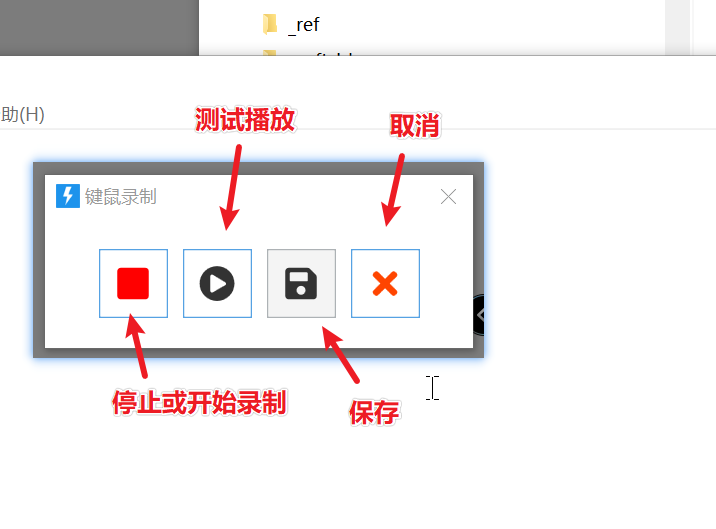
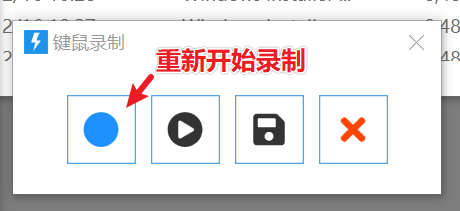

# 录制键鼠操作

录制键盘和鼠标操作，输出一段数据，再用 [重放键鼠操作](/v2/xaction/modules/playrecord) 回放。本功能为测试功能，可能调整或取消。

## 当前模块定义

<XActionModuleMeta moduleKey="sys:record" />

## 概述

坐标是绝对坐标。重放成败取决于窗口位置、屏幕分辨率、输入法等是否和录制时一致，只适合特定环境。

<ModuleParamPreview moduleKey="sys:record" />

运行到本步骤后，会按「准备时间」倒计时，然后在屏幕右下角显示录制控制窗口。

点停止结束录制，可先测试重放，确认后再保存。不理想就点第一个按钮重新录。

也可以用托盘菜单里的「键鼠录制工具」录。

## 参数说明

**自动开始录制**：倒计时结束后是否自动开始。默认开启。

**录制鼠标移动过程**：是否记下点击之间的移动轨迹。默认开启；一般关掉，只记点击位置即可。

**准备时间**：开始前的倒计时秒数，支持小数。默认 2。

**失败后停止**：取消录制后是否中止动作。默认开启。

## 输出

- **是否成功**：是否完成了录制。
- **录制数据**：交给「重放键鼠操作」使用。

## 限制与排障

- 绝对坐标，换分辨率、窗口位置或输入法后重放容易失败。
- 含这类步骤的动作不要当通用动作分发。

## 相关链接

<RelatedDocs
  items={[
    {
      href: '/v2/xaction/modules/playrecord',
      label: '重放键鼠操作',
      description: '回放本模块录下的数据。',
    },
    {
      href: '/v2/xaction/modules/inputscript',
      label: '多步骤输入',
      description: '可维护的键鼠脚本，比录制更稳。',
    },
  ]}
/>
