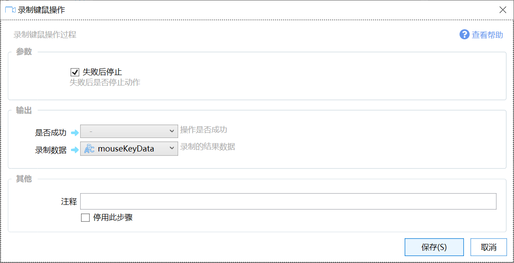

# 录制键鼠操作

录制键鼠操作过程

{/* xaction-metadata:start */}
## 当前模块定义

- 模块 Key：`sys:record`
- 分类：界面组件（`Ui`）
- 类型：`Action`
- 风险操作：否
- 专业版：否

## 输入参数

| Key | 名称 | 类型 | 默认值 | 必填 | 变量模式 | 条件 | 说明 |
| --- | --- | --- | --- | --- | --- | --- | --- |
| `autoStart` | 自动开始录制 | `Boolean` | true | 否 | `UseVarOrInput` |  | 2秒后是否自动开始录制 |
| `recordMouseMove` | 录制鼠标移动过程 | `Boolean` | true | 否 | `UseVarOrInput` |  | 是否录制鼠标的中间移动过程，仅必要时开启。关闭时仅记录点击位置。 |
| `prepareSeconds` | 准备时间 | `Number` | 2 | 否 | `UseVarOrInput` |  | 开始录制前的倒计时秒数（支持小数） |
| `stopIfFail` | 失败后停止 | `Boolean` | true | 否 | `Input` |  | 失败后是否停止动作 |

## 输出参数

| Key | 名称 | 类型 | 条件 | 说明 |
| --- | --- | --- | --- | --- |
| `isSuccess` | 是否成功 | `Boolean` |  | 操作是否成功 |
| `output` | 录制数据 | `Text` |  | 录制的结果数据 |
{/* xaction-metadata:end */}

## 概述

录制键盘和鼠标操作，并输出操作数据。

本功能为测试功能，可能调整或取消。

注意：录制的数据使用绝对坐标，重放时是否能够成功依赖比较多的因素：

-   窗口位置和状态
-   屏幕分辨率
-   输入法状态
-   其他可能有影响的情况。

因此包含这类操作的动作仅供特定情况下使用，使用时需保持和录制时尽量相同的环境。

运行到模块时，会自动等待2秒后自动开始录制。并在屏幕右下角显示录制控制窗口。

点击停止录制。根据需要可以测试重放录制的操作。 没有问题后点击保存按钮完成录制。

如果录制的不理想，可以点击第一个按钮重新录制。

## 输出

【是否成功】是否成功完成录制。

【录制数据】录制的结果数据。此数据使用“重放键鼠操作”模块进行重放。
