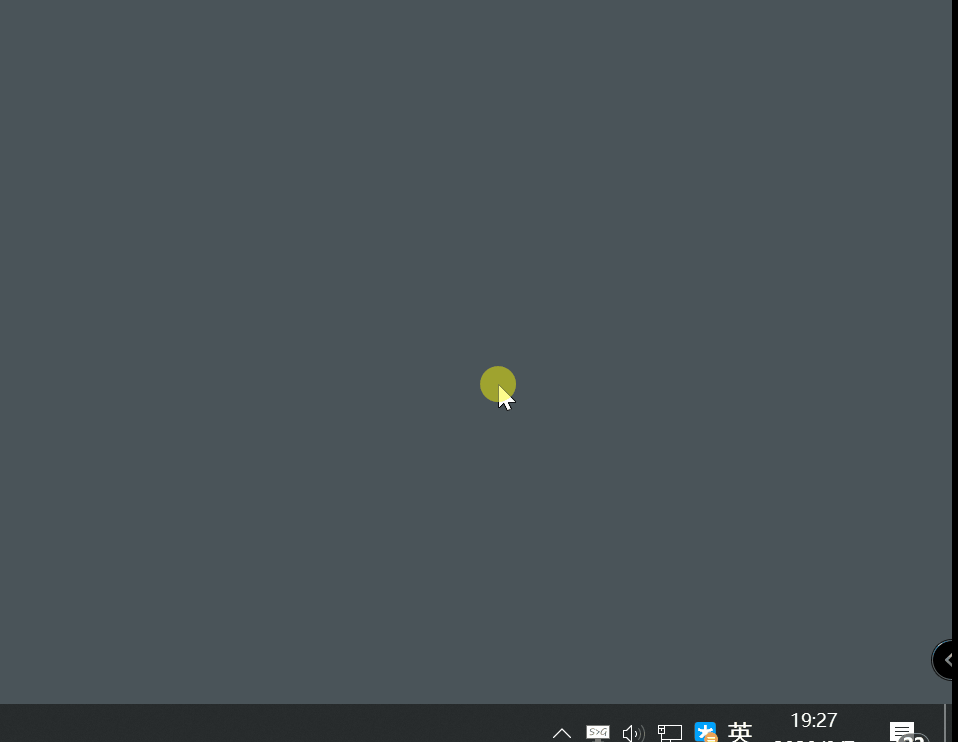
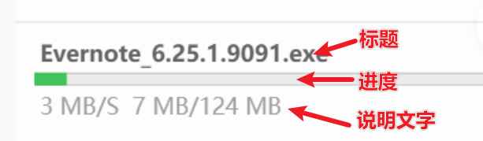
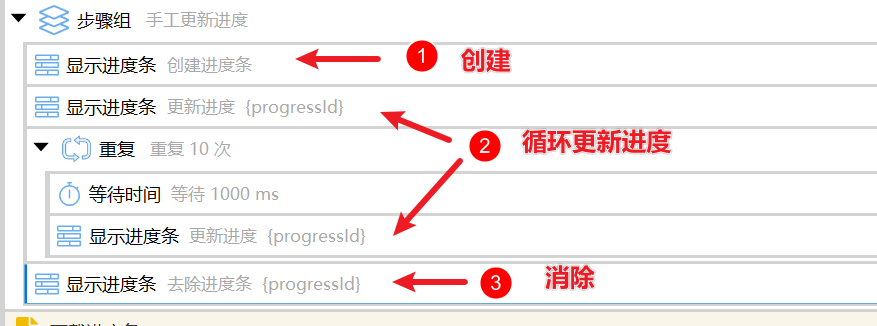
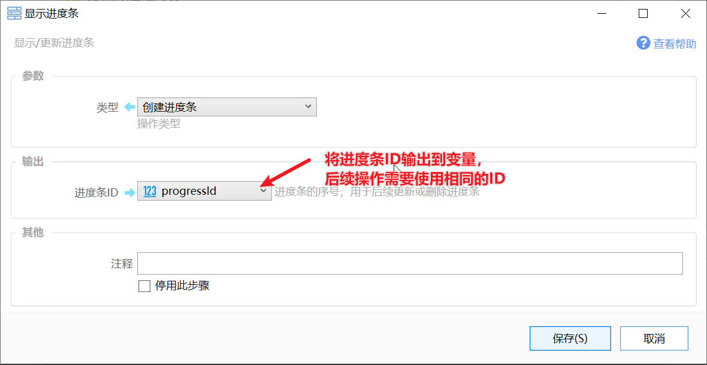
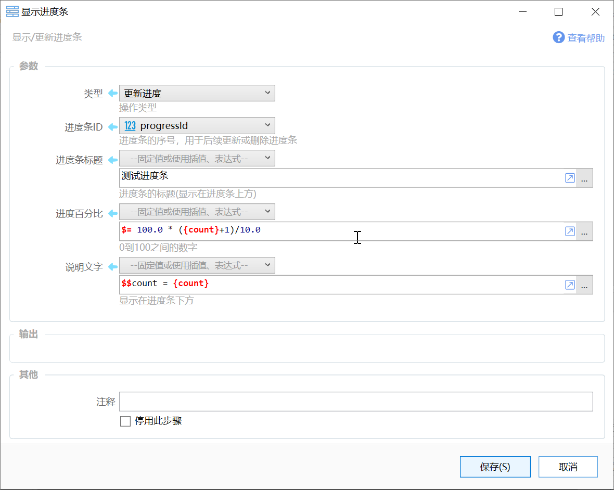
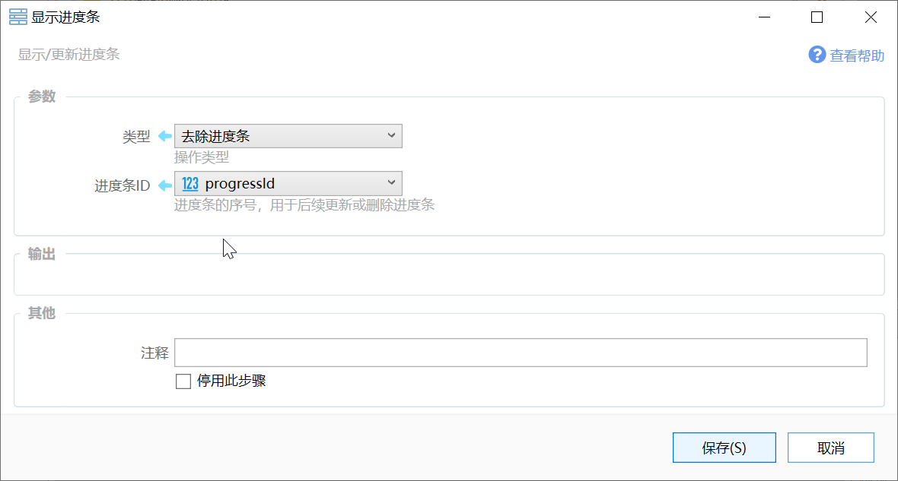
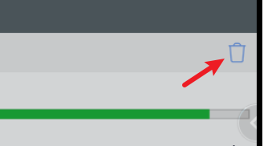

# 显示进度条

显示/更新进度条

## 当前模块定义

<XActionModuleMeta moduleKey="sys:reportProgress" />

自1.10.8+版本开始提供。

用于显示某项操作的进度。

示例动作：[https://getquicker.net/sharedaction?code=9a2970fd-14a5-4428-9b2a-08d852fc39cc](https://getquicker.net/sharedaction?code=9a2970fd-14a5-4428-9b2a-08d852fc39cc)

进度条窗口显示在桌面的**右下角**，窗口中可以同时堆叠显示多个进度条。窗口默认以半透明的方式显示，鼠标移动到窗口上时会变成完全不透明。

每行进度条由三个部分组成：

在1.10.8版本中，下载模块和Http模块增加了是否显示进度条的参数，它们与本模块共用一个进度条窗口。

## 使用进度条

进度条通常按下面的步骤来使用：

1.  创建进度条：用于获得一个表示序号的进度条ID。
2.  在循环中更新进度条。
3.  去除进度条：操作完成后，删除进度条。

更新和删除进度条时，现需指定在第一步中获得的进度条ID。

### 创建进度条

操作类型选择“创建进度条”，将【进度条ID】输出到变量中。

创建进度条只是生成一个id，并不会立即显示进度条。

### 更新进度

更新进度操作会让进度条实际显示出来。

参数说明：

【进度条ID】通过“创建进度条”操作获得的进度条ID编号。

【进度条标题】显示在进度条上方的文字，会以粗体/颜色较深的字体显示。

【进度百分比】从0到100之间的表示进度的数字（小数）。

-   如果表示总共7件任务完成了3件，百分比可以用表达式：$= 100.0 \* 3 / 7

【说明文字】显示在进度条下方的浅色文字。

### 去除进度条

操作完成后，需要去除进度条。

如果没有消除进度条（如忘记添加消除步骤，或动作提取中止），该进度条将会一直显示。这时候也可以点击进度条窗口的垃圾桶图标清理。

