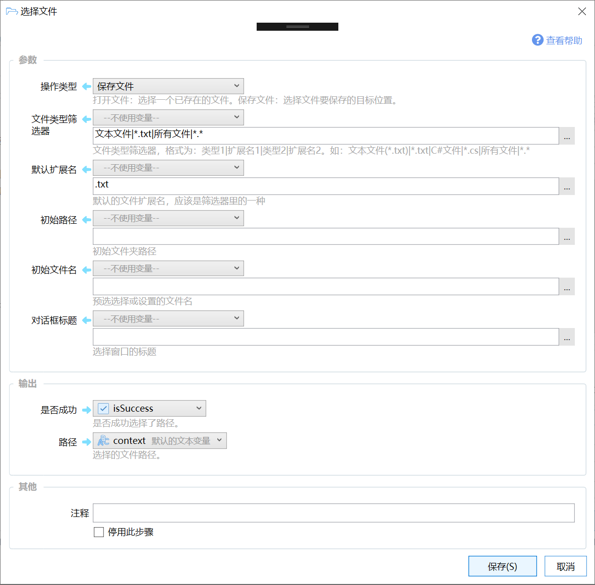

# 选择文件

用文件选择对话框选择要打开或保存的文件

{/* xaction-metadata:start */}
## 当前模块定义

- 模块 Key：`sys:selectFile`
- 分类：界面组件（`Ui`）
- 类型：`Action`
- 风险操作：否
- 专业版：否

## 输入参数

| Key | 名称 | 类型 | 默认值 | 必填 | 变量模式 | 条件 | 说明 |
| --- | --- | --- | --- | --- | --- | --- | --- |
| `type` | 操作类型 | `Enum` | openFile | 是 | `Input` |  | 打开文件：选择一个已存在的文件。保存文件：选择文件要保存的目标位置。 |
| `filter` | 文件类型筛选器 | `Text` | 文本文件\|*.txt\|所有文件\|*.* | 否 | `UseVarOrInput` |  | 文件类型筛选器，格式为：类型1\|扩展名1\|类型2\|扩展名2。如：文本文件(*.txt)\|*.txt\|C#文件\|*.cs\|所有文件\|*.* |
| `defaultExt` | 默认扩展名 | `Text` | .txt | 否 | `UseVarOrInput` |  | 默认的文件扩展名，应该是筛选器里的一种 |
| `initFileName` | 初始文件名 | `Text` |  | 否 | `UseVarOrInput` |  | 预选选择或设置的文件名 |
| `initDir` | 初始路径 | `Text` |  | 否 | `UseVarOrInput` |  | 初始文件夹路径 |
| `title` | 对话框标题 | `Text` |  | 否 | `UseVarOrInput` |  | 选择窗口的标题 |
| `topMost` | 置顶显示 | `Boolean` | true | 否 | `Input` |  | 是否置置顶显示窗口。 |
| `stopIfFail` | 失败后停止 | `Boolean` | true | 否 | `Input` |  | 失败后是否停止动作 |

## 输出参数

| Key | 名称 | 类型 | 条件 | 说明 |
| --- | --- | --- | --- | --- |
| `isSuccess` | 是否成功 | `Boolean` |  | 是否成功选择了路径。 |
| `path` | 路径 | `Text` | 仅：openFile, saveFile | 选择的文件路径。 |
| `pathList` | 路径列表 | `List` | 仅：openMultiFile | 选择的文件路径列表。 |

## 选项值

### `type` 操作类型

| Value | 名称 | 说明 |
| --- | --- | --- |
| `openFile` | 打开单个文件 |  |
| `openMultiFile` | 打开多个文件 |  |
| `saveFile` | 保存文件 |  |
{/* xaction-metadata:end */}

在0.12.3版本中添加。

## 概述

选择要打开或保存的文件路径。

## 参数

### 输入

-   【操作类型】可选三种操作之一：

-   打开单个文件：显示“打开文件对话框”，选择一个文件，输出选择文件的路径（文本类型）。
-   打开多个文件：显示“打开文件对话框”，选择一个或多个文件，输出选择的文件列表（列表类型）。

-   保存文件：显示“保存文件对话框”，选择要保存到的文件位置。

-   【文件类型筛选器】限定可选的文件类型。格式为：类型1|扩展名1|类型2|扩展名2。如："文本文件(\*.txt)|\*.txt|C#文件|\*.cs|图片文件|\*.jpg;\*.png;\*.bmp;\*.gif|所有文件|\*.\*"

-   格式说明：文件类型标题|扩展名或扩展名的列表|文件类型标题|扩展名或扩展名的列表

-   【默认扩展名】默认的文件类型。如“.txt”
-   【初始路径】对话框默认打开的路径，可以留空。

-   【初始文件名】预置的文件名，可以留空。
-   【对话框标题】对话框的标题文字，可以留空。

### 输出

-   【是否成功】是否选择了文件。如果在对话框中选择了取消，则值为False。如果此参数未输出到变量，则没有选择文件时会停止动作执行。
-   【路径】选择的单个文件路径。

-   【路径列表】选择的文件路径列表，仅在“打开多个文件”操作类型时生效。

## 应用

-   选择文件进行某种处理。
-   选择将信息输出到的文件路径。
