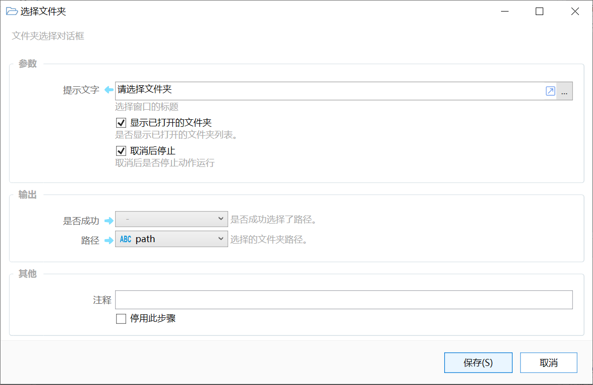

# 选择文件夹

文件夹选择对话框

{/* xaction-metadata:start */}
## 当前模块定义

- 模块 Key：`sys:selectFolder`
- 分类：界面组件（`Ui`）
- 类型：`Action`
- 风险操作：否
- 专业版：否

## 输入参数

| Key | 名称 | 类型 | 默认值 | 必填 | 变量模式 | 条件 | 说明 |
| --- | --- | --- | --- | --- | --- | --- | --- |
| `prompt` | 提示文字 | `Text` | 请选择文件夹 | 是 | `Input` |  | 选择窗口的标题 |
| `initDir` | 初始路径 | `Text` |  | 否 | `UseVarOrInput` |  | 初始文件夹路径 |
| `showOpenedDirs` | 显示已打开的文件夹 | `Boolean` | true | 否 | `Input` |  | 显示当前在资源管理器窗口中打开的文件夹。 |
| `stopIfFail` | 失败后停止 | `Boolean` | true | 否 | `Input` |  | 失败后是否停止动作 |

## 输出参数

| Key | 名称 | 类型 | 条件 | 说明 |
| --- | --- | --- | --- | --- |
| `isSuccess` | 是否成功 | `Boolean` |  | 是否成功选择了路径。 |
| `path` | 路径 | `Text` |  | 选择的文件夹路径。 |
{/* xaction-metadata:end */}

选择一个文件夹，获取其完整路径。

## 参数

【提示文字】显示在选择窗口标题栏的文字。

【显示已打开的文件夹】

启用：显示已经在Windows资源管理器中打开的文件夹，方便直接选择。

不启用：直接显示选择文件夹窗口：

【取消后停止】用户取消选择后，停止当前动作。

## 输出

【是否成功】是否选取了一个文件夹。

【路径】选取的文件夹的完整路径。

## 相关子程序

-   选择多个文件夹：[https://getquicker.net/subprogram?id=fe43699c-88dc-4b8d-0913-08d9d6a79e0f](https://getquicker.net/subprogram?id=fe43699c-88dc-4b8d-0913-08d9d6a79e0f)

## 参考动作

-   切换文件夹：[https://getquicker.net/sharedaction?code=065dc9ec-731b-4230-58c2-08d6a5df163e](https://getquicker.net/sharedaction?code=065dc9ec-731b-4230-58c2-08d6a5df163e)
