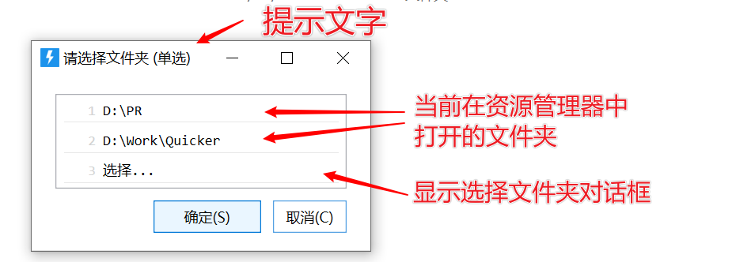
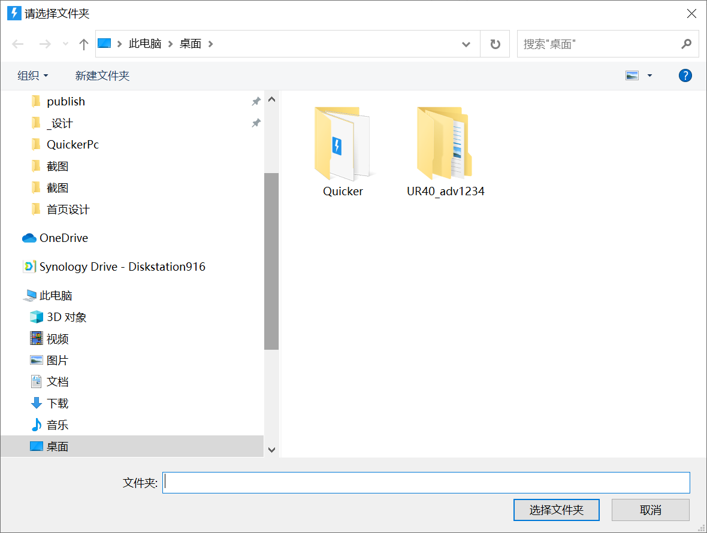

# 选择文件夹

文件夹选择对话框

## 当前模块定义

<XActionModuleMeta moduleKey="sys:selectFolder" />

选择一个文件夹，获取其完整路径。

<ModuleParamPreview moduleKey="sys:selectFolder" />

## 参数

【提示文字】显示在选择窗口标题栏的文字。

【显示已打开的文件夹】

启用：显示已经在Windows资源管理器中打开的文件夹，方便直接选择。

不启用：直接显示选择文件夹窗口：

【取消后停止】用户取消选择后，停止当前动作。

## 输出

【是否成功】是否选取了一个文件夹。

【路径】选取的文件夹的完整路径。

## 相关子程序

<ShareLinkCard
  kind="subprogram"
  id="fe43699c-88dc-4b8d-0913-08d9d6a79e0f"
  title="多选文件夹"
  description="选择多个文件夹并获得路径列表"
  author="CL"
  category="文件和目录"
/>

## 参考动作

<ShareLinkCard
  kind="action"
  code="065dc9ec-731b-4230-58c2-08d6a5df163e"
  title="切换文件夹"
  description="获取资源管理器已打开的路径，选择后填入保存对话框。"
  author="CL"
  category="文件处理"
/>
