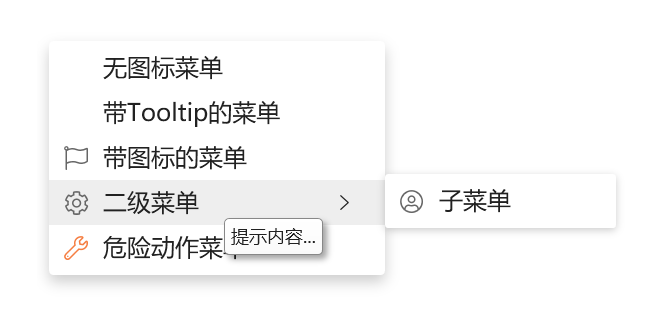
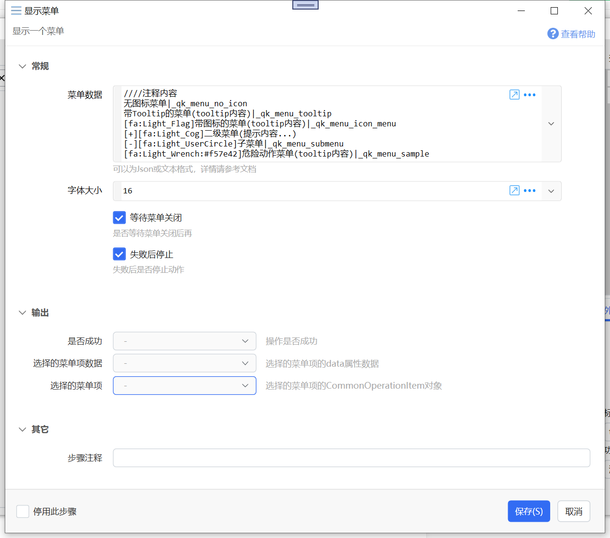
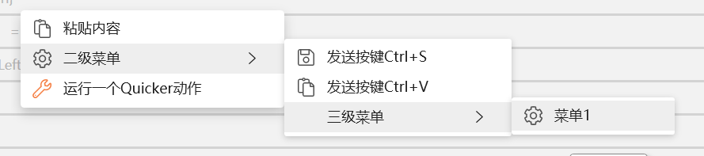

# 显示菜单

显示一个菜单

{/* xaction-metadata:start */}
## 当前模块定义

- 模块 Key：`sys:showmenu`
- 分类：界面组件（`Ui`）
- 类型：`Action`
- 风险操作：否
- 专业版：否

## 输入参数

| Key | 名称 | 类型 | 默认值 | 必填 | 变量模式 | 条件 | 说明 |
| --- | --- | --- | --- | --- | --- | --- | --- |
| `menuData` | 菜单数据 | `Text` |  | 是 | `UseVarOrInput` |  | 可以为Json/菜单文本格式/IList&lt;CommonOperationItem&gt;对象，详情请参考文档 |
| `fontsize` | 字体大小 | `Number` | 12 | 是 | `UseVarOrInput` |  |  |
| `iconsize` | 图标大小 | `Number` | 16 | 是 | `UseVarOrInput` |  | 图标的宽度/高度像素数 |
| `maxHeight` | 最大高度 | `Text` | 0 | 是 | `UseVarOrInput` |  | 可以为百分比（如:50%）或固定数值（如:500）。 |
| `waitMenuClose` | 等待菜单关闭 | `Boolean` | true | 否 | `Input` |  | 是否等待菜单关闭后再运行后续步骤 |
| `useFocus` | 占用焦点 | `Boolean` | false | 否 | `Input` |  | 是否允许菜单占用焦点（从而可以键盘选择菜单项） |
| `stopIfFail` | 失败后停止 | `Boolean` | true | 否 | `Input` |  | 失败后是否停止动作 |

## 输出参数

| Key | 名称 | 类型 | 条件 | 说明 |
| --- | --- | --- | --- | --- |
| `isSuccess` | 是否成功 | `Boolean` |  | 操作是否成功 |
| `selectedItemData` | 选择的菜单项数据 | `Text` |  | 选择的菜单项的data属性数据 |
| `selectedItem` | 选择的菜单项 | `Object` |  | 选择的菜单项的CommonOperationItem对象 |
| `clickButton` | 点击按钮 | `Text` |  | 点击菜单使用的鼠标按钮：Left（左键）或 Right（右键） |
{/* xaction-metadata:end */}

在鼠标指针所在位置显示一个纵向菜单（效果类似于右键菜单），可用于执行或选择特定操作。



此菜单需要用鼠标点击，不支持键盘选择菜单项。

也可以使用网友 @Ceastld 分享的[显示菜单的子程序](https://getquicker.net/subprogram?id=b68fab2f-7004-4373-9242-08d982821308)（支持焦点和水平排列等功能）。


注意：

-   鼠标或键盘的抬起事件会自动关闭菜单。根据使用方式，可能需要在显示菜单之前增加一些等待时间，以避免在点击动作后抬起鼠标时菜单被自动关闭的情况发生。（[参考](https://getquicker.net/QA/Question/10669)）

## 参数



【菜单数据】菜单的定义。

支持四种类型的数据：

**（1）类似于**[**动作右键菜单定义**](/v2/xaction/concepts/action-custom-context-menu)**的文本格式。**

与动作右键菜单不同的是，动作右键菜单仅支持返回一个文本数据作为参数返回给动作。

这种方式只支持一级子菜单。

```
////注释内容。
Ping百度|operation=run&data=ping baidu.com
//// ----表示分隔符
----
只有Data的菜单(返回结果后使用)|只有data数据
[fa:Light_Paste]粘贴内容(tooltip内容)|operation=paste&data=要粘贴的内容
[+][fa:Light_Cog]二级菜单(提示内容...)
[-][fa:Light_Save]发送按键Ctrl+S(模拟保存)|operation=sendkeys&data=^s
[-][fa:Light_Paste]发送按键Ctrl+V(模拟粘贴)|operation=sendkeys&data=^v
[fa:Light_Wrench:#f57e42]运行一个Quicker动作(tooltip内容)|operation=action&action=动作名称
```

说明：

-   //// 开始的内容为注释；
-   \---- 为分隔符；
-   \[+\]开始的行为父菜单；
-   \[-\]开始的行为子菜单项；
-   每一项通过分隔符（默认为“|”，可以在首行使用“|=新分隔符”的方式更改）分为标题部分和值部分。
-   标题部分：遵循格式“\[图标\]标题(Tooltip内容)”，其中“\[图标\]”和“(Tooltip)”内容是可选的。
-   内容部分：如果不需要执行操作，可以直接写菜单项的数据（分隔符|后面的内容整体作为模块输出）。如果需要执行操作，使用这样的格式：`operation=操作类型&data=数据内容&action=要执行的动作`。对于包含特殊字符的内容，需要进行URL编码才能正常传递。
-   支持的operation类型请参考CommonOperationItem对象的文档说明。

**（2）文本缩进格式**

使用空格或tab缩进表示菜单层级。需Quicker版本1.34.27+

-   只能使用空格或tab中的一种。
-   可以使用一个或多个空格或tab表示缩进。

```
[fa:Light_Paste]粘贴内容(tooltip内容)|operation=paste&data=要粘贴的内容
[fa:Light_Cog]二级菜单(提示内容...)
  [fa:Light_Save]发送按键Ctrl+S(模拟保存)|operation=sendkeys&data=^s
  [fa:Light_Paste]发送按键Ctrl+V(模拟粘贴)|operation=sendkeys&data=^v
  三级菜单
    [fa:Light_Cog]菜单1(提示内容...)
[fa:Light_Wrench:#f57e42]运行一个Quicker动作(tooltip内容)|operation=action&action=动作名称
```



注意：当`data`的参数值中包含特殊字符，如`+`时，必须对参数值进行URL编码。 参考：[讨论话题](https://getquicker.net/Common/Topics/ViewTopic/29658)

**（3）CommonOperationItem对象列表的JSON序列化文本。**

-   支持多级菜单。

-   IsSeparator=true时，表示是一条分割线。
-   子菜单存放在Children属性中。

示例：

```
[{
  "Title": "Ping baidu",
  "Description": "屏Ping百度",
  "Icon": "fa:Light_Pen",
  "Data": "ping baidu.com",
  "DataType": null,
  "Operation": "run",
  "Action": null,
  "IsSeparator": false,
  "OriginText": null,
  "ExtraData": null,
  "Children": null
}, {
  "Title": null,
  "Description": null,
  "Icon": null,
  "Data": null,
  "DataType": null,
  "Operation": null,
  "Action": null,
  "IsSeparator": true,
  "OriginText": null,
  "ExtraData": null,
  "Children": null
}, {
  "Title": "快搜",
  "Description": "屏Ping百度",
  "Icon": "fa:Light_Search",
  "Data": "",
  "DataType": null,
  "Operation": "action",
  "Action": "快搜",
  "IsSeparator": false,
  "OriginText": null,
  "ExtraData": null,
  "Children": null
}, {
  "Title": "多级菜单",
  "Description": null,
  "Icon": "fa:Light_Search",
  "Data": "",
  "DataType": null,
  "Operation": null,
  "Action": null,
  "IsSeparator": false,
  "OriginText": null,
  "ExtraData": null,
  "Children": [{
    "Title": "Ping baidu",
    "Description": "屏Ping百度",
    "Icon": "fa:Light_Pen",
    "Data": "ping baidu.com",
    "DataType": null,
    "Operation": "run",
    "Action": null,
    "IsSeparator": false,
    "OriginText": null,
    "ExtraData": null,
    "Children": null
  }, {
    "Title": null,
    "Description": null,
    "Icon": null,
    "Data": null,
    "DataType": null,
    "Operation": null,
    "Action": null,
    "IsSeparator": true,
    "OriginText": null,
    "ExtraData": null,
    "Children": null
  }, {
    "Title": "快搜",
    "Description": "屏Ping百度",
    "Icon": "fa:Light_Search",
    "Data": "",
    "DataType": null,
    "Operation": "action",
    "Action": "快搜",
    "IsSeparator": false,
    "OriginText": null,
    "ExtraData": null,
    "Children": null
  }, {
    "Title": "多级菜单",
    "Description": null,
    "Icon": "fa:Light_Search",
    "Data": "",
    "DataType": null,
    "Operation": null,
    "Action": null,
    "IsSeparator": false,
    "OriginText": null,
    "ExtraData": null,
    "Children": [{
      "Title": "Ping baidu",
      "Description": "屏Ping百度",
      "Icon": "fa:Light_Pen",
      "Data": "ping baidu.com",
      "DataType": null,
      "Operation": "run",
      "Action": null,
      "IsSeparator": false,
      "OriginText": null,
      "ExtraData": null,
      "Children": null
    }, {
      "Title": null,
      "Description": null,
      "Icon": null,
      "Data": null,
      "DataType": null,
      "Operation": null,
      "Action": null,
      "IsSeparator": true,
      "OriginText": null,
      "ExtraData": null,
      "Children": null
    }, {
      "Title": "快搜",
      "Description": "屏Ping百度",
      "Icon": "fa:Light_Search",
      "Data": "",
      "DataType": null,
      "Operation": "action",
      "Action": "快搜",
      "IsSeparator": false,
      "OriginText": null,
      "ExtraData": null,
      "Children": null
    }, {
      "Title": "多级菜单",
      "Description": null,
      "Icon": "fa:Light_Search",
      "Data": "",
      "DataType": null,
      "Operation": null,
      "Action": null,
      "IsSeparator": false,
      "OriginText": null,
      "ExtraData": null,
      "Children": []
    }]
  }]
}]
```

**（4）CommonOperationItem列表对象。**

例如，通过表达式生成操作菜单的列表。

```
$=
  var items =  new List<CommonOperationItem>(){
  new CommonOperationItem(){
    Title = "Ping baidu",
    Data="ping baidu.com",
    Icon="fa:Light_Pen",
    Operation="run",
    Description="屏Ping百度"},
  new CommonOperationItem(){ IsSeparator = true},
  new CommonOperationItem(){
    Title = "快搜",
    Data="",
    Icon="fa:Light_Search",
    Operation="action",
    Action="快搜",
    Description="屏Ping百度"},
  new CommonOperationItem(){
    Title = "多级菜单",
    Data="",
    Icon="fa:Light_Search",
    Children = new List<CommonOperationItem>(){
      new CommonOperationItem(){
        Title = "Ping baidu",
        Data="ping baidu.com",
        Icon="fa:Light_Pen",
        Operation="run",
        Description="屏Ping百度"},
      new CommonOperationItem(){ IsSeparator = true},
      new CommonOperationItem(){
        Title = "快搜",
        Data="",
        Icon="fa:Light_Search",
        Operation="action",
        Action="快搜",
        Description="屏Ping百度"},
      new CommonOperationItem(){
        Title = "多级菜单",
        Data="",
        Icon="fa:Light_Search",
        Children = new List<CommonOperationItem>(){
          new CommonOperationItem(){
            Title = "Ping baidu",
            Data="ping baidu.com",
            Icon="fa:Light_Pen",
            Operation="run",
            Description="屏Ping百度"},
          new CommonOperationItem(){ IsSeparator = true},
          new CommonOperationItem(){
            Title = "快搜",
            Data="",
            Icon="fa:Light_Search",
            Operation="action",
            Action="快搜",
            Description="屏Ping百度"},
          new CommonOperationItem(){
            Title = "多级菜单",
            Data="",
            Icon="fa:Light_Search",
            Children = new List<CommonOperationItem>(){

            }}

        }}
    }}

};


return items;
```


【字体大小】菜单文字字体大小。

【等待菜单关闭】是否等待菜单关闭后再执行后面的步骤

【失败后停止】在“等待菜单关闭”的情况下，未点击菜单时，是否停止动作。

### 输出参数

【是否成功】在“等待菜单关闭”的情况下，用户是否点击了菜单项。

【选择的菜单项数据】选择的菜单项的data参数。使用第一种格式设定菜单数据时，如果未指定data部分内容，则返回标题内容。

【选择的菜单项】选择的菜单项对应的CommonOperationItem对象。

### 示例动作

-   菜单模块测试：[https://getquicker.net/Sharedaction?code=a2933deb-ebe7-4895-69d4-08d992b19cae](https://getquicker.net/Sharedaction?code=a2933deb-ebe7-4895-69d4-08d992b19cae)
-   运行子程序并传递参数：[https://getquicker.net/Sharedaction?code=186c9f3f-46d4-4f63-00b9-08db56e12efe](https://getquicker.net/Sharedaction?code=186c9f3f-46d4-4f63-00b9-08db56e12efe)

## CommonOperationItem 对象


在Quicker内部用于表示一个通用的操作条目。其定义如下：

```
 public class CommonOperationItem
 {

        /// <summary>
        /// 标题文字，用于显示
        /// </summary>
        public string Title { get; set; }

        /// <summary>
        /// 描述文字，通常显示为tooltip
        /// </summary>
        public string Description { get; set; }

        /// <summary>
        /// 图标，格式请参考文档说明。
        /// </summary>
        public string Icon { get; set; }

        /// <summary>
        /// 数据内容
        /// </summary>
        public string Data { get; set; }

        /// <summary>
        /// 内部数据类型
        /// </summary>
        public string DataType { get; set; }

        /// <summary>
        /// 通常用于保存对Data内容的操作类型。
        /// <see cref="CommonOperationTypes">通用操作类型</see>
        /// </summary>
        public string Operation { get; set; }

        /// <summary>
        /// 要触发的动作id或名称
        /// </summary>
        public string Action { get; set; }

        /// <summary>
        /// 是否是分隔线
        /// </summary>
        public bool IsSeparator { get; set; }

        /// <summary>
        /// 从文本解析操作项时，被解析的原始文本
        /// </summary>
        public string OriginText { get; set; }


        /// <summary>
        /// 扩展数据
        /// </summary>
        public IDictionary<string, object> ExtraData { get; set; }

        /// <summary>
        /// 子项，也可做子菜单使用
        /// </summary>
        public IList<CommonOperationItem> Children { get; set; }
 }
```


### 支持的Operation类型

-   copy：复制，将data中的内容复制到剪贴板。
-   paste：粘贴，将data中的内容复制到剪贴板后粘贴到当前窗口（模拟Ctrl+V）。
-   pastefile：粘贴文件，data作为文件路径，将文件复制到剪贴板后，粘贴到当前窗口（模拟Ctrl+V）。
-   pasteimage：粘贴图片，data作为图片路径，读取图片并放入剪贴板后，粘贴到当前窗口（模拟Ctrl+V）。
-   run：运行，将data作为命令执行。可以为文件、网址、命令等可以在Win+R窗口中运行的命令。
-   sendkeys：将data作为模拟按键B的内容模拟输入。
-   inputtext：模拟输入文本内容。
-   action：运行动作。此时通过Action参数给出动作ID或（没有重复的）名称，1.36.22版本后，也可以使用`_this_`表示当前动作。data中的内容作为参数传递给动作。
-   selectfile：在资源管理器中选择文件。
-   open: 打开文件或网址（通过data参数指定）；
-   sp: 执行子程序。此时通过spname参数传入要执行的子程序名称。
-   none：不执行任何操作。
-   inputscript: 多步骤输入。 如果无法使用多行方式传入data内容，也可以在一行中填写，并使用`;;`表示换行。(1.36.17+)


CommonOperationItem 支持如下的静态方法：

-   ParseLine：解析一行文本数据“\[图标\]标题(Tooltip)|operation=run&data=内容”，返回一个ComonOperationItem对象。
-   ParseLines：解析多行文本数据，返回CommonOperationItem的列表。不支持子项。
-   ParseLinesWithSubItems：解析多行文本数据，支持\[+\]\[-\]前缀声明父项和子项。请参考本文档中菜单数据的第一种格式。


## 更新说明

-   20221229： 增加operation类型：open/sp/none/inputscript。
-   20230106：1.36.22版本增加operation=action时，通过`action=_this_`表示当前动作。
-   20230426：增加pastefile和pasteimage的说明。
-   20230518：增加调用子程序示例动作。
