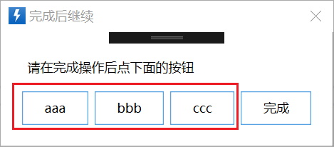
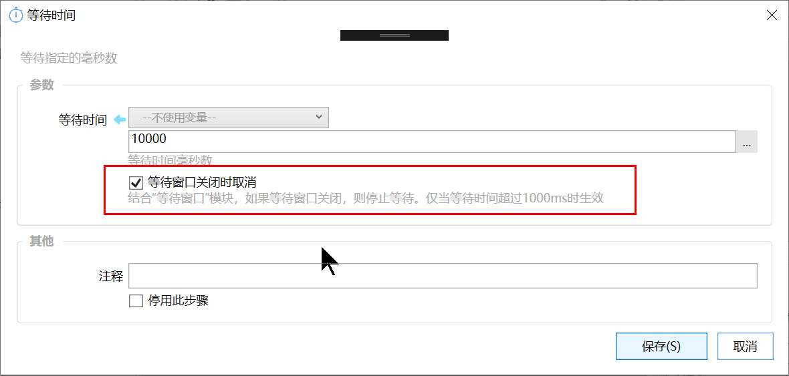

# 显示等待窗口

显示一个等待用户完成某个操作的提示窗口。

## 当前模块定义

<XActionModuleMeta moduleKey="sys:showWaitWin" />

## 概述

等待窗口主要用于：

1.  需要用户指示中止循环的操作。如在连续复制粘贴动作中，请用户指示已完成复制，可以开始粘贴了。
2.  需要允许用户提前结束等待的动作：等待剪贴板变更、等待时间等。

3.  向用户显示进度信息。
4.  允许用户中止动作。

<WaitWinPreview
  title="完成后继续"
  message="完成复制操作后，点按钮开始粘贴"
  progress="44/100"
  buttons={['继续']}
/>

用户点击等待窗口下部的按钮，窗口将关闭。

点击右上角的X按钮，将会弹窗询问是否终止当前动作。

## 模块参数设置

<ModuleParamPreview
  moduleKey="sys:showWaitWin"
  values={{
    mode: 'show',
    title: '完成后继续',
    prompt: '这里是一个循环，可以点击按钮提前中止',
    btnText: '结束循环',
    winLocation: 'BottomCenter',
    progress: '$${count}/100',
    operations: '暂停\n取消',
  }}
/>

### 输入参数

**操作类型：**

-   显示窗口：弹出等待窗口。
-   更新窗口：更新等待窗口中显示的文本消息、按钮文字和进度信息。

-   检查是否关闭：返回等待窗口是否关闭了（点击了窗口上的按钮）。
-   关闭窗口（如果仍然打开）：关闭窗口。

-   等待用户关闭：开始等待，在用户关闭了“等待窗口”以后继续运行后续模块。
-   显示窗口并等待用户关闭：显示窗口并开始等待，在用户关闭了“等待窗口”以后继续运行后续模块。

**窗口标题**：等待窗口的标题文字。

**提示文字**：按钮上方的提示文字。

**默认按钮的文字**：在默认按钮上显示的文字。

**窗口位置**：具体的位置（屏幕的中间或4角），或上次的位置。上次的位置仅当在同一个动作里第二次或之后再显示等待窗口时使用（用于在手工拖动等待窗口后，下次弹出时仍然显示在拖动后的位置，从而避免遮挡屏幕内容）。

**进度条参数**：显示的进度信息。 如果为空则不显示进度条。格式为  “当前值/最大值”。如“90/100”等。 可以在前面增加负号-表示倒数。如“-10/100”，则显示为90%的进度。

**附加操作按钮**：定义显示在对话框上的其他按钮。每一行输入一个按钮的文字，格式与“[用户选择](/v2/xaction/modules/userselect)”模块的选项定义相同。附加操作按钮，依次排列在默认按钮左侧。点击按钮/附加操作按钮时，等待窗口均会关闭。

*（1.5.21版本）按钮*文字部分支持使用下面的格式设置图标和tooltip文字(可选)：

-   \[fa:Light\_Pen:#99AAFF\]按钮标题(Tooltip文字内容)

【图标大小】指定按钮上图标的尺寸，默认为16。

【激活模式】窗口占用焦点的方式：

-   不支持激活：窗口不占用焦点，即使点击窗口或上面的按钮也不占用。
-   支持激活，打开时不抢占焦点。

-   支持激活，打开时抢占焦点。抢占焦点将导致之前操作的窗口失去焦点。

### 输出参数

当操作类型为“检查是否关闭”，输出是否关闭以及选择按钮的信息。
<ModuleParamPreview
  moduleKey="sys:showWaitWin"
  focusKeys={['mode', 'isClosed', 'selectedOperation']}
  values={{mode: 'check'}}
  outputVars={{isClosed: 'isClosed', selectedOperation: 'selectedOperation'}}
/>

**是否已关闭：**（仅适用于“检查是否关闭”操作），用于返回用户是否通过点击等待窗口上的按钮关闭了窗口。

**选择的按钮**：当使用“操作按钮”参数定义了更多按钮时，选择的是哪个按钮。 如果选择了默认按钮，则返回空，否则返回按钮所对应的值。

## 结合其他模块

等待窗口可以用于提前停止**等待剪贴板变化**和**等待时间模块**。

## 通常的使用方法

1.  （在循环之前）调用“显示窗口”操作。
2.  在循环中

1.  如果需要更新进度和文字，调用“更新窗口”。
2.  如果需要判断用户是否关闭了窗口（点击了按钮上的动作），则调用“检查是否关闭”，并根据需要执行相应的操作，如跳出循环等；

3.  需要时，调用“关闭窗口”窗口操作销毁等待窗口。

## 示例动作

[https://getquicker.net/Sharedaction?code=80427a4f-78c4-4fc5-7b1a-08d6a9169e61](https://getquicker.net/Sharedaction?code=80427a4f-78c4-4fc5-7b1a-08d6a9169e61)
