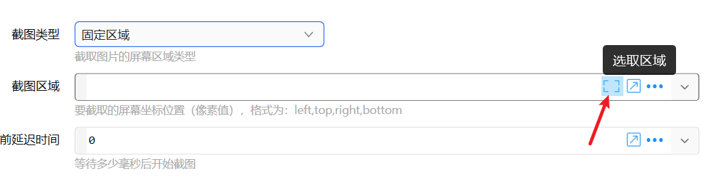

# 辅助选择工具

一些常用的选择内容并获取文本的工具

## 当前模块定义

<XActionModuleMeta moduleKey="sys:textSelectTools" />

用于选取某项内容并得到对应的文本值。

<ModuleParamPreview moduleKey="sys:textSelectTools" />

功能类似于“表单”窗口或“用户输入”窗口的“文本选择工具”：

只是不再显示表单界面，而是直接显示选取界面开始选取。

目前支持的选择工具如下：

-   选取文件... - SelectSingleFile
-   选取(多个)文件... - SelectMultiFile
-   选取文件夹... - SelectSingleFolder
-   选择保存路径... - SelectSavePath
-   选择窗口的进程路径。 - SelectProcessPath
-   选择进程名 - SelectProcessName
-   选择场景标识 - SelectProfileExe
-   选择窗口句柄 - SelectWindowHandle
-   从键盘输入键名 - SelectKeyName
-   从键盘输入模拟按键B的内容 - SelectSendKeysData
-   从键盘输入键码数字 - SelectKeyCode
-   选取区域 - SelectLocationArea
-   选取坐标位置 - SelectLocationPoint
-   选取窗口坐标位置 - SelectRelativePoint
-   截图并获取路径 - CaptureToFile
-   选取矢量图标 - SelectIcon
-   选取动作ID - SelectActionId
-   选取动作名称 - SelectActionName
-   选择窗口控件，获取其XPath - SelectControlXPath
-   已配对的蓝牙设备 - SelectBluetoothDevice
-   低功耗蓝牙设备 - SelectBluetoothLEDevice
-   网络连接 - SelectNetworkProfile

## 更新历史

-   20230326 更新工具列表。
