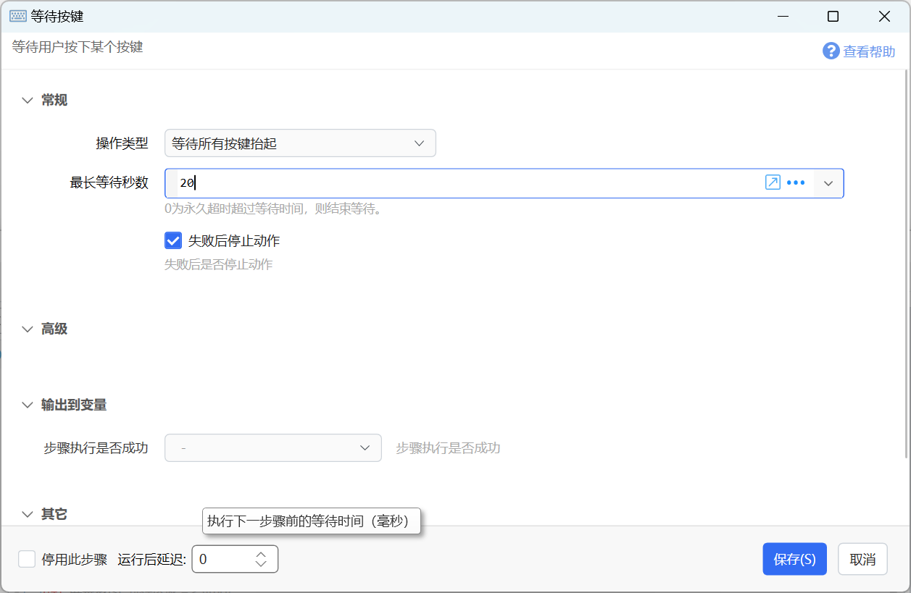

# 等待按键

等待用户按下某个按键

{/* xaction-metadata:start */}
## 当前模块定义

- 模块 Key：`sys:waitKeyboard`
- 分类：界面组件（`Ui`）
- 类型：`Action`
- 风险操作：是
- 专业版：否

## 输入参数

| Key | 名称 | 类型 | 默认值 | 必填 | 变量模式 | 条件 | 说明 |
| --- | --- | --- | --- | --- | --- | --- | --- |
| `operation` | 操作类型 | `Enum` | waitKeyDown | 是 | `Input` |  |  |
| `waitingKeys` | 等待的按键 | `Text` |  | 否 | `Input` |  | 可选，留空表示任意键盘按键。格式请参考文档。 |
| `modifierKeys` | 修饰键 | `Text` |  | 否 | `Input` |  | 可选。逗号分隔的ctrl,shift,alt,win组合。仅用于等待组合快捷键。修饰键不会被拦截。 |
| `maxWaitSeconds` | 最长等待秒数 | `Number` | 0 | 是 | `Input` |  | 0为永久超时超过等待时间，则结束等待。 |
| `filterEvent` | 拦截原始按键事件 | `Boolean` | true | 否 | `Input` |  | 避免按键输入到窗口中 (仅对键盘按键有效) |
| `waitKeyUp` | 等待按键抬起 | `Boolean` | false | 否 | `Input` |  | 等待按键抬起后再返回 (仅对键盘按键有效) |
| `ignoreSimulated` | 忽略模拟的按键 | `Boolean` | false | 否 | `Input` |  | 是否忽略（不检测）模拟的按键消息 |
| `help` | 提示信息 | `Text` | 请按键... | 否 | `UseVarOrInput` |  | 等待按键时显示的提示文字 |
| `fontfamily` | 字体名称 | `Text` |  | 否 | `UseVarOrInput` |  | 可选。设置字体名称。如有多个字体，使用逗号分隔。 |
| `winLocation` | 提示窗口位置 | `Enum` | TopCenter | 否 | `UseVarOrInput` |  | 在哪里显示提示窗口 |
| `mouseThrough` | 鼠标穿透 | `Boolean` | true | 否 | `Input` |  | 鼠标是否可以穿透提示窗口点击下面的内容 |
| `stopIfFail` | 失败后停止动作 | `Boolean` | true | 否 | `Input` |  | 失败后是否停止动作 |

## 输出参数

| Key | 名称 | 类型 | 条件 | 说明 |
| --- | --- | --- | --- | --- |
| `isSuccess` | 步骤执行是否成功 | `Boolean` |  | 步骤执行是否成功 |
| `keyCode` | 键名 | `Text` |  | 按键名，具体请参考模块文档。 |
| `keyValue` | 键值 | `Integer` |  | 按键数值，具体请参考模块文档。 |
| `holdTimeMs` | 按下保持时间 | `Integer` |  | 按下保持时间，单位毫秒。仅支持键盘按键。 |

## 选项值

### `operation` 操作类型

| Value | 名称 | 说明 |
| --- | --- | --- |
| `waitKeyDown` | 等待按下 |  |
| `waitAllKeyUp` | 等待所有按键抬起 |  |

### `winLocation` 提示窗口位置

| Value | 名称 | 说明 |
| --- | --- | --- |
| `CenterScreen` | 屏幕中间 |  |
| `TopLeft` | 屏幕左上 |  |
| `TopCenter` | 屏幕中上 |  |
| `TopRight` | 屏幕右上 |  |
| `LeftCenter` | 屏幕左中 |  |
| `RightCenter` | 屏幕右中 |  |
| `BottomLeft` | 屏幕左下 |  |
| `BottomCenter` | 屏幕中下 |  |
| `BottomRight` | 屏幕右下 |  |
{/* xaction-metadata:end */}

支持的操作类型：

-   等待按下：等待某个键盘或鼠标按键按下；
-   等待所有按键抬起：等待所有键盘按键抬起；

## 等待按下

等待用户按下指定的键盘或鼠标按键。

鼠标键自1.5.3版本开始支持（鼠标键不支持拦截）。

典型用途：

-   等待用户完成指定的操作后按键继续执行动作；
-   从多个选项中使用按键选择一个；

### 参数

【等待的按键】等待的键盘或鼠标按键，可以指定多个。在等待组合快捷键时，用于指定按键组合中的非修饰键部分（如Ctrl+S组合，等待的按键为S）。

-   如果不指定，将会在按下任意**键盘键**时完成等待。此时不等待鼠标按键。
-   如果指定，则会在按下设定的鼠标或键盘键时完成等待。可以指定多个要等待的按键，其格式为：使用小写逗号分隔的多个键名或键值（[System.Windows.Forms.Keys](https://docs.microsoft.com/en-us/dotnet/api/system.windows.forms.keys?view=netframework-4.8)枚举值中的名字或数字值，请参见本文后面的表）。

示例：

-   LMenu,RMenu   (等待左或右Alt键）
-   112,113    (等待F1或F2）
-   LButton,A  (等到鼠标左键或A键)
-   特别的，可以用wheel表示等待鼠标垂直滚轮（1.28.5+版本）

对于控制键ControlKey/Control、ShiftKey/Shift、Menu（alt），会自动等待对应的左右两侧的按键。返回的键值是实际按下的左侧或右侧按键对应的值（如LControlKey/RControlKey等)

【修饰键】仅用于等待组合快捷键。内容为使用英文半角逗号分隔的`ctrl,shift,alt,win`组合。如`Ctrl+Shift+S`组合，修饰键为`ctrl,shift`。

【最长等待秒数】最长等待时间。如果该时间内没有按下要等待的按键则，则“是否成功”返回False，“键名”“键值”返回等待时间内最后按下的键的键名和键值，如果没有按任何键，则返回`None`和`0`。

【拦截原始按键事件】如果拦截，则等待的按键不会发送到其他软件中变成字母输入。如果不拦截，则类似于普通键盘敲击的效果。仅对键盘按键有效。在等待组合按键时，不会拦截Ctrl/Shift/Alt/Win等修饰键。

【等待按键抬起】对于键盘按键，可以在按下按键后继续等待该按键抬起。此时可以输出按下的保持时间。（v1.40.23+）

【忽略模拟的按键】是否忽略通过动作或其它软件模拟生成的按键消息。（仅等待物理键盘按键）

【提示信息】 在屏幕顶端使用透明窗口显示给用户的提示文字。

【提示窗口位置】半透明提示窗口的显示位置。

【鼠标穿透】半透明提示窗口是否允许鼠标穿透（从而避免影响点击提示窗下面的内容）。

### 输出

注：输出的是实际按键的值，比如等待的是ControlKey，根据按下的键，实际输出的是LControlKey或RControlKey。

【键名】（KeyCode）按键的名称。参见下表或：[https://docs.microsoft.com/en-us/dotnet/api/system.windows.forms.keys?view=netframework-4.8](https://docs.microsoft.com/en-us/dotnet/api/system.windows.forms.keys?view=netframework-4.8)

【键值】（Keyvalue）按键的数字值。可以用[示例动作](https://getquicker.net/sharedaction?code=55c2a301-191e-4650-aa19-08d743b351f9)检测按键的键值。

【按下保持时间】开启“等待按键抬起”选项后，对键盘按键，可以输出按下的保持时间（用以区分短按和长按等场景使用）。（v1.40.23+）

### 参考动作

-   示例：显示键值  [https://getquicker.net/sharedaction?code=55c2a301-191e-4650-aa19-08d743b351f9](https://getquicker.net/sharedaction?code=55c2a301-191e-4650-aa19-08d743b351f9)

## 等待所有按键抬起

等待所有键盘物理按键抬起（不支持模拟按键状态，不支持鼠标键）。

通常用于等待ctrl/shift/alt等按键抬起，避免其对后续模拟的按键产生叠加效果。

## 更改历史

-   从1.1.33版本开始提供。
-   1.2.11 增加“等待的按键”参数。
-   1.5.3 增加支持鼠标按键(LButton/MButton/RButton/XButton1/XButton2)；增加是否拦截原始按键消息的选项。

参考

##### System.Windows.Forms.Keys 键值对照表

| 键名 | 键值 | 说明 |
| --- | --- | --- |
| A | 65 | A 键。 |
| Add | 107 | 加号键。 |
| Alt | 262144 | Alt 修改键。 |
| Apps | 93 | 应用程序键（Microsoft Natural Keyboard，人体工程学键盘）。 |
| Attn | 246 | ATTN 键。 |
| B | 66 | B 键。 |
| Back | 8 | BACKSPACE 键。 |
| BrowserBack | 166 | 浏览器后退键（Windows 2000 或更高版本）。 |
| BrowserFavorites | 171 | 浏览器收藏夹键（Windows 2000 或更高版本）。 |
| BrowserForward | 167 | 浏览器前进键（Windows 2000 或更高版本）。 |
| BrowserHome | 172 | 浏览器主页键（Windows 2000 或更高版本）。 |
| BrowserRefresh | 168 | 浏览器刷新键（Windows 2000 或更高版本）。 |
| BrowserSearch | 170 | 浏览器搜索键（Windows 2000 或更高版本）。 |
| BrowserStop | 169 | 浏览器停止键（Windows 2000 或更高版本）。 |
| C | 67 | C 键。 |
| Cancel | 3 | Cancel 键。 |
| Capital | 20 | CAPS LOCK 键。 |
| CapsLock | 20 | CAPS LOCK 键。 |
| Clear | 12 | CLEAR 键。 |
| Control | 131072 | Ctrl 修改键。 |
| ControlKey | 17 | CTRL 键。 |
| Crsel | 247 | CRSEL 键。 |
| D | 68 | D 键。 |
| D0 | 48 | 0 键。 |
| D1 | 49 | 1 键。 |
| D2 | 50 | 2 键。 |
| D3 | 51 | 3 键。 |
| D4 | 52 | 4 键。 |
| D5 | 53 | 5 键。 |
| D6 | 54 | 6 键。 |
| D7 | 55 | 7 键。 |
| D8 | 56 | 8 键。 |
| D9 | 57 | 9 键。 |
| Decimal | 110 | 句点键。 |
| Delete | 46 | DEL 键。 |
| Divide | 111 | 除号键。 |
| Down | 40 | DOWN ARROW 键。 |
| E | 69 | E 键。 |
| End | 35 | END 键。 |
| Enter | 13 | ENTER 键。 |
| EraseEof | 249 | ERASE EOF 键。 |
| Escape | 27 | ESC 键。 |
| Execute | 43 | EXECUTE 键。 |
| Exsel | 248 | EXSEL 键。 |
| F | 70 | F 键。 |
| F1 | 112 | F1 键。 |
| F10 | 121 | F10 键。 |
| F11 | 122 | F11 键。 |
| F12 | 123 | F12 键。 |
| F13 | 124 | F13 键。 |
| F14 | 125 | F14 键。 |
| F15 | 126 | F15 键。 |
| F16 | 127 | F16 键。 |
| F17 | 128 | F17 键。 |
| F18 | 129 | F18 键。 |
| F19 | 130 | F19 键。 |
| F2 | 113 | F2 键。 |
| F20 | 131 | F20 键。 |
| F21 | 132 | F21 键。 |
| F22 | 133 | F22 键。 |
| F23 | 134 | F23 键。 |
| F24 | 135 | F24 键。 |
| F3 | 114 | F3 键。 |
| F4 | 115 | F4 键。 |
| F5 | 116 | F5 键。 |
| F6 | 117 | F6 键。 |
| F7 | 118 | F7 键。 |
| F8 | 119 | F8 键。 |
| F9 | 120 | F9 键。 |
| FinalMode | 24 | IME 最终模式键。 |
| G | 71 | G 键。 |
| H | 72 | H 键。 |
| HanguelMode | 21 | IME Hanguel 模式键。 （为了保持兼容性而设置；使用 `HangulMode`） |
| HangulMode | 21 | IME Hangul 模式键。 |
| HanjaMode | 25 | IME Hanja 模式键。 |
| Help | 47 | HELP 键。 |
| Home | 36 | HOME 键。 |
| I | 73 | I 键。 |
| IMEAccept | 30 | IME 接受键，替换 [IMEAceept](https://docs.microsoft.com/zh-cn/dotnet/api/system.windows.forms.keys?view=netframework-4.8#System_Windows_Forms_Keys_IMEAceept)。 |
| IMEAceept | 30 | IME 接受键。 已过时，请改用 [IMEAccept](https://docs.microsoft.com/zh-cn/dotnet/api/system.windows.forms.keys?view=netframework-4.8#System_Windows_Forms_Keys_IMEAccept)。 |
| IMEConvert | 28 | IME 转换键。 |
| IMEModeChange | 31 | IME 模式更改键。 |
| IMENonconvert | 29 | IME 非转换键。 |
| Insert | 45 | INS 键。 |
| J | 74 | J 键。 |
| JunjaMode | 23 | IME Junja 模式键。 |
| K | 75 | K 键。 |
| KanaMode | 21 | IME Kana 模式键。 |
| KanjiMode | 25 | IME Kanji 模式键。 |
| KeyCode | 65535 | 从键值提取键代码的位屏蔽。 |
| L | 76 | L 键。 |
| LaunchApplication1 | 182 | 启动应用程序一键（Windows 2000 或更高版本）。 |
| LaunchApplication2 | 183 | 启动应用程序二键（Windows 2000 或更高版本）。 |
| LaunchMail | 180 | 启动邮件键（Windows 2000 或更高版本）。 |
| LButton | 1 | 鼠标左按钮。 |
| LControlKey | 162 | 左 CTRL 键。 |
| Left | 37 | LEFT ARROW 键。 |
| LineFeed | 10 | LINEFEED 键。 |
| LMenu | 164 | 左 ALT 键。 |
| LShiftKey | 160 | 左 Shift 键。 |
| LWin | 91 | 左 Windows 徽标键 (Microsoft Natural Keyboard)。 |
| M | 77 | M 键。 |
| MButton | 4 | 鼠标中按钮（三个按钮的鼠标）。 |
| MediaNextTrack | 176 | 媒体下一曲目键（Windows 2000 或更高版本）。 |
| MediaPlayPause | 179 | 媒体播放暂停键（Windows 2000 或更高版本）。 |
| MediaPreviousTrack | 177 | 媒体上一曲目键（Windows 2000 或更高版本）。 |
| MediaStop | 178 | 媒体停止键（Windows 2000 或更高版本）。 |
| Menu | 18 | Alt 键。 |
| Multiply | 106 | 乘号键。 |
| N | 78 | N 键。 |
| Next | 34 | PAGE DOWN 键。 |
| NoName | 252 | 留待将来使用的常数。 |
| None | 0 | 不按任何键。 |
| NumLock | 144 | NUM LOCK 键。 |
| NumPad0 | 96 | 数字键盘上的 0 键。 |
| NumPad1 | 97 | 数字键盘上的 1 键。 |
| NumPad2 | 98 | 数字键盘上的 2 键。 |
| NumPad3 | 99 | 数字键盘上的 3 键。 |
| NumPad4 | 100 | 数字键盘上的 4 键。 |
| NumPad5 | 101 | 数字键盘上的 5 键。 |
| NumPad6 | 102 | 数字键盘上的 6 键。 |
| NumPad7 | 103 | 数字键盘上的 7 键。 |
| NumPad8 | 104 | 数字键盘上的 8 键。 |
| NumPad9 | 105 | 数字键盘上的 9 键。 |
| O | 79 | O 键。 |
| Oem1 | 186 | OEM 1 键。 |
| Oem102 | 226 | OEM 102 键。 |
| Oem2 | 191 | OEM 2 键。 |
| Oem3 | 192 | OEM 3 键。 |
| Oem4 | 219 | OEM 4 键。 |
| Oem5 | 220 | OEM 5 键。 |
| Oem6 | 221 | OEM 6 键。 |
| Oem7 | 222 | OEM 7 键。 |
| Oem8 | 223 | OEM 8 键。 |
| OemBackslash | 226 | RT 102 键的键盘上的 OEM 尖括号或反斜杠键（Windows 2000 或更高版本）。 |
| OemClear | 254 | CLEAR 键。 |
| OemCloseBrackets | 221 | 美式标准键盘上的 OEM 右括号键（Windows 2000 或更高版本）。 |
| Oemcomma | 188 | 任何国家/地区键盘上的 OEM 逗号键（Windows 2000 或更高版本）。 |
| OemMinus | 189 | 任何国家/地区键盘上的 OEM 减号键（Windows 2000 或更高版本）。 |
| OemOpenBrackets | 219 | 美式标准键盘上的 OEM 左括号键（Windows 2000 或更高版本）。 |
| OemPeriod | 190 | 任何国家/地区键盘上的 OEM 句点键（Windows 2000 或更高版本）。 |
| OemPipe | 220 | 美式标准键盘上的 OEM 管道键（Windows 2000 或更高版本）。 |
| Oemplus | 187 | 任何国家/地区键盘上的 OEM 加号键（Windows 2000 或更高版本）。 |
| OemQuestion | 191 | 美式标准键盘上的 OEM 问号键（Windows 2000 或更高版本）。 |
| OemQuotes | 222 | 美式标准键盘上的 OEM 单/双引号键（Windows 2000 或更高版本）。 |
| OemSemicolon | 186 | 美式标准键盘上的 OEM 分号键（Windows 2000 或更高版本）。 |
| Oemtilde | 192 | 美式标准键盘上的 OEM 波形符键（Windows 2000 或更高版本）。 |
| P | 80 | P 键。 |
| Pa1 | 253 | PA1 键。 |
| Packet | 231 | 用于将 Unicode 字符当作键击传递。 Packet 键值是用于非键盘输入法的 32 位虚拟键值的低位字。 |
| PageDown | 34 | PAGE DOWN 键。 |
| PageUp | 33 | PAGE UP 键。 |
| Pause | 19 | PAUSE 键。 |
| Play | 250 | 播放键。 |
| Print | 42 | PRINT 键。 |
| PrintScreen | 44 | PRINT SCREEN 键。 |
| Prior | 33 | PAGE UP 键。 |
| ProcessKey | 229 | Process Key 键。 |
| Q | 81 | Q 键。 |
| R | 82 | R 键。 |
| RButton | 2 | 鼠标右按钮。 |
| RControlKey | 163 | 右 CTRL 键。 |
| Return | 13 | Return 键。 |
| Right | 39 | RIGHT ARROW 键。 |
| RMenu | 165 | 右 ALT 键。 |
| RShiftKey | 161 | 右 Shift 键。 |
| RWin | 92 | 右 Windows 徽标键 (Microsoft Natural Keyboard)。 |
| S | 83 | S 键。 |
| Scroll | 145 | Scroll Lock 键。 |
| Select | 41 | SELECT 键。 |
| SelectMedia | 181 | 选择媒体键（Windows 2000 或更高版本）。 |
| Separator | 108 | 分隔符键。 |
| Shift | 65536 | Shift 修改键。 |
| ShiftKey | 16 | Shift 键。 |
| Sleep | 95 | 计算机睡眠键。 |
| Snapshot | 44 | PRINT SCREEN 键。 |
| Space | 32 | SPACEBAR 键。 |
| Subtract | 109 | 减号键。 |
| T | 84 | T 键。 |
| Tab | 9 | TAB 键。 |
| U | 85 | U 键。 |
| Up | 38 | UP ARROW 键。 |
| V | 86 | V 键。 |
| VolumeDown | 174 | 减小音量键（Windows 2000 或更高版本）。 |
| VolumeMute | 173 | 静音键（Windows 2000 或更高版本）。 |
| VolumeUp | 175 | 增大音量键（Windows 2000 或更高版本）。 |
| W | 87 | W 键。 |
| X | 88 | X 键。 |
| XButton1 | 5 | 第一个 X 鼠标按钮（五个按钮的鼠标）。 |
| XButton2 | 6 | 第二个 X 鼠标按钮（五个按钮的鼠标）。 |
| Y | 89 | Y 键。 |
| Z | 90 | Z 键。 |
| Zoom | 251 | 缩放键。 |

## 更新历史

-   20241023 去除失效链接。
