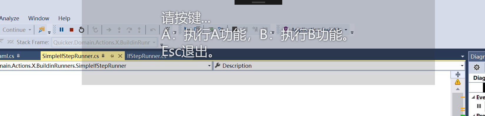

# 等待按键

等到用户按下指定键，或等到全部键盘键抬起。常用来等用户做完一件事再继续，或用按键在几个选项里选一个。

## 当前模块定义

<XActionModuleMeta moduleKey="sys:waitKeyboard" />

## 概述

两种操作：

- **等待按下**：等某个键盘或鼠标键（鼠标键 1.5.3+，不能拦截）。
- **等待所有按键抬起**：等全部物理键盘键抬起（不含模拟键、不含鼠标）。常用来等 Ctrl / Shift / Alt 松开，避免叠到后面的模拟按键上。

<ModuleParamPreview moduleKey="sys:waitKeyboard" />

## 参数说明

**操作类型**：「等待按下」或「等待所有按键抬起」。

**等待的按键**：可指定多个。等组合键时只写非修饰键（`Ctrl+S` 写 `S`）。留空表示任意**键盘键**（不含鼠标）。多个键用英文逗号分隔，可以是键名或键值（见文末表）。

- `LMenu,RMenu`：左或右 Alt
- `112,113`：F1 或 F2
- `LButton,A`：鼠标左键或 A
- `wheel`：垂直滚轮（1.28.5+）

`ControlKey` / `Control`、`ShiftKey` / `Shift`、`Menu`（Alt）会同时等左右两侧，输出的是实际按下的那一侧（如 `LControlKey`）。

**修饰键**：仅组合快捷键。英文逗号分隔的 `ctrl,shift,alt,win`。`Ctrl+Shift+S` 填 `ctrl,shift`。

**最长等待秒数**：超时则「步骤执行是否成功」为 False；「键名」「键值」是超时前最后一次按键，没按过则是 `None` 和 `0`。`0` 表示一直等。

**拦截原始按键事件**：拦截后按键不会进其它软件。只对键盘有效；组合键里的 Ctrl / Shift / Alt / Win 不会被拦截。鼠标键不能拦截。

**等待按键抬起**：按下后再等抬起，并输出保持时间。仅键盘。1.40.23+。

**忽略模拟的按键**：忽略动作或其它软件模拟的按键，只等物理键。

**提示信息**：屏幕上半透明提示。

**字体名称**：提示文字字体，多个用逗号分隔。

**提示窗口位置**：半透明提示出现的位置。

**鼠标穿透**：鼠标能否点穿提示窗点到下面。默认开启。

**失败后停止动作**：超时或失败后是否中止。默认开启。

## 输出

输出的是实际按键。等 `ControlKey` 时，按下左侧就得到 `LControlKey`。

- **步骤执行是否成功**：是否等到了目标按键（或全部抬起）。
- **键名**：见文末表或 [Keys 枚举](https://docs.microsoft.com/en-us/dotnet/api/system.windows.forms.keys?view=netframework-4.8)。
- **键值**：数字。可用下面的示例动作查看。
- **按下保持时间**：开启「等待按键抬起」后，键盘按下的毫秒数。1.40.23+。

## 等待所有按键抬起

<ModuleParamPreview
  moduleKey="sys:waitKeyboard"
  focusKeys={['operation', 'maxWaitSeconds', 'stopIfFail', 'isSuccess']}
  values={{operation: 'waitAllKeyUp', maxWaitSeconds: '20', stopIfFail: 'true'}}
/>

## 示例动作

<StepProgramView example="55c2a301-191e-4650-aa19-08d743b351f9" />

<ShareLinkCard
  code="55c2a301-191e-4650-aa19-08d743b351f9"
  title="示例：显示键值"
  description="按下按键后显示键名和键值。按 Esc 退出。"
  author="CL"
/>

## 键值对照表

System.Windows.Forms.Keys：

| 键名 | 键值 | 说明 |
| --- | --- | --- |
| A | 65 | A 键。 |
| Add | 107 | 加号键。 |
| Alt | 262144 | Alt 修改键。 |
| Apps | 93 | 应用程序键（Microsoft Natural Keyboard，人体工程学键盘）。 |
| Attn | 246 | ATTN 键。 |
| B | 66 | B 键。 |
| Back | 8 | BACKSPACE 键。 |
| BrowserBack | 166 | 浏览器后退键（Windows 2000 或更高版本）。 |
| BrowserFavorites | 171 | 浏览器收藏夹键（Windows 2000 或更高版本）。 |
| BrowserForward | 167 | 浏览器前进键（Windows 2000 或更高版本）。 |
| BrowserHome | 172 | 浏览器主页键（Windows 2000 或更高版本）。 |
| BrowserRefresh | 168 | 浏览器刷新键（Windows 2000 或更高版本）。 |
| BrowserSearch | 170 | 浏览器搜索键（Windows 2000 或更高版本）。 |
| BrowserStop | 169 | 浏览器停止键（Windows 2000 或更高版本）。 |
| C | 67 | C 键。 |
| Cancel | 3 | Cancel 键。 |
| Capital | 20 | CAPS LOCK 键。 |
| CapsLock | 20 | CAPS LOCK 键。 |
| Clear | 12 | CLEAR 键。 |
| Control | 131072 | Ctrl 修改键。 |
| ControlKey | 17 | CTRL 键。 |
| Crsel | 247 | CRSEL 键。 |
| D | 68 | D 键。 |
| D0 | 48 | 0 键。 |
| D1 | 49 | 1 键。 |
| D2 | 50 | 2 键。 |
| D3 | 51 | 3 键。 |
| D4 | 52 | 4 键。 |
| D5 | 53 | 5 键。 |
| D6 | 54 | 6 键。 |
| D7 | 55 | 7 键。 |
| D8 | 56 | 8 键。 |
| D9 | 57 | 9 键。 |
| Decimal | 110 | 句点键。 |
| Delete | 46 | DEL 键。 |
| Divide | 111 | 除号键。 |
| Down | 40 | DOWN ARROW 键。 |
| E | 69 | E 键。 |
| End | 35 | END 键。 |
| Enter | 13 | ENTER 键。 |
| EraseEof | 249 | ERASE EOF 键。 |
| Escape | 27 | ESC 键。 |
| Execute | 43 | EXECUTE 键。 |
| Exsel | 248 | EXSEL 键。 |
| F | 70 | F 键。 |
| F1 | 112 | F1 键。 |
| F10 | 121 | F10 键。 |
| F11 | 122 | F11 键。 |
| F12 | 123 | F12 键。 |
| F13 | 124 | F13 键。 |
| F14 | 125 | F14 键。 |
| F15 | 126 | F15 键。 |
| F16 | 127 | F16 键。 |
| F17 | 128 | F17 键。 |
| F18 | 129 | F18 键。 |
| F19 | 130 | F19 键。 |
| F2 | 113 | F2 键。 |
| F20 | 131 | F20 键。 |
| F21 | 132 | F21 键。 |
| F22 | 133 | F22 键。 |
| F23 | 134 | F23 键。 |
| F24 | 135 | F24 键。 |
| F3 | 114 | F3 键。 |
| F4 | 115 | F4 键。 |
| F5 | 116 | F5 键。 |
| F6 | 117 | F6 键。 |
| F7 | 118 | F7 键。 |
| F8 | 119 | F8 键。 |
| F9 | 120 | F9 键。 |
| FinalMode | 24 | IME 最终模式键。 |
| G | 71 | G 键。 |
| H | 72 | H 键。 |
| HanguelMode | 21 | IME Hanguel 模式键。 （为了保持兼容性而设置；使用 `HangulMode`） |
| HangulMode | 21 | IME Hangul 模式键。 |
| HanjaMode | 25 | IME Hanja 模式键。 |
| Help | 47 | HELP 键。 |
| Home | 36 | HOME 键。 |
| I | 73 | I 键。 |
| IMEAccept | 30 | IME 接受键，替换 [IMEAceept](https://docs.microsoft.com/zh-cn/dotnet/api/system.windows.forms.keys?view=netframework-4.8#System_Windows_Forms_Keys_IMEAceept)。 |
| IMEAceept | 30 | IME 接受键。 已过时，请改用 [IMEAccept](https://docs.microsoft.com/zh-cn/dotnet/api/system.windows.forms.keys?view=netframework-4.8#System_Windows_Forms_Keys_IMEAccept)。 |
| IMEConvert | 28 | IME 转换键。 |
| IMEModeChange | 31 | IME 模式更改键。 |
| IMENonconvert | 29 | IME 非转换键。 |
| Insert | 45 | INS 键。 |
| J | 74 | J 键。 |
| JunjaMode | 23 | IME Junja 模式键。 |
| K | 75 | K 键。 |
| KanaMode | 21 | IME Kana 模式键。 |
| KanjiMode | 25 | IME Kanji 模式键。 |
| KeyCode | 65535 | 从键值提取键代码的位屏蔽。 |
| L | 76 | L 键。 |
| LaunchApplication1 | 182 | 启动应用程序一键（Windows 2000 或更高版本）。 |
| LaunchApplication2 | 183 | 启动应用程序二键（Windows 2000 或更高版本）。 |
| LaunchMail | 180 | 启动邮件键（Windows 2000 或更高版本）。 |
| LButton | 1 | 鼠标左按钮。 |
| LControlKey | 162 | 左 CTRL 键。 |
| Left | 37 | LEFT ARROW 键。 |
| LineFeed | 10 | LINEFEED 键。 |
| LMenu | 164 | 左 ALT 键。 |
| LShiftKey | 160 | 左 Shift 键。 |
| LWin | 91 | 左 Windows 徽标键 (Microsoft Natural Keyboard)。 |
| M | 77 | M 键。 |
| MButton | 4 | 鼠标中按钮（三个按钮的鼠标）。 |
| MediaNextTrack | 176 | 媒体下一曲目键（Windows 2000 或更高版本）。 |
| MediaPlayPause | 179 | 媒体播放暂停键（Windows 2000 或更高版本）。 |
| MediaPreviousTrack | 177 | 媒体上一曲目键（Windows 2000 或更高版本）。 |
| MediaStop | 178 | 媒体停止键（Windows 2000 或更高版本）。 |
| Menu | 18 | Alt 键。 |
| Multiply | 106 | 乘号键。 |
| N | 78 | N 键。 |
| Next | 34 | PAGE DOWN 键。 |
| NoName | 252 | 留待将来使用的常数。 |
| None | 0 | 不按任何键。 |
| NumLock | 144 | NUM LOCK 键。 |
| NumPad0 | 96 | 数字键盘上的 0 键。 |
| NumPad1 | 97 | 数字键盘上的 1 键。 |
| NumPad2 | 98 | 数字键盘上的 2 键。 |
| NumPad3 | 99 | 数字键盘上的 3 键。 |
| NumPad4 | 100 | 数字键盘上的 4 键。 |
| NumPad5 | 101 | 数字键盘上的 5 键。 |
| NumPad6 | 102 | 数字键盘上的 6 键。 |
| NumPad7 | 103 | 数字键盘上的 7 键。 |
| NumPad8 | 104 | 数字键盘上的 8 键。 |
| NumPad9 | 105 | 数字键盘上的 9 键。 |
| O | 79 | O 键。 |
| Oem1 | 186 | OEM 1 键。 |
| Oem102 | 226 | OEM 102 键。 |
| Oem2 | 191 | OEM 2 键。 |
| Oem3 | 192 | OEM 3 键。 |
| Oem4 | 219 | OEM 4 键。 |
| Oem5 | 220 | OEM 5 键。 |
| Oem6 | 221 | OEM 6 键。 |
| Oem7 | 222 | OEM 7 键。 |
| Oem8 | 223 | OEM 8 键。 |
| OemBackslash | 226 | RT 102 键的键盘上的 OEM 尖括号或反斜杠键（Windows 2000 或更高版本）。 |
| OemClear | 254 | CLEAR 键。 |
| OemCloseBrackets | 221 | 美式标准键盘上的 OEM 右括号键（Windows 2000 或更高版本）。 |
| Oemcomma | 188 | 任何国家/地区键盘上的 OEM 逗号键（Windows 2000 或更高版本）。 |
| OemMinus | 189 | 任何国家/地区键盘上的 OEM 减号键（Windows 2000 或更高版本）。 |
| OemOpenBrackets | 219 | 美式标准键盘上的 OEM 左括号键（Windows 2000 或更高版本）。 |
| OemPeriod | 190 | 任何国家/地区键盘上的 OEM 句点键（Windows 2000 或更高版本）。 |
| OemPipe | 220 | 美式标准键盘上的 OEM 管道键（Windows 2000 或更高版本）。 |
| Oemplus | 187 | 任何国家/地区键盘上的 OEM 加号键（Windows 2000 或更高版本）。 |
| OemQuestion | 191 | 美式标准键盘上的 OEM 问号键（Windows 2000 或更高版本）。 |
| OemQuotes | 222 | 美式标准键盘上的 OEM 单/双引号键（Windows 2000 或更高版本）。 |
| OemSemicolon | 186 | 美式标准键盘上的 OEM 分号键（Windows 2000 或更高版本）。 |
| Oemtilde | 192 | 美式标准键盘上的 OEM 波形符键（Windows 2000 或更高版本）。 |
| P | 80 | P 键。 |
| Pa1 | 253 | PA1 键。 |
| Packet | 231 | 用于将 Unicode 字符当作键击传递。 Packet 键值是用于非键盘输入法的 32 位虚拟键值的低位字。 |
| PageDown | 34 | PAGE DOWN 键。 |
| PageUp | 33 | PAGE UP 键。 |
| Pause | 19 | PAUSE 键。 |
| Play | 250 | 播放键。 |
| Print | 42 | PRINT 键。 |
| PrintScreen | 44 | PRINT SCREEN 键。 |
| Prior | 33 | PAGE UP 键。 |
| ProcessKey | 229 | Process Key 键。 |
| Q | 81 | Q 键。 |
| R | 82 | R 键。 |
| RButton | 2 | 鼠标右按钮。 |
| RControlKey | 163 | 右 CTRL 键。 |
| Return | 13 | Return 键。 |
| Right | 39 | RIGHT ARROW 键。 |
| RMenu | 165 | 右 ALT 键。 |
| RShiftKey | 161 | 右 Shift 键。 |
| RWin | 92 | 右 Windows 徽标键 (Microsoft Natural Keyboard)。 |
| S | 83 | S 键。 |
| Scroll | 145 | Scroll Lock 键。 |
| Select | 41 | SELECT 键。 |
| SelectMedia | 181 | 选择媒体键（Windows 2000 或更高版本）。 |
| Separator | 108 | 分隔符键。 |
| Shift | 65536 | Shift 修改键。 |
| ShiftKey | 16 | Shift 键。 |
| Sleep | 95 | 计算机睡眠键。 |
| Snapshot | 44 | PRINT SCREEN 键。 |
| Space | 32 | SPACEBAR 键。 |
| Subtract | 109 | 减号键。 |
| T | 84 | T 键。 |
| Tab | 9 | TAB 键。 |
| U | 85 | U 键。 |
| Up | 38 | UP ARROW 键。 |
| V | 86 | V 键。 |
| VolumeDown | 174 | 减小音量键（Windows 2000 或更高版本）。 |
| VolumeMute | 173 | 静音键（Windows 2000 或更高版本）。 |
| VolumeUp | 175 | 增大音量键（Windows 2000 或更高版本）。 |
| W | 87 | W 键。 |
| X | 88 | X 键。 |
| XButton1 | 5 | 第一个 X 鼠标按钮（五个按钮的鼠标）。 |
| XButton2 | 6 | 第二个 X 鼠标按钮（五个按钮的鼠标）。 |
| Y | 89 | Y 键。 |
| Z | 90 | Z 键。 |
| Zoom | 251 | 缩放键。 |

## 相关链接

<RelatedDocs
  items={[
    {
      href: '/v2/xaction/modules/keyinput',
      label: '模拟按键',
      description: '等到之后再模拟按键。',
    },
    {
      href: '/v2/xaction/modules/sendkeys',
      label: '模拟按键B',
      description: '用 SendKeys 语法输入。',
    },
    {
      href: '/v2/xaction/modules/showwaitwin',
      label: '显示等待窗口',
      description: '用按钮而不是按键来继续。',
    },
  ]}
/>

## 更新历史

- 1.1.33 起提供。
- 1.2.11 增加「等待的按键」。
- 1.5.3 支持鼠标按键（LButton / MButton / RButton / XButton1 / XButton2）；增加是否拦截原始按键。
- 20241023 去除失效链接。
