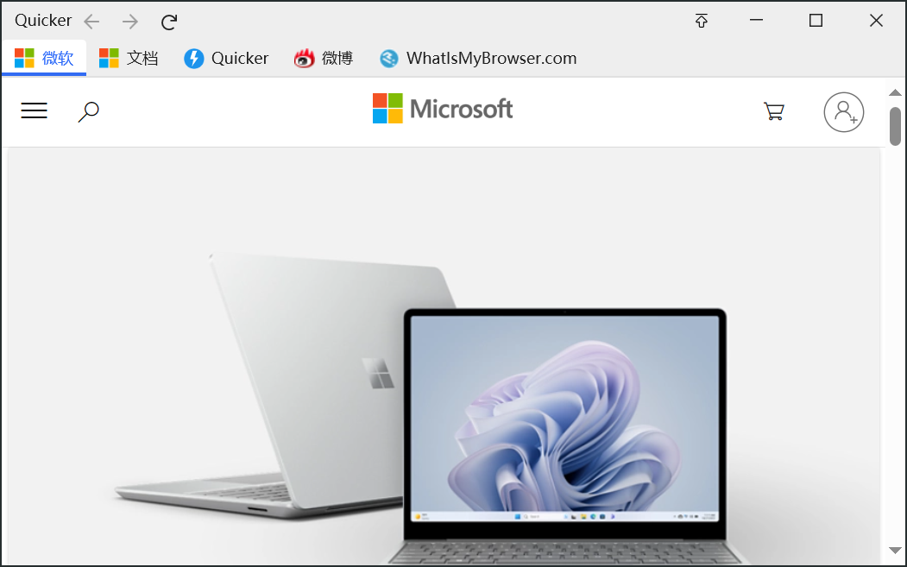

# WebView2浏览器窗口

用微软 Edge [WebView2](https://docs.microsoft.com/en-us/microsoft-edge/webview2/) 打开网址或 HTML，并可读写动作变量、调用子程序。要自己画 WPF 界面，用 [自定义窗口](/v2/xaction/modules/customwindow)。只是用系统浏览器打开一个地址，用 [打开网址](/v2/xaction/modules/openurl)。

Win11 自带运行时。其它系统可到 [WebView2 下载页](https://developer.microsoft.com/zh-cn/microsoft-edge/webview2/) 安装。动作里改变量名时，网页 JS 里写死的变量名不会跟着改。

## 当前模块定义

<XActionModuleMeta moduleKey="sys:webview2" />

## 概述

换 **操作类型** 后显示对应参数。同一 **窗口标识** 可对已打开的窗口发消息、跑脚本或关掉它。

<ModuleParamPreview moduleKey="sys:webview2" />

## 参数说明

**操作类型**：

- **打开网页**：打开网址或 HTML，然后继续。若填了 **窗口标识** 且窗口已在，按 **如果窗口已存在** 处理。
- **打开网页并等待加载完成**：打开后等到加载完再继续。
- **打开网页并等待窗口关闭**：等到用户关窗再继续。
- **发送消息**：用 [PostWebMessageAsJson](https://learn.microsoft.com/en-us/dotnet/api/microsoft.web.webview2.core.corewebview2.postwebmessageasjson?view=webview2-dotnet-1.0.2045.28) 给网页发 JSON。网页里要先写接收代码。
- **执行脚本**：在网页上下文跑 JS，用 [ExecuteScriptAsync](https://learn.microsoft.com/en-us/dotnet/api/microsoft.web.webview2.core.corewebview2.executescriptasync?view=webview2-dotnet-1.0.2045.28)。只在顶层文档执行，不进 iframe。
- **获取窗口状态**：取当前网址、标题、是否加载完等。
- **关闭窗口(如果尚未关闭)**：按 **窗口标识** 关掉已打开的窗口。
- **重新加载/刷新** / **停止加载**
- **检查是否安装WebView2**
- **【多标签】打开网址** / **【多列】打开网址**：同时打开一组相关网页，方便一起关。这两种布局不和动作其它部分交互。

**失败后停止**：失败是否中止。默认开启。除「检查是否安装WebView2」外都有 **窗口标识**。

### 打开网页

下面参数出现在「打开网页」「打开网页并等待加载完成」「打开网页并等待窗口关闭」（部分也用于多标签 / 多列）。

**网址或HTML内容**：网址、本地文件路径或 HTML。

**附加的浏览器参数**：见 [AdditionalBrowserArguments](https://learn.microsoft.com/en-us/dotnet/api/microsoft.web.webview2.core.corewebview2environmentoptions.additionalbrowserarguments?view=webview2-dotnet-1.0.2045.28)。非必要不要填，可能造成无法同时开多个 WebView2。设代理可写 `--proxy-server=http://127.0.0.1:8888`。

**虚拟主机映射**：把本地目录映射成主机名。如 `myserver|d:\folder`，网页里可用 `https://myserver/file.png` 访问该目录文件。目录必须存在。多条时每行一个。

**User Agent**：自定义 UA。可在 [这里查看](https://tools.getquicker.cn/browser/useragent) 当前浏览器 UA，或查 [常见设备 UA](https://www.whatismybrowser.com/guides/the-latest-user-agent/)。

**窗口标题**：未填时用网页标题。

**窗口图标**：左上角图标。支持 `fa:内置图标名:#RRGGBB` 或图标网址。

**默认背景色**：窗口默认背景。

**窗口标识**：相同标识避免开多个窗。再用本模块打开时，会在已有窗口里更新。`=` 表示用当前动作 ID。默认 `=`。

**如果窗口已存在**：仅「打开网页」「打开网页并等待加载完成」。可选跳过此步骤、更新网址、更新网址和窗口位置、关闭并重建窗口、激活窗口。默认跳过此步骤。

**JS脚本**：网页加载后注入，走 [AddScriptToExecuteOnDocumentCreatedAsync](https://learn.microsoft.com/en-us/dotnet/api/microsoft.web.webview2.core.corewebview2.addscripttoexecuteondocumentcreatedasync?view=webview2-dotnet-1.0.2045.28)。「执行脚本」时则是本次要跑的代码。

**窗口位置**：跟随鼠标、屏幕各方位、全屏、最大化、自定义位置。默认屏幕中间。

**窗口尺寸/位置**：自定义位置时写 `left,top,right,bottom`（像素或百分比，如 `981,608,2610,1143`、`25%,25%,75%,75%`）。其它位置写 `width,height`，如 `400,700`、`50%,50%`。

**默认下载文件夹**：默认保存位置。对同一 Profile 下的 WebView 窗口都生效。

**Profile**：同一网站要登多个账号时，用独立 Profile 存各自用户数据。通常写一个单词或拼音，不要写文件夹路径。

**置顶显示**：默认关闭。

**显示任务栏图标**：默认开启。

**不占用焦点**：开启后也不能在窗口里输入文字。默认关闭。

**失去焦点后**：不执行操作、关闭窗口、隐藏窗口、最小化窗口，以及「如果未置顶」时的关闭 / 隐藏 / 最小化。

**按Esc关闭窗口**：默认关闭。

**显示工具栏**：前进、后退、刷新、地址栏。默认关闭。

**添加DevTools桥**：给页面加 DevTools 桥接。默认关闭。

**窗口风格**：正常，或无边框。

**关闭窗口时清理Cookie**：关掉时清最后打开网页的 Cookie，便于退出账号。

### 发送消息

**窗口标识**：目标窗口。

**消息内容**：JSON 文本，经 PostWebMessageAsJson 发出。词典变量会自动转成 JSON。

**附加对象**：PostWebMessageAsJson 的附加对象列表，目前支持路径列表。

网页里要先接收：

```javascript
window.chrome.webview.addEventListener('message', event =>
{
  console.log('recv message:', event.data);

  document.getElementById('js_fanyi_input').innerText = event.data.keyword;
  document.getElementById('js_fanyi_input').dispatchEvent(new Event('input',{bubbles:true}));

});
```

### 执行脚本

**窗口标识**：目标窗口。

**JS脚本**：要执行的代码，走 ExecuteScriptAsync。输出 **脚本运行结果** 为 JSON 编码的返回值。

### 多标签 / 多列

这两种布局方便同时打开一组相关网页，没有和动作其它部分交互的能力，参数也相同。

**多标签**：适合用多个搜索引擎搜同一个词。



**多列**：每列较窄，适合移动端页面（通常要改 **User Agent**）。


<ModuleParamPreview
  moduleKey="sys:webview2"
  focusKeys={[
    'type',
    'urlList',
    'userAgent',
    'title',
    'autoCloseKey',
    'winLocation',
    'winSize',
    'defaultDownloadFolderPath',
    'topMost',
    'isSuccess',
  ]}
  values={{
    type: 'MultiColumn_OpenUrl',
    urlList: `Quicker|https://getquicker.net
小红书|https://www.xiaohongshu.com/
微博|https://weibo.com
Baidu|https://baidu.com`,
    userAgent:
      'Mozilla/5.0 (Linux; Android 13; SM-N960U) AppleWebKit/537.36 (KHTML, like Gecko) Chrome/117.0.5938.60 Mobile Safari/537.36',
    title: 'Quicker',
    autoCloseKey: '=',
    winLocation: 'Manual',
    winSize: '20%,20%,80%,80%',
    defaultDownloadFolderPath: 'F:\\test',
    topMost: 'false',
  }}
/>

**网址列表**：每行一个，可以是：

- `网址`：标签标题用网页标题
- `标题|网址`：固定标题
- `标题(ProfileName)|网址`：谨慎使用。同一网站多账号时，给每个账号单独 Profile，Cookie 分开放

也支持 `[图标]标题|网址`。

**窗口标题** / **窗口标识** / **窗口位置** / **窗口尺寸/位置** / **User Agent** / **默认下载文件夹** / **置顶显示**：含义与打开网页相同。

## 动作交互

### 桥接对象

用来访问动作变量、调用子程序。

- 异步：`window.chrome.webview.hostObjects.v`，或 1.23.5+ 的 `$quicker`
- 同步：`window.chrome.webview.hostObjects.sync.v`，或 `$quickerSync`

详见微软 [AddHostObjectToScript](https://docs.microsoft.com/en-us/dotnet/api/microsoft.web.webview2.core.corewebview2.addhostobjecttoscript?view=webview2-dotnet-1.0.774.44#Microsoft_Web_WebView2_Core_CoreWebView2_AddHostObjectToScript_System_String_System_Object_)。

### 读写动作变量

注入对象名为 **v**（variables）。

异步：

```javascript
async function func(){
  let v = await $quicker;
  let varValue = await v.getVar("变量名");
  await v.setVar("变量名", newValue);
}
```

同步：

```javascript
function funcSync(){
  let varValue = $quickerSync.getVar("text");
  $quickerSync.setVar("text", "Hello world from js code");
}
```

支持数字、文本和列表。词典读取时自动变成 JSON 文本，不能用 `setVar` 写回词典。

### 词典变量

不能直接当 JS 对象改。整本替换：

```javascript
$quickerSync.setDictByJson("dict", "{a: 1, b: 2}");
```

改某个键：

```javascript
$quickerSync.setDictItemValue("dict", "c", 3);
```

读某个键：

```javascript
var value = $quickerSync.getDictItemValue("dict","c");
```

### 调用子程序

1.23.15+ 推荐：`await $quickerSp(spName, dataObj)`。

- `spName`：子程序名称
- `dataObj`：输入对象，每个 key 对应子程序的一个输入变量

输入和输出都是**对象**，不是 JSON 字符串。

```javascript
async function testSubprogram(){
  var obj = {input:'Hello Quicker!', age:3};
  var data = await $quickerSp('subprogram1', obj);
  alert('success: ' + data.output);
}
```

下面这种方式不建议再用：`await $quicker.subprogram(spName, dataJson, boolParam, callback)`。第三个参数请传 `false`；回调里成功时 `data` 是输出变量的 JSON **文本**。复杂操作请用异步，同步等待容易把界面卡死。

## 输出

- **是否成功**：本步是否完成。获取窗口信息时表示窗口是否存在。
- **是否安装WebView2**：仅检查安装。
- **窗口句柄** / **WebView2对象**：打开网页、等待加载、获取状态。对象可在 C# 脚本里用，须在 UI 线程，避免循环引用。
- **窗口位置**：`left,top,right,bottom`。等待加载、获取状态、等待关窗。
- **当前网址** / **网页标题** / **网页代码** / **Cookie**：等待加载、获取状态。
- **脚本运行结果**：仅执行脚本。
- **预览图** / **导航是否已结束**：仅获取状态。

## 限制与排障

- 未装运行时时，先用「检查是否安装WebView2」，或到官网安装。
- **附加的浏览器参数** 可能导致无法同时开多个窗口。
- 改动作变量名不会改网页里写死的名字。
- 词典不能 `setVar`，用 `setDictByJson` / `setDictItemValue`。
- 同步调子程序可能死锁，用 `$quickerSp` 异步。
- 虚拟主机映射格式是 `主机名|文件夹路径`，主机名在前。

## 示例

<ShareLinkCard
  items={[
    {
      code: 'c501debe-7e80-408c-d791-08d856359351',
      title: '参数传递与子程序调用',
      description: 'JS 读写变量并调用子程序',
    },
    {
      code: 'a6fd6ca9-b6d8-4fbf-afe2-08d8f6743496',
      title: '搜索 Quicker 网站',
      description: '用发送消息更新已打开的窗口',
    },
    {
      code: '0b13fc42-ada7-4bb0-afe3-08d8f6743496',
      title: '有道翻译',
      description: '向已打开的翻译页发送消息',
    },
  ]}
/>

## 相关链接

<RelatedDocs
  items={[
    {
      href: '/v2/xaction/modules/customwindow',
      label: '自定义窗口',
      description: 'WPF/XAML 窗口，不是网页。',
    },
    {
      href: '/v2/xaction/modules/openurl',
      label: '打开网址',
      description: '用系统浏览器打开，不嵌在动作里。',
    },
    {
      href: '/v2/xaction/modules/jsscript',
      label: '运行Javascript代码',
      description: '在动作里跑 JS，不是网页上下文。',
    },
    {
      href: '/v2/xaction/modules/httpserver',
      label: 'HTTP服务器',
      description: '本地起服务再给 WebView 打开。',
    },
  ]}
/>

## 更新历史

- 20230929 完善文档。增加多标签、多列说明。
- 20240426 修正虚拟主机映射（主机名在前）。
